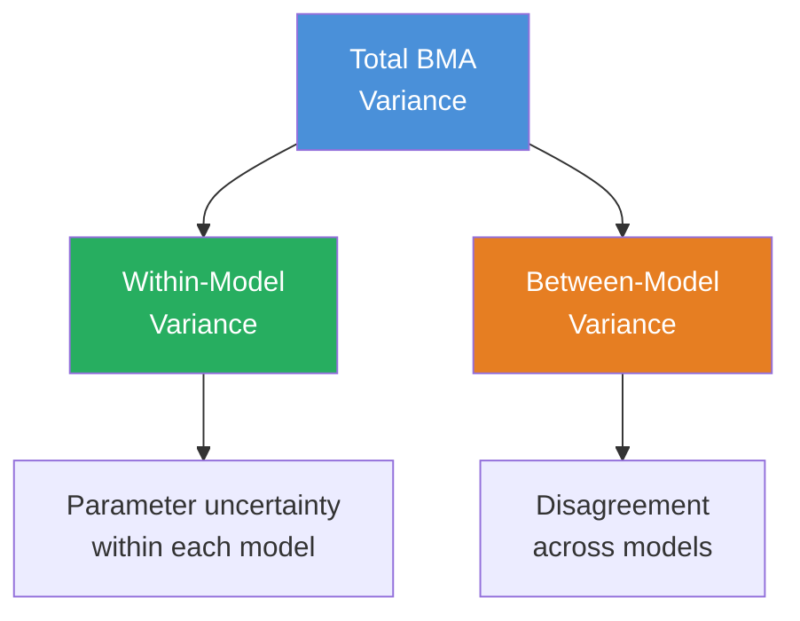
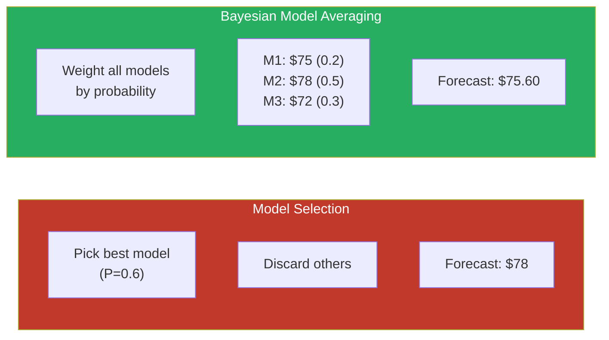
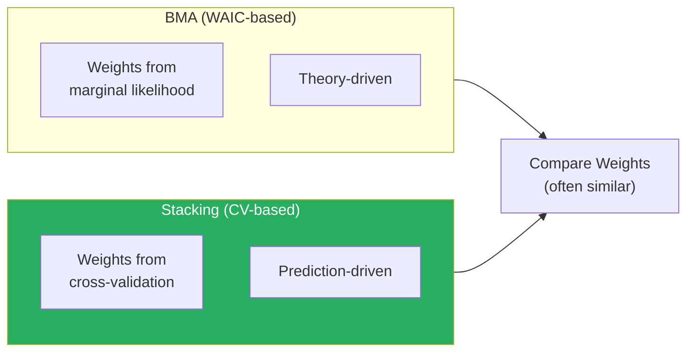
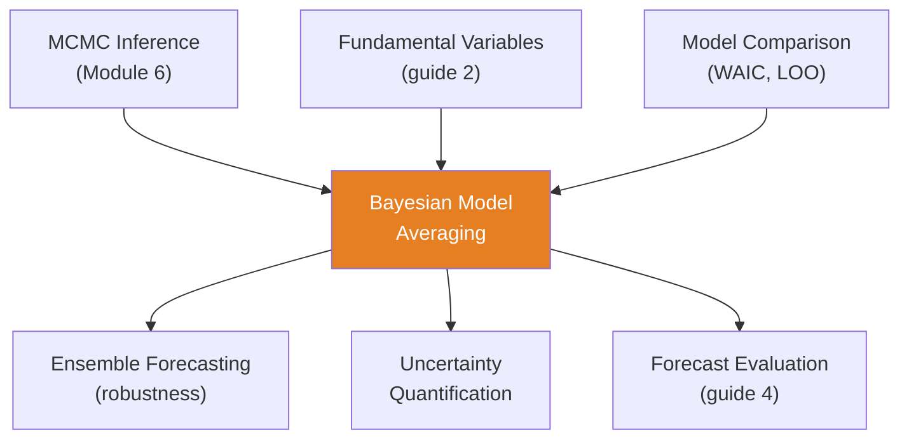

<!-- _class: lead -->

# Bayesian Model Averaging

**Module 8 — Fundamentals Integration**

Using all models, weighted by plausibility

<!-- Speaker notes: Welcome to Bayesian Model Averaging. This deck covers the key concepts you'll need. Estimated time: 34 minutes. -->
---

## Key Insight

> **Model selection discards information and understates uncertainty.** If Model A has 60% posterior probability and Model B has 40%, why use only Model A? BMA uses both, weighted by their probabilities, capturing both parameter uncertainty and model uncertainty.

<!-- Speaker notes: Explain Key Insight. Connect this concept to the practical applications in commodity markets. Check for understanding before moving on. -->
---

## BMA Framework

**Posterior model probability:**

$$P(M_k | \mathcal{D}) = \frac{P(\mathcal{D} | M_k)\, P(M_k)}{\sum_{j=1}^K P(\mathcal{D} | M_j)\, P(M_j)}$$

**BMA prediction:**

$$P(y^* | \mathcal{D}) = \sum_{k=1}^K P(y^* | M_k, \mathcal{D})\, P(M_k | \mathcal{D})$$

**BMA point forecast:**

$$\hat{y}^* = \sum_{k=1}^K \mathbb{E}[y^* | M_k, \mathcal{D}] \cdot P(M_k | \mathcal{D})$$

<!-- Speaker notes: Walk through the mathematical notation carefully. Explain each symbol and relate it back to the intuitive explanation. Don't rush through formulas. -->
---

## BMA Variance Decomposition

$$\text{Var}(y^* | \mathcal{D}) = \underbrace{\sum_k \text{Var}(y^* | M_k)\, P(M_k)}_{\text{Within-model}} + \underbrace{\sum_k (\mathbb{E}[y^* | M_k] - \hat{y}^*)^2\, P(M_k)}_{\text{Between-model}}$$



> Selection ignores between-model variance. BMA captures it.

<!-- Speaker notes: Use the diagram to illustrate the relationships visually. Point to each node as you explain the flow. Give learners time to study the diagram. -->
---

## Model Selection vs BMA



BMA is more robust: doesn't fully commit to one model.

<!-- Speaker notes: Use the diagram to illustrate the relationships visually. Point to each node as you explain the flow. Give learners time to study the diagram. -->
---

## Commodity Model Space

| Model | Variables | Complexity |
|-------|-----------|-----------|
| $M_1$: AR(2) | Price lags only | Low |
| $M_2$: AR(2) + inventory | + inventory | Medium |
| $M_3$: AR(2) + inv + prod | + production | Medium-High |
| $M_4$: AR(2) + all fundamentals | + GDP, weather | High |
| $M_5$: GP with covariates | Nonparametric | Highest |

> BMA lets data determine which model(s) deserve weight.

<!-- Speaker notes: Walk through each row of the table. This is reference material learners will come back to, so highlight the most important entries. -->
---

<!-- _class: lead -->

# Code Implementation

<!-- Speaker notes: Transition slide. We're now moving into Code Implementation. Pause briefly to let learners absorb the previous section before continuing. -->
---

## BMA Class

```python
class BayesianModelAveraging:
    def __init__(self):
        self.models, self.traces = [], []
        self.model_names = []

    def add_model(self, model, trace, name):
        self.models.append(model)
        self.traces.append(trace)
        self.model_names.append(name)

    def compute_model_weights(self, method='waic'):
        waic_values = np.array(
            [az.waic(t).waic for t in self.traces])  # ... continued on next slide
```

<!-- Speaker notes: Walk through the code step by step. Highlight the key lines and explain the purpose of each section. Encourage learners to run this in their own notebooks. -->
---

## Code (continued)

<!-- Speaker notes: Continue walking through the code. This is a continuation of the previous slide's code block. -->

```python
        log_probs = -0.5 * waic_values
        log_probs -= logsumexp(log_probs)
        return np.exp(log_probs)
```

---

## Fitting Multiple Models

```python
# Model 1: Intercept only
with pm.Model() as m1:
    alpha = pm.Normal('alpha', 0, 10)
    sigma = pm.HalfNormal('sigma', 5)
    y_obs = pm.Normal('y_obs', mu=alpha, sigma=sigma,
                       observed=y)
    trace1 = pm.sample(1000, tune=1000)

# Model 2: Inventory
with pm.Model() as m2:
    alpha = pm.Normal('alpha', 0, 10)
    beta1 = pm.Normal('beta1', 0, 5)
    sigma = pm.HalfNormal('sigma', 5)  # ... continued on next slide
```

<!-- Speaker notes: Walk through the code step by step. Highlight the key lines and explain the purpose of each section. Encourage learners to run this in their own notebooks. -->
---

## Code (continued)

<!-- Speaker notes: Continue walking through the code. This is a continuation of the previous slide's code block. -->

```python
    y_obs = pm.Normal('y_obs', mu=alpha + beta1*X1,
                       sigma=sigma, observed=y)
    trace2 = pm.sample(1000, tune=1000)

# Model 3: Inventory + Production
# Model 4: All variables
# ... (similar pattern)
```

---

## BMA Prediction

```python
    def predict(self, X_new, model_weights=None):
        if model_weights is None:
            model_weights = self.compute_model_weights()

        all_preds, all_uncs = [], []
        for model, trace in zip(self.models, self.traces):
            with model:
                ppc = pm.sample_posterior_predictive(trace)
                pred = ppc.predictions['y_obs'].values
                all_preds.append(pred.mean(axis=(0,1)))
                all_uncs.append(pred.std(axis=(0,1)))

        preds = np.array(all_preds)  # ... continued on next slide
```

<!-- Speaker notes: Walk through the code step by step. Highlight the key lines and explain the purpose of each section. Encourage learners to run this in their own notebooks. -->
---

## Code (continued)

<!-- Speaker notes: Continue walking through the code. This is a continuation of the previous slide's code block. -->

```python
        uncs = np.array(all_uncs)

        # BMA: weighted average
        bma_pred = np.average(preds, axis=0,
                               weights=model_weights)
        within_var = np.average(uncs**2, axis=0,
                                 weights=model_weights)
        between_var = np.average(
            (preds - bma_pred)**2, axis=0,
            weights=model_weights)
        bma_unc = np.sqrt(within_var + between_var)
        return bma_pred, bma_unc, model_weights
```

---

## Pseudo-BMA with Stacking



```python
# ArviZ stacking weights
comparison = az.compare({
    'Null': trace1, 'Inventory': trace2,
    'Inv+Prod': trace3, 'Full': trace4
}, ic='loo', method='stacking')
print(comparison)
```

> Stacking (Yao et al. 2018) often more robust than WAIC-based BMA.

<!-- Speaker notes: Walk through the code step by step. Highlight the key lines and explain the purpose of each section. Encourage learners to run this in their own notebooks. -->
---

<!-- _class: lead -->

# Common Pitfalls

<!-- Speaker notes: Transition slide. We're now moving into Common Pitfalls. Pause briefly to let learners absorb the previous section before continuing. -->
---

## Pitfalls to Avoid

**Overlapping Model Space:** AR(2) and AR(3) are too similar. Weight splits between them. Ensure diverse models.

**Too Many Models:** Averaging 100 models is expensive. Pre-screen with BIC, then BMA over top 5-10.

**Over-Interpreting Small Differences:** $P(M_1) = 0.51$ vs $P(M_2) = 0.49$. Use BMA when weights are split; select only when dominant ($> 0.9$).

**Uniform Prior Model Probabilities:** When domain knowledge suggests otherwise, use informative model priors.

<!-- Speaker notes: These are common mistakes that even experienced practitioners make. Share a real-world example if possible to make the warning concrete. -->
---

## Effective Number of Models

$$N_{\text{eff}} = \frac{1}{\sum_k w_k^2}$$

| Weights | $N_{\text{eff}}$ | Interpretation |
|---------|------------------|---------------|
| [0.95, 0.03, 0.02] | 1.1 | Effectively one model (select) |
| [0.50, 0.30, 0.20] | 2.6 | Several models matter (average) |
| [0.25, 0.25, 0.25, 0.25] | 4.0 | All equally important |

<!-- Speaker notes: Walk through the mathematical notation carefully. Explain each symbol and relate it back to the intuitive explanation. Don't rush through formulas. -->
---

## Connections



<!-- Speaker notes: Use the diagram to illustrate the relationships visually. Point to each node as you explain the flow. Give learners time to study the diagram. -->
---

## Practice Problems

1. Three models with WAIC: 2500, 2520, 2600. Calculate posterior probabilities using $P(M_k) \propto \exp(-\text{WAIC}_k / 2)$.

2. $M_1$: $E[y^*]=50$, $\text{SD}=5$, $P=0.6$. $M_2$: $E[y^*]=55$, $\text{SD}=4$, $P=0.4$. Compute BMA prediction, within-model, between-model, and total variance.

3. Weights: [0.5, 0.3, 0.15, 0.05]. Compute $N_{\text{eff}}$. How many effective models?

4. Weights A: [0.95, 0.03, 0.02]. Weights B: [0.4, 0.35, 0.25]. Which scenario uses BMA vs selection?

> *"BMA doesn't pick the 'best' model -- it uses all models weighted by plausibility, capturing model uncertainty ignored by selection."*

<!-- Speaker notes: Give learners 5-10 minutes to attempt these problems. Circulate and offer hints. Review solutions together afterward. -->
---


<!-- _class: lead -->

# References

<!-- Speaker notes: These references provide deeper coverage of the topics discussed. Recommend the first 1-2 as starting points for learners who want to go deeper. -->

- **Hoeting et al. (2000):** "Bayesian Model Averaging: A Tutorial"
- **Vehtari et al. (2017):** "Practical Bayesian Model Evaluation Using LOO-CV"
- **Yao et al. (2018):** "Using Stacking to Average Bayesian Predictive Distributions"
- **Baumeister & Kilian (2015):** "Forecasting the Real Price of Oil" - Model uncertainty
