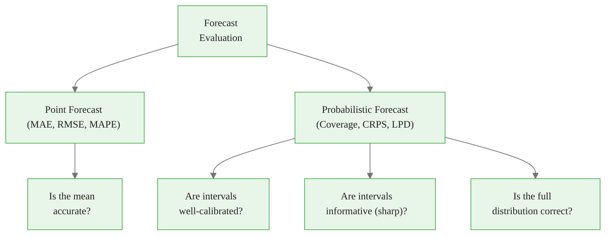
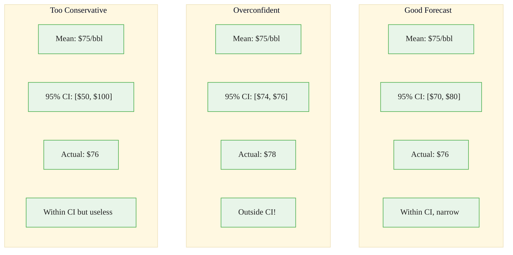
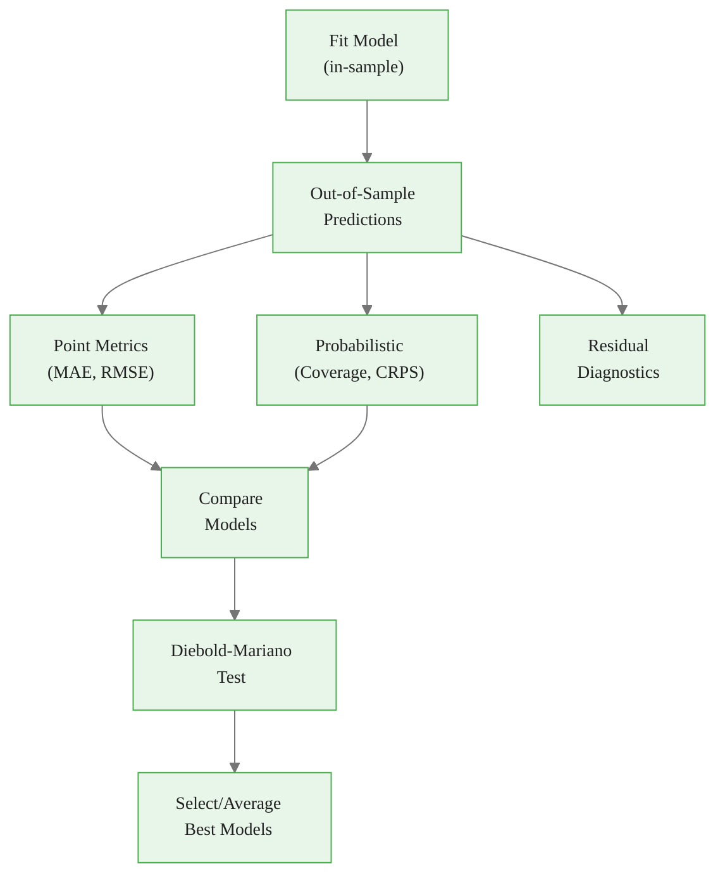
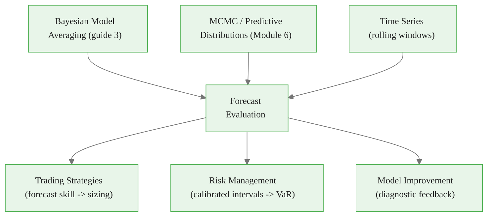

<!-- _class: lead -->

# Forecast Evaluation for Bayesian Models

**Module 8 — Fundamentals Integration**

A forecast is not just a number -- it's a distribution

<!-- Speaker notes: Welcome to Forecast Evaluation for Bayesian Models. This deck covers the key concepts you'll need. Estimated time: 34 minutes. -->
---

## Key Insight

> **A good Bayesian forecast has: (1) accurate central tendency (low MAE), (2) well-calibrated uncertainty (95% intervals contain 95% of outcomes), (3) sharp distributions (not overly conservative).** Proper scoring rules like CRPS evaluate the entire predictive distribution.

<!-- Speaker notes: Explain Key Insight. Connect this concept to the practical applications in commodity markets. Check for understanding before moving on. -->

<div class="callout-info">
This is a foundational concept for the rest of the module.
</div>
---

## Two Levels of Evaluation



> Evaluating only point accuracy ignores uncertainty quantification.

<!-- Speaker notes: Use the diagram to illustrate the relationships visually. Point to each node as you explain the flow. Give learners time to study the diagram. -->

<div class="callout-key">
This is the key takeaway from this section.
</div>
---

## Point Forecast Metrics

**Mean Absolute Error:**
$$\text{MAE} = \frac{1}{T} \sum_{t=1}^T |y_t - \hat{y}_t|$$

**Root Mean Squared Error:**
$$\text{RMSE} = \sqrt{\frac{1}{T} \sum_{t=1}^T (y_t - \hat{y}_t)^2}$$

**Mean Absolute Percentage Error:**
$$\text{MAPE} = \frac{100}{T} \sum_{t=1}^T \left|\frac{y_t - \hat{y}_t}{y_t}\right|$$

| Metric | Robust to Outliers | Scale-Free |
|--------|-------------------|-----------|
| MAE | Yes | No |
| RMSE | No | No |
| MAPE | Yes | Yes |

<!-- Speaker notes: Walk through the mathematical notation carefully. Explain each symbol and relate it back to the intuitive explanation. Don't rush through formulas. -->

<div class="callout-warning">
Common misconception — read carefully.
</div>
---

## Probabilistic Metrics

**Coverage (Calibration):**
$$\text{Coverage} = \frac{1}{T} \sum_{t=1}^T \mathbb{1}(L_t \leq y_t \leq U_t)$$

Should equal $1 - \alpha$ (e.g., 95% intervals contain 95% of outcomes).

**Sharpness:**
$$\text{Sharpness} = \frac{1}{T} \sum_{t=1}^T (U_t - L_t)$$

Narrower is better -- but only if well-calibrated!

**CRPS (Continuous Ranked Probability Score):**
$$\text{CRPS}(F_t, y_t) = \int_{-\infty}^{\infty} (F_t(x) - \mathbb{1}(x \geq y_t))^2\, dx$$

> CRPS evaluates the entire predictive distribution. Lower is better.

<!-- Speaker notes: Walk through the mathematical notation carefully. Explain each symbol and relate it back to the intuitive explanation. Don't rush through formulas. -->

<div class="callout-insight">
This insight connects theory to practice.
</div>
---

## Good vs Bad Forecasts



<!-- Speaker notes: Use the diagram to illustrate the relationships visually. Point to each node as you explain the flow. Give learners time to study the diagram. -->
---

## Log Predictive Density

$$\text{LPD} = \frac{1}{T} \sum_{t=1}^T \log p(y_t | \mathcal{D}_{1:t-1})$$

Higher is better. Proper scoring rule rewarding both accuracy and calibration.

## Diebold-Mariano Test

Test if forecast 1 is significantly better than forecast 2:

$$\text{DM} = \frac{\bar{d}}{\sqrt{\text{Var}(\bar{d})/T}} \sim t_{T-1}$$

where $d_t = L(e_t^{(1)}) - L(e_t^{(2)})$

<!-- Speaker notes: Walk through the mathematical notation carefully. Explain each symbol and relate it back to the intuitive explanation. Don't rush through formulas. -->
---

<!-- _class: lead -->

# Code Implementation

<!-- Speaker notes: Transition slide. We're now moving into Code Implementation. Pause briefly to let learners absorb the previous section before continuing. -->
---

## ForecastEvaluator Class

```python
class ForecastEvaluator:
    def __init__(self, y_true, predictive_mean,
                  predictive_std, intervals=None):
        self.y_true = np.array(y_true)
        self.mean = np.array(predictive_mean)
        self.std = np.array(predictive_std)
        self.intervals = intervals or {}

    def point_metrics(self):
        errors = self.y_true - self.mean
        return {
            'MAE': np.mean(np.abs(errors)),
            'RMSE': np.sqrt(np.mean(errors**2)),  # ... continued on next slide
```

<!-- Speaker notes: Walk through the code step by step. Highlight the key lines and explain the purpose of each section. Encourage learners to run this in their own notebooks. -->
---

## Code (continued)

<!-- Speaker notes: Continue walking through the code. This is a continuation of the previous slide's code block. -->

```python
            'MAPE': np.mean(np.abs(errors/self.y_true))*100
        }

    def crps_gaussian(self):
        z = (self.y_true - self.mean) / self.std
        pdf_z = stats.norm.pdf(z)
        cdf_z = stats.norm.cdf(z)
        return self.std * (z*(2*cdf_z-1) + 2*pdf_z
                           - 1/np.sqrt(np.pi))
```

---

## Calibration Plot

```python
    def calibration_plot(self):
        pit = stats.norm.cdf(self.y_true, self.mean,
                              self.std)
        fig, axes = plt.subplots(1, 2, figsize=(12, 5))

        # PIT histogram
        axes[0].hist(pit, bins=10, density=True, alpha=0.7)
        axes[0].axhline(1.0, color='red', linestyle='--')
        axes[0].set_title('PIT Histogram')

        # Coverage curve
        alphas = np.linspace(0.01, 0.99, 50)
        coverages = []  # ... continued on next slide
```

<!-- Speaker notes: Walk through the code step by step. Highlight the key lines and explain the purpose of each section. Encourage learners to run this in their own notebooks. -->
---

## Code (continued)

<!-- Speaker notes: Continue walking through the code. This is a continuation of the previous slide's code block. -->

```python
        for a in alphas:
            z = stats.norm.ppf(a)
            cov = np.mean(
                (self.y_true >= self.mean - z*self.std) &
                (self.y_true <= self.mean + z*self.std))
            coverages.append(cov)
        axes[1].plot(alphas, coverages, linewidth=2)
        axes[1].plot([0,1], [0,1], 'r--')
        axes[1].set_title('Coverage Calibration')
```

> Flat PIT histogram = well-calibrated. U-shaped = overconfident.

---

## Comparing Multiple Forecasts

```python
def compare_forecasts(y_true, forecasts_dict):
    results = []
    for name, (mean, std) in forecasts_dict.items():
        ev = ForecastEvaluator(y_true, mean, std)
        point = ev.point_metrics()
        crps = np.mean(ev.crps_gaussian())
        lpd = np.mean(stats.norm.logpdf(
            y_true, mean, std))
        results.append({
            'Model': name,
            'MAE': point['MAE'],
            'RMSE': point['RMSE'],
            'CRPS': crps, 'LPD': lpd  # ... continued on next slide
```

<!-- Speaker notes: Walk through the code step by step. Highlight the key lines and explain the purpose of each section. Encourage learners to run this in their own notebooks. -->
---

## Code (continued)

<!-- Speaker notes: Continue walking through the code. This is a continuation of the previous slide's code block. -->

```python
        })
    return pd.DataFrame(results).sort_values('CRPS')

comparison = compare_forecasts(y_true, {
    'ARIMA': (pred_arima, std_arima),
    'GP': (pred_gp, std_gp),
    'Fundamental': (pred_fund, std_fund)
})
```

---

## Evaluation Workflow



> Always evaluate out-of-sample. In-sample metrics are misleading.

<!-- Speaker notes: Use the diagram to illustrate the relationships visually. Point to each node as you explain the flow. Give learners time to study the diagram. -->
---

<!-- _class: lead -->

# Common Pitfalls

<!-- Speaker notes: Transition slide. We're now moving into Common Pitfalls. Pause briefly to let learners absorb the previous section before continuing. -->
---

## Pitfalls to Avoid

**Point Metrics Only:** MAE/RMSE alone miss poor calibration. Always evaluate coverage and CRPS.

**In-Sample Evaluation:** Testing on training data gives optimistic results. Use rolling windows or cross-validation.

**Not Checking Calibration:** 95% intervals should contain 95% of outcomes. Plot calibration curves.

**Scale-Dependent Metrics:** Cannot compare MAE across commodities with different price levels. Use MAPE or MASE.

**Ignoring Temporal Dependence:** Forecast errors are autocorrelated. Use Diebold-Mariano with HAC standard errors.

<!-- Speaker notes: These are common mistakes that even experienced practitioners make. Share a real-world example if possible to make the warning concrete. -->
---

## Connections



<!-- Speaker notes: Use the diagram to illustrate the relationships visually. Point to each node as you explain the flow. Give learners time to study the diagram. -->
---

## Practice Problems

1. 100 forecasts with 95% CIs. 92 actuals within intervals. Well-calibrated? What's the problem?

2. Model A: CRPS = 2.5. Model B: CRPS = 3.1. Which is better? By how much?

3. Model 1: 95% coverage = 0.95, width = 5. Model 2: 95% coverage = 0.95, width = 10. Which is better? Why?

4. Forecast errors $e_1 = [2, -1, 3, -2, 1]$, $e_2 = [3, -2, 4, -1, 2]$. Compute $d_t = e_1^2 - e_2^2$ and test $\bar{d} = 0$.

5. Oil forecasts: MAE = $2.50/bbl, 95% coverage = 0.89 (target: 0.95). Diagnosis? Fix?

> *"Forecast evaluation should assess both accuracy and uncertainty. A perfect mean forecast with mis-calibrated intervals is still a bad forecast."*

<!-- Speaker notes: Give learners 5-10 minutes to attempt these problems. Circulate and offer hints. Review solutions together afterward. -->
---


<!-- _class: lead -->

# References

<!-- Speaker notes: These references provide deeper coverage of the topics discussed. Recommend the first 1-2 as starting points for learners who want to go deeper. -->

- **Gneiting & Raftery (2007):** "Strictly Proper Scoring Rules" - CRPS, log score
- **Diebold & Mariano (1995):** "Comparing Predictive Accuracy" - DM test
- **Gneiting et al. (2007):** "Probabilistic Forecasts, Calibration and Sharpness"
- **Baumeister & Kilian (2014):** "Real-Time Forecasts of the Real Price of Oil"
