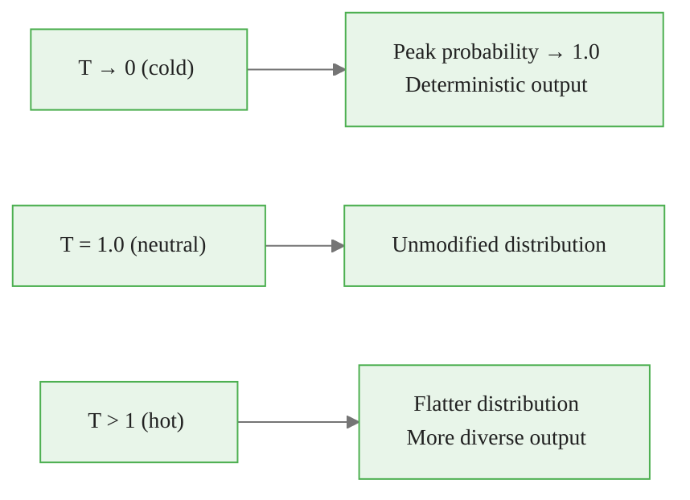
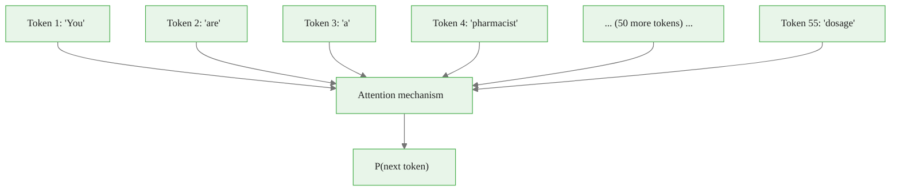

<!-- _class: lead -->

# Autoregressive Generation

**Module 0 — Foundations**

How language models generate text as conditional probability

<!-- Speaker notes: Welcome. The goal of this deck is to give you a precise mental model of what a language model actually does when it generates text. This model will be the foundation for everything in the course. Estimated time: 25 minutes. -->

---

## What We Cover

```mermaid
%%{init: {"theme": "base", "themeVariables": {"primaryColor": "#e8f5e9", "primaryBorderColor": "#4caf50", "primaryTextColor": "#212121", "secondaryColor": "#e3f2fd", "tertiaryColor": "#fff8e1", "lineColor": "#757575", "fontFamily": "Inter, sans-serif", "fontSize": "14px"}}}%%
flowchart LR
    A[What is a token?] --> B[One-step generation]
    B --> C[The chain rule]
    C --> D[Temperature & sampling]
    D --> E[Your prompt as prior condition]
    E --> F[Why this changes everything]
```



<!-- Speaker notes: Walk through the roadmap so learners see where we are going. Emphasise that each section builds directly on the previous one. The payoff is the last box: understanding your prompt as a prior condition is the conceptual unlock for the whole course. -->

<div class="callout-info">
This is a foundational concept for the rest of the module.
</div>
---

## The Wrong Mental Model

<div class="columns">
<div>

### What most people assume

```
User:  "What is the capital of France?"
           ↓
      [ Database lookup ]
           ↓
Model: "Paris"
```

A search engine returning a stored fact.

</div>
<div>

### What actually happens

```
User:  "What is the capital of France?"
           ↓
   P(next_token | all prior tokens)
           ↓
Model: samples "Paris" (p ≈ 0.94)
```

A probability distribution over 50,000+ vocabulary items, sampled once.

</div>
</div>

<!-- Speaker notes: This contrast is the most important slide in the deck. Let it land. The implications are enormous: the model is not retrieving a fact — it is generating the most probable continuation of the token sequence you gave it. That means your prompt is not a query; it is a set of conditioning variables. -->

<div class="callout-key">
This is the key takeaway from this section.
</div>
---

## What Is a Token?

Tokens are chunks of text, not words. Determined by Byte Pair Encoding trained on a large corpus.

| Text | Tokenisation (approximate) |
|------|---------------------------|
| `hello` | `[hello]` |
| `unbelievable` | `[un][believ][able]` |
| `anthropic` | `[anthrop][ic]` |
| `2024` | `[2024]` |
| `don't` | `[don]['][t]` |

Vocabulary size: typically **50,000–130,000 tokens**

> At every generation step, the model assigns a probability to **every token in the vocabulary**.

<!-- Speaker notes: Most people think models work on words. Correcting this misconception early matters because it explains why unusual proper nouns, numbers, and compound words can behave unexpectedly. The key point: the model predicts the next token, not the next word, and the token boundaries affect which probabilities are computed. -->

<div class="callout-warning">
Common misconception — read carefully.
</div>
---

## One Step of Generation

```
Context:  "The capital of France is"

┌─────────────────────────────────────────────┐
│             Transformer                     │
│   (attention layers over all prior tokens)  │
└─────────────────────────────────────────────┘
                    ↓
         Logit for every vocabulary item
                    ↓
              Softmax → probabilities

  "Paris"      → 0.9421   ████████████████████
  " Paris"     → 0.0341   █
  " Lyon"      → 0.0031
  " the"       → 0.0021
  ... 50,000+ more
                    ↓
              Sample: "Paris"
```

<!-- Speaker notes: Walk through this step by step. The transformer takes the entire context and produces one logit per vocabulary item. Softmax converts logits to probabilities. We sample from that distribution. The sampled token is appended, and the whole process repeats. This is autoregressive generation. -->

<div class="callout-insight">
This insight connects theory to practice.
</div>
---

## The Chain Rule of Generation

Every output token is conditioned on every token before it.

$$P(t_1, t_2, \ldots, t_N) = \prod_{n=1}^{N} P(t_n \mid t_1, t_2, \ldots, t_{n-1})$$

<div class="columns">
<div>

**Generation as a chain:**

```
P("Paris")
× P("is" | "Paris")
× P("the" | "Paris is")
× P("capital" | "Paris is the")
× ...
```

</div>
<div>

**What this means:**

- Each word depends on all previous words
- No "memory" separate from context
- The full sequence probability is the product of all conditionals

</div>
</div>

<!-- Speaker notes: This is the core mathematical fact. The model has no separate working memory or fact store — everything is in the conditional probability over the current context window. The chain rule is not a simplification; it is precisely how the model is trained and how it generates. -->

---

## Temperature: Reshaping the Distribution

$$P(t_n = v) = \frac{e^{z_v / T}}{\sum_{v'} e^{z_{v'} / T}}$$



> Temperature reshapes the distribution — it does not change which distribution is being computed. **The prompt still determines that.**

<!-- Speaker notes: A common misconception is that temperature adds creativity or correctness. It does neither. Temperature only reshapes the distribution that the prompt already determined. If your prompt produces a distribution peaked on the wrong answer, T=0 deterministically gives you that wrong answer. Fixing the prompt is always more powerful than adjusting temperature. -->

---

## Attention: Why Context Matters Across Distance



The attention mechanism allows token 4 ("pharmacist") to **directly influence** the probability distribution at token 55, regardless of distance.

<!-- Speaker notes: This is why long prompts can work — the attention mechanism allows any token to attend to any other token in the context window, regardless of position. The word "pharmacist" established early in the prompt actively shapes what tokens are probable 50 positions later. This is the mechanism behind why detailed context in prompts shifts outputs. -->

---

## Your Prompt Is a Conditioning Event

The generation probability conditioned on your prompt:

$$P(\underbrace{t_{k+1}, \ldots, t_N}_{\text{model output}} \mid \underbrace{t_1, \ldots, t_k}_{\text{your prompt}})$$

<div class="columns">
<div>

**Vague prompt**

`"The recommended dosage is"`

Wide distribution: could be medicine, cooking, veterinary, fiction...

Probability mass spread thinly across many completions.

</div>
<div>

**Specific prompt**

`"You are a pharmacist. A patient asks about ibuprofen for adult pain relief. The recommended dosage is"`

Probability mass concentrated on medically correct adult ibuprofen dosage.

</div>
</div>

<!-- Speaker notes: This is the conceptual payoff of the whole deck. Your prompt is not a question — it is a set of conditioning variables. Every sentence you add is evidence that shifts the probability distribution. The more precisely you specify the conditions, the more the probability mass concentrates on the output you actually want. This is Bayesian thinking applied to prompt engineering. -->

---

## Seeing It in Numbers

Same question, two prompts. Imagined completion probabilities:

| Completion | Vague prompt | Specific prompt |
|------------|-------------|-----------------|
| "400mg every 4–6 hours" | 0.12 | 0.71 |
| "consult your doctor" | 0.31 | 0.18 |
| "one teaspoon" | 0.08 | 0.00 |
| "two tablets" | 0.15 | 0.08 |
| other | 0.34 | 0.03 |

Adding domain, role, and drug name **shifted 59 percentage points** onto the correct clinical answer.

<!-- Speaker notes: These are illustrative numbers, not measured logprobs — but the qualitative effect is real and observable. You can verify this in the notebook. The point is that specificity does not just slightly improve the answer; it can move the modal output from a hedge to a specific correct response. -->

---

## What Training Data Does to Priors

The model learned $P(t_n \mid t_1, \ldots, t_{n-1})$ by maximising likelihood on a large text corpus.

That corpus had patterns:

- Most "capital of France" occurrences were followed by "Paris"
- Most "recommended dosage" occurrences were in general medical contexts, not your specific patient
- Most "write a cover letter" requests were from entry-level job seekers

> When your prompt does not specify otherwise, the model defaults to **the most typical situation in its training data** — not the most typical situation in your life.

This is **prior dominance**. The next guide covers it in depth.

<!-- Speaker notes: This slide is the bridge to Guide 02. The training corpus is the prior. When you under-specify your prompt, you are not getting "the model's answer to your question" — you are getting the most probable continuation given the most common context in training data. For many use cases, that context is completely different from yours. -->

---

## Summary

<div class="columns">
<div>

**What we learned**

1. LLMs generate token by token as $P(t_n \mid t_1 \ldots t_{n-1})$
2. Every vocabulary item gets a probability at every step
3. Temperature reshapes — it does not determine — the distribution
4. Attention lets early tokens condition distant generation
5. Your prompt is a prior conditioning event

</div>
<div>

**The implication**

Prompt engineering is **probability engineering**.

Every word you write shifts the conditional distribution over completions.

Specificity concentrates probability mass on the correct answer for your situation.

</div>
</div>

<!-- Speaker notes: Summarise the five key points and then land on the implication. This framing — prompt engineering as probability engineering — is the conceptual foundation for the entire course. If learners leave with only one thing, it should be this. Next: Guide 02 covers what happens when you fail to shift the distribution enough, the prior dominance problem. -->

---

<!-- _class: lead -->

## Next: Prior Dominance

**Guide 02** — Why models produce confident wrong answers, and the condition-specification technique that fixes it.

<!-- Speaker notes: Point learners to the next guide and the notebook. The notebook lets them see these probability effects with real Claude API calls — observing the same question produce different completions based on a single added sentence. -->
