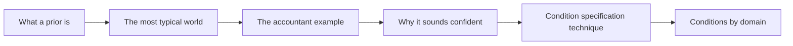
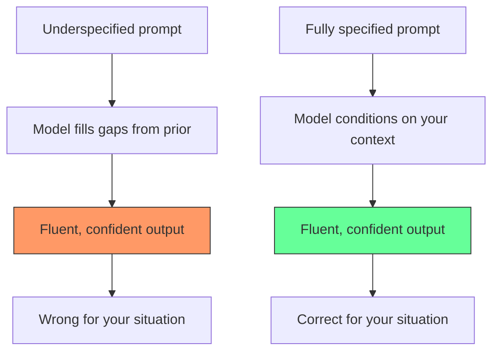

<!-- _class: lead -->

# Prior Dominance

**Module 0 — Foundations**

Why LLMs produce coherent but wrong answers — and what to do about it

<!-- Speaker notes: Welcome to the Prior Dominance deck. This is arguably the most practically important concept in the course. Every time you have been frustrated by an AI that gave you a generic, useless answer, prior dominance was the mechanism. By the end of this deck, you will be able to diagnose it and fix it. Estimated time: 28 minutes. -->

---

## Roadmap

<!-- Speaker notes: Walk through the roadmap. Emphasise that we start with the mechanism, then spend most of the deck on practical diagnosis and fixing. By the end, learners should be able to look at any prompt and identify what the model will assume by default. -->

---

## Every LLM Response Answers a Hidden Question

**What you asked:**

> "What are the tax implications of filing late?"

**The question the model answered:**

> "What are the tax implications of filing late **for a typical US personal income tax return for the most recent tax year filed a few weeks overdue**?"

The gap between those two questions is prior dominance.

<!-- Speaker notes: This slide crystallises the problem. The model did not ignore your question — it answered a specific, fully-specified version of your question, where all the blanks were filled in from training data. The problem is that the model did not tell you which question it answered. It gave you the answer to a question you may not have been asking. -->

---

## What Is a Prior?

In Bayesian inference:

$$\underbrace{P(\theta \mid \text{data})}_{\text{posterior}} \propto \underbrace{P(\text{data} \mid \theta)}_{\text{likelihood}} \times \underbrace{P(\theta)}_{\text{prior}}$$

The **prior** is the probability distribution over outcomes *before* observing evidence.

For a language model:
- **Prior** = probability distribution learned from training corpus
- **Evidence** = your prompt tokens
- **Posterior** = updated distribution from which the model generates

> When evidence is weak (underspecified prompt), the posterior stays close to the prior — "most typical training-data world."

<!-- Speaker notes: The Bayesian framing is not decorative — it is the exact mechanism. The model has a prior shaped by its training corpus. Your prompt is evidence. An underspecified prompt is weak evidence that barely updates the prior. The model then generates from a distribution close to its prior, which reflects the statistical patterns of its training data, not your specific situation. -->

---

## The Most Typical World

For any underspecified prompt, the model's prior fills in gaps with the most statistically common scenario.

| Prompt fragment | Model's default assumption |
|----------------|---------------------------|
| "tax implications" | US federal personal income tax |
| "the patient" | Adult, no major comorbidities, high-income country |
| "our codebase" | Greenfield project, latest stable library versions |
| "my investment" | Retail personal account, long-term horizon |
| "write a cover letter" | Entry-level position, general industry |

These defaults are correct for the average case. They are wrong for most specific cases.

<!-- Speaker notes: Go through the table row by row. For each, ask the audience: when would this assumption be wrong? The goal is to build the habit of asking "what world does this prompt assume?" before submitting any prompt. -->

---

## The Accountant Example — Before

> "My client filed their tax return late. What penalties should they expect?"

**What the model assumes (prior):**
- Jurisdiction: United States
- Return type: Personal income tax (Form 1040)
- Tax year: Most recent completed year
- Lateness: Weeks to months
- Situation: Simple oversight, no prior violations

**Model output (fluent, confident, wrong for our situation):**
> "The failure-to-file penalty is 5% of unpaid taxes per month, up to 25%..."

<!-- Speaker notes: The model's answer is correct — for a US personal income tax return filed a few months late. But this may have nothing to do with the actual client's situation. Notice the model gives no indication that it assumed a US context, or that its answer would be completely different for a UK corporation tax return filed two years late. -->

---

## The Accountant Example — After

> "My client is a **UK limited company**. Their **2024 corporation tax** return has not been filed and is now being submitted in **2026, two years after the deadline**. The company was dormant during the intervening period. What HMRC penalties should they expect?"

**Four conditions added:** Jurisdiction, entity type, delay length, dormancy status.

**Model output (now correct for the situation):**
> "HMRC imposes escalating penalties for late corporation tax returns. Beyond 12 months, a tax-geared penalty of 100% of unpaid tax can apply. For a dormant company with nil profits, the tax-geared element is zero, but fixed penalties of £100 at 3 months and £200 at 6 months still apply..."

<!-- Speaker notes: Walk through the four conditions that were added. Each one is evidence that shifts the probability distribution. The jurisdiction shift alone changes the answer from IRS rules to HMRC rules — a completely different regulatory framework. This is not context-setting politeness; it is likelihood evidence in a Bayesian update. -->

---

## Why It Sounds Confident Either Way

> Fluency and confidence are properties of the **generation process**, not signals that the answer is correct for your situation.

<!-- Speaker notes: This is the dangerous part of prior dominance. A human expert who lacks information will hedge, ask for clarification, or say "it depends." A language model does none of these things — it produces a confident, well-structured response regardless of whether its assumed context matches yours. You cannot use output quality as a proxy for contextual accuracy. -->

---

## The Condition Specification Technique

Three steps to eliminate prior dominance:

**Step 1: Identify the prior assumption**

> "What world does this prompt assume by default?"

List each implicit assumption across: who, where, when, what constraints.

**Step 2: Find the delta**

> "Where does my actual situation differ from the default?"

Every mismatch is a missing condition.

**Step 3: Add conditions as evidence**

Rewrite with each missing condition stated explicitly.

You are not padding — you are providing likelihood evidence that shifts the posterior distribution.

<!-- Speaker notes: This three-step process should become habitual. Before submitting any important prompt, run through: what world does this assume? Where am I different? What conditions would shift the distribution toward my actual situation? It takes 30 seconds and prevents the most common class of LLM failures. -->

---

## Conditions and Their Impact

Not all conditions shift the distribution equally.

| Condition type | Impact on distribution |
|---------------|----------------------|
| Role / expertise level | High — changes register, depth, baseline knowledge |
| Jurisdiction / regulatory context | High for legal, tax, medical |
| Time period / version | Medium — relevant when training data is dated |
| Hard constraints | Medium — eliminates out-of-scope solutions |
| Existing state / prior choices | High for technical and advisory tasks |
| Format preferences | Low on substance, high on surface |

**Focus on conditions where you differ from the typical case**, not conditions where you match it.

<!-- Speaker notes: This prioritisation is practical advice. You have limited space and attention. Spend it on conditions that actually shift the distribution — the ones where your situation is unusual relative to the training prior. Adding conditions that match the default only adds noise. -->

---

## Prior Dominance Across Domains

**Medical**
Default: adult, no comorbidities, high-income country
Specify: age, weight, kidney function, concurrent meds, country

**Legal**
Default: US law, individual, recent date
Specify: jurisdiction, entity type, date of incident

**Code**
Default: latest libraries, greenfield, web deployment
Specify: framework version, legacy constraints, target environment

**Finance**
Default: retail, personal account, long horizon
Specify: institutional vs retail, instrument type, regulatory regime

**Writing**
Default: general audience, 10th-grade level
Specify: audience expertise, publication context, purpose

**Every domain has a "most typical world." Know yours.**

<!-- Speaker notes: Go through each domain and ask learners to reflect on what their "most typical world" assumption would be for their primary domain. The insight is that in every domain, there are two or three conditions that are almost always under-specified. Knowing what those are for your domain is one of the highest-leverage prompt engineering skills you can develop. -->

---

## Worked Example: Before and After

**Domain: Software engineering**

**Before (prior-dominated)**

> "How should I handle authentication in my app?"

Model assumes: web app, modern stack, greenfield, single-tenant, no regulatory requirements.

**After (conditions specified)**

> "We are building a healthcare data platform in Germany, using Django 4.2, subject to GDPR and §630g BGB. We have a legacy SSO system using SAML 2.0 that cannot be replaced. How should we handle authentication?"

The second prompt will produce an answer an expert would actually give.

<!-- Speaker notes: The before prompt would produce a generic answer about JWT, OAuth2, and maybe a recommendation to use Auth0. The after prompt will produce an answer that specifically addresses GDPR requirements, SAML 2.0 integration patterns, healthcare data regulations in Germany, and the constraints of working with a legacy SSO system that cannot be replaced. These are completely different answers, both of which would be delivered with equal confidence. -->

---

## The Common Mistake: Fluency as a Signal

**This is not a signal of accuracy:**

> "Great question! There are several important considerations when filing a late tax return. The most significant is the failure-to-file penalty, which accrues at 5% per month on unpaid taxes..."

**This is what prior dominance looks like:**

- Fluent prose
- Confident assertions
- Structured, organised response
- Completely wrong jurisdiction, entity type, and timeline for your client

Check the assumed context, not the writing quality.

<!-- Speaker notes: This is the practical test. When you see a fluent, well-structured response, do not treat that as a signal that the model understood your context. Instead, ask: what world did this answer assume? Does that world match my actual situation? If not, you have observed prior dominance, and the fix is to add the missing conditions. -->

---

## Summary

**Prior dominance:**
The model defaults to the most typical scenario from training data when your prompt leaves conditions unspecified.

**Why it is dangerous:**
Output is equally fluent and confident whether or not the assumed context matches yours.

**The fix:**

1. Identify what world the prompt assumes by default
2. Find where your situation differs
3. Add those differences as explicit conditions

**Conditions are Bayesian evidence** — they shift the posterior distribution away from the training prior toward the correct answer for your actual situation.

<!-- Speaker notes: These are the three takeaways. Prior dominance is a mechanism, not a flaw. The fix is condition specification, which is Bayesian evidence provision. This framing — conditions as evidence — is the foundation of everything in the rest of the course. Next: the notebook lets you observe prior dominance and its fix with real API calls. -->

---

<!-- _class: lead -->

## Next: Notebook 01

**Seeing Conditional Probability in Action**

Observe how a single sentence shifts model output across four domains — with live Claude API calls.

<!-- Speaker notes: Point learners to the notebook. The hands-on observation of this effect is more persuasive than any slide. They will see, in real model outputs, how adding one sentence of context changes the answer dramatically. This makes the abstract mechanism concrete and motivates the rest of the course. -->
