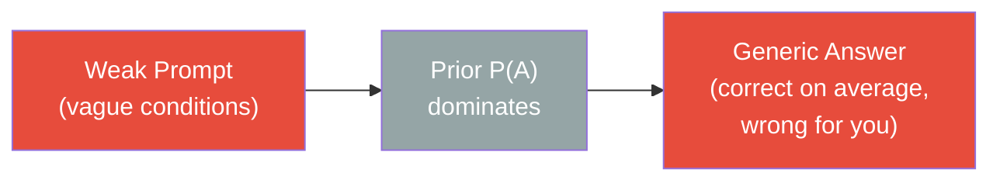
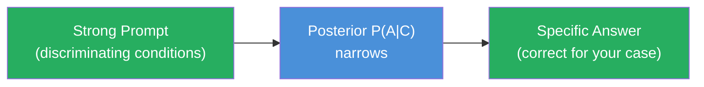
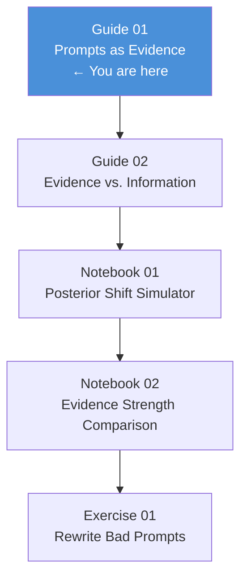

<!-- _class: lead -->

# Prompts as Evidence
## The P(A|C) Frame

**Module 1 — The Bayesian Frame**

<!-- Speaker notes: Welcome. This deck establishes the single most important idea in the course: your prompt is not a command, it is evidence. Everything else builds from this. Estimated deck time: 25 minutes. -->

---

## Why Most Prompts Fail

You write more. You get the same generic answer.

Adding words doesn't help if those words don't **shift the posterior**.

> The problem is not length. The problem is that you're providing information, not evidence.

<!-- Speaker notes: Start with the frustration learners already have. They've written long prompts and gotten useless answers. Name the mechanism before giving it a name. This creates the question the rest of the deck answers. -->

---

## The Model Is Not a Search Engine

A search engine retrieves. A language model **samples**.

Every response is drawn from a conditional distribution:

$$P(A \mid C)$$

- $A$ = Answer (what the model outputs)
- $C$ = Conditions (everything in your prompt)

**Your prompt does not select an answer. It defines a distribution over answers.**

<!-- Speaker notes: This is the key reframe. Spend time here. Ask: when you type into Google vs. when you type into Claude, what's the difference in how it works? Google looks things up. Claude generates from a probability distribution conditioned on your input. -->

---

## Bayes' Theorem — Applied to Prompting

$$P(A \mid C) \propto P(C \mid A) \cdot P(A)$$

<div class="columns">

**What each term means:**

| Term | Meaning |
|------|---------|
| $P(A)$ | The model's **prior** — training data defaults |
| $P(C \mid A)$ | How consistent your conditions are with each possible answer |
| $P(A \mid C)$ | The **posterior** — what you actually get |

**The key relationship:**

Weak conditions → $P(A \mid C) \approx P(A)$

Strong conditions → posterior collapses onto the right answer

</div>

<!-- Speaker notes: Walk through the formula slowly. Emphasize that the proportionality sign means the normalizing constant doesn't matter — what matters is the RATIO. Strong conditions shift the numerator for the right answer and shrink it for everything else. -->

---

## The Prior: What the Model Assumes by Default

When you ask a tax question, the model's prior encodes:

- United States federal law
- Current tax year
- Timely filing (the modal case)
- Individual 1040 return
- Standard deductions
- Ordinary income

Every deviation from this "default world" requires you to **provide evidence that shifts away from it**.

> The prior is not wrong. It describes a real world. It is just not your world.

<!-- Speaker notes: The prior is the statistical center of training data. Ask learners: what's the default world for a medical question? (US, adult, no prior conditions, common diagnosis.) For a coding question? (Python 3, standard library, Linux, working code environment.) -->

---

## The Prior Is Invisible Until It Dominates





<!-- Speaker notes: Use these two flows to make the contrast concrete. The top flow is what happens with most prompts — the generic answer that feels slightly off. The bottom is what you're building toward. The mechanism is the same in both cases; what differs is the quality of the evidence. -->

---

<!-- _class: lead -->

# The Accountant Example

## Watching a Posterior Shift in Real Time

<!-- Speaker notes: Transition to the worked example. This is the most concrete illustration in the module. Walk through it step by step. Encourage learners to predict what changes before you show them. -->

---

## Starting Prompt: Prior Dominates

**Prompt:** *"What happens if I miss the filing deadline?"*

The model reasons in the **"typical filing" world:**

| Assumption | Default |
|-----------|---------|
| Who is asking? | Someone considering filing late (prospective) |
| Jurisdiction | US federal |
| Return type | Individual 1040 |
| Status | Hasn't filed yet |

**Response covers:** failure-to-file penalty (5%/month), failure-to-pay penalty (0.5%/month), interest, how to request an extension.

*Correct — for the prior world. Not useful for the specific case.*

<!-- Speaker notes: Ask learners to read the prompt and predict what the model will say before showing them. Then show the table of assumptions. Point out: the model made five assumptions you didn't authorize. -->

---

## One Sentence Changes Everything

**New prompt:** *"What happens if I miss the filing deadline? I already filed late in 2026 and didn't request an extension."*

The phrase "already filed late" and "didn't request an extension" is **discriminating evidence**.

It rules out:
- The prospective framing
- Extension availability
- The "should I file late?" question
- Several non-2026 tax years

<!-- Speaker notes: Point to the words "already" and "didn't request" as the evidence. These two words eliminate entire categories of possible interpretations. This is not more detail — this is evidence that excludes wrong worlds. -->

---

## The Posterior Shifts

<div class="columns">

**Before (prior world)**

- Prospective question
- Extension still available
- General penalty rates
- How to avoid penalties
- What happens if you don't file

**After (posterior world)**

- Retroactive situation
- Extension not available
- Penalty calculation for 2026
- First-time abatement eligibility
- IRS collection timeline

</div>

Same question. Different world. Different answer.

<!-- Speaker notes: Read the two columns together. Ask: which column is more useful to someone who already filed late? The posterior world is more actionable, more specific, and requires the model to know different things than the prior world required. -->

---

## Visualizing the World Collapse

```
         Prior P(A) — all plausible tax worlds
         ┌──────────────────────────────────┐
         │  Late filing retroactive         │ ← kept
         │  On-time filing                  │ ← ruled out: "already filed late"
         │  Extension requested             │ ← ruled out: "didn't request"
         │  Business tax question           │ ← ruled out: individual framing
         │  Non-US jurisdiction             │ ← ruled out: "2026" (US cycle)
         │  Future tax planning             │ ← ruled out: "already filed"
         └──────────────────────────────────┘
                           │
                           ▼
              Posterior P(A|C) — one world
              [Late filing, 2026, no extension, retroactive]
```

One sentence. Five worlds eliminated.

<!-- Speaker notes: This diagram is the core visual. Spend time on it. Point to each eliminated row and ask: which word or phrase in the prompt eliminated it? Get learners comfortable with the "world collapse" mental model. -->

---

## What Made That Sentence Evidence?

The sentence "I already filed late in 2026 and didn't request an extension" is evidence because it:

1. **Specifies timing** — "2026" rules out prior years and future hypotheticals
2. **Specifies status** — "already filed" shifts from prospective to retroactive
3. **Specifies a constraint** — "didn't request an extension" eliminates extension-based advice
4. **Changes the objective** — from "how to avoid" to "what now that it happened"

Each element narrows the posterior. Together, they produce a different answer.

<!-- Speaker notes: Pull apart the mechanics. What is evidence in a prompt? It is a fact that (a) is specific to your situation and (b) rules out other possible interpretations. Not every fact qualifies — we'll see why in Guide 02. -->

---

## The Stabilization Prediction

As you add more discriminating conditions, the posterior narrows and **stabilizes**.

```
Conditions Added    │ Response Specificity
────────────────────┼──────────────────────
0 conditions        │ Very generic, many caveats
1 condition         │ Somewhat focused
2 conditions        │ More specific
3 conditions        │ Highly specific
4+ conditions       │ Stable — additional conditions add little
```

**Testable prediction:** Response similarity should increase as conditions are added, then plateau.

You will verify this in notebook `01_posterior_shift_simulator.ipynb`.

<!-- Speaker notes: The stabilization effect is important because it tells you when you're done — when additional conditions stop changing the response materially. It also tells you when you've been adding detail rather than evidence: the response doesn't change at all. -->

---

## Common Failure Modes

<div class="columns">

**Fails to shift posterior**

- "Please be thorough"
- "I've tried other approaches"
- "This is for an important project"
- "I am a professional"
- Restating what the model already assumes

**Shifts the posterior**

- Jurisdiction different from default
- Timing / year / phase
- Constraints that rule out solutions
- Your actual objective function
- The failure mode you observed

</div>

The difference: does this fact **exclude** possible answer worlds?

<!-- Speaker notes: Ask learners to look at their last three prompts and categorize each sentence as "shifts posterior" or "doesn't shift posterior." Most sentences in most prompts are in the left column. This is the diagnosis. -->

---

## The Core Formula in Plain Language

$$P(A \mid C) \propto P(C \mid A) \cdot P(A)$$

**In practice:**

- Start with what the model assumes (P(A))
- Identify where your situation departs from those assumptions
- Provide exactly the evidence that marks those departures
- Everything else is noise

> Your prompt is a selector. It selects which world the model reasons in. The question is whether you've selected the right one.

<!-- Speaker notes: Bring it back to the formula, now that learners have seen it illustrated. The formula is the compact form of everything in this deck. Make sure they can translate each symbol back to the concrete example before moving on. -->

---

<!-- _class: lead -->

# What You Can Do Now

<!-- Speaker notes: Closing section. Move from concept to action. Give learners one concrete thing to try before the next session. -->

---

## Immediate Application

Take any prompt that gave you a generic answer. Ask three questions:

1. **What world did the model default to?** Name the assumptions it made.
2. **Where does your situation depart from that world?** Identify the specific facts that differ.
3. **What one sentence encodes those departures?** Write it. Add it to the prompt.

Then run both versions and compare.

This is not a trick. This is the mechanism. You are not manipulating the model — you are providing the evidence it needs to reason in your world.

<!-- Speaker notes: End with the action. Learners should leave this deck able to apply the frame immediately. The exercise is simple and produces visible results in minutes. That feedback loop is essential for building the intuition. -->

---

## Module 1 Roadmap



<!-- Speaker notes: Orient learners in the module. They've completed the first guide. Next is the critical distinction between evidence and information — the most common failure mode. Notebooks give them hands-on verification with real API calls. -->

---

## Summary

- Language models sample from **P(A|C)**, not retrieve
- Your prompt conditions the distribution — it doesn't select an answer
- Weak conditions → prior dominates → generic answer
- Strong, **discriminating** conditions → posterior collapses → specific answer
- The accountant example: one sentence eliminated five worlds
- Evidence is not detail — it is facts that **exclude** wrong worlds

**Next:** Guide 02 — why adding detail often fails, and what makes a condition truly discriminating

<!-- Speaker notes: Review the summary. Ask learners to close their eyes and explain the P(A|C) frame in one sentence to a colleague. If they can do that, they're ready for Guide 02. If they can't, spend a moment on the accountant example again. -->
