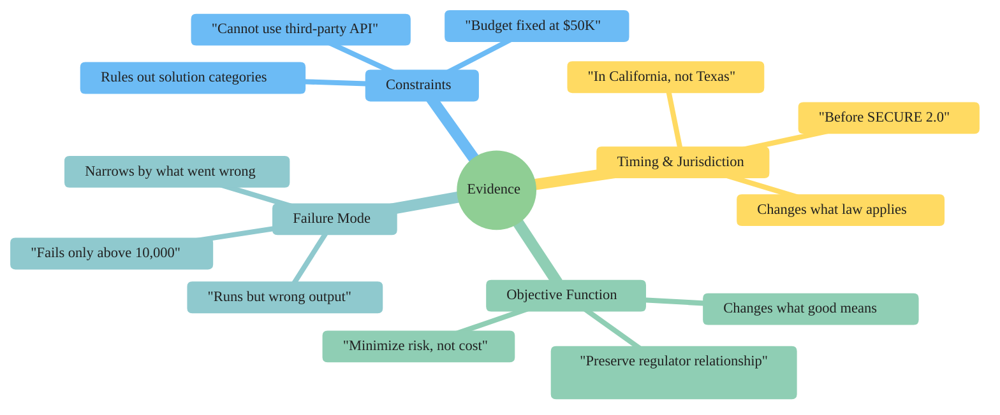

<!-- _class: lead -->

# Evidence vs. Information
## Why "More Detail" Often Fails

**Module 1 — The Bayesian Frame**

<!-- Speaker notes: This deck addresses the most common misconception in prompt engineering: that longer, more detailed prompts produce better answers. They often don't. The reason is the evidence/information distinction, which this deck makes concrete with side-by-side examples. Estimated time: 20 minutes. -->

---

## The Paradox

You write a detailed, thorough prompt.

You get a generic answer.

You add more detail.

The answer gets slightly longer. Still generic.

> **Why?** Because you're adding *information*, not *evidence*.

<!-- Speaker notes: Start with the frustration. Ask the room: who has had this experience? Most hands go up. Then: what did you try to fix it? More detail. Did it work? Usually not. That's the paradox this deck resolves. -->

This is a foundational concept for the rest of the module.

---

## Information vs. Evidence

**Information**

Any fact that is true and relevant.

Does not necessarily change the posterior.

Examples:
- "I am a professional"
- "This is important"
- "I need a clear answer"
- "I've tried other approaches"

**Evidence**

A fact that **narrows the solution space**.

Eliminates possible answers. Shifts the posterior.

Examples:
- "Delaware C-corp"
- "Before SECURE 2.0"
- "Cannot change the schema"
- "Objective is license retention"

The distinction: does this fact **exclude** possible answer worlds?

<!-- Speaker notes: Put both columns on the board. Ask learners to look at their last prompt and sort each sentence into left or right column. This usually produces a moment of recognition — most sentences are on the left. -->

This is the key takeaway from this section.

---

## The Marginal Evidence Test

Before adding any sentence to a prompt, ask:

> If the model didn't have this sentence, would it produce a meaningfully different response?

| Sentence | Passes? | Why |
|---------|---------|-----|
| "I'm asking for professional purposes" | No | Model assumes this already |
| "The database is PostgreSQL 14, not MySQL" | Yes | Changes SQL syntax options |
| "I need a clear and comprehensive answer" | No | Model tries to be clear regardless |
| "The timestamp format is ISO 8601" | Yes | Changes parsing code |
| "I've spent weeks on this" | No | Effort doesn't shift the answer |

<!-- Speaker notes: Have learners run the test on their own prompts. The cut rate is usually high. Ask: if you cut all the sentences that fail the test, is your prompt shorter and better? Usually yes. -->

Common misconception — read carefully.

---

## Numbers Are Not Automatically Evidence

**Information-heavy prompt with numbers:**

> "I have about 5-7 years of experience, work with approximately 200-300 clients per year, and generate roughly $800K-$1.2M in annual revenue. What tax strategies should I consider?"

These numbers don't shift the posterior because:

- No baseline to compare against
- Ranges still consistent with many strategies
- Revenue in this range applies to many different tax situations
- No numbers constrain the solution space

<!-- Speaker notes: This is a common failure mode — people think adding specific numbers makes a prompt more evidence-rich. Numbers help only when they cross a threshold that changes the answer (e.g., "over $10M revenue" triggers different tax rules than "under $10M"). Ask: what number would actually matter here? -->

This insight connects theory to practice.

---

## Same Domain — Evidence-Strong Version

> "I am a consultant structured as an S-corp and I have **not yet set up** a solo 401(k) or SEP-IRA. What tax-advantaged retirement strategies am I **missing**?"

What shifts the posterior:

| Condition | What it eliminates |
|-----------|-------------------|
| "S-corp" | Sole prop strategies, C-corp strategies |
| "not yet set up" | Advice about managing existing accounts |
| "missing" | Generic overview → specific gap analysis |

No revenue figures needed. The structure and the gap are the evidence.

<!-- Speaker notes: Compare the two prompts side by side. Ask: which one is shorter? Which one will get a better answer? The evidence-strong version is shorter but more powerful because every word is discriminating. -->

---

## The Four Categories of Discriminating Evidence

<!-- Speaker notes: Walk through each branch. For each, ask learners for an example from their own domain. The goal is to build a taxonomy they can apply when constructing prompts. These four categories cover the majority of useful conditions. -->

---

## Category 1: Constraints

A constraint rules out entire categories of answers.

**Without constraint:**
> "How should I architect this data pipeline?"

Model covers: Spark, Dask, Airflow, Kafka, custom ETL, cloud-native...

**With constraint:**
> "How should I architect this data pipeline? We are on AWS, cannot use managed services, and must stay under $500/month compute cost."

Model covers: EC2-based options within that cost envelope only.

Every constraint eliminates answers. Eliminating answers is evidence.

<!-- Speaker notes: The constraint example is intuitive. Ask: if you were advising a friend and they said "can't use managed services, under $500/month" — would you give a different answer? Of course. The constraint changes what's in scope. The model works the same way. -->

---

## Category 2: Timing and Jurisdiction

Timing and jurisdiction change what law, precedent, or convention applies.

| Before condition | After condition | What changes |
|-----------------|-----------------|-------------|
| "What are the tax rules?" | "...under 2025 rules after SECURE 2.0?" | Retirement contribution limits |
| "Is this legal?" | "...in California?" | Employee classification law |
| "How do I file?" | "...for a 2023 amended return?" | Form 1040-X, different process |
| "What's the standard?" | "...per GDPR, not CCPA?" | Data retention rules |

> The model's prior assumes the most common jurisdiction and the most current rules. Any deviation is evidence.

<!-- Speaker notes: Jurisdiction is one of the highest-leverage evidence categories because it changes not just emphasis but the actual rules that apply. A California employment law question and a Texas employment law question can have diametrically opposite correct answers. -->

---

## Category 3: The Objective Function

The objective function determines what a "good answer" looks like.

**Default objective (prior):** Minimize penalty / maximize outcome / standard recommendation

**Shifted objective (evidence):**

> "We have a regulatory violation identified internally. Our objective is to **preserve the regulator relationship and operating license**, not minimize the current penalty."

This shifts from:
- Defensive legal posture
- Minimize disclosure

To:
- Voluntary disclosure
- Remediation plan
- Relationship management

Same situation. Different optimal action. Objective is the evidence.

<!-- Speaker notes: The objective function category is underused. Ask: what's the default objective the model assumes for your most common prompt type? Is it your actual objective? Usually there's a gap. That gap is the most important thing to specify. -->

---

## Category 4: The Failure Mode

Telling the model what went wrong is evidence about what is *not* the answer.

**No failure mode:**
> "My Python script isn't working correctly."

Model covers: syntax errors, logic errors, import problems, type errors, environment issues — everything.

**With failure mode:**
> "My script runs successfully but produces incorrect numerical output on inputs larger than 10,000."

Model rules out: syntax errors, imports, environment. Focuses on: integer overflow, floating point precision, algorithmic threshold effects.

<!-- Speaker notes: The failure mode is evidence because it tells the model which worlds are ruled out. "Runs successfully" eliminates syntax and import errors. "Larger than 10,000" suggests a threshold — an algorithm that behaves differently at scale. These constraints point directly at the real problem. -->

---

## Side-by-Side: Medical Domain

**Information-heavy (generic):**
> "45-year-old adult with fatigue for a few months. Generally healthy, active lifestyle, balanced diet, 7-8 hours sleep."

Result: full differential for adult fatigue — thyroid, anemia, depression, sleep apnea, diabetes...

**Evidence-strong (specific):**
> "Fatigue worst in morning, improves through day. Weight gain despite unchanged diet, cold intolerance, dry skin. 3-month onset. No stress changes."

Result: symptom cluster points toward hypothyroidism with high discriminating power.

The symptom cluster is evidence. Lifestyle reassurances are not.

<!-- Speaker notes: The medical example is powerful because it's relatable and the difference is stark. Ask: if you described these symptoms to a doctor, which description would produce a useful response? The cluster of specific symptoms is the diagnostic evidence. Reassurances ("healthy lifestyle") confirm the prior — the doctor already assumes you're basically healthy. -->

---

## Side-by-Side: Code Generation

**Information-heavy (generic):**
> "Process a large CSV file efficiently. Contains sales data. Need it to be fast and memory-efficient."

Result: pandas with chunked reading — the standard pattern.

**Evidence-strong (specific):**
> "50GB CSV, 4GB RAM machine, standard library and pandas only — no Spark/Dask. Filter `status=='completed'`, sum `amount` by `customer_id`."

Result: chunked streaming aggregation with dict accumulator — the specific solution for these exact constraints.

<!-- Speaker notes: Walk through what each condition in the evidence-strong version eliminates. "50GB on 4GB RAM" → no in-memory solutions. "Standard library and pandas only" → no Spark/Dask. "Filter then aggregate" → no need for arbitrary transformation patterns. The posterior collapses onto one approach. -->

---

## Side-by-Side: Business Strategy

**Information-heavy (generic):**
> "Growing SaaS, different customer types, want to maximize revenue. What pricing should we consider?"

Result: standard playbook — tiered pricing, usage-based, freemium, enterprise.

**Evidence-strong (specific):**
> "Free tier converting at 8% (industry avg 2-4%). Paid churning at 3%/month (avg 5-7%). Strong retention, weak initial conversion. Product locked for 6 months."

Result: focus on top-of-funnel, not pricing tiers — different question entirely.

The metrics reveal where the actual problem is.

<!-- Speaker notes: The business example shows how specific metrics can reframe the problem entirely. The generic prompt asks "what pricing strategy?" The evidence reveals the problem isn't pricing — it's conversion. The answer to the evidence-strong prompt is completely different from what a generic prompt would produce. -->

---

## The Cut Rule

If it passes the marginal evidence test, keep it.

If it fails, cut it or replace it with something that passes.

**Most prompts improve when sentences that fail the test are removed** — not added to.

> Shorter prompt, stronger evidence, better answer.

<!-- Speaker notes: This is counterintuitive. Learners have been trained to write more. The insight is that length works against you when it dilutes the signal-to-noise ratio of your evidence. A prompt with three strong conditions outperforms a prompt with three conditions and ten filler sentences. -->

---

## Summary

- Information = true and relevant; doesn't necessarily shift the posterior
- Evidence = narrows the solution space; eliminates answer worlds
- Numbers are not automatically evidence
- The four categories that discriminate: constraints, timing/jurisdiction, objective function, failure mode
- Apply the marginal evidence test: would the model respond differently without this sentence?
- Cut what fails the test

**Next:** Notebook 01 — Posterior Shift Simulator — verify these claims with real API calls

<!-- Speaker notes: End with the summary. The key takeaway is the marginal evidence test — it's the practical tool learners can apply immediately. Before the next session, ask them to apply it to one real prompt and report back what they cut. -->
