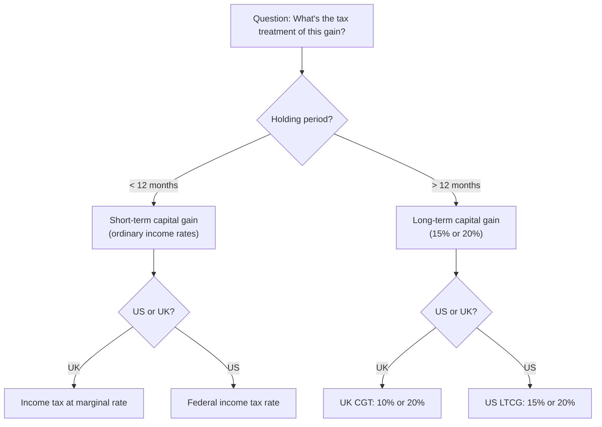
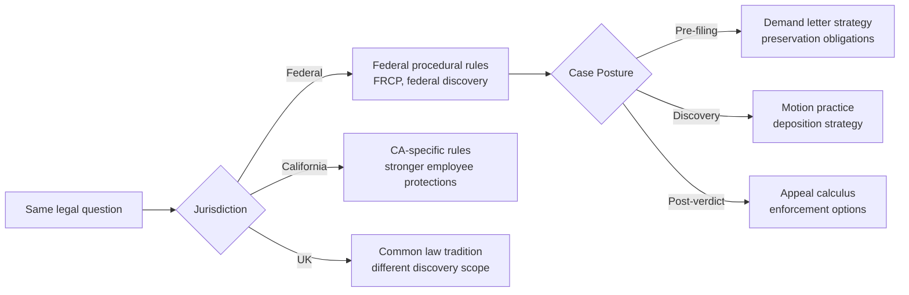
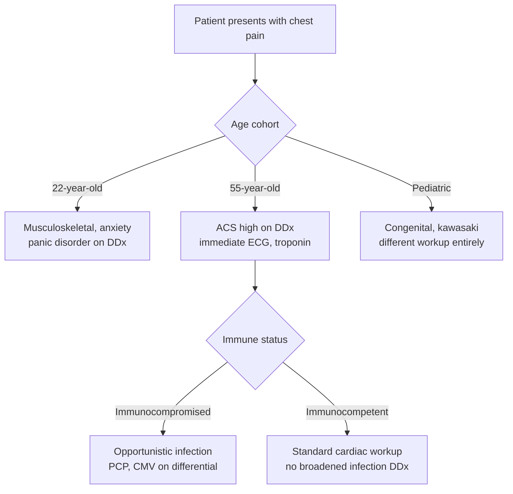
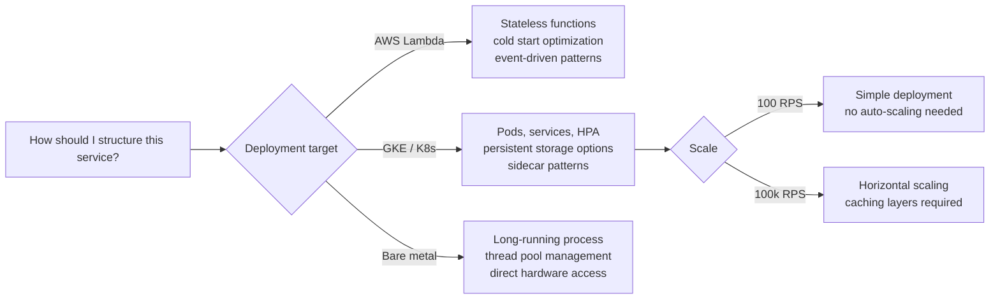

<!-- _class: lead -->

# Switch Variables
## The Conditions That Actually Matter

### Module 2 — Bayesian Prompt Engineering

<!-- Speaker notes: This module solves the most common prompt engineering failure: adding more detail without adding the right detail. Switch variables are the conditions that bifurcate the solution space entirely — not refinements, but routing mechanisms. Set the stage by asking students: when was the last time a model gave you a confident, detailed, completely wrong answer? That happens because a switch variable was missing. -->

---

## The Core Problem

**What most people do:**

Add more description.

> "I'm a product manager at a B2B SaaS company with 200 employees building tools for HR teams in the US market targeting mid-market companies since 2021..."

**What actually matters:**

Identify the branches.

> "Jurisdiction: US federal
> Entity type: C-Corp
> Transaction goal: acquisition
> Timeline: before Series B close"

The first prompt is longer. The second prompt is *better*.

<!-- Speaker notes: The contrast here is the core lesson. Most prompts fail not because of quantity of information, but because they supply the wrong kind. Volume does not equal information. This slide sets up the entire module. Point to both columns and ask: which one narrows the model's reasoning more? -->

---

## What Is a Switch Variable?

A **switch variable** is a condition whose value routes reasoning to a **categorically different solution branch**.

Not a refinement. A fork.

$$P(\text{answer} \mid Q, V{=}v_1) \neq P(\text{answer} \mid Q, V{=}v_2)$$

> If the variable were different, you would need a completely different answer — not a slightly adjusted one.

<!-- Speaker notes: Make the mathematical definition concrete. The equation says: the correct answer given value v1 is different from the correct answer given value v2. This is not a marginal difference — it's categorical. Example: "Is this filing valid?" with v1=before deadline is yes. With v2=after deadline the answer isn't "less valid" — it simply doesn't exist. The deadline is a switch variable. -->

---

## Anatomy of a Switch

Each switch variable doubles the branching. Miss one, the model picks a branch for you.

<!-- Speaker notes: Walk through the tree step by step. The holding period is the first switch — under 12 months versus over 12 months routes to completely different tax regimes. The jurisdiction is the second switch. Without specifying these two variables, the model is forced to guess which branch you're in. And it will often guess wrong, confidently. This is not a model failure — it's a missing condition failure. -->

---

## The Five Categories

| Category | What It Does | Example |
|----------|-------------|---------|
| **Jurisdiction** | Which rule set applies | US federal vs. EU |
| **Timing / Posture** | Where in the process | Pre-litigation vs. appellate |
| **Status / Role** | Who the actor is | Individual vs. entity |
| **Constraints** | What eliminates solutions | Budget, allergy, latency |
| **Objective function** | What "correct" means | Win vs. settle vs. delay |

Every switch variable in every domain belongs to one of these five categories.

<!-- Speaker notes: These five categories are exhaustive across all domains. When a student is stuck identifying switch variables for a new domain, they should run through this list as a checklist. Jurisdiction first: which rules apply? Timing: when in the process? Status: who is involved? Constraints: what eliminates solutions? Objective: what are we optimizing for? The objective function is the most commonly omitted — and often the highest-leverage. -->

---

## Domain: Law

The same question needs five switch variables answered before any real analysis can begin.

<!-- Speaker notes: Legal questions are especially vulnerable to missing switch variables because law is almost entirely conditional. The correct answer in California employment law is often the opposite of the correct answer in Texas. The pre-litigation strategy is completely different from post-verdict options. A lawyer who ignores jurisdiction is committing malpractice. A prompt that ignores jurisdiction is getting a blended, hedged non-answer. -->

---

## Domain: Medicine

The diagnostic tree for a 22-year-old and a 55-year-old with identical symptoms is not similar. It is categorically different.

<!-- Speaker notes: This is the clearest domain for showing why switch variables are not just "more detail." The clinical presentation is identical but the diagnostic and treatment approach is entirely different depending on age, immune status, acuity, and care setting. Adding more symptom detail to a prompt without specifying age cohort gives you a blended answer that doesn't represent any real clinical scenario. -->

---

## Domain: Software Engineering

The "correct" architecture for a Lambda function is wrong for Kubernetes. These are not alternative approaches — they are different systems.

<!-- Speaker notes: Software engineers often fall into the trap of asking abstract architectural questions. "What's the best way to structure this?" is unanswerable without knowing the deployment target, scale, and team constraints. A microservices recommendation for a solo developer is as wrong as a monolith recommendation for a 50-engineer team building for 10M users. The switch variables are the prerequisites for any architectural advice. -->

---

## Domain: Finance

**Same position, different objective:**

| Objective | Correct action |
|-----------|---------------|
| Maximize alpha | Hold, add on dips |
| Hedge exposure | Sell, buy puts |
| Meet capital ratios | Reduce notional |
| Minimize tax | Hold past year-end |
| Meet redemption | Liquidate now |

**Five different correct answers** for the same position.

The objective function is the switch variable that most finance prompts omit entirely.

> "What should I do with this position?"

Without an objective, this question has five valid but contradictory answers.

<!-- Speaker notes: Finance is the best domain for illustrating the objective function as a switch variable. The same position in a portfolio calls for completely different actions depending on whether you're trying to maximize return, hedge risk, meet a capital requirement, or minimize taxes. These are not marginal differences in strategy — they are opposite actions. "Hold" vs. "Sell" cannot both be correct simultaneously. The objective function chooses the answer. -->

---

## The Diagnostic Question

Before writing any prompt, ask:

> **"What are the top 5 conditions that would make the correct answer to this question completely different?"**

This forces you to think in branches, not details.

**The test:** If you change the condition and the answer changes by 100%, it's a switch variable. If it changes by 10%, it's a descriptive detail.

<!-- Speaker notes: This diagnostic question is the most useful tool from this entire module. It reframes the task from "what context should I give?" to "what are the branching conditions?" The second framing is far more productive. Have students practice this right now by thinking of a domain they work in and asking this question about a common question they prompt on. -->

---

## Worked Example: Switch Variable Extraction

**Question:** "How should I handle this employment dispute?"

| Step | Condition found | Category | Impact |
|------|-----------------|----------|--------|
| 1 | US / California / Federal | Jurisdiction | 100% |
| 2 | Pre-litigation / post-filing | Timing | 100% |
| 3 | Employer or employee? | Status | 100% |
| 4 | Goal: win, settle, preserve relationship | Objective | 90% |
| 5 | Arbitration clause present? | Constraint | 80% |

All five conditions found in under 2 minutes using the five-category checklist.

<!-- Speaker notes: Walk through this example slowly. Notice that all five conditions were identified by simply running through the five categories. This is not a creative exercise — it's a systematic one. Jurisdiction: which state? Timing: where in the process? Status: which party? Objective: what are we trying to achieve? Constraints: what eliminates options? After doing this exercise, the prompt is ready to write. Before this exercise, any prompt is guesswork. -->

---

## What Switch Variables Are NOT

**Not switch variables:**

- Company size (47 employees)
- Founding year (2019)
- Number of locations (6 cities)
- User's preferred format
- Tone preferences
- Background reading

These are **descriptive details** — they refine presentation, not answers.

**Switch variables:**

- Governing state (NY vs. CA)
- Transaction type (asset vs. stock)
- Entity structure (LLC vs. C-Corp)
- Timeline (before vs. after close)
- Goal (acquisition vs. partnership)

These **route to different solution branches**.

<!-- Speaker notes: This distinction is critical and where most prompt engineers go wrong. They add company background, context, and description — none of which is a switch variable. The test is simple: if the answer would be the same regardless of this condition, it's not a switch variable. If the answer would be fundamentally different, it is. Apply this test ruthlessly to every piece of context you add to a prompt. -->

---

## The Objective Function: Most Commonly Missing

The objective function is the switch variable that professionals most reliably omit.

**Why:** It feels implicit. "Of course I want to win." "Of course I want maximum return."

**But it isn't implicit.** For every domain:

- **Law:** Win at trial ≠ minimize cost ≠ preserve relationship ≠ establish precedent
- **Medicine:** Cure ≠ symptom management ≠ palliative ≠ prevention
- **Engineering:** Maximum performance ≠ minimum cost ≠ maximum reliability
- **Finance:** Alpha ≠ hedge ≠ income ≠ capital preservation

State the objective function explicitly. Every time.

<!-- Speaker notes: The reason the objective function is so commonly omitted is that professionals assume it's obvious. An experienced lawyer might think "clearly we want to win." But do we want to win at trial, or win by getting the case dismissed early, or win by making litigation so expensive the other side settles? These call for different strategies. The model does not know which objective you have unless you say so explicitly. -->

---

## Practice: Identify the Missing Switch

**Prompt:** "What database should I use for this application?"

What's missing?

1. Scale: 100 users or 100 million?
2. Query pattern: relational, document, graph, time-series?
3. Consistency requirement: ACID or eventual?
4. Deployment target: cloud-managed or self-hosted?
5. Team expertise: SQL, NoSQL, NewSQL?

Without these, the model will recommend PostgreSQL because it's the most common — not because it's correct for your case.

<!-- Speaker notes: Have students identify the missing switch variables before revealing the list. This active recall exercise builds the habit. The right answer to "what database should I use" changes entirely between a 100-user CRUD app and a real-time analytics platform at 10M events/second. These are not the same question wearing different clothes — they require completely different answers. -->

---

## Summary

**Switch variables** are the conditions that route reasoning to categorically different solution branches.

**Five categories** cover every domain:
- Jurisdiction, Timing, Status, Constraints, Objective function

**The diagnostic question:** *"What top 5 conditions would make the correct answer completely different?"*

**The test:** 100% answer change = switch variable. 10% change = descriptive detail.

**Next:** Guide 2 — why information gain (not volume) determines which conditions to add first.

<!-- Speaker notes: Close by emphasizing the shift in mindset this module requires. Prompt engineering is not a writing skill — it's a probability skill. Switch variables are the levers that move the probability mass from a vague distribution to a precise one. Students who internalize this will write fundamentally better prompts than those who just add more context. The next guide builds on this with information theory to explain why some conditions matter far more than others. -->

---

<!-- _class: lead -->

## Next: Information Gain

### Guide 2 — Why "More Detail" Is Not "Better Conditions"

Not all switch variables reduce uncertainty equally.
Learn to rank them by their impact on the answer distribution.

<!-- Speaker notes: Preview the next guide. The key insight coming up is that conditions have different information gain — some collapse the answer space dramatically, others barely move it. Understanding this lets you prioritize which switch variables to add first, which is the practical skill for time-pressured prompt writing. -->
