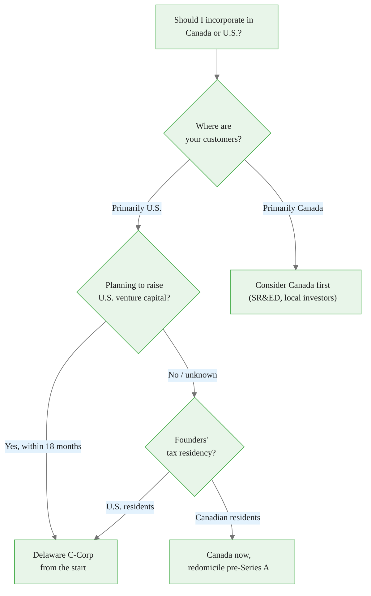
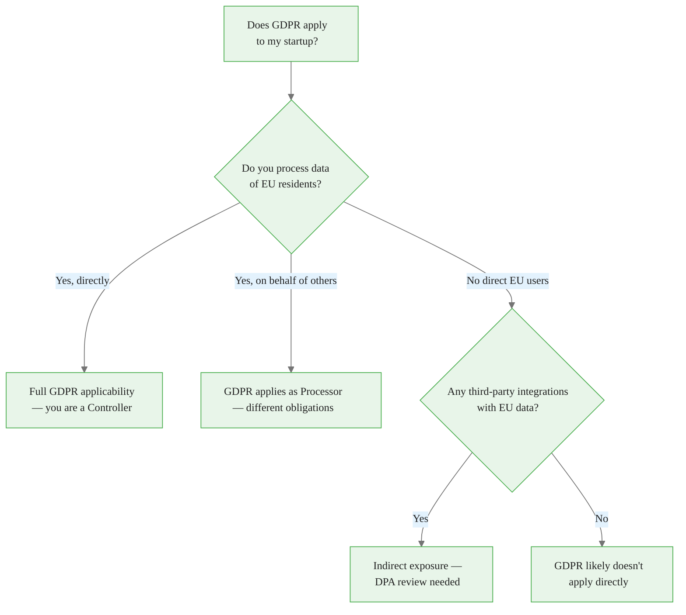

<!-- _class: lead -->

# Conditional Trees
## When One Answer Is Wrong

**Module 4 — Bayesian Prompt Engineering**

*The model gave you an answer. It gave you the wrong branch.*

<!-- Speaker notes: Open with this: "Has anyone ever gotten a completely accurate AI answer that was completely wrong for their situation?" That's the experience this module is about. The model wasn't hallucinating. It was giving you the most common answer — which was someone else's answer, not yours. -->

---

## The Question That Looks Simple

> "Should I incorporate in Canada or the U.S.?"

Seems like a question with an answer.

**It is not a question with an answer.**

It is a decision tree wearing the costume of a simple question.

<!-- Speaker notes: This is the central insight. Before we talk about prompting technique, we need to see the structural problem. The question looks simple. It has branches. Every serious decision question has branches. The model's job, when asked a flat question, is to pick the most common branch. That is almost certainly not your branch. -->

<div class="callout-info">
This is a foundational concept for the rest of the module.
</div>
---

## What the Model Does

$$P(\text{Delaware}) \mid \text{"Canada or U.S.?"}) \approx P(\text{Delaware in training data})$$

The model picks the **training prior** — the most common answer across all the people who ever asked this question.

> *"Delaware C-Corp is standard for venture-backed startups..."*

This answer is **correct for the average case.**

You are not the average case.

<!-- Speaker notes: This is the Bayesian framing connecting back to Module 1. When you don't specify conditions, the posterior defaults to the prior. The prior is the average answer. The average answer is probably not your answer. This isn't a model failure — it's the math working correctly given what you provided. -->

<div class="callout-key">
This is the key takeaway from this section.
</div>
---

## The Tree That Was Hidden



<!-- Speaker notes: This is the actual structure of the question. Every node is a condition. Every path is an answer. When you asked for a single verdict, the model picked one path. It didn't ask you which node you were at. Walk through the tree and ask the audience: which node are you at? Most of them don't know until they see the tree. -->

<div class="callout-warning">
Common misconception — read carefully.
</div>
---

## Recognizing Hidden Decision Trees

A question has hidden conditional structure when:

| Signal | Example |
|--------|---------|
| Domain with jurisdiction variation | "Is this legal?" — depends on where |
| Competing values / tradeoffs | "What's best?" — depends on what you optimize |
| Scale thresholds | "What database?" — different at 1K vs 100M users |
| Stakeholder dependency | "How should I present this?" — depends on audience |
| High-stakes irreversible decision | Risk tolerance and fallback options vary |

**Diagnostic:** If I change one condition, does the answer change? If yes — tree.

<!-- Speaker notes: Give the audience a moment to apply this diagnostic mentally to a question they've asked AI recently. Most questions about decisions, recommendations, and strategy have conditional structure. Most questions about facts don't. The goal is to develop a reflexive awareness: before I ask this, does it have branches? -->

<div class="callout-insight">
This insight connects theory to practice.
</div>
---

## The Failure Mode: Verdicts Without Trees

**What you asked:**
> "Should I build my API in REST or GraphQL?"

**What you got:**
> "For most modern applications, GraphQL offers advantages in flexibility and developer experience. However, REST is simpler and better supported..."

**What this actually is:**

The model averaged across all the situations where this question has been asked. It gave you the centroid of the distribution. The centroid is often wrong for any specific point.

<!-- Speaker notes: The "it depends" answer is slightly better but still a failure. "It depends on X, Y, Z" without telling you what your X, Y, Z are is not useful. The model knows what X, Y, Z are — it just doesn't surface them unless prompted. That's the fix: prompt for the structure, not just the conclusion. -->

---

## Before vs. After

<div class="columns">

<div>

**Before (flat prompt)**

> "What's the best pricing model for my SaaS?"

**Response:**
> Freemium works well for products with strong viral potential and low marginal cost...

*You got the average case.*

</div>

<div>

**After (conditional prompt)**

> "Before recommending a pricing model, list the conditions that would lead to different choices. Then answer for each major branch."

**Response:**
> **Freemium** → if: viral coefficient > 1, marginal cost per user < $0.10, conversion to paid > 3%...
> **Usage-based** → if: value scales with usage, buyers are technical, no budget approval needed...

*You got a map.*

</div>

</div>

<!-- Speaker notes: The key difference isn't the length of the response. It's the structure. The flat answer gives you a conclusion. The conditional answer gives you a navigation instrument. Once you have the map, you can tell the model which branch you're on and get a precise answer for your situation. -->

---

## Technique 1: Explicit Branch Request

Tell the model you want the tree, not the verdict.

```
I'm deciding whether to incorporate in Canada or the U.S.
Don't give me a single recommendation. Instead:

1. List the conditions that make Canada the right choice
2. List the conditions that make the U.S. the right choice
3. List the questions I need to answer before deciding

Then, given those conditions, tell me which ones I've
already specified and what's still unclear.
```

**The key move:** "Don't give me a single recommendation" — explicit permission to withhold the premature verdict.

<!-- Speaker notes: The phrase "don't give me a single recommendation" is important. Without it, models are trained to produce recommendations. They fill in uncertainty with the prior. You have to explicitly open the door to "I need more information" or "the answer depends on X." The model can do this — you just have to ask for it. -->

---

## Technique 2: The Meta-Prompt

Ask for conditions **before** the answer.

```
Before answering this question, list all the conditions
that would change your answer. Be specific: for each
condition, state what changes if it's true vs. false.

Question: [your question]

After listing the conditions, answer for each major branch.
```

This makes the model's **hidden assumptions explicit** before it buries them in a verdict.

<!-- Speaker notes: This is the most powerful technique in this module. The meta-prompt forces the model to externalize its decision structure before it collapses it into an answer. Once you see the conditions, you can identify which branch you're on and ask a much more precise follow-up. This technique also trains you to see the conditional structure in future questions. -->

---

## Technique 3: Condition-First Specification

Fill in your branch before asking.

```
My situation:
- Canadian startup, two founders, both Canadian residents
- No U.S. customers yet, planning to expand in 18 months
- Seeking seed funding from Canadian angels, U.S. VC at Series A
- SaaS product, no regulated industry involvement

Given these conditions: should I incorporate in Canada now
and redomicile to Delaware before Series A, or start in
Delaware from day one?
```

Now the question has **no hidden branches** — you've specified them all.

<!-- Speaker notes: This connects directly to Module 3 (Condition Stack). Filling in your condition stack is exactly this: providing the conditions that collapse the tree to your specific path. The three techniques form a progression: Explicit Branch Request (ask for the map), Meta-Prompt (ask for the conditions), Condition-First (supply the conditions yourself). Use whichever matches what you know upfront. -->

---

## Prompting for "I Don't Know Enough"

One of the most valuable responses a model can give: **"I need more information."**

Most prompts discourage this. Add explicit permission:

```
If you don't have enough information to give me a specific
recommendation, say so — and list exactly what information
you would need. Don't give me a general answer when a
specific one is possible with more context.
```

**Reframe:** Uncertainty acknowledgment is a feature, not a failure.

A model that lists what it needs is more useful than one that gives a confident wrong answer.

<!-- Speaker notes: There's a cultural norm that AI answers should be confident and complete. This norm produces bad answers. A doctor who says "I need to run a test before I can tell you" is better than one who guesses. Same with language models. The prompt explicitly gives the model permission to be uncertain — which means it will actually surface useful uncertainty instead of hiding it behind a confident verdict. -->

---

## Domain Pattern: Compliance Questions



The flat answer — "GDPR applies if you have EU users" — hides this entire structure.

<!-- Speaker notes: Compliance questions are almost always decision trees, not facts. "Does X law apply to me?" is never a yes/no question — it's a tree with conditions as nodes. When you ask an AI a compliance question and get a flat yes/no, you've been given a potentially dangerous oversimplification. The conditional tree prompt forces the model to surface the actual structure of the legal question. -->

---

## Domain Pattern: Architecture Decisions

<div class="columns">

<div>

**Flat verdict:**
> "Start with a monolith, migrate to microservices when needed."

Correct for some teams. Actively harmful for others.

</div>

<div>

**Conditional tree:**

| Condition | Architecture |
|-----------|-------------|
| < 10 engineers, one product | Monolith |
| 5+ teams, independent deploys | Microservices |
| Need team independence, not distributed overhead | Modular monolith |
| Scale unknown, team inexperienced | Monolith + clean modules |

</div>

</div>

<!-- Speaker notes: The architecture answer "start with a monolith" is one of the most repeated pieces of advice in software engineering. It's often correct. It's also sometimes wrong — for example, for a platform company that knows from day one it will need independent service deployment. The flat answer is training prior. The tree is the actual structure of the decision. -->

---

## What Changes When You Use Trees

| Flat Prompts | Conditional Tree Prompts |
|-------------|--------------------------|
| Get the average answer | Get your branch's answer |
| Model hides assumptions | Model surfaces assumptions |
| Must guess which branch applies | Can specify your branch |
| Uncertainty produces false confidence | Uncertainty produces useful questions |
| One prompt, one answer | One prompt, a navigation instrument |

<!-- Speaker notes: This table is the practical summary of the module. The shift isn't just about getting better answers — it's about changing the type of output you request. Single answers are epistemically false: the model doesn't know which case you're in. Decision trees are epistemically honest: they show you the structure and let you navigate it. -->

---

## The Two-Step Process

**Step 1:** Use a conditional prompt to get the tree

```
Before answering, list the conditions that change your
recommendation. Then answer for each major branch.
```

**Step 2:** Specify your branch and get the calibrated answer

```
Given the tree you described: I'm in the [specific branch]
situation because [my conditions]. What's the specific
recommendation for my case?
```

Don't skip Step 2. The tree is the map. The calibrated answer is the destination.

<!-- Speaker notes: This two-step pattern is the practical takeaway from the entire module. Step 1 surfaces structure. Step 2 uses that structure to get a precise answer. Many learners stop at Step 1 and think they're done. The tree is more useful than a flat answer — but it's still not the answer. You need to complete the loop by specifying your position in the tree. -->

---

## Summary

**The problem:** Questions about decisions, recommendations, and strategy contain hidden conditional structure. Flat prompts collapse trees into verdicts. You get the most common branch, not your branch.

**The recognition:** If changing one condition would change the answer, the question has a tree.

**The fix:** Three techniques — Explicit Branch Request, Meta-Prompt, Condition-First Specification.

**The mindset shift:** Uncertainty acknowledgment is valuable. "I need X to answer precisely" is a better output than a confident wrong answer.

**What's next:** Module 5 — applying conditional trees inside agents and multi-step workflows, where the tree is executed dynamically.

<!-- Speaker notes: Close with the meta-observation: once you develop the habit of seeing decision trees in questions, you can't unsee them. Every "should I do X or Y" question, every "what's the best approach" question, every compliance question — they all have trees inside. The skill this module builds isn't a prompting technique. It's a way of seeing the structure of questions before you ask them. -->
