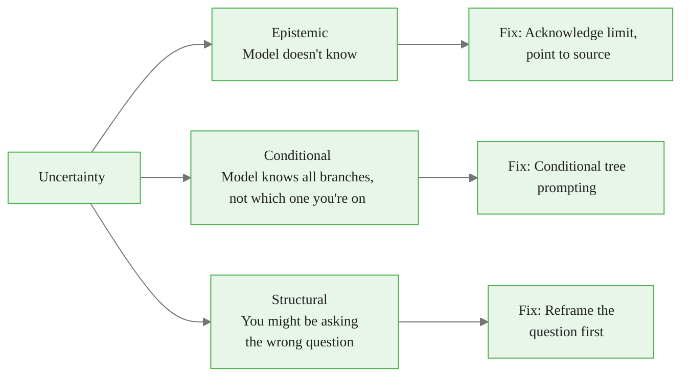

<!-- _class: lead -->

# Uncertainty Prompting
## Getting the Model to Say What It Doesn't Know

**Module 4, Guide 2 — Bayesian Prompt Engineering**

*The model's confident answer often hides an uncertain foundation.*

<!-- Speaker notes: Start with this framing: we've been trained to think that a good AI answer is a confident, complete answer. That expectation is wrong. A confident wrong answer is worse than a hedged correct answer. This guide is about prompting specifically for uncertainty — surfacing what the model doesn't know and what conditions it would need to be precise. This is one of the most practically useful skills in the entire course. -->

---

## The Confidence Illusion

**You:** "Is it better to raise seed funding before or after launching?"

**Model:**
> "Most investors prefer to see traction before investing, but pre-launch funding is common when founders have prior exits or when technical risk is the primary unknown..."

This sounds complete.

**What's hidden inside it:**
- Consumer apps → almost always need traction first
- B2B enterprise → pre-launch raises are common
- Repeat founders with exits → pre-launch is easy
- First-time founders, no network → pre-launch is nearly impossible

The model knows this. It didn't tell you.

<!-- Speaker notes: The model's answer is technically defensible — it says "it depends" in sophisticated language. But it doesn't tell you what it depends on in a way you can act on. This is the confidence illusion: the answer sounds like it addresses your situation when it's actually addressing all situations simultaneously, which means it addresses none of them precisely. -->

<div class="callout-info">
This is a foundational concept for the rest of the module.
</div>
---

## Three Types of Uncertainty



Most uncertainty in AI responses is **Conditional** — the model knows the answer for each branch but doesn't surface the branch structure.

<!-- Speaker notes: This taxonomy matters because the fix depends on the type. Epistemic uncertainty — the model genuinely doesn't know — is rare and usually involves post-cutoff information. Structural uncertainty is when you need to step back and question whether you're asking the right thing. But conditional uncertainty is by far the most common and the most fixable. That's what the rest of this guide addresses. -->

<div class="callout-key">
This is the key takeaway from this section.
</div>
---

## The Meta-Prompt

A single prefix that transforms any question:

```
Before answering, identify:
1. The conditions that would most change your answer
2. What you would need to know to give a
   specific (not general) answer
3. Any assumptions you're making about my situation

Then answer — but flag the parts that depend on
unverified assumptions.
```

Add this before any high-stakes question.

<!-- Speaker notes: This is the most powerful single technique in this guide. The meta-prompt doesn't change the question — it changes the framing around how the model approaches the question. It instructs the model to externalize its internal structure before compressing it into a verdict. Demonstrate this with a question from the audience if time allows. -->

<div class="callout-warning">
Common misconception — read carefully.
</div>
---

## Meta-Prompt in Action

<div class="columns">

<div>

**Without meta-prompt:**

> "What architecture for my e-commerce platform?"

> "Microservices offer scalability and independent deployment of payments, inventory, user management..."

*Hidden: this advice is probably wrong for most startups.*

</div>

<div>

**With meta-prompt:**

> Conditions that change my answer:
> - Team < 5 engineers → monolith strongly preferred
> - Under 100 orders/day → premature optimization
> - 3-month launch → distributed adds risk
>
> What I need to know: order volume, team size, timeline
>
> Assumption: you're building from scratch
>
> **Given those assumptions:** A modular monolith...

</div>

</div>

<!-- Speaker notes: The right column is longer. It's also honest. The microservices answer might be right for a company at scale with large engineering teams. It's probably wrong for a startup. The meta-prompt forces the model to surface the conditions under which each answer is correct — which lets you check whether the conditions match your situation. -->

<div class="callout-insight">
This insight connects theory to practice.
</div>
---

## Prompting for Explicit Condition Lists

When you want a structured decision instrument:

```
For the question below, produce:

CHANGES MY ANSWER IF:
- [condition]: leads to [A] instead of [B]

ASSUMPTIONS I'M MAKING:
- [assumption about your situation]

ANSWER FOR TYPICAL CASE: [answer]

ANSWER WHEN KEY CONDITIONS DIFFER: [alternatives]

Question: [your question]
```

**Use this when:** You'll encounter the same decision repeatedly, or need to teach others to make it.

<!-- Speaker notes: This structured format is particularly useful for building decision protocols — repeatable processes for making the same category of decision. If you're building a team that needs to make architecture decisions, pricing decisions, or hiring decisions regularly, this format produces output you can turn into a decision guide. -->

---

## Getting the Model to Ask You Questions First

Flip the interaction structure:

```
You are an expert advisor. Before giving any recommendation,
identify the 3-5 questions you would need answered to give
advice specific to my situation rather than general advice.

Ask those questions first. Do not give general advice
until you have my answers.

My question: [question]
```

**Default:** Model produces answer → you interpret
**Target:** Model asks → you answer → model gives calibrated answer

<!-- Speaker notes: This technique feels counterintuitive because we're used to asking AI questions and getting answers. But the most valuable expert interactions work the other way: you describe your situation, the expert asks what they need to know, you answer, they give specific advice. This prompt replicates the expert interaction pattern. Use it for legal, medical, financial, and architectural questions where the general answer is well-known and what you need is your specific answer. -->

---

## Structured If-Then Responses

For decisions you want to apply repeatedly:

```
Answer this question in if-then format. For each major
condition, state the condition and what action follows.
Do not summarize into a verdict.
```

**Expected output:**
```
IF [condition A]:
  THEN [action/recommendation]
  BECAUSE [reasoning]

IF [condition B]:
  THEN [different action]
  BECAUSE [reasoning]

IF [conditions unclear]:
  THEN ask: [questions]
  BEFORE taking action
```

<!-- Speaker notes: The if-then format is the most actionable output structure for conditional decisions. It can be read as a protocol — a checklist you walk through. This is valuable when you're building processes, not just answering one-off questions. The "IF conditions unclear → THEN ask" branch is particularly important: it builds in the next step when you don't know which branch you're on. -->

---

## The Assumption-Surfacing Follow-Up

After any model response, add:

```
List every assumption you made about my situation that,
if false, would change your answer.
```

**Example output:**
> Assumptions I made:
> - You're selling B2B (not B2C)
> - You have a sales team (not PLG)
> - Deal size is $5K-$100K ACV
> - You're past early product-market fit
> - You have competition (not unique solution)

Now check each assumption against your reality.

<!-- Speaker notes: This is a powerful post-hoc technique. You ask the question normally, get an answer, and then apply this follow-up. The model surfaces the assumptions it made — which are often things it never mentioned in the original answer. You check each assumption: if any are wrong, you now know which part of the answer doesn't apply to you. This is a useful habit to build for any high-stakes AI-assisted decision. -->

---

## Calibrating Confidence Language

Request explicit confidence ratings:

```
Answer this question and rate each major claim:
- HIGH: true in 80%+ of relevant situations
- MEDIUM: true in 50-80%; context-dependent
- LOW: true in fewer than 50%; very situational
```

**Transforms:**
- "It depends" → "MEDIUM confidence: depends primarily on X"
- "Generally speaking" → "HIGH confidence in typical case; LOW if [condition]"
- "Some would argue" → "LOW confidence: contested in the field"

<!-- Speaker notes: Confidence language is usually decorative in AI responses. "Generally," "typically," "in most cases" — these phrases convey uncertainty without quantifying it. Explicit confidence ratings force the model to be more specific about *how much* its answer depends on context. A LOW-confidence claim with a specific condition is more useful than a vague hedge. -->

---

## The Two-Phase Query Pattern

<div class="columns">

<div>

**Phase 1: Extract the tree**
```
Before answering, tell me:
what conditions determine
whether your answer would
be significantly different?

List major branches without
answering yet.
```

</div>

<div>

**Phase 2: Specify your branch**
```
Given the branches you
identified: I'm in [situation]
because [my conditions].

Now give me the specific
answer for my case.
```

</div>

</div>

Phase 1 → map. Phase 2 → destination.

**Never skip Phase 2.**

<!-- Speaker notes: This two-phase pattern is the practical synthesis of both guides in this module. Phase 1 is conditional tree prompting — getting the structure. Phase 2 is uncertainty resolution — specifying your position in the structure and getting a calibrated answer. Emphasize: stopping at Phase 1 is common and insufficient. The tree is a means, not an end. The end is the calibrated answer for your specific situation. -->

---

## When Uncertainty Prompting Backfires

| Situation | Problem | Fix |
|-----------|---------|-----|
| Need quick directional answer | Adds friction | Use flat prompt; apply uncertainty prompting only for high stakes |
| Conditions genuinely unknown | Tree is incomplete | Ask for probability-weighted summary instead |
| Factual lookup question | No branches exist | Don't apply conditional tree technique |
| Model over-hedges everything | Useless "it depends" list | "Focus on 3 conditions with highest decision leverage" |

<!-- Speaker notes: Techniques should fit the situation. Uncertainty prompting is a high-value technique for high-stakes decisions with conditional structure. It's overhead for simple lookups. The most important failure mode is over-hedging — when the model produces a list of 20 "it depends" conditions, all equally weighted. The fix is to constrain: "the 3 conditions with highest decision leverage" forces the model to prioritize, not just list. -->

---

## Summary

**The problem:** Models hide conditional uncertainty inside confident language.

**Three types of uncertainty:**
- Epistemic (model doesn't know) → acknowledge the limit
- Conditional (model knows branches, not which you're on) → tree prompting
- Structural (wrong question) → reframe

**Key techniques:**
1. Meta-prompt — before answering, identify conditions and assumptions
2. Question-first interaction — model asks before it answers
3. Structured if-then format — build decision protocols
4. Assumption surfacing follow-up — check assumptions post-hoc
5. Confidence calibration — explicit HIGH/MEDIUM/LOW ratings

**The two-phase pattern:** Extract tree → specify branch → get calibrated answer.

<!-- Speaker notes: Close with this: uncertainty is information. A model that says "I need X to answer this precisely" is giving you valuable information — it's telling you that X is a decision-relevant variable you need to determine. Learning to prompt for uncertainty transforms AI from an answer machine into a reasoning partner. That's the practical payoff of this module. -->
