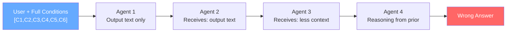
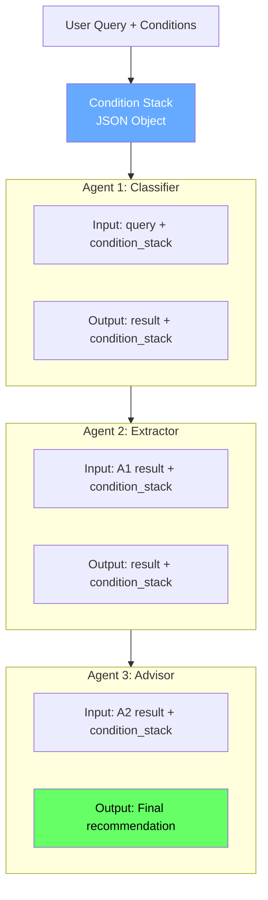
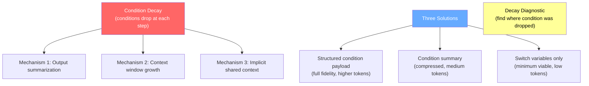

<!-- _class: lead -->

# Agent Conditioning
## How Bayesian Conditions Flow Through Multi-Step Workflows

### Module 5: Agents and Workflows
#### Bayesian Prompt Engineering

<!-- Speaker notes: This deck covers condition propagation and decay across agent pipelines. The core problem: conditions you set in step 1 often don't reach step 5. By the end, students should understand why this happens and have three concrete solutions. -->

---

## The Single-Turn Baseline

In a single-turn prompt, all conditions are simultaneously present:

$$P(\text{answer} \mid C_1, C_2, C_3, C_4, C_5, C_6)$$

| Layer | What it specifies |
|-------|-------------------|
| C1 | Jurisdiction / Rule Set |
| C2 | Time / Procedural Posture |
| C3 | Objective Function |
| C4 | Constraints |
| C5 | Facts |
| C6 | Output Specification |

The model computes its posterior over all 6 layers at once.

<!-- Speaker notes: This slide reviews the condition stack from Module 3. In a single-turn prompt, all six layers are in the same context window and the model computes P(answer | all conditions) directly. The multi-agent problem breaks this because conditions are now distributed across multiple calls. -->

---

## What Changes in a Multi-Agent System



Each step passes **output**, not **conditions**.

> By step 4, the model fills missing conditions from its training prior — the average case, not your case.

<!-- Speaker notes: This is the condition decay problem in a single diagram. Each arrow represents an API call. What flows across each arrow is the output text, not the conditions that shaped that output. Each downstream agent must fill missing conditions from its prior. -->

---

## Condition Decay: Three Mechanisms

<div class="columns">
<div>

**Mechanism 1: Output Summarization**

Agents compress outputs. Summaries preserve salience, not conditions. "Peripheral" conditions (peripheral to Agent 2) disappear — even if they are critical for Agent 5.

**Mechanism 2: Context Window Growth**

As conversation grows, early system prompts receive less attention weight. Conditions from step 1 are technically present but practically ignored.

</div>
<div>

**Mechanism 3: Implicit Shared Context**

Prompts for Agent 3 assume it "knows" things established only in Agent 1's system prompt.

This is a conditioning error. The model only conditions on what is in its current context window.

**Bottom line:** Conditions don't teleport.

</div>
</div>

<!-- Speaker notes: Walk through all three mechanisms. The most common is mechanism 3 — developers write prompts for Agent 3 as if the agent has been listening to the whole conversation. It hasn't. Each API call is stateless. -->

---

## A Concrete Example: Contract Review Pipeline

```
Agent 1 (Classifier): Reads contract → "California commercial lease"

Agent 2 (Risk Extractor): Reads Agent 1 output → Lists risky clauses

Agent 3 (Advisor): Reads Agent 2 output → "Should client sign?"
```

**What conditions does Agent 3 actually have?**

- A list of clauses — yes
- Client's risk tolerance — NO
- Client's objective (minimize risk vs. close fast) — NO
- Client's timeline pressure — NO
- Jurisdiction (unless Agent 1's text was passed through) — MAYBE

Agent 3 fills all missing conditions from its prior.

<!-- Speaker notes: This example makes condition decay concrete. Walk through what each agent receives. The key question to ask students: "What does Agent 3 NOT have?" That list is the condition decay. The recommendation Agent 3 produces is conditioned on the average client profile, not this specific client. -->

---

## Decay Visualization: Step by Step

```
Step 1: [C1][C2][C3][C4][C5][C6]   Full stack — best output
         │
         ▼ passes only output text
Step 2: [C5][?? ][?? ][?? ][C6]    Facts + some context
         │
         ▼ passes summary
Step 3: [C5 fragment][          ]   Facts only
         │
         ▼ passes output
Step 4: [               prior   ]   Model fills from training average
```

Each `??` is a condition the model must infer — from a prior calibrated on the median case.

<!-- Speaker notes: This visualization makes the decay quantitative. Each step loses conditions. By step 4, the model is almost entirely reasoning from its prior. The conditions the user specified in step 1 have no causal effect on step 4's reasoning. -->

---

## Solution 1: Structured Condition Handoff

Treat the condition stack as a **first-class data object** — not implicit context.

```python
condition_payload = {
    "layer_1_jurisdiction": "California commercial tenancy law",
    "layer_2_time":         "Pre-signature review, 2025",
    "layer_3_objective":    "Minimize tenant liability, not minimize rent",
    "layer_4_constraints":  ["Budget ceiling $8k/month", "No subletting"],
    "layer_5_facts":        "5-year lease, mixed-use, force majeure present",
    "layer_6_output_spec":  "Bullet recommendations with confidence levels"
}
```

Every agent output schema includes `condition_stack` — unchanged and forwarded.

```python
agent_output = {
    "result":          "...",    # This agent's work
    "condition_stack": {...},    # Received conditions — pass through unchanged
    "added_context":   {...}     # New conditions this agent contributes
}
```

<!-- Speaker notes: This is the core solution. The condition stack is JSON, not prose. It rides alongside the output at every step. Agents are required to include it in their output schema. The downstream agent injects it into its system prompt. Simple. -->

---

## Injecting Conditions into Downstream Agents

```python
def build_agent_system_prompt(task: str, condition_stack: dict) -> str:
    conditions_text = "\n".join(
        f"- {k}: {v}" for k, v in condition_stack.items()
    )
    return f"""You are operating under conditions that MUST shape your reasoning:

{conditions_text}

Task: {task}

If the task conflicts with these conditions, flag the conflict explicitly.
Do not resolve conflicts silently."""
```

The conditions enter via the `system` parameter on every API call — not buried in the `user` message.

<!-- Speaker notes: The system prompt is Layer 0 in Claude — it has the highest attention weight. Conditions injected into the system prompt persist throughout the conversation and receive more weight than conditions buried in user messages. This is why we use the system parameter, not the user message. -->

---

## Solution 2: Condition Summaries

Full payload passing is expensive for long pipelines. Use a **condition summary** when token cost matters.

```python
SUMMARIZE_CONDITIONS_PROMPT = """
Compress the following condition stack into 3-5 sentences.

Preserve: jurisdiction, objective function, top 2 constraints.
Omit: facts (task-specific), output format (per-agent).

Condition stack:
{condition_stack}
"""
```

**Trade-offs:**

| Method | Tokens | Fidelity | Use when |
|--------|--------|----------|----------|
| Full payload | High | Perfect | Short pipelines, high stakes |
| Summary | Medium | Good | Medium pipelines |
| System prompt only | Low | Static conditions | Stable conditions across runs |

<!-- Speaker notes: The condition summary is a practical compromise. For most production pipelines, the high-leverage conditions (jurisdiction, objective, constraints) fit in 3-5 sentences. Facts are task-specific and get regenerated per task. The system prompt can hold stable conditions that don't change across runs. -->

---

## Solution 3: Switch Variables as Minimum Viable Conditions

From Module 2: switch variables flip the solution branch. In a pipeline, they are the **minimum set that must survive every handoff**.

```python
# Contract review pipeline: switch variables
switch_variables = {
    "deal_breaker_threshold": "client walks away if monthly rent > $8k",
    "jurisdiction":           "California (affects enforceability of clauses)",
    "timeline_pressure":      "must sign within 2 weeks (HIGH)",
    "client_type":            "corporation (not individual — affects liability)"
}
```

If you can only pass one thing forward, pass the switch variables.

These are the conditions whose absence causes the largest shift in the model's posterior.

<!-- Speaker notes: Switch variables from Module 2 are the minimum viable condition set for pipelines. Even if you can't pass the full 6-layer stack, pass the switch variables. They are the conditions that change which solution branch the model reasons in. Everything else is detail. -->

---

## The Condition Decay Diagnostic

When an agent gives a wrong answer, run this before debugging the model:

```
1. List the conditions this task requires
2. For each condition: is it present in this agent's context?
3. For missing conditions: was it established in an earlier step?
4. Was it included in the handoff payload from that step?
5. Find the first step where it was dropped
6. Fix the handoff schema at that step
```

This diagnostic resolves most agent failures in under 5 minutes.

> The answer is almost always: "Agent N received output text but not the condition payload."

<!-- Speaker notes: This diagnostic process is a practical tool students can use immediately. Walk through it with the contract example: Agent 3 gives a wrong recommendation. Step 1: what conditions does this task need? Client objective, risk tolerance, timeline. Step 2: are they in Agent 3's context? No. Step 3: were they established? Yes, in the user's initial query. Step 4: were they in Agent 1's output schema? No. Step 5: fix Agent 1's output schema. -->

---

## Common Pitfalls

<div class="columns">
<div>

**Pitfall 1: "System prompts persist"**

Each API call is stateless. A system prompt in call 1 has zero effect on call 2 unless you include it in call 2's `system` parameter.

**Pitfall 2: "Natural language carries conditions"**

"Keep in mind the client's risk tolerance" in step 1 does not condition step 3. Only structured data in the context window conditions reasoning.

</div>
<div>

**Pitfall 3: "We'll add condition passing later"**

Retrofitting structured handoffs into an existing pipeline is painful. Build it from the start.

**Pitfall 4: "Pass everything everywhere"**

Over-stuffing contexts degrades attention on relevant conditions. Pass what each agent needs, not everything.

</div>
</div>

<!-- Speaker notes: These four pitfalls are real patterns from production systems. Pitfall 1 catches developers unfamiliar with LLM API statefulness. Pitfall 2 is the most common — it feels like natural language "should" carry conditions because it does in human conversation. It doesn't in LLM API calls. Pitfall 3 is a project management failure mode. Pitfall 4 is an overcorrection. -->

---

## Architecture: What Full Condition Passing Looks Like



<!-- Speaker notes: This architecture diagram shows the full solution. The condition_stack JSON object travels alongside every agent's output. Each agent receives both the result and the condition_stack from its predecessor. Each agent injects the condition_stack into its own system prompt. The conditions never decay because they are always explicitly present. -->

---

## Conditions as Bayesian Priors on Agent Behavior

Every agent in a pipeline can be viewed as computing:

$$P(\text{output} \mid \text{task}, \text{condition\_stack})$$

Without condition_stack:

$$P(\text{output} \mid \text{task}) \approx P(\text{output} \mid \text{task}, \text{average\_case})$$

The conditions narrow the posterior from "what would I recommend for the average contract review?" to "what would I recommend for this specific client with this specific objective under these specific constraints?"

That narrowing is the entire value of the condition stack framework applied to agents.

<!-- Speaker notes: This slide connects the agent pattern back to the probability framework. Without conditions, agents reason about the average case. With conditions, they reason about your specific case. The condition_stack is the evidence that shifts the posterior from the prior to the posterior your client actually needs. -->

---

## Summary



<!-- Speaker notes: This summary diagram captures the entire deck. Condition decay has three mechanisms. Three solutions address it at different cost/fidelity trade-offs. The diagnostic helps you find and fix decay in existing pipelines. All three concepts work together. -->

---

## What's Next

**Guide 02: Claude-Specific Conditioning Patterns**

- System prompts as Layer 0 (persistent conditions, not Layer 1)
- Prefilling assistant responses to constrain output format
- Tool descriptions as constraint injection
- Structured outputs for condition passing between agents
- How to pass switch variables between Claude agents using JSON

**Notebook 01: Build a Condition-Aware Agent**

A working agent that identifies missing conditions and assembles the stack before answering.

<!-- Speaker notes: Guide 02 maps the abstract framework from this deck to specific Claude API features. Students will see exactly which API parameter to use for each condition layer. The notebook puts it all together in running code. -->
