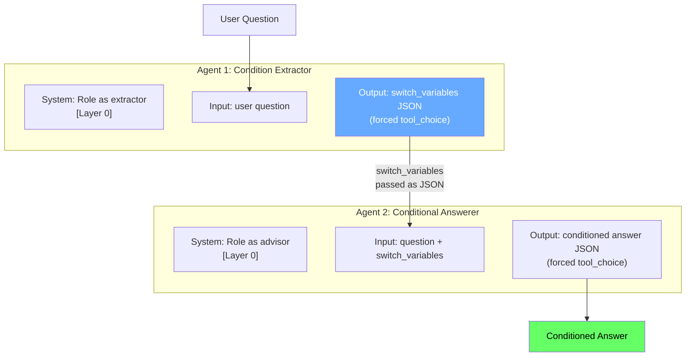
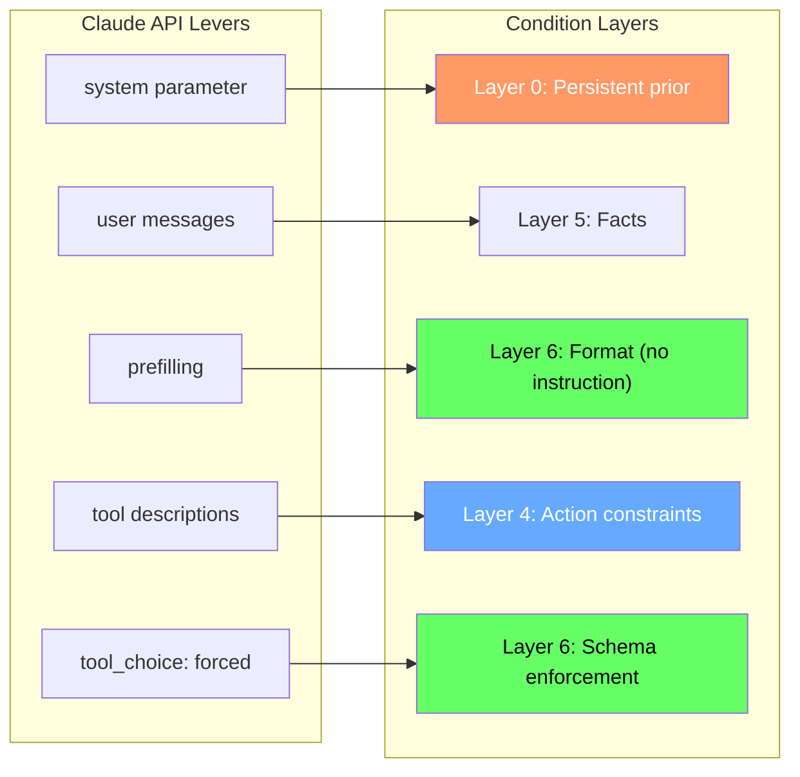

<!-- _class: lead -->

# Claude-Specific Conditioning Patterns
## API Features as Condition Layers

### Module 5: Agents and Workflows
#### Bayesian Prompt Engineering

<!-- Speaker notes: This deck maps the abstract condition stack framework to concrete Claude API features. Every feature is a conditioning lever. Most developers use only one lever — user messages. We'll cover all five levers and when to use each. -->

---

## The Claude API Has Five Conditioning Levers

```python
client.messages.create(
    model="claude-opus-4-5",
    system="...",           # Lever 1: Persistent prior
    messages=[
        {"role": "user",      "content": "..."},  # Lever 2: Evidence
        {"role": "assistant", "content": "..."},  # Lever 3: Prefill
    ],
    tools=[...],            # Lever 4: Constraint injection
)
```

Most developers use only Lever 2.

> Using only user messages is like having a 6-layer condition stack and only filling Layer 5.

<!-- Speaker notes: The framing here is direct: five levers exist, most people use one. Each lever maps to a specific part of the condition stack. The parallel to Module 3 is explicit — using only user messages is exactly as weak as using only Layer 5 in a single-turn prompt. -->

---

## Lever 1: System Prompt as Layer 0

The system prompt is not Layer 1. It is **Layer 0** — a prior that:

- Persists across every turn of a conversation
- Has higher effective attention weight than user messages
- Cannot be overridden by user messages (when written correctly)
- Is re-injected on every API call in an agentic loop

**What belongs in Layer 0:**

| Condition | Example |
|-----------|---------|
| Role | "You are a tenant-side contract analyst" |
| Jurisdiction | "Apply California commercial code" |
| Objective | "Minimize liability exposure, not minimize rent" |
| Standing constraints | "Never recommend waiving right to cure" |

<!-- Speaker notes: The key insight is that "Layer 0" is a new concept introduced here. In Module 3, we covered Layers 1-6. The system prompt sits below all of them — it is the prior that the layers further constrain. In agentic loops, the system prompt is re-injected at every API call, which makes it uniquely persistent. -->

---

## System Prompt: What Goes Where

<div class="columns">
<div>

**In the system prompt (stable):**

- Role definition
- Jurisdiction / rule set
- Objective function
- Standing constraints
- Behavioral guardrails

These conditions do not change across queries.

</div>
<div>

**In user messages (per-query):**

- Task-specific facts
- Per-query output format
- Context for this specific question
- Switch variables for this question

These conditions change with each query.

</div>
</div>

> Conditions that should never decay → system prompt.
> Conditions that are task-specific → user message.

<!-- Speaker notes: This split is the practical design rule. The system prompt holds what is always true for this agent. User messages hold what is true for this specific task. When conditions that should be stable end up in user messages, they decay as conversations grow because the user message scrolls further back in the context window. -->

---

## Lever 3: Prefilling

Prefilling means providing the beginning of Claude's response. The model completes from where you left off.

This is direct posterior manipulation — you constrain the output distribution before generation begins.

```python
# Without prefilling: hope Claude returns JSON
messages=[{"role": "user", "content": "Return JSON with switch variables."}]

# With prefilling: guarantee JSON output
messages=[
    {"role": "user", "content": "Identify switch variables in this question."},
    {"role": "assistant", "content": '{"switch_variables": ['}  # Prefill
]
```

**Why this is better than output format instructions:**

| Approach | Failure rate |
|----------|-------------|
| "Return JSON with these fields" | Occasional — wraps in markdown, adds prose |
| Prefill with `{"` | Zero — model continues valid JSON |

<!-- Speaker notes: Prefilling is underused. Developers write long output format instructions when a one-character prefill achieves the same result with zero failure rate. The mechanism is clear: once you've started the JSON, the model's posterior over the next token heavily favors valid JSON continuation. It's not an instruction — it's a direct constraint on the output distribution. -->

---

## Prefill Patterns for Multi-Agent Pipelines

```python
# Pattern 1: Force JSON output
{"role": "assistant", "content": "{"}

# Pattern 2: Force specific JSON structure
{"role": "assistant", "content": '{"condition_stack": {'}

# Pattern 3: Force numbered list
{"role": "assistant", "content": "1."}

# Pattern 4: Force structured analysis
{"role": "assistant", "content": "## Condition Analysis\n\n**Conditions present:**\n-"}

# Pattern 5: Force decision tree format
{"role": "assistant", "content": "IF"}
```

Use prefilling whenever an agent's output will be parsed by the next agent.

<!-- Speaker notes: Give students a minute to read these patterns. The key use case for agents is Pattern 1 and 2 — when the output must be machine-parseable JSON for the next agent in the pipeline. Pattern 4 and 5 are for human-readable outputs with structured format requirements. -->

---

## Lever 4: Tool Descriptions as Constraints

Tool descriptions are read **before** any response is generated. They function as constraint injection — Layer 4 of the condition stack applied to actions.

<div class="columns">
<div>

**Weak (no constraint):**
```python
{
  "name": "search",
  "description": "Search the database.",
  "input_schema": {...}
}
```

Model can search anything, anyhow.

</div>
<div>

**Strong (constraint embedded):**
```python
{
  "name": "search",
  "description": """Search California commercial
  law. Include 'California' in all queries.
  Do NOT infer from federal cases.
  If no results: report 'no CA precedent'
  rather than extrapolating.""",
  "input_schema": {...}
}
```

</div>
</div>

The description prevents cross-jurisdiction inference hallucination without a system prompt addition.

<!-- Speaker notes: Tool description quality is a major differentiator in production agents. A vague description leaves the model to infer how to use the tool — and it will infer based on its training prior, not your constraints. A constraint-rich description is a Layer 4 condition applied specifically to tool use behavior. -->

---

## Lever 5: Forced Tool Choice for Structured Output

When you need guaranteed structured output, force tool use:

```python
response = client.messages.create(
    model="claude-opus-4-5",
    tools=[{
        "name": "submit_analysis",
        "description": "Submit your structured analysis.",
        "input_schema": your_schema
    }],
    tool_choice={"type": "tool", "name": "submit_analysis"},  # Force it
    messages=[...]
)

# Extract structured result
for block in response.content:
    if block.type == "tool_use":
        result = block.input  # Guaranteed to match your_schema
```

Without `tool_choice: forced`, the model may respond in natural language and break your pipeline parser.

<!-- Speaker notes: This is a practical production pattern. tool_choice with a specific tool name forces the model to use that tool — it cannot respond in natural language. This guarantees the output matches your schema and is machine-parseable for the next agent. Emphasize: this is not just a style preference, it prevents a class of pipeline failures. -->

---

## The Complete Layer Map

| Claude API Feature | Condition Layer | What it conditions |
|-------------------|-----------------|--------------------|
| `system` | Layer 0 | Persistent role, objective, jurisdiction, constraints |
| `messages[user]` | Layer 5 | Task-specific facts, per-query conditions |
| Prefilling | Layer 6 | Output format (no instruction needed) |
| Tool descriptions | Layer 4 | Constraints on action selection |
| `tool_choice: forced` | Layer 6 | Output schema enforcement |

**The rule:** Match the lever to the layer.

<!-- Speaker notes: This table is the key reference for this deck. Walk through each row. The column "What it conditions" is the most important. For each API feature, ask: which condition stack layer does this map to? That tells you what to put in it. -->

---

## Multi-Agent Pattern: Two-Claude Pipeline



<!-- Speaker notes: This diagram shows the two-agent pattern from Guide 02. Agent 1's output is structured JSON containing switch variables. That JSON is passed directly to Agent 2 as part of the user message. Agent 2's system prompt establishes its role and standing conditions. The conditions ride in the JSON, not in natural language. -->

---

## Passing Switch Variables Between Agents

```python
# Agent 1 returns this:
extraction_result = {
    "switch_variables_needed": [
        {"name": "jurisdiction",      "value": "California"},
        {"name": "client_type",       "value": "corporation"},
        {"name": "timeline_pressure", "value": "high (2 weeks)"},
        {"name": "objective",         "value": "minimize liability, not cost"}
    ],
    "confidence": "high"
}

# Agent 2 receives this as user message:
user_msg = f"""Question: {original_question}

Conditions extracted by analysis agent:
{json.dumps(extraction_result['switch_variables_needed'], indent=2)}

Answer with full awareness of these conditions."""
```

The switch variables travel as structured data, not prose. They cannot be summarized away.

<!-- Speaker notes: The critical detail here is that switch variables are passed as JSON, not as a sentence like "by the way, the client is a California corporation on a tight timeline." JSON is machine-readable and passed without loss. Natural language is summarized and conditions can be dropped. -->

---

## Why Forced Tool Choice Matters for Condition Passing

Without forced tool choice — natural language output from Agent 1:

```
"Based on my analysis, this appears to be a California case involving
a corporate client. The timeline seems tight. The client seems to
prioritize cost over liability protection..."
```

Agent 2 must parse natural language. Conditions are implicit. "Seems to" introduces uncertainty. "Appears to be" is not a condition — it is a hedge.

With forced tool choice — JSON output from Agent 1:

```json
{
  "jurisdiction": "California",
  "client_type": "corporation",
  "timeline_days": 14,
  "primary_objective": "liability_minimization"
}
```

Agent 2 receives exact values. No parsing ambiguity. No hedges. No condition decay.

<!-- Speaker notes: This slide makes the case for forced tool choice concrete. The natural language version uses hedging language ("seems to," "appears to") which are not conditions — they are uncertainty markers. The JSON version has exact values. Agent 2 receives certainty about what conditions apply. -->

---

## System Prompt Anti-Patterns

<div class="columns">
<div>

**Anti-pattern 1: No system prompt**
```python
# Everything in user messages
# Conditions compete with facts for attention
# High decay risk
messages=[{"role": "user",
  "content": long_prompt_with_everything}]
```

**Anti-pattern 2: System prompt as instructions only**
```python
system="Be helpful and professional.
Return JSON if asked."
# Not conditions — behaviors
# No posterior constraint
```

</div>
<div>

**Anti-pattern 3: Task-specific facts in system prompt**
```python
system=f"""Your role is analyst.
This client has {client_facts}."""
# Facts change per client
# System prompt becomes stale
# Creates maintenance debt
```

**Correct pattern:**
```python
system="""Role, jurisdiction,
objective, constraints here."""
messages=[{"role": "user",
  "content": f"Facts: {facts}"}]
```

</div>
</div>

<!-- Speaker notes: These anti-patterns are common in production systems. Anti-pattern 1 is the most common — everything in user messages. Anti-pattern 2 is subtle: using the system prompt for behavioral instructions ("be helpful") rather than conditions. Anti-pattern 3 creates a maintenance problem — the system prompt needs to be rebuilt for every new client. Stable conditions go in system prompt. Variable facts go in user messages. -->

---

## Summary: Five Levers, Five Layers



<!-- Speaker notes: This summary diagram is the reference map for the entire deck. Five API levers, five condition layer targets. Print this or screenshot it. When designing an agent system, use this map to decide which lever to use for each condition you need to specify. -->

---

## What's Next

**Notebook 01: Build a Condition-Aware Agent**

A working Claude agent that:
1. Receives a user question
2. Identifies what conditions are needed
3. Asks for missing conditions
4. Assembles a condition stack
5. Generates the final answer

All five levers in action. Anthropic Python SDK. Full working implementation.

<!-- Speaker notes: The notebook takes everything from these two guide decks and implements it in running code. Students will see all five API levers used together in a single agent. The agent itself demonstrates condition awareness — it identifies its own missing conditions before answering. -->
