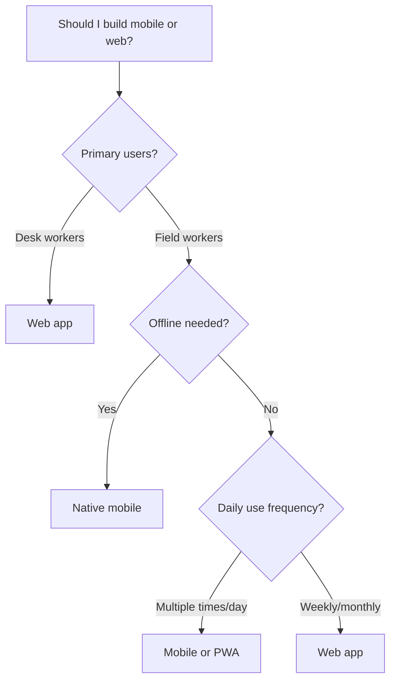
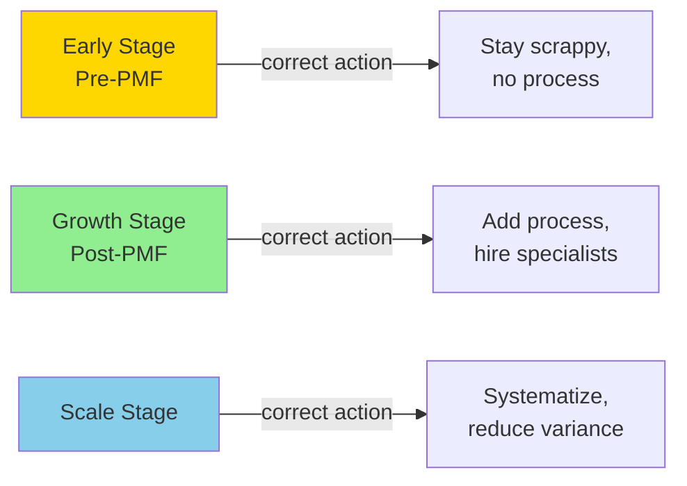

<!-- _class: lead -->

# The Six Probability Mistakes
## Common Anti-Patterns in Prompt Engineering

**Module 6 · Bayesian Prompt Engineering**

> *Every bad AI answer is predictable. Every bad answer has a name.*

<!-- Speaker notes: Welcome to Module 6. We've spent five modules building the positive framework — how to write great prompts. This module flips that: we catalog the six most common ways to write bad ones, and explain exactly why each produces bad output through the Bayesian lens. The goal is that after today, when Claude gives you a wrong answer, you won't just feel frustrated. You'll be able to name the mistake and apply the fix. -->

---

## The Core Insight

<div class="columns">

**What most people believe**

The model gave a bad answer because:
- It's not smart enough
- It doesn't know enough
- It misunderstood me
- I need to rephrase

**What's actually true**

The model gave the most probable answer for the evidence you provided.

When the answer is wrong, the evidence was incomplete — in one of six specific ways.

</div>

$$P(\text{wrong answer}) = P(\text{right answer} \mid \text{wrong evidence})$$

<!-- Speaker notes: This reframe is important. The model isn't malfunctioning. It's doing exactly what its training tells it to do. The fault in a bad answer almost always lives in the prompt, and almost always in one of six predictable patterns. -->

---

<!-- _class: lead -->

# Mistake 1
## Confusing "More Detail" with "More Conditions"

<!-- Speaker notes: The first and most common mistake. People get a generic answer, add more text, and get a slightly longer generic answer. They conclude the model is bad. But there's a critical distinction between information and evidence. -->

---

## Detail vs. Evidence

<div class="columns">

**Information** (doesn't shift the posterior)

> "I'm a software engineer at a Series B startup in the supply chain space. We have a complex backend with multiple services. We need good performance and reliability."

More words. Same answer.

**Evidence** (collapses the posterior)

> Read/write: 80% reads. Query type: ad-hoc aggregations. Scale: 10M → 500M rows. Deployment: managed cloud only.

Fewer words. Specific answer.

</div>

$$P(\text{answer} \mid \text{evidence}) \neq P(\text{answer} \mid \text{information})$$

<!-- Speaker notes: Evidence is the conditions that change which answer is correct. Information is everything else. Ask yourself: does this sentence change which answer is right? If not, it's information, not evidence. -->

---

## Mistake 1 — The Fix

**Test:** Add a sentence. Does it change which answer is correct, or just describe the situation?

**Fix:** Structure additions as conditions, not narrative.

```
Before: "We have a complex system with many requirements..."

After:
- Constraint A: managed cloud only
- Query pattern: ad-hoc aggregations, not point lookups
- Scale inflection: 10M → 500M rows in 18 months
- Write pattern: append-only, ~50k inserts/minute
```

**The rule:** Every sentence in your prompt should be able to change which branch of the answer tree you're on. If it can't — cut it.

<!-- Speaker notes: This is about density of evidence, not volume of text. A prompt with 50 words of precise conditions will outperform a prompt with 500 words of narrative context every time. -->

---

<!-- _class: lead -->

# Mistake 2
## Asking for One Answer When You Need a Conditional Tree

<!-- Speaker notes: Every question has a decision tree underneath it. When you ask for a single answer, you're asking the model to collapse that tree. It picks the most common branch — which is probably not your branch. -->

---

## The Hidden Tree



When you ask "mobile or web?" with no conditions — the model picks the most probable node. That might not be your node.

<!-- Speaker notes: The tree always exists. The question is whether you surface it or collapse it. A collapsed tree gives you an answer. A surfaced tree gives you your answer. -->

---

## Mistake 2 — The Fix

**Signal:** You followed the advice. It didn't work. Someone in a different situation would have gotten better advice.

**Fix:** Ask for the tree first, then locate yourself in it.

```
Before: "Should I build mobile or web?"

After: "Before answering, map the 3-4 conditions that most
strongly determine mobile vs web. Show what each condition
implies. Then, given my conditions [desk-based B2B users,
once-daily use, no offline requirement] — which branch
am I on?"
```

The model can't collapse a tree it hasn't built yet.

<!-- Speaker notes: This is the key technique. Force tree construction before recommendation. Once the tree is on the page, you can locate yourself in it accurately. -->

---

<!-- _class: lead -->

# Mistake 3
## Treating AI Like a Search Engine

<!-- Speaker notes: Language models and search engines are fundamentally different systems. Using keyword prompts on a language model is like using a hammer to tighten a screw. The tool is wrong for the job you're trying to do. -->

---

## Two Different Systems

<div class="columns">

**Search Engine**

Retrieves documents ranked by keyword relevance.

Keyword prompt → ranked document list.

Input: "Python async performance database"

Output: A document about async Python

**Language Model**

Performs conditional inference.

Evidence prompt → probability-weighted completion.

Input: The specific conditions of your situation.

Output: Reasoning about YOUR situation.

</div>

**Keyword prompts ask for document retrieval. You want conditional inference.**

<!-- Speaker notes: When you write a keyword prompt, the model interprets it as the beginning of a search result document, and completes it accordingly. You get a good summary of the topic, not reasoning about your specific situation. -->

---

## Mistake 3 — The Fix

**Signal:** The response reads like a Wikipedia article or a tutorial intro. General, well-structured, not specific to you.

**Fix:** Replace topics with inference specifications.

```
Before: "Python async performance optimization database queries"

After:
Current state: Sequential DB calls inside async event loop,
~20ms each, 500 concurrent users, event loop blocking.
Target: Under 50ms p95 latency.
Constraints: Cannot change DB (Postgres) or ORM (SQLAlchemy).

What are the highest-ROI async patterns for this specific
setup? For each: expected improvement, complexity, tradeoffs.
```

State: current state → target state → constraints → ask for reasoning.

<!-- Speaker notes: The three-part spec -- current, target, constraints -- transforms a keyword query into a conditional inference request. It tells the model: reason about my situation, not the topic in general. -->

---

<!-- _class: lead -->

# Mistake 4
## Not Specifying the Objective Function

<!-- Speaker notes: Every recommendation optimizes for something. When you don't specify what, the model picks the most common objective from its training data. That is almost certainly not exactly your objective. -->

---

## Implicit vs. Explicit Objectives

$$\text{best answer} = \arg\max_{\text{ans}} \mathbb{E}[\text{value} \mid \text{ans, conditions, \textbf{objective}}]$$

Without an objective, the model substitutes the training-data average:

| Domain | Default objective (training average) | What you might actually want |
|--------|-------------------------------------|------------------------------|
| Engineering | Minimize complexity | Minimize time-to-deploy |
| Finance | Risk-adjusted return | Preserve capital at all costs |
| Medical | Standard of care | Minimize side effects |
| Legal | Win the case | Preserve the relationship |

**The model always has an objective. It's just not necessarily yours.**

<!-- Speaker notes: This is subtle but critical. The model isn't wrong to optimize for something -- every useful recommendation has to. The mistake is leaving the objective implicit and assuming the default matches yours. -->

---

## Mistake 4 — The Fix

**Signal:** The advice is reasonable but optimizes for the wrong thing. It feels slightly off even if technically correct.

**Fix:** State the objective function explicitly — including what you're NOT optimizing for.

```
Before: "How should I structure my cloud infrastructure?"

After:
My objective function: minimize time-to-first-deployment.
I accept higher monthly cost and lower scalability ceiling.
I am NOT optimizing for cost efficiency or infinite scale.
Hard constraint: 2 engineers, 4 weeks to launch.

Given this objective, what's the right starting architecture?
```

A clean format: "Optimize for [X]. Acceptable to sacrifice [Y]. Hard constraints: [Z]."

<!-- Speaker notes: The 'NOT optimizing for' clause is often the most powerful part. It explicitly blocks the model from defaulting to standard objectives that don't apply to you. -->

---

<!-- _class: lead -->

# Mistake 5
## Ignoring Temporal Conditions

<!-- Speaker notes: The right answer often depends not just on what conditions exist, but on when you are in a process, a market, a project, or a cycle. Advice that's correct in steady state may be actively harmful in an early phase. -->

---

## Time Changes the Answer



"Should I hire a head of sales?" has different answers at each stage.

Without temporal conditions, the model picks the most common timing in its training data — usually the steady-state answer for a company past the inflection point.

<!-- Speaker notes: Temporal conditions are a specific type of switch variable. They're often the most important variable and the most frequently omitted. The question 'what should I do?' is incomplete without 'right now, given where I am.' -->

---

## Mistake 5 — The Fix

**Signal:** The advice feels right in principle but doesn't match your current urgency or constraints. It reads like advice for six months from now.

**Fix:** Specify temporal conditions as a distinct clause.

```
Before: "Should I hire a head of sales now?"

After:
Temporal conditions:
- Current: $180k ARR, 3 customers via founder outreach
- Stage: pre-PMF, still iterating on ICP and pricing
- Time pressure: need $400k ARR in 4 months for next round
- Sales motion: no repeatable playbook yet

Given this phase, should I hire head of sales now?
What temporal trigger would change this answer?
```

Always ask: "What would have to change about the timing for this answer to change?"

<!-- Speaker notes: The last question -- what temporal trigger changes the answer -- is especially powerful. It gives you the milestone to watch for, so you know when to revisit the decision. -->

---

<!-- _class: lead -->

# Mistake 6
## Assuming the Model Shares Your Priors

<!-- Speaker notes: Language models have priors built from their training data -- the distribution of situations humans have written about. That distribution represents the average case. If your situation is not average, the model will confidently give you advice for someone else. -->

---

## Training Priors vs. Your Priors

<div class="columns">

**Training distribution prior**

"Good software architecture depends on team size and scale requirements."

"Error logging should capture all exceptions with stack traces."

"Compliance is an important consideration in any infrastructure decision."

**Your actual prior**

"We have deep K8s expertise — microservices are fine for us."

"We're SOC 2 audited — tamper-evident logs for anything touching user data."

"Compliance is non-negotiable — it's a hard constraint, not a consideration."

</div>

$$P(\text{good answer} \mid \text{your prior}) \neq P(\text{good answer} \mid \text{training prior})$$

<!-- Speaker notes: The model is not wrong to answer from its training priors. It has no other choice unless you tell it yours. The mistake is assuming the priors are shared without stating them. -->

---

## Mistake 6 — The Fix

**Signal:** The advice is technically correct and completely generic. It applies to everyone and therefore doesn't account for your specific constraints or beliefs.

**Fix:** Make your priors explicit before asking for advice.

```
Before: "How should I handle error logging?"

After:
My priors to factor in:
- We already have Datadog everywhere — centralize there,
  don't add another tool
- Our on-call is burned out — prefer fewer, higher-signal
  alerts over comprehensive logging
- SOC 2 audit in 3 months — tamper-evident logs mandatory
  for any data touching user records

Given these priors, what's the right error logging approach?
Note where your answer would differ without these constraints.
```

<!-- Speaker notes: The last instruction -- 'note where your answer would differ' -- is valuable because it shows you where the priors are doing real work. If nothing would differ, your prior wasn't actually a discriminating condition. -->

---

## All Six Mistakes — Summary

| # | Mistake | Signal | Fix |
|---|---------|--------|-----|
| 1 | Detail ≠ Conditions | More text, same generic answer | Evidence over information |
| 2 | One answer, need tree | Advice wrong for your case | Ask for the tree first |
| 3 | Keyword prompts | Response reads like a Wikipedia article | Specify the inference chain |
| 4 | No objective function | Advice optimizes for the wrong goal | State what you're maximizing |
| 5 | No temporal conditions | Advice is for a different phase | Specify when you are |
| 6 | Assumed shared priors | Correct answer for someone else | Make your priors explicit |

<!-- Speaker notes: These six mistakes cover the large majority of bad prompts. Learning to recognize which mistake you made is half the fix. The diagnostic framework in the next guide gives you a systematic way to identify it. -->

---

## Each Mistake Has a Bayesian Name

| Mistake | Bayesian Description |
|---------|---------------------|
| Detail ≠ Conditions | Low-discriminance evidence |
| One answer, need tree | Collapsing the posterior prematurely |
| Keyword prompts | Retrieval prior, not inference prior |
| No objective | Unspecified loss function |
| No temporal conditions | Missing temporal switch variable |
| Assumed shared priors | Prior mismatch |

Understanding the Bayesian name gives you the fix automatically.

<!-- Speaker notes: This is why the Bayesian framing matters -- it's not just vocabulary. Each Bayesian description implies a specific structural fix. Prior mismatch means: state your priors. Missing switch variable means: add the temporal condition. Collapsed posterior means: ask for the tree. -->

---

<!-- _class: lead -->

## What's Next

**Guide 2:** The Diagnostic Framework

A systematic flowchart for determining which mistake caused any specific bad answer — and applying the fix.

**Notebook 1:** Bad Prompt Clinic

Live API calls: take 6 broken prompts, diagnose the mistake, apply the fix, compare outputs.

<!-- Speaker notes: The next guide converts these six patterns into a diagnostic tool you can use on any bad answer in real time. The notebook puts it into practice with actual Claude API calls. -->
