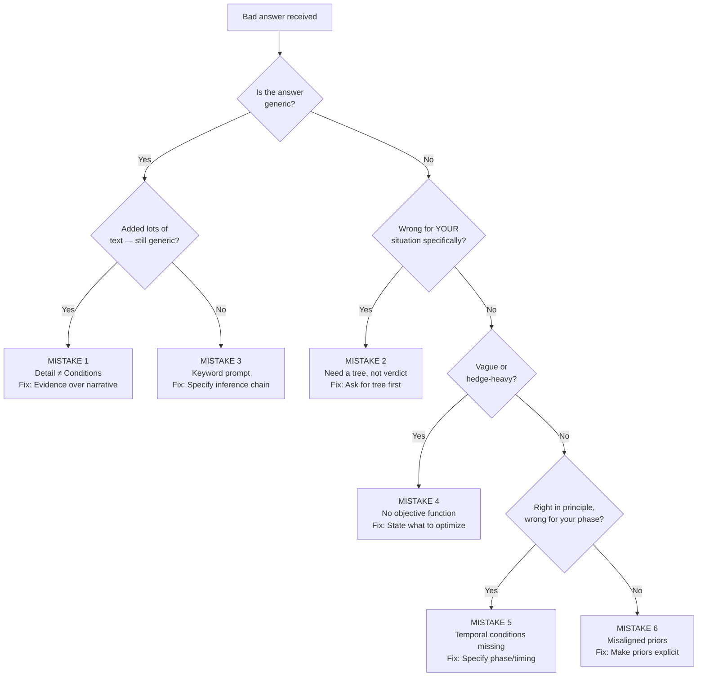
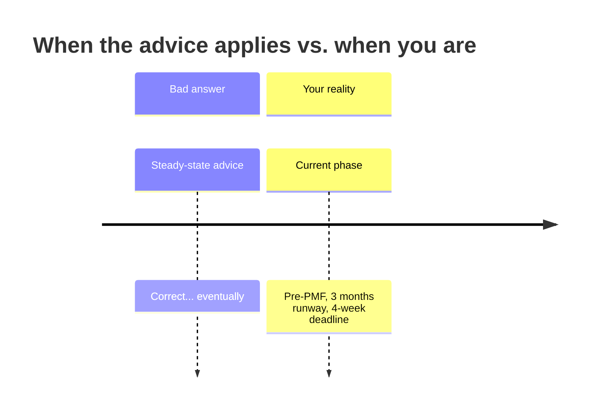
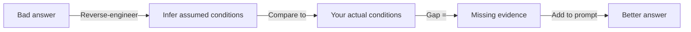

<!-- _class: lead -->

# Diagnostic Framework
## Systematically Debugging Bad AI Answers

**Module 6 · Bayesian Prompt Engineering**

> *Every bad answer is a diagnostic signal. Read it backwards.*

<!-- Speaker notes: This guide converts the six mistake patterns into a practical diagnostic tool. When you get a bad answer, you won't just try to rewrite the prompt. You'll run a systematic diagnosis, identify which mistake is present, and apply the specific fix. This turns prompt debugging from guesswork into a structured process. -->

---

## The Diagnostic Mindset

The model is not wrong. It answered the most probable question for the evidence you gave it.

**Question:** Who would get this answer?

Find the person, company, or situation for whom this answer is correct. The gap between that person and you is exactly where your missing evidence lives.

**Read the answer as a description of what the model thought your conditions were.**

Then check whether those assumed conditions match your actual conditions.

<!-- Speaker notes: This reframe -- reading the answer backwards to infer assumed conditions -- is the single most powerful diagnostic technique. The model's answer implicitly encodes what it thought your situation was. Mismatch between that and your actual situation points directly to what's missing. -->

---

## The Diagnostic Flowchart



<!-- Speaker notes: Walk through the flowchart from top to bottom. Each diamond is a yes/no question you can answer by reading the bad response carefully. The terminal boxes give you the specific mistake and the fix. In practice, you'll often find two mistakes operating at once -- apply both fixes. -->

---

## Diagnosis Question 1: Generic?

**The test:** Replace your name and company with someone else's. Would they get the same answer?

If yes — the answer is generic.

<div class="columns">

**Generic signals**
- Advice that works for anyone
- Lists of "key considerations"
- "It depends on your situation"
- High-level frameworks with no specifics
- Definitions of terms you already know

**Non-generic signals**
- References your specific constraint
- Gives different advice than the default
- Asks a clarifying question about your case
- Contradicts common wisdom based on your conditions

</div>

**If generic:** Continue to → "Did you add lots of text and still get this?"

<!-- Speaker notes: The generic test is the first filter because it catches the two most common mistakes -- detail that isn't evidence, and keyword prompts. Generic answers are usually Mistake 1 or Mistake 3. -->

---

## Diagnosis Questions 2 & 3: Wrong for You? Inconsistent?

**Wrong for your situation:**
Is there a version of you — different size, different role, different industry — for whom this advice would be correct?

If yes: The model answered for that version. You need a conditional tree that separates your branch from theirs.

→ **Mistake 2:** Ask for the decision tree, then locate yourself in it.

**Inconsistent answers:**
Have you gotten contradictory answers when rephrasing the same question?

If yes: The phrasing variation is landing you on different branches of a hidden tree. The inconsistency tells you which variable is the branch condition.

→ **Mistake 2:** The inconsistency itself reveals the missing condition. Make it explicit.

<!-- Speaker notes: Inconsistency is actually useful data. If small changes to your prompt flip the answer, that's the model showing you which variable is doing the most work. That variable belongs in your prompt as an explicit condition. -->

---

## Diagnosis Question 4: Vague or Hedgy?

**Count the hedges:** "it depends," "you might want to consider," "there are tradeoffs," "it really varies"

**More than 2-3 = the model cannot commit without an objective function.**

The model is doing its job — it genuinely cannot recommend without knowing what you're optimizing for. The hedges are the model's signal to you.

**The fix:**

```
I need a recommendation, not a list of tradeoffs.
My primary objective is: [X]
I accept sacrificing: [Y]
Hard constraints: [Z]
Make those assumptions and give me a specific answer.
```

→ **Mistake 4:** State the objective function. The hedges will collapse into a recommendation.

<!-- Speaker notes: Vague answers are often blamed on the model. But a vague answer is usually the model correctly identifying that it cannot optimize without knowing your goal. It's the model asking you: what are we maximizing? State it. -->

---

## Diagnosis Question 5: Right Principle, Wrong Timing?

**The test:** Read the advice and ask — is this correct for 6 months from now? Is this steady-state advice being applied to an early phase?



Training data overwhelmingly represents steady-state best practices. When you're not in steady state, temporal conditions must be specified explicitly.

→ **Mistake 5:** Add: current phase, time horizon, and the trigger that would change the answer.

<!-- Speaker notes: This is especially common for any advice about 'best practices.' Best practices are steady-state descriptions. If you're at an early or transitional phase, you need phase-specific advice, not best practices. -->

---

## Diagnosis Question 6: Correct but Generic to You?

**The test:** Is the advice technically sound — but it doesn't account for a constraint or belief you have that you didn't mention?

**Examples of unstated priors:**

| What you have | What training data assumes |
|---------------|---------------------------|
| Deep K8s expertise | Teams unfamiliar with orchestration |
| SOC 2 audit in 90 days | Compliance is optional |
| A burned-out on-call team | Alert fatigue is manageable |
| A specific vendor constraint | Free choice of tools |

These are discriminating conditions. They change the answer. They don't show up in your prompt unless you put them there.

→ **Mistake 6:** List your non-standard priors explicitly before asking.

<!-- Speaker notes: The question to ask yourself: 'What would I push back on if someone gave me standard advice here?' Whatever your pushback would be -- that's the prior you need to state. If you find yourself thinking 'yes, but in my case...' that's the prior. State it first. -->

---

## The Meta-Diagnostic: Read It Backwards



**Example:** Model says "start with a monolith, extract services as you find seams."

Reverse-engineering the assumed conditions:
- New project, greenfield
- Team without existing service expertise
- No performance requirements specified yet
- Standard growth trajectory assumed

If any of these are wrong for you — those are the missing conditions.

<!-- Speaker notes: This is the most powerful diagnostic technique. Every sentence in the model's answer implies a condition it thought was true. Work backwards. Which of those implied conditions are not true for you? Those are what's missing from your prompt. -->

---

## Two Mistakes at Once

In practice, bad prompts often have multiple mistakes operating simultaneously.

**Example:** "How should I hire my first 5 engineers?"

<div class="columns">

**Mistake 3** (keyword prompt)
Short, noun-heavy. No current state, no target, no constraints specified.
Response reads like a hiring best-practices article.

**Mistake 5** (temporal conditions)
You need to hire in 4 weeks. The answer describes a thoughtful 3-month process.
Right advice, wrong moment.

</div>

**Fix both:**
```
Current: Product launched, 3 months runway, need 2 backend
engineers (Python/FastAPI) in 4 weeks. Objective: fill roles
fast. Accept higher cultural mismatch risk in exchange for speed.
What's the fastest path to 2 qualified hires in 4 weeks — not
the best long-term hiring process?
```

<!-- Speaker notes: When you run the diagnostic checklist, don't stop at the first mistake you find. Run all the questions. It's common to find two or three mistakes in a single prompt. Fix them all at once rather than iterating one at a time. -->

---

## The Full Diagnostic Checklist

```
GENERIC ANSWER?
□ Applies to anyone in my field?
□ Added lots of text, still generic?
  → Mistake 1 or Mistake 3

WRONG FOR MY CASE?
□ Right answer for a different type of person?
  → Mistake 2 — ask for conditional tree

INCONSISTENT?
□ Small prompt changes flip the answer?
  → Mistake 2 — hidden conditional structure

VAGUE/HEDGY?
□ More than 2-3 "it depends" phrases?
  → Mistake 4 — state objective function

RIGHT IN PRINCIPLE, WRONG TIMING?
□ Correct but for a different phase?
  → Mistake 5 — add temporal conditions

CORRECT BUT DOESN'T FIT ME?
□ Technically right but ignores my specific constraints?
  → Mistake 6 — state your priors
```

<!-- Speaker notes: Print this checklist. Keep it next to your keyboard. When you get a bad answer, run through the questions before rewriting the prompt. Ten seconds of diagnosis will save you 20 minutes of frustrated rephrasing. -->

---

## Diagnostic in Action: Live Example

**Bad prompt:** "What's the best way to reduce churn in my SaaS?"

**Running the diagnosis:**
1. Generic? Yes — any SaaS company gets this answer.
2. Added lots of text, still generic? Not yet tested, but the prompt is short — likely Mistake 3.
3. Also wrong for your moment? Probably — depends on your stage.

**Infer assumed conditions from likely response:** Established SaaS, already past PMF, monthly subscription, self-serve or sales-led, general customer base.

**Your actual conditions:** 3 months post-launch, 47 customers, churn is 8%/month, exit interviews show pricing confusion as primary reason.

**Fix:**
```
3 months post-launch, 47 customers, 8% monthly churn.
Exit interviews: pricing confusion is the primary cited reason.
Objective: reduce churn in next 60 days, not build long-term
retention systems. Given this specific diagnosis, what are the
highest-ROI interventions for pricing-confusion-driven churn?
```

<!-- Speaker notes: Notice how the fixed prompt is not longer, but far more specific. It specifies: current state (47 customers, 8% churn), the cause (pricing confusion from exit interviews), the time horizon (60 days), and the objective (specific diagnosis, not general retention). Every sentence is evidence. -->

---

<!-- _class: lead -->

## Summary

**The diagnostic framework is systematic, not intuitive.**

1. Read the bad answer
2. Run the checklist
3. Name the mistake(s)
4. Apply the fix(es)

**Next:** The Bad Prompt Clinic notebook — diagnose and fix 6 real-world broken prompts using the Claude API.

<!-- Speaker notes: The key word is systematic. You don't have to feel your way through prompt debugging. The checklist converts a frustrating, opaque problem into a diagnostic procedure. Run the procedure. Get the fix. Move on. -->
