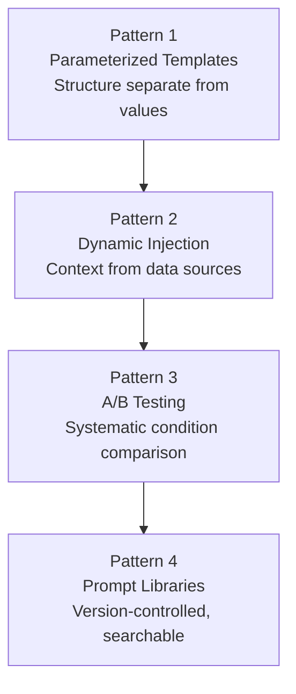
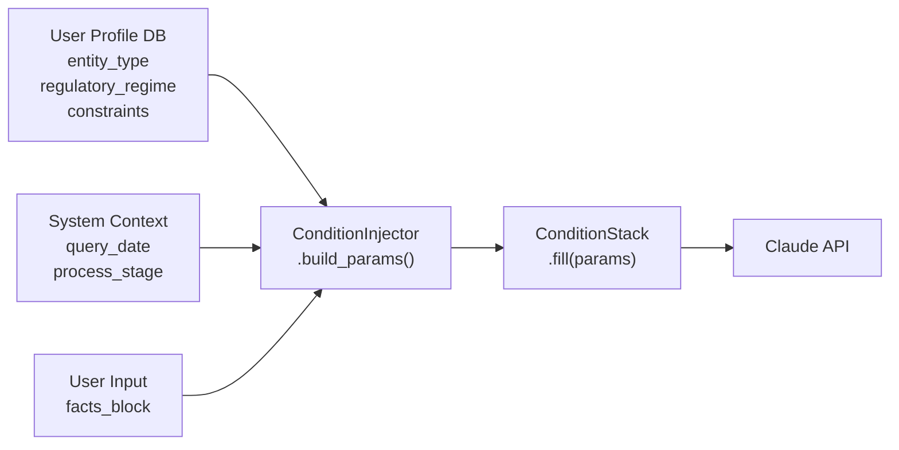
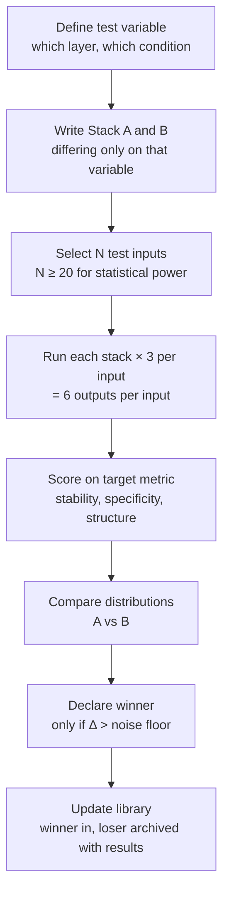
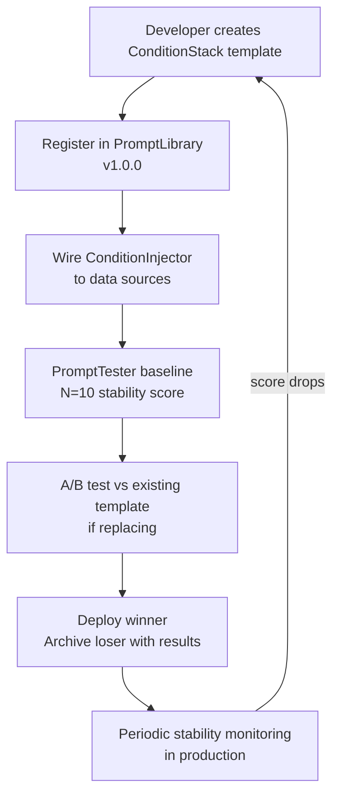

<!-- _class: lead -->

# Production Patterns
## Bayesian Prompting at Scale

### Module 7 · Bayesian Prompt Engineering

<!-- Speaker notes: This deck covers the infrastructure layer of prompt engineering — moving from prompts that work once to systems that work reliably at scale. The central problem is prompt entropy: as organizations grow, well-built condition stacks erode without tooling to preserve them. We will build that tooling. -->

---

## The Gap Between Craft and Engineering

<div class="columns">

**Craft (individual)**
- One person, one prompt
- Modified manually per query
- Quality depends on author skill
- No comparison history
- Works until the author leaves

**Engineering (organizational)**
- Templates shared across teams
- Conditions injected dynamically
- Quality measured by stability score
- A/B tested and versioned
- Works regardless of who runs it

</div>

The transition requires infrastructure, not just better prompts.

<!-- Speaker notes: The distinction is not about intelligence or effort. A brilliant individual prompt does not survive organizational scale without tooling. Frame this as an engineering problem, not a skills problem. -->

---

## What Happens Without Infrastructure

```
Month 0:  You build a precise 6-layer condition stack.
Month 2:  A colleague copies it and removes Layer 2 (time).
Month 4:  Someone edits Layer 3 (objective) for a different use case.
Month 6:  Three variants exist. Nobody knows which is current.
Month 8:  "The AI answers got worse." — actually: the prompts did.
```

This is **prompt entropy**: the gradual erosion of condition precision across a team.

**Measurement:** If you cannot answer "which version of this prompt is deployed and what is its current stability score?" — you have prompt entropy.

<!-- Speaker notes: Prompt entropy is the most common reason organizations report AI quality degrading over time. The model has not changed. The prompts have. Make this concrete with the timeline diagram. -->

---

## The Four Production Patterns



Each pattern builds on the previous. Templates enable injection. Injection enables testing. Testing feeds the library.

<!-- Speaker notes: Walk through the dependency graph. You cannot inject conditions into a template that does not exist. You cannot A/B test what you cannot parameterize. And you cannot maintain a library without A/B results to record. The sequence is architectural. -->

---

## Pattern 1: Parameterized Templates

A static prompt stores values inside structure.
A parameterized template separates them.

```python
# Static (fragile)
prompt = """You are advising a Series A startup under SEC Reg D.
As of March 2026, 15 days post-close...
Objective: determine disclosure obligations..."""

# Parameterized (scalable)
template = ConditionStack(
    layer_1="{entity_type} under {regulatory_regime}",
    layer_2="As of {query_date}, {process_stage}",
    layer_3="Objective: {primary_objective}",
    layer_4="Constraints: {constraint_list}",
    layer_5="{facts_block}",
    layer_6="Return: {output_format}"
)
```

Missing parameters raise errors **before** the API call, not after.

<!-- Speaker notes: The key insight is error-time. A static prompt with a missing condition silently produces a bad answer. A parameterized template with a missing condition fails loudly at fill time. That is the software engineering principle of failing fast applied to prompts. -->

---

## Template Design: Name by Use Case

| Wrong | Right |
|-------|-------|
| `legal_template_v3.txt` | `sec_reg_d_disclosure_check` |
| `prompt_2026_03.md` | `eu_gdpr_breach_notification_v2.1.0` |
| `final_good_prompt.txt` | `contract_risk_assessment_msft_tier` |
| `gpt_prompt_works.md` | `onboarding_action_plan_enterprise` |

Names encode **purpose**. Version numbers encode **history**.

A template named by purpose can be found by someone who did not write it.
A template named by date or version number cannot.

<!-- Speaker notes: Naming conventions are a cultural artifact, not a technical one. Push back on the instinct to version by date or by "v1/v2/final." The name should answer: what problem does this template solve? If a new team member reads the name, can they guess what it does? -->

---

## Pattern 2: Dynamic Condition Injection



Layers 1–4 are injected from the system. Layer 5 comes from the user.

<!-- Speaker notes: The critical division is which layers the user provides versus which the system provides. Most users will only provide facts (Layer 5). Everything else needs to come from the system if you want consistent quality. This is the production architecture for any AI-powered product. -->

---

## What Gets Injected From Where

| Layer | Production Source |
|-------|------------------|
| **L1 Jurisdiction** | User profile: org type, geography, regulatory tier |
| **L2 Time** | System clock, process state machine, workflow tracker |
| **L3 Objective** | User action: what they clicked, submitted, or requested |
| **L4 Constraints** | User profile: subscription tier, approved-use flags |
| **L5 Facts** | The user's actual input — never overridden by injection |
| **L6 Output Format** | User preferences or downstream system requirements |

Layer 5 is sacred. Do not inject pre-defined facts over user input.

<!-- Speaker notes: Emphasize the Layer 5 rule. The whole point of Bayesian conditioning is that facts narrow the posterior further. If you pre-inject facts, you have bypassed the user's actual situation. Injection handles the framing layers; the user provides the evidence. -->

---

## Pattern 3: A/B Testing Prompts

**What A/B testing is NOT:**
Changing random words and seeing which reads better.

**What A/B testing IS:**
Varying one condition at a time and measuring whether output shifts in the predicted direction.

```
Stack A: Layer 3 = "minimize ambiguity about next steps"
Stack B: Layer 3 = "maximize relationship warmth while moving to action"
         ↑ all other layers identical ↑

Test on N=20+ inputs. Score outputs. Compare distributions.
Declare winner only if difference exceeds noise floor.
```

You are testing: does this condition produce a more constrained posterior?

<!-- Speaker notes: The key discipline is one variable at a time. If Stacks A and B differ in multiple conditions, you cannot attribute the output difference to either one. This is basic experimental design. The novelty is applying it to prompt conditions rather than UI features. -->

---

## The A/B Protocol



<!-- Speaker notes: Walk through each step. The × 3 runs per stack are important — they let you measure within-stack stability separately from between-stack differences. If Stack A has high internal variance, it is an unreliable baseline regardless of whether it beats B. -->

---

## Pattern 4: Measuring Prompt Quality

**The core metric: output stability**

Run the same prompt 5 times. How similar are the outputs?

| Metric | What It Measures |
|--------|-----------------|
| Vocabulary overlap | Jaccard similarity of word sets across runs |
| Length variance | Std dev of token count across runs |
| Key entity consistency | Fraction of key terms appearing in all N runs |
| Structure consistency | Same headings, lists, paragraph count across runs |

**High stability → narrow posterior → well-specified conditions**

No ground truth required. Stability is measured from outputs alone.

<!-- Speaker notes: The beauty of stability as a metric is that it requires no ground truth — you do not need to know the right answer to measure whether the model is converging on one. High variance in outputs means the model is sampling from a wide distribution, which means conditions are underspecified. Low variance means conditions are doing their job. -->

---

## Stability vs. Condition Sensitivity

<div class="columns">

**Stability**
Run identical prompts N times.
Measure variance across runs.

High stability = consistent posterior.
Good conditions.

Run after: every template change.

**Condition Sensitivity**
Remove one condition at a time.
Measure how much outputs change.

High sensitivity = that condition is doing real work.
It is a true switch variable.

Run when: auditing a template.

</div>

Stability answers: is this prompt good?
Sensitivity answers: which conditions matter most?

<!-- Speaker notes: These are complementary diagnostics. Stability is your ongoing health check. Condition sensitivity is your audit tool. When outputs degrade in production, run sensitivity analysis to find which layer lost its specificity. -->

---

## Pattern 5: The Prompt Library

**Wrong organization** (by topic keywords):
```
prompts/
├── marketing/
├── legal/
└── data_analysis/
```

**Right organization** (by condition stack structure):
```
prompt_library/
├── by_objective/
│   ├── risk_assessment/
│   ├── action_generation/
│   └── comparison/
├── by_jurisdiction/
│   ├── us_federal/
│   └── eu_gdpr/
└── by_output_format/
    ├── decision_tree/
    └── numbered_action_list/
```

Templates appear in multiple indexes. Indexes are views, not folders.

<!-- Speaker notes: The topic-based organization is intuitive but wrong. When you need a prompt, you know what you are trying to accomplish (Layer 3) and what rules apply (Layer 1). You do not know which topic bucket someone filed it under. Organize by the conditions that define the template, not by the subject matter. -->

---

## Versioning Semantics for Prompts

| Change | Version | Why |
|--------|---------|-----|
| Layer 1 changed (jurisdiction) | Major: 2.0 → 3.0 | Different legal universe; outputs incomparable |
| Layer 3 changed (objective) | Major: 2.0 → 3.0 | Different optimization target |
| Layer 6 changed (output format) | Minor: 2.0 → 2.1 | Same reasoning; different presentation |
| Wording clarification, same conditions | Patch: 2.1 → 2.1.1 | No posterior change expected |

**Rule:** If you expect the posterior to shift, increment major or minor.
If you expect no output change, increment patch.

Major changes trigger re-testing before deployment.

<!-- Speaker notes: Semantic versioning gives teams a signal about risk. A patch-level change can be deployed without re-testing. A major-level change must go through the full A/B protocol before deployment. This is the same risk management logic as software version management. -->

---

## The Full Production Pipeline



<!-- Speaker notes: The loop at the bottom is important. Stability monitoring in production closes the feedback cycle. If conditions drift (user input patterns change, injected context becomes stale), stability scores will drop, triggering a review cycle. This is prompt infrastructure as a continuous process, not a one-time build. -->

---

## Common Pitfalls

1. **Templates as documentation** — If it is not executable and testable, it is not a template. It is a note.

2. **Versioning by date** — `prompt_2026_03.md` tells you when, not what changed. Use semantic versioning.

3. **A/B by subjective quality** — "This reads better" is not a metric. Stability scores are.

4. **Library organized by topic** — Organize by condition structure (objective, jurisdiction, output format).

5. **Injecting facts** — Layer 5 comes from the user. Injecting pre-defined facts overrides the actual situation.

<!-- Speaker notes: These are the five most common failure modes when teams attempt to productionize prompts without a framework. Collect examples from your own experience to make these concrete. The topic-organization pitfall is especially common because it matches how humans think about documents. -->

---

<!-- _class: lead -->

## Summary

Prompt entropy is inevitable without infrastructure.

The four patterns — parameterized templates, dynamic injection, A/B testing, and prompt libraries — are the engineering layer that makes Bayesian prompt quality durable.

**Next:** Guide 02 covers the measurement side in depth: stability metrics, sensitivity analysis, and the A/B testing framework with worked examples.

<!-- Speaker notes: Close by connecting the engineering patterns to the Bayesian frame. Each pattern is a mechanism for preserving posterior precision as the system scales. Parameterization preserves layer structure. Injection fills layers reliably. Testing measures posterior quality. Libraries preserve test results and enable comparison. -->
