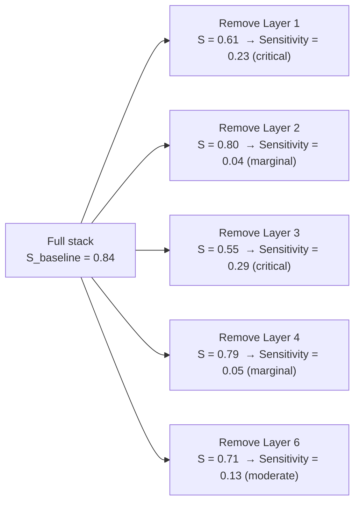

<!-- _class: lead -->

# Measuring Prompt Quality
## Stability, Sensitivity, and A/B Testing

### Module 7 · Bayesian Prompt Engineering

<!-- Speaker notes: This deck covers the measurement layer of prompt engineering. The central insight is that posterior precision is directly measurable from outputs alone, without ground truth. This converts prompt testing from a subjective judgment into an objective diagnostic. -->

---

## The Untested Prompt Problem

Most prompts are written, tried once, and declared good.

```
Write prompt → Send once → "Looks good" → Deploy
```

What this misses:
- The first output was a lucky sample from a wide posterior
- The same prompt on a different input will behave differently
- Nobody will know why outputs degrade six months later

**Production prompts require the same testing discipline as production code.**

<!-- Speaker notes: The analogy to software testing is exact. A function that works once in a demo is not production-ready. Neither is a prompt. The difference is that software engineers have 40 years of testing culture; prompt engineers are starting from scratch. -->

---

## The Measurement Principle

Running the same prompt N times samples from its posterior:

$$\text{Low output variance} \Leftrightarrow \text{Low posterior entropy} \Leftrightarrow \text{Well-specified conditions}$$

$$\text{High output variance} \Leftrightarrow \text{High posterior entropy} \Leftrightarrow \text{Underspecified conditions}$$

**You do not need ground truth to measure stability.**
You only need the outputs themselves.

This converts "does this prompt work?" (requires ground truth)
into "does this prompt converge?" (requires only N outputs).

<!-- Speaker notes: The key insight is that consistency is a property of the prompt, independent of correctness. A prompt can be consistently wrong (stable, but wrong) or inconsistently right (unstable but lucky). Both are measurable separately. In practice, well-specified prompts tend to be both stable AND correct — because the conditions that constrain the posterior also steer it toward the right region. -->

---

## Five Metrics Overview

| Metric | Diagnoses | Ground Truth? |
|--------|-----------|---------------|
| **Stability score** | Overall posterior precision | No |
| **Length variance** | Layer 3/6 ambiguity | No |
| **Key entity consistency** | Specific term anchoring | Partial (entity list) |
| **Structure consistency** | Layer 6 (output format) | No |
| **Condition sensitivity** | Which layer is causing problems | No |

All five are computable from Claude API outputs alone.
None require knowing the "correct" answer.

<!-- Speaker notes: Walk through the table column by column. The "No ground truth" column is the key differentiator from traditional NLP evaluation. These metrics are intrinsic to the outputs — they measure the distribution, not the correctness of individual samples. -->

---

## Metric 1: Stability Score

Run the same prompt 5 times. Compare all output pairs.

$$\text{Stability} = \frac{2}{N(N-1)} \sum_{i < j} \text{Jaccard}(o_i, o_j)$$

```
N=5 gives 10 pairs:
(o1,o2), (o1,o3), (o1,o4), (o1,o5)
        (o2,o3), (o2,o4), (o2,o5)
                 (o3,o4), (o3,o5)
                          (o4,o5)

Average Jaccard across all 10 pairs = Stability score
```

| Score | Interpretation |
|-------|---------------|
| 0.85+ | Excellent — deploy |
| 0.70–0.85 | Good — check Layer 6 |
| < 0.70 | Problem — run sensitivity analysis |

<!-- Speaker notes: Jaccard similarity is word-set overlap: |intersection| / |union|. It ignores word order, which is intentional — two outputs can say the same thing in different sentence structures and both be correct. For structured outputs (JSON, lists), you might use a stricter similarity measure. -->

---

## Stability: A Visual

```
High stability (score = 0.88):
Run 1: "File Form 8-K within 4 business days. Attach Material Event description..."
Run 2: "You must file Form 8-K. Material Event must be described within 4 business days..."
Run 3: "Form 8-K filing required within 4 business days of material event..."
       ↑ Same entities, same timeframe, same requirement — different sentences ↑

Low stability (score = 0.31):
Run 1: "File Form 8-K within 4 business days..."
Run 2: "Consult your securities attorney to determine disclosure timing..."
Run 3: "The SEC requires timely disclosure of material events to shareholders..."
       ↑ Different actions, different entities, different framing — same input ↑
```

<!-- Speaker notes: The low-stability example is especially instructive. All three outputs are plausible and arguably correct. But they represent different worlds: Run 1 is operational, Run 2 is risk-averse, Run 3 is educational. The model is sampling from three different regions of the posterior because the conditions are underspecified. -->

---

## Metric 2: Length Variance

Fast proxy for Layer 3/6 ambiguity.

$$\text{CV} = \frac{\text{std dev of token counts}}{\text{mean token count}}$$

| CV | Interpretation |
|----|---------------|
| < 0.15 | Good — consistent depth |
| 0.15–0.30 | Moderate — some depth uncertainty |
| > 0.30 | High — check Layer 3 (objective) or Layer 6 (output format) |

**Why it matters:**
A prompt asking for "an action plan" with CV=0.5 is sometimes producing
a 3-bullet summary and sometimes a 20-step implementation guide.
Both are "action plans." Layer 6 is underspecified.

<!-- Speaker notes: Length variance is the fastest thing to check — it requires no similarity computation, just word counts. It is not a complete diagnostic, but it is a 30-second first pass that often points directly to the problem layer. -->

---

## Metric 3: Key Entity Consistency

Does every output mention the terms that must appear?

```python
key_entities = ["Form 8-K", "material event", "4 business days"]

Run 1: mentions all 3 → ✓
Run 2: mentions "8-K" and "4 days" but not "material event" → partial
Run 3: mentions all 3 → ✓

Entity consistency = 2/3 entities appear in ALL runs = 0.67
```

**When to use:**
- Domain has specific technical vocabulary (regulations, procedures, standards)
- Generic word overlap is insufficient
- You know which terms a correct output must contain

**Requires:** A predefined key entity list (10–20 terms, 5 minutes to write).

<!-- Speaker notes: The entity consistency metric bridges the gap between pure intrinsic measurement (stability) and evaluation against content requirements. It is still not full ground truth evaluation — you are not checking correctness of the content about the entities, only their presence. But presence is a necessary condition for a useful output. -->

---

## Metric 4: Structure Consistency

Does every output use the same format?

```
Run 1: [numbered list with 5 items]    → has_numbered_list: True
Run 2: [prose paragraphs]              → has_numbered_list: False
Run 3: [numbered list with 7 items]    → has_numbered_list: True
Run 4: [bullet points]                 → has_numbered_list: False
Run 5: [numbered list with 5 items]    → has_numbered_list: True

Structure consistency for numbered list = 3/5 = 0.60
```

A score below 0.80 on any structural feature means Layer 6 is ambiguous.

**Fix:** Be explicit. Not "provide a list" but "provide a numbered list of exactly 5 items, each starting with an action verb."

<!-- Speaker notes: Structure consistency is especially important for prompts feeding downstream systems. If a data pipeline expects a numbered list and 40% of responses come back as prose, the pipeline fails. Explicit Layer 6 specification is not pedantic — it is a requirement for production reliability. -->

---

## Metric 5: Condition Sensitivity

Which conditions are actually doing work?



Layers 1 and 3 are doing the heavy lifting. Layers 2 and 4 can be simplified.

<!-- Speaker notes: This diagram is the key output of a sensitivity analysis. It tells you where to invest condition-writing effort. In this example, Layer 1 (jurisdiction) and Layer 3 (objective) are the critical constraints. Layers 2 and 4 are marginal — possibly because they are implied by Layer 1 in this domain. This is actionable intelligence about where prompt complexity pays off. -->

---

## The Diagnostic Protocol

```
Outputs look generic or inconsistent
           │
           ▼
Step 1: Stability test (N=5)
    > 0.70 → check Layer 6 specifically
    < 0.70 → continue to step 2
           │
           ▼
Step 2: Length variance check
    CV > 0.30 → Layer 6 or Layer 3 ambiguous
    CV normal → continue to step 3
           │
           ▼
Step 3: Structure consistency check
    Inconsistent → fix Layer 6 first
    Consistent → continue to step 4
           │
           ▼
Step 4: Sensitivity analysis
    Identify the layer whose removal drops stability most
    Fix that layer; re-run step 1
```

<!-- Speaker notes: Walk through the protocol as a decision tree. The key efficiency is that each step is cheaper than the next. Stability (N=5 runs) costs less than sensitivity analysis (N=5 × 6 runs). You only escalate to sensitivity analysis if the cheaper diagnostics do not identify the problem. -->

---

## A/B Testing: The Rules

**Rule 1:** Change one condition at a time.

```
✓ Stack A: Layer 3 = "minimize audit exposure"
  Stack B: Layer 3 = "minimize current-year liability"
  All other layers identical

✗ Stack A: [different Layer 1 and Layer 3 and Layer 6]
  Stack B: [different Layer 1 and Layer 3 and Layer 6]
  → confounded: cannot attribute result to either change
```

**Rule 2:** Specify the scoring criterion before running the test.

**Rule 3:** Use N ≥ 20 test inputs before declaring a winner.

<!-- Speaker notes: Rule 1 is the most frequently violated. Teams often compare "old prompt" versus "new prompt" where the new prompt changed three things. When the new prompt wins, they attribute the win to the most salient change, which may not be the actual cause. Single-condition A/B design is non-negotiable for interpretable results. -->

---

## A/B Scoring: Define Criteria First

| Criterion | Definition | Measurement |
|-----------|-----------|-------------|
| **Relevance** | Addresses the actual input | Entity overlap with input terms |
| **Specificity** | Concrete over general | Inverse hedge word density |
| **Consistency** | Reproducible across runs | Stability score |
| **Actionability** | Contains executable next steps | Action verb + specific noun density |

Pick **one** criterion per A/B test.
Switching criteria after seeing results is HARKing (Hypothesizing After Results Known).

<!-- Speaker notes: HARKing is the A/B testing equivalent of p-hacking. You run a test, see which stack produced outputs you prefer, then describe those outputs using a criterion that favors them. The fix is pre-registration: write down the criterion, the N, and the minimum effect size before running a single API call. -->

---

## When Is a Difference Meaningful?

$$\text{Meaningful if: } |\bar{S}_A - \bar{S}_B| > 2 \times \sigma_{\text{pooled}}$$

Where $\sigma_{\text{pooled}}$ is the pooled standard deviation of stability scores across inputs.

**Example:**
- Stack A: mean stability = 0.82, σ = 0.06
- Stack B: mean stability = 0.79, σ = 0.07
- Pooled σ ≈ 0.065
- |0.82 - 0.79| = 0.03 < 2 × 0.065 = 0.13

Result: **not meaningful**. The stacks are equivalent. Do not deploy Stack A as a definitive winner.

With N < 20, almost no prompt difference will be statistically meaningful.

<!-- Speaker notes: This slide is here to prevent premature winner-declaration. With N=5 test inputs, the noise from input variation dominates any signal from the prompts. The 2σ threshold is a practical rule of thumb, not a formal statistical test — but it correctly discourages acting on small samples. -->

---

## Assembling the Metrics Dashboard

```
Template: sec_reg_d_disclosure_check v2.1.0
Test date: 2026-03-24  |  N=10 inputs, 5 runs each

Stability score:        0.83  ✓
Length CV:              0.11  ✓
Structure consistency:  0.90  ✓
Entity consistency:     0.88  ✓  (entities: Form 8-K, Reg D, accredited investor)

Condition sensitivity:
  Layer 1 (jurisdiction):  0.21  ★ critical
  Layer 2 (time):          0.06  — marginal
  Layer 3 (objective):     0.18  ★ high
  Layer 4 (constraints):   0.04  — marginal
  Layer 6 (output):        0.09  — moderate

Status: DEPLOY  |  Next review: 2026-06-24
```

This is the metadata that goes into the prompt library entry.

<!-- Speaker notes: The metrics dashboard is what the prompt library stores alongside the template itself. When a template is reviewed six months later, this baseline tells reviewers what "good" looked like at deployment. If current stability has dropped from 0.83 to 0.61, something has changed — either the template, the injected data, or the input distribution. -->

---

<!-- _class: lead -->

## Summary

Prompt quality is measurable — no ground truth required.

The five metrics — stability, length variance, entity consistency, structure consistency, condition sensitivity — give you a complete diagnostic toolkit.

A/B testing with proper controls (one variable, predefined criterion, N ≥ 20) turns prompt improvement into an evidence-based practice.

**Next:** Notebook 01 builds the full production pipeline — `ConditionStack`, `ConditionInjector`, `PromptTester`, and A/B comparison — using the Claude API.

<!-- Speaker notes: Close by connecting the metrics back to the Bayesian frame. Each metric is a way of observing the posterior distribution indirectly through its samples. The goal of prompt engineering is to narrow the posterior; these metrics tell you whether you have succeeded. -->
