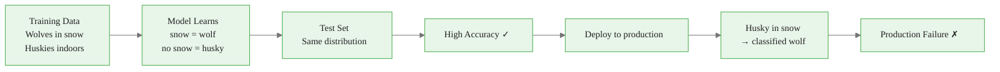
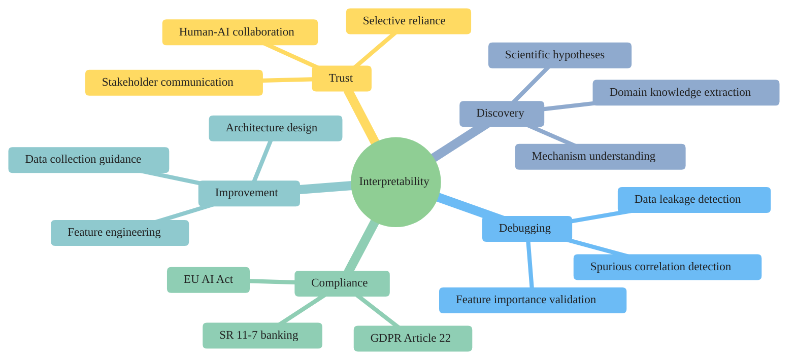
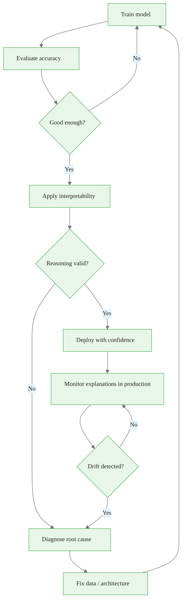

<!-- _class: lead -->

# Why Interpretability Matters

## Module 00 — Foundations
### Neural Network Interpretability with Captum

<!-- Speaker notes: Welcome to the course. This opening deck establishes the *why* before we touch any code. The most important idea to convey: interpretability is not an academic exercise. It is an engineering necessity. Real models have failed in production because nobody asked why they worked on the test set. By the end of this deck, learners should feel genuine urgency about interpretability — not just intellectual curiosity. -->

---

# The Black Box Problem

A ResNet-50 prediction involves:
- **50 layers** of computation
- **25 million parameters**
- **~4 billion floating-point operations**

> You see the input. You see the output.
> You see **nothing** in between.

<!-- Speaker notes: Start concrete. ResNet-50 is a familiar model. The numbers make the opacity visceral: 25 million parameters means 25 million things that could be wrong. The quote is intentionally provocative. We will spend this course building the tooling to see what happens in between. -->

<div class="callout-info">
This is a foundational concept for the rest of the module.
</div>
---

# Three Categories of Risk

<div class="columns">

**Debugging Failures**
- Can't find the bug
- Can't verify the fix
- Guesswork at production scale

**Trust Failures**
- Stakeholders reject opaque outputs
- Blind trust is professionally irresponsible
- Human-AI collaboration breaks down

</div>

**Regulatory Failures**
- Law requires explanations for automated decisions
- Audits cannot happen without transparency
- Fines up to 4% of global annual revenue (GDPR)

<!-- Speaker notes: Three failure modes, all real, all expensive. The regulatory category is accelerating: the EU AI Act came into force in 2024 and the US is developing analogous frameworks. Financial services (SR 11-7) and healthcare (FDA SaMD guidance) have had interpretability requirements for years. This is not hypothetical. -->

<div class="callout-key">
This is the key takeaway from this section.
</div>
---

# Case Study: The Husky vs Wolf Classifier

```
Model accuracy: 85% on test set
Apparent conclusion: model has learned to distinguish huskies from wolves
```

After applying LIME (Ribeiro et al., 2016):

```
Actual feature used: BACKGROUND SNOW
  - Image contains snow → classified as "wolf"
  - No snow → classified as "husky"
```

**The model never looked at the animal.**

<!-- Speaker notes: This is the classic illustration of the gap between accuracy and correctness. The model was not wrong on the test set — it really did achieve 85% accuracy. But it was learning a spurious correlation in the dataset. Wolves are typically photographed outdoors in snowy environments; huskies often in domestic settings. The model learned photography context, not zoology. -->

<div class="callout-warning">
Common misconception — read carefully.
</div>
---

# Why Accuracy Metrics Miss This



Accuracy measures **outcome correlation**, not **causal reasoning**.

<!-- Speaker notes: The failure chain is inevitable given the training data distribution. Accuracy metrics only detect failures when the test distribution differs from training. Spurious correlations that exist uniformly in both sets are invisible to accuracy metrics. This is why interpretability is complementary to, not replaceable by, accuracy evaluation. -->

<div class="callout-insight">
This insight connects theory to practice.
</div>
---

# Case Study: IBM Watson for Oncology

- Deployed at cancer centers worldwide
- Recommended "unsafe and incorrect" treatment plans
- **Root cause:** trained on synthetic cases, not real patients
- No interpretability → no way to detect this before harm

> "Physicians using Watson for Oncology noticed the recommendations did not match clinical guidelines, but they couldn't see *why*."

**Outcome:** Quietly discontinued at many sites after internal audit.

<!-- Speaker notes: This case demonstrates a failure mode that interpretability would have caught: if clinicians could see what evidence Watson was weighing, they would have noticed it was citing non-existent patient histories. Attribution analysis of model inputs would have shown the model was not grounding decisions in real patient data. -->

---

# Case Study: Skin Lesion Classification

Stanford model: matched dermatologist accuracy at detecting malignant lesions.

Interpretability analysis revealed:

```
Model relied heavily on: RULER MARKINGS in dermoscopy images
Reasoning: suspicious lesions are more often photographed with rulers
```

The model learned **clinical photography practice**, not dermatology.

**This would not be caught by accuracy metrics alone.**

<!-- Speaker notes: The ruler marking problem is particularly insidious because it represents a real-world correlation: dermatologists do photograph suspicious lesions with rulers for scale. So the correlation holds in real data. But it is a confound, not a cause. A model relying on ruler markings would fail when deployed in a clinical setting that does not photograph non-suspicious lesions differently. -->

---

# Regulatory Landscape

<div class="columns">

**EU AI Act (2024)**
- High-risk AI requires documentation
- Technical explainability mandatory
- Human oversight required
- Ongoing monitoring mandated

**EU GDPR Article 22**
- Right to explanation for automated decisions
- Applies to credit, hiring, insurance
- Significant decisions affecting individuals

</div>

**US SR 11-7 (Federal Reserve)**
- Model risk management guidance
- Applies to all bank models including ML
- Requires conceptual soundness analysis

<!-- Speaker notes: The regulatory landscape has shifted dramatically. SR 11-7 from 2011 was designed for traditional statistical models but regulators have explicitly stated it applies to machine learning. The EU AI Act creates the most comprehensive framework: high-risk categories include medical devices, credit scoring, biometric identification, and critical infrastructure. This is not hypothetical future regulation — it is current law. -->

---

# The Five Dimensions of Interpretability Value



<!-- Speaker notes: Each dimension has concrete business or scientific value. In practice, organizations often start with compliance requirements and discover that building interpretability infrastructure also delivers debugging and improvement benefits. The scientific discovery dimension is particularly relevant in drug discovery, materials science, and genomics where the model's learned features may encode real domain knowledge. -->

---

# Trust and Human-AI Collaboration

**Without explanations:**

> "The model says the loan is high risk. Deny it."

**With explanations:**

> "The model flags this loan as high risk primarily because the debt-to-income ratio is 0.82, significantly above the 0.43 threshold it has learned from historical defaults. Verify this figure."

The second version allows the human to **validate the reasoning**, not just accept the outcome.

<!-- Speaker notes: Research by Bansal et al. (2021) and others shows that explanations improve *appropriate* reliance on AI — humans become better at knowing when to follow vs. override model recommendations. This is the real goal: not to replace human judgment but to make human-AI teams more accurate than either alone. -->

---

# What Breaks Without Interpretability

| Failure | Example | Cost |
|---------|---------|------|
| Spurious features | Wolf/husky snow | Model revamp |
| Training data bugs | Watson oncology | Patient harm |
| Regulatory violation | Unexplainable credit denial | Legal/financial |
| Bias undetected | COMPAS recidivism | Legal/reputational |
| Scientific misfire | Wrong drug mechanism | Research waste |
| Operator over-trust | Wrong clinical action | Patient harm |

<!-- Speaker notes: These are not hypothetical: every row in this table has a real documented case. The cost column understates the impact in most cases. The COMPAS case resulted in ongoing litigation and legislation in multiple states. Watson for Oncology represented years of development and billions in investment. Spurious feature models may be deployed at scale before production anomalies surface the problem. -->

---

# The Interpretability-Accuracy Trade-off Is Overstated

Common myth: "Interpretable models sacrifice accuracy."

**Reality for post-hoc interpretability:**
- Post-hoc methods explain any existing model
- No architectural changes required
- No accuracy penalty
- Captum works on any PyTorch model

**Reality for intrinsically interpretable models:**
- Modern interpretable models (EBMs, NAMs) are competitive
- For many real-world tasks, the accuracy gap is <2%

<!-- Speaker notes: The accuracy-interpretability trade-off is real for some problem domains but is frequently overstated. Post-hoc interpretability — the focus of this course — imposes zero accuracy cost by definition: you explain the model you already have. The trade-off debate is most relevant when comparing neural networks to decision trees or linear models. Modern neural additive models and explainable boosting machines have largely closed this gap. -->

---

# The Debugging Loop with Interpretability



<!-- Speaker notes: This loop should be standard practice but rarely is. Most ML pipelines stop at the accuracy check. The interpretability check catches a different class of errors: not poor performance but incorrect reasoning. The production monitoring box is important: explanation drift (the model starting to rely on different features) can precede accuracy degradation. -->

---

# SR 11-7: Model Risk Management for ML

Federal Reserve Guidance (2011, updated interpretations for ML):

1. **Conceptual soundness** — Does the model make sense given domain knowledge?
2. **Data integrity** — Is training data appropriate and unbiased?
3. **Outcome analysis** — Are predictions reasonable across the input space?
4. **Sensitivity analysis** — How do outputs change with input perturbations?
5. **Ongoing monitoring** — Is performance stable over time?

**Interpretability tools address points 1, 3, and 4 directly.**

<!-- Speaker notes: SR 11-7 is the gold standard for model governance in financial services and has influenced model risk management practices in insurance, healthcare, and other regulated industries. Points 1 (conceptual soundness) and 4 (sensitivity analysis) map directly to attribution methods. Is the model relying on economically meaningful features? How sensitive is the prediction to each input? These questions require interpretability tooling to answer rigorously. -->

---

# EU AI Act: High-Risk AI Systems

Systems requiring mandatory interpretability documentation:

- Biometric identification systems
- Critical infrastructure management
- Educational or vocational training
- Employment and worker management
- Credit scoring and access to essential services
- Law enforcement risk assessment
- Migration and asylum decisions
- Administration of justice

> If your model touches any of these domains, interpretability is not optional.

<!-- Speaker notes: The EU AI Act list covers a substantial fraction of commercial ML deployments. Any startup or enterprise deploying ML in these domains in the EU must comply. Non-EU companies serving EU residents are subject to the Act. The technical documentation requirements include descriptions of the training data, model performance across demographic groups, and explanations of the system's decision logic. -->

---

# What This Course Covers


Every method answers the question: **"Why did the model predict this?"**

<!-- Speaker notes: The course is organized by method family, moving from simpler gradient-based methods to more sophisticated perturbation-based and layer-level approaches. Each family has different computational cost, different fidelity, and different use cases. The goal is not to pick one winner but to understand which tool to reach for in which situation. -->

---

# Key Takeaways

1. **Accuracy is necessary but insufficient** — a model can be accurate *and* wrong for the right reasons
2. **Interpretability is debugging** — it finds the bugs that test metrics miss
3. **Regulation is accelerating** — EU AI Act, GDPR, SR 11-7 all require explainability
4. **Trust requires transparency** — humans calibrate reliance on models they can interrogate
5. **The cost is zero for post-hoc methods** — explain the model you already have

<!-- Speaker notes: These five points should be the lasting takeaway from this deck. If a learner leaves with only one idea, it should be point 1: good test accuracy does not mean the model is reasoning correctly. The husky/wolf case is the perfect illustration. Points 3 and 5 address common objections: "interpretability is nice to have" (it's legally required) and "interpretability reduces model performance" (post-hoc methods have zero performance cost). -->

---

<!-- _class: lead -->

# Next: Taxonomy of Interpretability Methods

### Guide 02: Intrinsic vs Post-hoc, Local vs Global, Model-specific vs Agnostic

<!-- Speaker notes: Guide 02 builds a systematic map of the interpretability landscape. Understanding this taxonomy allows practitioners to select the right tool for any given situation rather than defaulting to the most popular method. The distinction between local and global explanations is especially important and frequently misunderstood. -->
