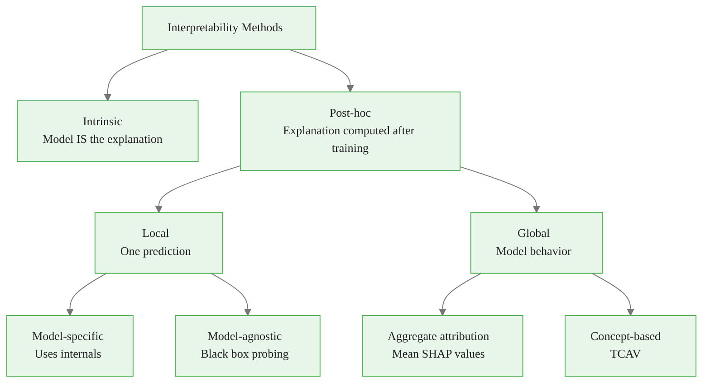
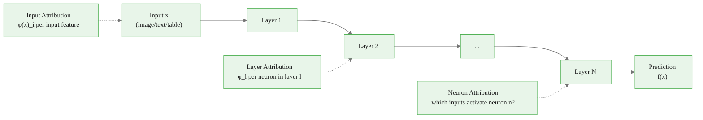
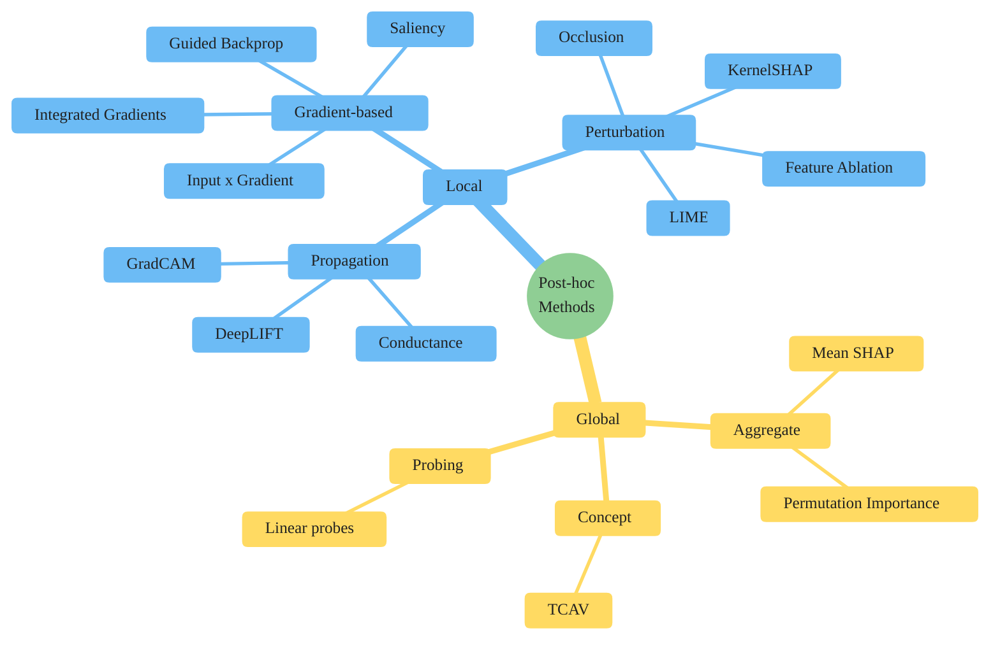
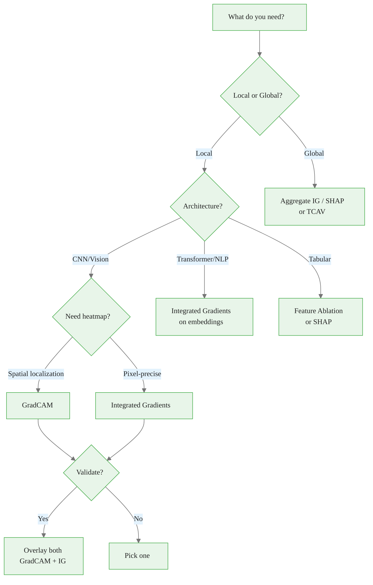

<!-- _class: lead -->

# Taxonomy of Interpretability Methods

## Module 00 — Foundations
### Neural Network Interpretability with Captum

<!-- Speaker notes: This deck builds the mental map for the entire course. The taxonomy has three primary dimensions: intrinsic vs post-hoc, local vs global, model-specific vs model-agnostic. Practitioners who confuse these dimensions reach for the wrong tool. The goal of this deck is to make the taxonomy feel natural and to establish decision rules that learners can apply immediately. -->

---

# Why Taxonomy Matters

Without a taxonomy, you will:
- Apply local methods to answer global questions
- Use model-specific methods on incompatible architectures
- Report post-hoc explanations as ground truth
- Confuse attribution with causation

**Taxonomy gives you decision rules, not just options.**

<!-- Speaker notes: The interpretability literature is cluttered with method names: LIME, SHAP, GradCAM, IG, Saliency, DeepLIFT, TCAV — each new paper introduces new acronyms. Without a conceptual framework, practitioners either default to the most popular method or experiment randomly. The taxonomy converts this alphabet soup into a structured decision tree. -->

This is a foundational concept for the rest of the module.

---

# The Three Primary Dimensions

<!-- Speaker notes: These three dimensions are orthogonal. A method can be post-hoc AND local AND model-specific (GradCAM). Or post-hoc AND local AND model-agnostic (LIME). Understanding which combination you need is the first step to choosing the right method. Intrinsic methods are architecturally constrained, so the interesting space for this course is all post-hoc methods. -->

This is the key takeaway from this section.

---

# Dimension 1: Intrinsic vs Post-hoc

**Intrinsic**
The model itself is the explanation.

- Linear regression → coefficients
- Decision tree → tree structure
- GAM → shape functions

Pros: Always faithful, no overhead
Cons: Architecture constrained, may sacrifice accuracy

**Post-hoc**
Explanation computed separately after training.

- Gradient-based attribution
- Perturbation-based probing
- Surrogate models (LIME)

Pros: Works on any model
Cons: Approximation, may not reflect true computation

<!-- Speaker notes: The intrinsic vs post-hoc distinction is fundamental because it determines whether the explanation IS the model or is a separate artifact. Post-hoc explanations can be wrong — they are approximations. This is not a flaw unique to post-hoc methods; all measurement has error. But it means post-hoc explanations require validation, not just production. -->

Common misconception — read carefully.

---

# Dimension 2: Local vs Global

**Local**
Why did the model predict *this specific instance* this way?

- Answers: "Why was this loan denied?"
- Varies per input
- Essential for auditing specific decisions

**Global**
What patterns does the model learn across *all* inputs?

- Answers: "What features does the model generally rely on?"
- Summarizes model behavior
- Essential for validation and documentation

> These answer **different questions** and cannot substitute for each other.

<!-- Speaker notes: The local-global confusion is the most common mistake in interpretability practice. A practitioner who generates local explanations for 100 test examples and averages them has produced a rough approximation of the global explanation — but with potential bias. Methods designed for local explanation (Integrated Gradients for one image) behave differently when naively aggregated versus methods designed for global explanation (TCAV). -->

This insight connects theory to practice.

---

# Dimension 3: Model-specific vs Model-agnostic

**Model-specific**
Exploits the model's internal structure.

Requires: gradients, specific architecture
Examples: GradCAM (needs conv layers), IG (needs differentiability)
Advantage: Fast, mechanistically precise

**Model-agnostic**
Treats the model as a black box.

Requires: only input-output pairs
Examples: LIME, KernelSHAP, Occlusion
Advantage: Universal, architecture-independent

<!-- Speaker notes: The model-agnostic methods are sometimes presented as more general (and they are), but this generality comes at cost: they require many more model evaluations. GradCAM computes a heatmap in one forward pass; Occlusion requires one forward pass per masked region. For a 224x224 image with an 8x8 sliding window, that is roughly 700 forward passes. The choice depends on whether computational cost or architectural generality is the binding constraint. -->

---

# Attribution Types: Input, Layer, Neuron

<!-- Speaker notes: The three attribution types are spatial in the computational graph. Input attribution (the most common) maps back to the input space — pixel heatmaps for images. Layer attribution maps to intermediate representations — which neurons in a layer matter. Neuron attribution asks the inverse question: given a specific neuron, which input patterns cause it to fire? These answer different questions about where and what the model has learned. -->

---

# The Full Taxonomy

<!-- Speaker notes: This diagram maps the complete post-hoc landscape. The course covers the highlighted methods in depth: Integrated Gradients, GradCAM, Conductance, Occlusion, Feature Ablation, and TCAV. Gradient-based methods (Module 01), IG (Module 02), Layer/Neuron methods (Module 03), and perturbation methods (Module 04). The goal is to leave learners with working implementations and intuition for all major method families. -->

---

# Axiomatic Foundation: What Should an Attribution Do?

Sundararajan et al. (2017) defined two fundamental axioms:

**Sensitivity:** If feature $i$ affects the output, then $\phi_i \neq 0$.

$$\text{If } f(x) \neq f(x') \text{ and } x_i \neq x'_i \text{ only for } i, \text{ then } \phi_i \neq 0$$

**Implementation Invariance:** Two functionally identical models receive identical attributions.

$$\text{If } f(x) = g(x) \text{ for all } x, \text{ then } \phi_f(x) = \phi_g(x)$$

<!-- Speaker notes: These two axioms seem minimal but are surprisingly restrictive. Saliency (vanilla gradients) fails sensitivity because gradients can be zero for features that saturated activations depend on. Guided Backpropagation fails implementation invariance because it modifies gradient flow based on activation function choices. Integrated Gradients satisfies both — this is its key theoretical advantage and why it was adopted as the reference method. -->

---

# Axiom Compliance: Method Comparison

| Method | Sensitivity | Impl. Invariance | Speed |
|--------|------------|-----------------|-------|
| **Integrated Gradients** | Yes | Yes | Medium |
| Saliency | No | Yes | Fast |
| Input × Gradient | No | Yes | Fast |
| Guided Backprop | No | **No** | Fast |
| Occlusion | Yes | Yes | Slow |
| SHAP | Yes | Yes | Slow |
| GradCAM | Partial | Yes | Fast |

<!-- Speaker notes: The compliance table reveals why Integrated Gradients is the theoretical gold standard: it is the only gradient-based method satisfying both axioms. This does not mean other methods are useless — saliency and Input×Gradient are often good enough for visual inspection and much faster. But for situations requiring formal guarantees (regulatory documentation, scientific claims), IG is the appropriate choice. -->

---

# Decision Rule: Choosing Your Method

<!-- Speaker notes: This decision tree covers 80% of practical use cases. The key branch is local vs global: most debugging questions are local (why did this fail?), most validation questions are global (is this model safe to deploy?). For CNNs, the spatial vs pixel precision tradeoff determines GradCAM vs IG. When in doubt, run both and compare: agreement builds confidence, disagreement reveals interesting cases for investigation. -->

---

# Computational Cost Reality Check

For a single ResNet-50 prediction on a GPU:

| Method | Time | Forward Passes |
|--------|------|---------------|
| Saliency | ~1ms | 1 |
| Input × Gradient | ~1ms | 1 |
| GradCAM | ~5ms | 1 |
| **Integrated Gradients (50 steps)** | ~50ms | 50 |
| Occlusion (8×8 window) | ~2-5s | ~700 |
| SHAP (KernelSHAP) | ~10-60s | 1000s |

**Gradient methods are 1000x faster than perturbation methods.**

<!-- Speaker notes: Cost differences of three to four orders of magnitude are practically important. If you are explaining predictions in a live application (fraud detection, medical imaging) you cannot use SHAP per request — you need gradient methods. If you are doing offline model validation on a representative sample, perturbation methods are affordable and may be more robust. Match the method to the deployment context, not just the analytical goal. -->

---

# Faithfulness vs Visual Cleanliness

**Faithful Methods**
- Integrated Gradients
- SHAP

Properties:
- Axiomatically grounded
- May produce noisy maps
- Best for validation/debugging
- Best for audits

**Visually Clean Methods**
- GradCAM
- Guided Backprop

Properties:
- Smooth, interpretable maps
- May not reflect true computation
- Best for stakeholder communication
- Best for initial exploration

<!-- Speaker notes: This trade-off is not widely appreciated. GradCAM produces visually clean, spatially coherent heatmaps that are easy to communicate to clinicians, engineers, or executives. But Guided Backpropagation has been shown (Adebayo et al., 2018, Sanity Checks paper) to produce similar visualizations even for randomly initialized models — meaning the visual cleanliness does not imply faithfulness. Use both: GradCAM for communication, IG for validation. -->

---

# Captum's Method Coverage

**Gradient-based**
- `Saliency`
- `InputXGradient`
- `GuidedBackprop`
- `Deconvolution`
- `IntegratedGradients`

**Layer-based**
- `LayerGradCam`
- `LayerConductance`
- `InternalInfluence`
- `LayerActivation`

**Neuron-based**
- `NeuronConductance`
- `NeuronIntegratedGradients`

**Perturbation-based**
- `FeatureAblation`
- `Occlusion`
- `ShapleyValueSampling`
- `FeaturePermutation`

**Concept-based**
- `TCAV`

<!-- Speaker notes: Captum covers almost every major method family in a unified API. The advantage is consistent interface: every method has an .attribute() call that returns an attribution tensor in the same shape as the input. This allows side-by-side comparison without converting between formats. The NoiseTunnel wrapper, covered in Module 02, can be applied to any method to add SmoothGrad-style variance reduction. -->

---

# Common Mistakes to Avoid

1. **Using local methods for global questions** — one SHAP plot does not describe model behavior
2. **Ignoring the baseline** — for IG and similar methods, the baseline is a model parameter
3. **Method shopping** — choosing the explanation that looks best introduces bias
4. **Attribution = causation** — high attribution means model use, not real-world causality
5. **Comparing across methods without understanding assumptions** — GradCAM and IG answer different questions; comparing outputs is not meaningful

<!-- Speaker notes: Each of these mistakes appears regularly in published work and production deployments. The causation mistake is particularly dangerous: a model that attributes high importance to hospital admission time for mortality prediction is using that feature, but hospitalization time is not a causal driver of mortality — it correlates with condition severity. Acting on the attribution (change admission time) would be useless. -->

---

# Key Takeaways

1. **Three dimensions:** intrinsic/post-hoc, local/global, model-specific/agnostic
2. **Attribution types:** input, layer, neuron — answer different questions
3. **Axioms:** sensitivity and implementation invariance separate rigorous from heuristic methods
4. **Cost:** gradient methods are 1000x faster than perturbation methods
5. **Trade-off:** faithfulness vs visual cleanliness — use both for different purposes

<!-- Speaker notes: The taxonomy is the mental model that makes everything else in the course coherent. When we introduce GradCAM in Module 03, learners should immediately classify it: post-hoc, local, model-specific (needs conv layers), layer attribution. When we introduce Occlusion in Module 04: post-hoc, local, model-agnostic, input attribution. The taxonomy converts each new method from an isolated technique into a node in a known graph. -->

---

<!-- _class: lead -->

# Next: Captum Library Architecture

### Guide 03: How Captum is organized and how it compares to SHAP and LIME

<!-- Speaker notes: Guide 03 moves from taxonomy to tooling: the specific API design choices Captum makes, how to navigate the documentation, and how Captum compares to the broader ecosystem. After Guide 03, learners will be ready for the first hands-on notebooks. -->
