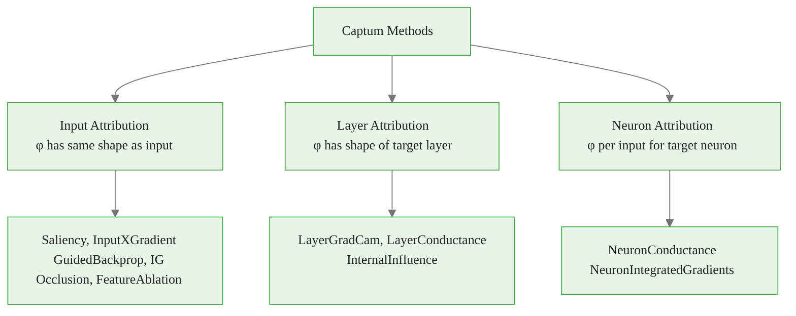
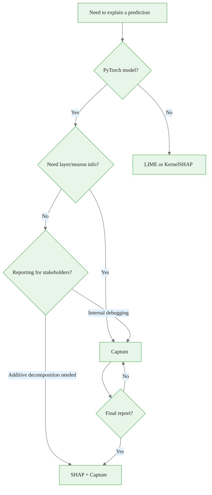
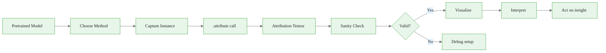

<!-- _class: lead -->

# Captum Library Architecture

## Module 00 — Foundations
### Neural Network Interpretability with Captum

<!-- Speaker notes: This deck bridges theory and practice. After the taxonomy deck, learners know what methods exist conceptually. This deck shows how Captum maps that taxonomy to a concrete API. The key insight to emphasize: the unified .attribute() interface is the library's most important design decision. It means you can compare 10 methods with 10 lines of code change. -->

---

# What Is Captum?

- **Library:** PyTorch's official model interpretability library
- **Origin:** Developed at Facebook AI Research, released 2019
- **Name:** Latin for "perceive, understand"
- **Key design:** Every method shares the same `.attribute()` API
- **License:** BSD-3 (use freely in commercial projects)

```python
pip install captum
```

> Works on any PyTorch model, including HuggingFace, torchvision, and custom architectures.

<!-- Speaker notes: Captum's institutional backing from Meta and its role as the official PyTorch interpretability library means it is the natural default choice for PyTorch models. The BSD-3 license removes any IP concerns for production use. The pip install is genuinely simple — no CUDA-specific compilation needed, no conflicts with standard PyTorch installations. -->

<div class="callout-info">
This is a foundational concept for the rest of the module.
</div>
---

# The Unified API Design

```python
# Every method follows this pattern:
from captum.attr import IntegratedGradients  # or any other method

method = IntegratedGradients(model)

attributions = method.attribute(
    inputs,           # Tensor to explain
    baselines=...,    # Reference point
    target=...,       # Output neuron to explain
    **method_kwargs   # Method-specific parameters
)

# attributions.shape == inputs.shape
# ALWAYS
```

**Change the method name. Everything else stays the same.**

<!-- Speaker notes: The single most important design decision in Captum is this API uniformity. Demonstrate this by showing that replacing IntegratedGradients with Saliency is a one-word change. This makes comparative studies trivially easy to implement: write attribution computation once, parameterize the method, loop over methods. This is what makes Module 01's side-by-side comparison notebook so clean. -->

<div class="callout-key">
This is the key takeaway from this section.
</div>
---

# Comparing Methods: 10 Methods in 10 Lines

```python
from captum.attr import (
    Saliency, InputXGradient, GuidedBackprop,
    IntegratedGradients, LayerGradCam,
    FeatureAblation, Occlusion
)

methods = {
    "Saliency":     Saliency(model),
    "InputXGrad":   InputXGradient(model),
    "GuidedBP":     GuidedBackprop(model),
    "IG":           IntegratedGradients(model),
}

results = {}
for name, method in methods.items():
    results[name] = method.attribute(inputs, target=class_idx)

# Plot all four side-by-side
```

This is impossible without a unified interface.

<!-- Speaker notes: Show how the unified interface enables systematic comparison. In practice, practitioners often want to see whether multiple methods agree — agreement increases confidence in the explanation. With Captum, this comparison requires about 5 minutes of code, not days of integration work. The dictionary comprehension pattern is worth showing explicitly as a practical idiom. -->

<div class="callout-warning">
Common misconception — read carefully.
</div>
---

# Three Method Families



<!-- Speaker notes: The three families produce attributions at different levels of the network. Input attribution answers "which input features mattered?" — the output is a heatmap overlaid on the input. Layer attribution answers "which neurons in this specific layer mattered?" — useful for understanding intermediate representations. Neuron attribution answers "given this neuron is active, what in the input caused it?" — useful for understanding what individual neurons detect. -->

<div class="callout-insight">
This insight connects theory to practice.
</div>
---

# Layer-Based Methods: Accessing Internal Layers

```python
import torchvision.models as models
from captum.attr import LayerGradCam, LayerConductance

resnet = models.resnet50(weights='IMAGENET1K_V1').eval()

# Access the target layer by name
target_layer = resnet.layer4[-1].conv2  # Last conv in layer 4

# Layer methods take the model AND the layer
lgc = LayerGradCam(resnet, target_layer)
lc = LayerConductance(resnet, target_layer)

# Attribution shape = spatial size of the layer
heatmap = lgc.attribute(inputs, target=class_idx)
# heatmap.shape: (1, 1, 7, 7) for ResNet layer4 on 224×224 input
```

<!-- Speaker notes: The layer-based API requires an additional argument: the target layer itself, passed as a Python object reference. This is PyTorch-native: the layer is just an nn.Module, accessed by attribute traversal. Students commonly make the mistake of passing the layer name as a string — that does not work. Show the correct pattern: get the actual module object via Python attribute access. -->

---

# The NoiseTunnel Wrapper

Any Captum method can be wrapped with NoiseTunnel for variance reduction:

```python
from captum.attr import IntegratedGradients, NoiseTunnel

ig = IntegratedGradients(model)
nt = NoiseTunnel(ig)   # Wraps any method

# SmoothGrad: average over inputs + Gaussian noise
attributions = nt.attribute(
    inputs,
    nt_type='smoothgrad',  # 'smoothgrad' | 'vargrad'
    nt_samples=20,         # More samples = less noise
    stdevs=0.1,            # Noise magnitude
    baselines=baseline,
    target=class_idx
)
```

**Result:** Smoother, more reliable attributions at 20x the compute cost.

<!-- Speaker notes: NoiseTunnel implements SmoothGrad (Smilkov et al., 2017) in a wrapper that works with any method. SmoothGrad was proposed specifically to address the noise problem in gradient-based attributions: gradients at a specific input can be highly sensitive to small perturbations. Averaging over 20 noisy copies smooths this out. The 20x compute cost is the trade-off. In Module 02, we will see this in action with a direct comparison. -->

---

# Visualization API

```python
from captum.attr import visualization as viz

# Multi-panel visualization
fig, axes = viz.visualize_image_attr_multiple(
    attr_numpy,          # (H, W, C) attribution array
    image_numpy,         # (H, W, C) original image [0, 1]
    methods=["original_image", "heat_map",
             "blended_heat_map", "masked_image"],
    signs=["all", "positive", "all", "positive"],
    show_colorbar=True,
    fig_size=(16, 4)
)
```

<div class="columns">

**Modes available:**
- `original_image` — raw input
- `heat_map` — attribution heatmap
- `blended_heat_map` — overlay
- `masked_image` — mask low regions
- `alpha_scaling` — opacity by attribution

**Sign options:**
- `all` — positive and negative
- `positive` — only positive attributions
- `negative` — only negative attributions
- `absolute_value` — magnitude

</div>

<!-- Speaker notes: The visualization module covers the common display patterns without requiring matplotlib expertise. The multi-panel visualization is particularly useful for presentations and reports. The sign parameter is important: for methods like IG, negative attributions (features that decrease the predicted class score) are sometimes as informative as positive ones. Always use "all" signs when exploring, then select the sign that best communicates your finding. -->

---

# Captum vs SHAP vs LIME

| Feature | Captum | SHAP | LIME |
|---------|--------|------|------|
| PyTorch-native | **Yes** | No | No |
| Layer attribution | **Yes** | No | No |
| Neuron attribution | **Yes** | No | No |
| Gradient methods | **Yes** | No | No |
| Axiom compliance | **Yes (IG)** | Approx | No |
| Tabular ecosystem | Good | **Best** | Good |
| Model-agnostic | Partial | Partial | **Yes** |
| Speed | **Fast** | Medium | Slow |

<!-- Speaker notes: This comparison is not "Captum wins" — it is "different tools for different problems." SHAP is genuinely better for tabular data with its tree-based model support (TreeSHAP) and better for generating reports that require the additive decomposition property. LIME is genuinely the right choice when you do not have access to model gradients. For PyTorch models where you can compute gradients, Captum is almost always the right primary tool. -->

---

# When to Use Each Tool



<!-- Speaker notes: The practical recommendation: use Captum during development and debugging, use SHAP for final reporting and business communication. SHAP's additive property ("this feature contributed +$200 to the predicted salary") is more intuitive for business stakeholders than IG attributions. For technical audiences (model debugging, layer analysis), Captum provides capabilities SHAP cannot. -->

---

# Working with Pretrained Models

```python
import torch
import torchvision.models as models
from captum.attr import IntegratedGradients

# Zero friction with standard pretrained models
model = models.resnet50(weights='IMAGENET1K_V1').eval()
ig = IntegratedGradients(model)

# HuggingFace transformers work equally well
from transformers import AutoModelForSequenceClassification
bert = AutoModelForSequenceClassification.from_pretrained(
    "distilbert-base-uncased-finetuned-sst-2-english"
).eval()

from captum.attr import LayerIntegratedGradients
lig = LayerIntegratedGradients(bert, bert.distilbert.embeddings)
```

No model modifications required. No custom wrappers. It just works.

<!-- Speaker notes: The zero-modification requirement is practically important. Some interpretability tools require adding hooks or modifying forward methods. Captum uses PyTorch's native hook mechanism internally, transparent to the user. This means you can load a pretrained model from any source — torchvision, HuggingFace, a custom checkpoint — and immediately apply Captum without any preparation. The only requirement is that the model is a PyTorch nn.Module. -->

---

# Critical Practical Details

```python
# 1. ALWAYS use model.eval() first
model.eval()  # Disables dropout, uses BN running stats

# 2. Enable gradients on input
inputs = preprocess(image).unsqueeze(0).requires_grad_(True)

# 3. Baseline does NOT need gradients
baseline = torch.zeros_like(inputs)  # No requires_grad

# 4. Detach before numpy conversion
attr_np = attributions.squeeze().permute(1, 2, 0).detach().numpy()

# 5. Check convergence (for IG)
attr, delta = ig.attribute(
    inputs, baselines=baseline, target=class_idx,
    return_convergence_delta=True
)
print(f"Convergence delta: {delta.item():.5f}")  # Should be < 0.05
```

<!-- Speaker notes: Each of these five points corresponds to a common mistake that produces silent errors or unreliable results. model.eval() is the most critical: dropout during attribution produces different results on each call, making the attribution meaningless. The convergence delta for IG is the diagnostic tool that verifies the integral approximation is accurate — use it during development. In production, you would typically validate once and then run with a fixed n_steps. -->

---

# Sanity Checking Your Attributions

Three mandatory checks before trusting any attribution:

```python
# Check 1: Completeness (IG only)
# Sum of attributions == f(input) - f(baseline)
pred_in = model(inputs)[0, target].item()
pred_bl = model(baseline)[0, target].item()
attr_sum = attributions.sum().item()
assert abs(attr_sum - (pred_in - pred_bl)) < 0.01

# Check 2: Sensitivity
# High-attribution region, when masked, changes prediction
# (manual verification or use FeatureAblation)

# Check 3: Randomization
# Attribution for random-weight model should look like noise
# (If it looks structured, something is wrong)
```

<!-- Speaker notes: Adebayo et al.'s "Sanity Checks for Saliency Maps" (NeurIPS 2018) showed that several popular methods produce similar-looking attributions even for randomly initialized models. This means visual "quality" of an attribution map is not evidence it reflects model computation. The three checks here are the minimum viable validation: completeness (mathematical), sensitivity (empirical), and randomization (adversarial). -->

---

# The Attribution Pipeline



<!-- Speaker notes: The pipeline emphasizes that attribution is not the end — it is the beginning of interpretation. The sanity check step is often skipped and should not be. The "act on insight" step is the entire point: fix the data, change the architecture, add regularization, document for regulators. Attribution without action on the insight is interpretability theater. -->

---

# Key Takeaways

1. **Unified API:** Every method uses `.attribute()` — swap methods with one word change
2. **Three families:** Input, layer, and neuron attribution answer different questions
3. **NoiseTunnel:** Adds SmoothGrad to any method at the cost of compute
4. **Comparison:** Captum for PyTorch, SHAP for tabular/reporting, LIME for model-agnostic
5. **Sanity checks:** Always validate completeness, sensitivity, and randomization

<!-- Speaker notes: These five points are the practical toolkit. After this deck, learners should be able to: (1) install captum, (2) load any pretrained model, (3) run any method with the unified API, (4) visualize the result, and (5) perform basic validation. The first notebook puts all of this into practice immediately. -->

---

<!-- _class: lead -->

# Next: Hands-On Notebooks

### Notebook 01: Environment Setup
### Notebook 02: First Explanation in 2 Minutes

<!-- Speaker notes: The transition to hands-on work starts with environment verification (making sure the stack is correctly installed) and then immediately with a complete end-to-end explanation pipeline. The goal of notebook 02 is to produce a visually meaningful attribution in less than 2 minutes of wall-clock execution time. This builds confidence before the deeper method explorations in later modules. -->
