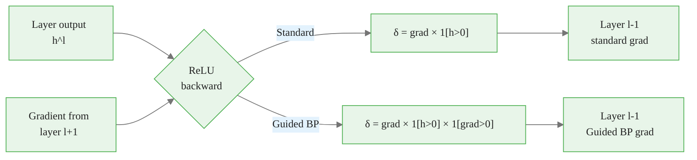

<!-- _class: lead -->

# Gradient-Based Attribution Methods

## Module 01 — Gradient Methods
### Theory: Saliency, Input×Gradient, Guided Backprop, Deconvolution

<!-- Speaker notes: This deck covers the four foundational gradient-based attribution methods. The key progression: saliency is simple and fast but noisy; Input×Gradient adds input weighting; Guided Backprop and Deconvolution produce cleaner visuals but at the cost of faithfulness. The theoretical point is that none of these satisfies both attribution axioms — which motivates Integrated Gradients in the next module. -->

---

# The Gradient as Sensitivity Measure

Given model $f: \mathbb{R}^d \rightarrow \mathbb{R}$ and input $x$:

$$\frac{\partial f(x)}{\partial x_i} = \lim_{\epsilon \rightarrow 0} \frac{f(x + \epsilon e_i) - f(x)}{\epsilon}$$

> "If I increase feature $i$ by a tiny amount, how much does the output change?"

This is the **local sensitivity** of the model to feature $i$ at input $x$.

<!-- Speaker notes: The gradient is the most natural sensitivity measure. It tells you, locally, how much the model cares about each input dimension. For a linear model f(x) = w^T x, the gradient equals w everywhere — attributions equal the weights. For non-linear models, the gradient varies by input location, which is why it is a local (not global) explanation. The limit notation emphasizes that gradients capture infinitesimally small changes, not the finite changes that matter for real attribution. -->

<div class="callout-info">
This is a foundational concept for the rest of the module.
</div>
---

# Method 1: Saliency (Vanilla Gradient)

$$\phi_i^{\text{saliency}}(x) = \left| \frac{\partial f(x)}{\partial x_i} \right|$$

**Algorithm:**
1. Forward pass: compute $f(x)$
2. Backward pass: compute $\nabla_x f(x)$
3. Take absolute value: $|\nabla_x f(x)|$

**Computational cost:** 1 forward + 1 backward pass

<!-- Speaker notes: Saliency is the simplest possible gradient attribution: run backpropagation, take the absolute value of each gradient. The absolute value removes sign information but gives a measure of "how much does any change here matter?" The two-pass cost (one forward, one backward) is essentially free compared to the model's forward pass. This makes saliency the go-to method when speed is critical. -->

<div class="callout-key">
This is the key takeaway from this section.
</div>
---

# Saliency: Intuition with a 1D Example

Consider $f(x) = \text{ReLU}(wx + b)$ with $w = 2, b = -1$:

| $x$ | $f(x)$ | $\nabla f$ | Saliency |
|-----|--------|-----------|---------|
| 0.0 | 0.0 | 0.0 | 0.0 |
| 0.5 | 0.0 | 0.0 | 0.0 |
| 0.6 | 0.2 | 2.0 | 2.0 |
| 1.0 | 1.0 | 2.0 | 2.0 |

At $x = 0.4$: the input affects the output (change $x$ to $0.6$, output goes from 0 to 0.2), but gradient is 0 — **saliency fails to attribute this**.

<!-- Speaker notes: This 1D example illustrates the saturation failure. Below the ReLU threshold (x < 0.5 for this example), the gradient is exactly zero — the ReLU is in its inactive region. But the input IS relevant: moving from x=0.4 to x=0.6 changes the output from 0 to 0.2. The gradient at x=0.4 cannot see this because it only measures infinitesimal perturbations at the current point. This is the fundamental limitation that motivates Integrated Gradients: we need to look at the whole path from baseline to input, not just the local derivative. -->

<div class="callout-warning">
Common misconception — read carefully.
</div>
---

# Method 2: Input × Gradient

$$\phi_i^{\text{I×G}}(x) = x_i \cdot \frac{\partial f(x)}{\partial x_i}$$

**Motivation:** Pure gradient ignores input magnitude.

A feature with value 0.001 and large gradient contributes almost nothing to the output, but saliency would show it as highly attributed.

Multiplying by $x_i$ creates a measure of actual contribution, not just local sensitivity.

<!-- Speaker notes: Input times Gradient addresses a real weakness of saliency: a feature with tiny value contributes little to the output regardless of the gradient. The product x_i * gradient is closer to measuring contribution than gradient alone. This is also related to a first-order Taylor approximation: f(x) ≈ f(0) + sum_i x_i * (∂f/∂x_i), so the product approximates each term's contribution in this linear approximation. The approximation is exact for linear models and asymptotically valid near the origin. -->

<div class="callout-insight">
This insight connects theory to practice.
</div>
---

# Input × Gradient as Taylor Approximation

For the zero baseline, a first-order Taylor expansion gives:

$$f(x) - f(0) \approx \sum_i x_i \cdot \frac{\partial f(x)}{\partial x_i}$$

Input × Gradient computes the approximate decomposition:

$$\phi_i^{\text{I×G}}(x) = x_i \cdot \frac{\partial f(x)}{\partial x_i}$$

This is exact for linear models; approximate for non-linear models.

**Integrated Gradients (Module 02) makes this exact via path integration.**

<!-- Speaker notes: The Taylor approximation connection is crucial for understanding why Integrated Gradients is the principled successor to Input×Gradient. Input×Gradient uses the gradient at the single point x to approximate the integral — which introduces first-order approximation error for non-linear models. IG integrates the gradient along the straight-line path from the baseline to x, making the approximation exact. This is the mathematical motivation for the extra computation in IG. -->

---

# Method 3: Guided Backpropagation

Modified backward pass through ReLU layers:

**Standard gradient backward:**
$$\delta^l = \frac{\partial f}{\partial h^l} \cdot \mathbf{1}[h^l > 0]$$

**Guided Backprop backward:**
$$\delta^l = \frac{\partial f}{\partial h^l} \cdot \mathbf{1}[h^l > 0] \cdot \mathbf{1}\!\left[\frac{\partial f}{\partial h^l} > 0\right]$$

**Effect:** Filters out both negative activations AND negative gradients.

<!-- Speaker notes: Guided Backpropagation adds one condition to the standard ReLU backward: the gradient being propagated must also be positive. Standard gradient zeroes out gradient flow where the forward activation was negative (inactive ReLU). Guided Backprop additionally zeroes out gradient flow where the gradient itself is negative. The result is a stricter filter that only propagates "positive evidence" — gradients that are both at active ReLUs and pointing in a positive direction. This produces visually clean outputs but, as we will see, at the cost of faithfulness. -->

---

# Guided Backprop vs Standard Gradient



Guided BP **filters more aggressively** → cleaner but less faithful.

<!-- Speaker notes: The diagram shows the two different backward pass rules at each ReLU layer. Standard gradient uses only the forward activation condition. Guided Backprop adds the gradient condition. The filtering cascade across all ReLU layers in a deep network produces very different results from standard gradients. The key question is whether this filtering reflects something meaningful about the model's computation — the answer, as shown by the sanity check experiments, is no. -->

---

# The Fatal Flaw: Architecture Dependence

**Adebayo et al. (2018) — "Sanity Checks for Saliency Maps":**

> Guided Backprop produces similar visualizations for:
> - A **fully trained** ResNet
> - A **randomly initialized** ResNet

**The model weights don't matter — only the architecture.**

This violates implementation invariance: two models with identical inputs/outputs should have identical attributions, but two models with different weights (producing different outputs) should have different attributions.

<!-- Speaker notes: The Adebayo et al. sanity check paper is one of the most important interpretability papers. The cascading randomization test randomizes layers from top to bottom and checks if the visualization changes. For methods like vanilla gradient and IG, the visualization changes dramatically as layers are randomized. For Guided Backprop, the visualization is nearly unchanged even when all layers are randomized. This means Guided Backprop is detecting the architecture's ReLU pattern, not the model's learned features. Do not use Guided Backprop for validation or debugging. -->

---

# Method 4: Deconvolution

Zeiler & Fergus (2014): backward pass uses gradient sign condition only:

$$\delta^l = \frac{\partial f}{\partial h^l} \cdot \mathbf{1}\!\left[\frac{\partial f}{\partial h^l} > 0\right]$$

(No condition on forward activation $h^l > 0$)

| Method | Forward activation | Gradient sign |
|--------|-------------------|---------------|
| Standard gradient | Required positive | Any |
| Deconvolution | Any | Required positive |
| Guided Backprop | Required positive | Required positive |

<!-- Speaker notes: Deconvolution is the historical precursor to Guided Backpropagation. The deconvolution operation (from the deconvolutional network paper) uses only the gradient sign condition, not the forward activation. In practice, Guided Backprop (which uses both conditions) tends to produce slightly cleaner results. Deconvolution shares the same faithfulness problems as Guided Backprop. Both are included in Captum for completeness and historical reference. -->

---

# All Four Methods: What They Compute

<div class="columns">

**Saliency**
$$\phi_i = |\nabla_{x_i} f|$$
Fast, noisy, no baseline

**Input × Gradient**
$$\phi_i = x_i \cdot \nabla_{x_i} f$$
Input-weighted, Taylor approx

</div>

<div class="columns">

**Guided Backprop**
$$\delta^l = \text{grad} \cdot \mathbf{1}[h>0] \cdot \mathbf{1}[\delta>0]$$
Clean but architecture-dependent

**Deconvolution**
$$\delta^l = \text{grad} \cdot \mathbf{1}[\delta > 0]$$
Historical method, same issues

</div>

<!-- Speaker notes: The four methods form a progression of increasing filtering. Saliency is unfiltered gradients. Input×Gradient multiplies by input value. Guided Backprop and Deconvolution add gradient-sign filtering. The filtering produces cleaner visuals but at the cost of faithfulness. This progression motivates asking: is there a method that is both clean AND faithful? The answer is Integrated Gradients, which achieves both by integrating rather than filtering. -->

---

# Axiom Compliance Summary

| Method | Sensitivity | Impl. Invariance |
|--------|------------|-----------------|
| Saliency | No | Yes |
| Input × Gradient | No | Yes |
| Guided Backprop | No | **No** |
| Deconvolution | No | **No** |
| **Integrated Gradients** | **Yes** | **Yes** |

None of today's methods satisfies both axioms. **This is why IG exists.**

<!-- Speaker notes: The table motivates Module 02. None of the gradient methods satisfies the sensitivity axiom — they all have the saturation failure mode. Guided Backprop and Deconvolution additionally fail implementation invariance. IG is the unique method (among gradient-based approaches) that satisfies both. The cost is the additional computation: ~50 forward+backward passes instead of 1. For most applications, this is affordable. For real-time systems, saliency or Input×Gradient may be the pragmatic choice. -->

---

# The Noise Problem in Gradient Attributions

Neural network gradients are **noisy near ReLU boundaries**:

$$\frac{\partial f}{\partial x_i}\bigg|_{x} \text{ and } \frac{\partial f}{\partial x_i}\bigg|_{x+\epsilon}$$

can differ dramatically for small $\|\epsilon\|$.

This produces "salt-and-pepper" noise in saliency maps — high-frequency attribution artifacts that are not semantically meaningful.

<!-- Speaker notes: The ReLU function has a discontinuous derivative at 0. Any input near a ReLU boundary (many inputs in a deep network) will have gradients that change sharply under tiny perturbations. Because there are many ReLU layers, these discontinuities compound. The result is that gradient-based attributions at a specific input point can be very sensitive to small input changes — producing noisy maps that are hard to interpret. SmoothGrad addresses this by averaging gradients over a small neighborhood. -->

---

# Solution 1: SmoothGrad

Average gradients over noise-perturbed inputs:

$$\phi_i^{\text{SmoothGrad}}(x) = \frac{1}{n} \sum_{k=1}^n \left|\frac{\partial f(x + \epsilon_k)}{\partial x_i}\right|, \quad \epsilon_k \sim \mathcal{N}(0, \sigma^2)$$

In Captum: `NoiseTunnel` wrapper (works with any method):

```python
from captum.attr import Saliency, NoiseTunnel
nt = NoiseTunnel(Saliency(model))
attr = nt.attribute(x, nt_type='smoothgrad',
                    nt_samples=20, stdevs=0.1, target=c)
```

<!-- Speaker notes: SmoothGrad is a simple but effective variance reduction technique. By averaging gradients over 20 noisy copies of the input, the high-frequency noise that results from ReLU boundary effects is smoothed out, while the spatially coherent signal (the actual object regions) reinforces. The standard deviation sigma controls the trade-off: larger sigma averages over a wider neighborhood (more smoothing) but may lose fine-grained attribution details. Typical values are sigma = 0.1 to 0.2 times the input range. -->

---

# Computational Cost Comparison

| Method | Passes | Relative Cost |
|--------|--------|--------------|
| Saliency | 1F + 1B | 1× |
| Input × Gradient | 1F + 1B | 1× |
| Guided Backprop | 1F + 1B | ~1× |
| Integrated Gradients (50 steps) | 50F + 50B | 50× |
| SmoothGrad (20 samples) | 20F + 20B | 20× |
| Occlusion (8×8 window) | ~700F | 350× |

F = forward pass, B = backward pass

<!-- Speaker notes: The cost table illustrates the speed-quality tradeoff. Saliency and Input×Gradient are essentially free — single backward pass. SmoothGrad with 20 samples is 20x the cost, comparable to IG with 20 steps. IG with 50 steps is the standard quality point. Occlusion with an 8x8 sliding window on a 224x224 image requires approximately (224/8)^2 = 784 forward passes, making it 350-700 times more expensive than gradient methods. The choice is almost always gradient methods for interactive or production applications. -->

---

# When to Use Each Gradient Method

| Situation | Recommended Method |
|-----------|-------------------|
| Debugging a wrong prediction quickly | Saliency |
| Input scale matters for interpretation | Input × Gradient |
| Clean visualization for a report | Guided Backprop (with caveat) |
| Formal validation / regulatory audit | Integrated Gradients (Module 02) |
| Noisy gradients, need cleaner output | Saliency + NoiseTunnel |

<!-- Speaker notes: The recommendation table captures the practical use cases. Note the explicit caveat for Guided Backprop: it produces clean visuals but is not faithful. For any situation requiring reliable attribution — debugging wrong predictions, regulatory audits, scientific claims about which features the model uses — use IG or other axiomatic methods. Guided Backprop is acceptable only for communicating model behavior to audiences who need visual clarity and do not need formal guarantees. -->

---

# Key Takeaways

1. **Gradient = local sensitivity** — measures how much a tiny input change affects output
2. **Input × Gradient** adds input magnitude weighting — Taylor approximation to contribution
3. **Guided Backprop / Deconvolution** produce clean visuals but are **architecture-dependent**, not faithful
4. **Gradient noise** is inherent in ReLU networks — SmoothGrad averages it away
5. **None satisfies both axioms** — this motivates Integrated Gradients

<!-- Speaker notes: The five takeaways form the logical argument for Module 02. Gradient methods are fast and useful but have fundamental limitations: saturation failure (sensitivity axiom violation) and architecture dependence (Guided Backprop). IG resolves both by integrating rather than evaluating at a point, and by using a mathematically principled path from baseline to input. Understanding the gradient methods' limitations makes the IG solution intellectually satisfying rather than arbitrary. -->

---

<!-- _class: lead -->

# Next: Captum Gradient API

### Guide 02: Captum implementations of Saliency, InputXGradient, GuidedBackprop, Deconvolution

<!-- Speaker notes: Guide 02 covers the practical Captum API for all four gradient methods. After the theory in this deck, learners will implement all four methods, compare their outputs side-by-side on a pretrained ResNet, and see the sanity check (randomization test) that demonstrates Guided Backprop's failure. -->
