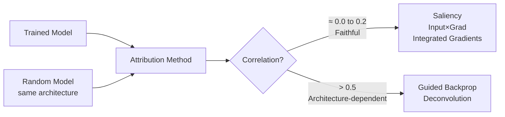

<!-- _class: lead -->

# Captum Gradient API

## Module 01 — Gradient Methods
### Saliency, InputXGradient, GuidedBackprop, Deconvolution

<!-- Speaker notes: This deck is the practical companion to Guide 01's theory. The key skill to develop: writing a reusable attribution comparison function that works with any Captum gradient method. By the end of this deck, learners should be able to run all four methods in parallel and produce a side-by-side visualization grid. The hands-on notebook in this module implements exactly that. -->

---

# The Unified Pattern

Every gradient method in Captum:

```python
from captum.attr import AnyGradientMethod

method = AnyGradientMethod(model)  # 1. Create

attrs = method.attribute(           # 2. Attribute
    inputs=input_tensor,            #    (requires_grad=True)
    target=class_idx                #    Class to explain
)

# attrs.shape == input_tensor.shape  # Always
```

**One function. Parameterize the method.**

<!-- Speaker notes: The pattern slide should be the first thing learners see when opening their notebook. The three-line pattern covers 90% of gradient attribution use cases. The key invariant is that attributions always have the same shape as inputs. This makes it trivial to loop over methods: create a dictionary of method instances, iterate, call .attribute() on each. -->

---

# Four Methods: API Reference

<div class="columns">

```python
from captum.attr import Saliency

s = Saliency(model)
attr = s.attribute(
    inputs,          # requires_grad=True
    target=class_idx,
    abs=True         # |∇f| vs ∇f
)
```

```python
from captum.attr import InputXGradient

ixg = InputXGradient(model)
attr = ixg.attribute(
    inputs,          # requires_grad=True
    target=class_idx
    # No abs param: returns x * ∇f
    # Positive = increases prediction
    # Negative = decreases prediction
)
```

</div>

<!-- Speaker notes: Show both APIs simultaneously to emphasize the pattern similarity. The only difference for the student is the class name. The abs parameter on Saliency controls whether absolute value is taken — set to False to see signed gradients. InputXGradient does not have abs parameter: it returns signed values by default, which is important because the sign tells you whether the feature supports or opposes the prediction. -->

---

# GuidedBackprop and Deconvolution API

<div class="columns">

```python
from captum.attr import GuidedBackprop

gbp = GuidedBackprop(model)
attr = gbp.attribute(
    inputs,
    target=class_idx
)
# Hooks registered automatically
# Hooks removed after .attribute()
```

```python
from captum.attr import Deconvolution

deconv = Deconvolution(model)
attr = deconv.attribute(
    inputs,
    target=class_idx
)
# Same API as GuidedBackprop
# Different backward modification
```

</div>

Both modify the backward pass via **hooks**. Captum handles registration/removal transparently.

<!-- Speaker notes: The hook mechanism is an internal implementation detail that students do not need to manage. Captum's GuidedBackprop and Deconvolution register forward hooks on ReLU layers to capture activations and modify the backward gradient. This is done inside the method class. Students should know it exists to understand why the method has architecture requirements (must have ReLU layers) but do not need to implement it. -->

---

# Comparison Loop: All Methods in Parallel

```python
from captum.attr import (Saliency, InputXGradient,
                          GuidedBackprop, Deconvolution)

# Define methods in a dictionary
methods = {
    "Saliency":     Saliency(model),
    "Input×Grad":   InputXGradient(model),
    "Guided BP":    GuidedBackprop(model),
    "Deconv":       Deconvolution(model),
}

# Compute all attributions
attributions = {}
for name, method in methods.items():
    inp = input_tensor.clone().requires_grad_(True)
    attributions[name] = method.attribute(inp, target=class_idx).detach()

print({k: v.shape for k, v in attributions.items()})
# All shapes: (1, 3, 224, 224)
```

<!-- Speaker notes: The dictionary pattern is a practical idiom for comparative attribution studies. By cloning the input tensor before each attribution call, we ensure that gradient graph state does not leak between methods. The .detach() call at the end releases the gradient computation graph from memory, which is important when processing many images. -->

---

# Visualization: Multi-Row Grid

```python
import matplotlib.pyplot as plt
import numpy as np

fig, axes = plt.subplots(len(methods), 3, figsize=(12, 4*len(methods)))

for row, (name, attr) in enumerate(attributions.items()):
    attr_np = np.abs(attr.squeeze(0).permute(1,2,0).numpy()).mean(axis=-1)

    # Column 0: Heatmap
    axes[row, 0].imshow(attr_np, cmap='hot')
    axes[row, 0].set_title(f"{name}: heatmap")
    axes[row, 0].axis('off')

    # Column 1: Overlay
    axes[row, 1].imshow(image_np)
    axes[row, 1].imshow(attr_np, alpha=0.6, cmap='hot',
                         vmin=np.percentile(attr_np, 85))
    axes[row, 1].set_title(f"{name}: overlay")
    axes[row, 1].axis('off')

    # Column 2: Distribution
    axes[row, 2].hist(attr_np.flatten(), bins=80, alpha=0.7)
    axes[row, 2].set_title(f"{name}: distribution")
```

<!-- Speaker notes: The three-column layout is the canonical visualization for gradient method comparison: raw heatmap, overlay on original image, and value distribution. The distribution plot is informative: Saliency tends to produce more uniform distributions; Input×Gradient and GBP often produce more peaked distributions. Differences in distribution shape affect how the heatmap looks and require different normalization strategies for fair comparison. -->

---

# Reading Attribution Heatmaps

<div class="columns">

**What warm colors mean:**
- Red/yellow = high attribution
- Feature strongly influences the prediction
- Model "pays attention" to this region

**What cool colors mean:**
- Blue/purple = low (or negative) attribution
- Feature has little effect on prediction
- Or: feature actively decreases the prediction

</div>

**Background should be cool. Object should be warm.**
If this is reversed: the model may be using spurious features.

<!-- Speaker notes: Attribution interpretation is often glossed over. The warm/cool mapping seems obvious but the background/object rule is critical for model validation. A well-calibrated classifier for "golden retriever" should have warm attribution on the dog and cool on the background. If the sky or grass is warm and the dog is cool, investigate: the model may have learned that dog photos have a certain background style rather than learning dog features. This is the husky/wolf scenario from Module 00. -->

---

# The Critical Sanity Check

**Adebayo et al. (2018): Randomize the model weights. Do attributions change?**

```python
import copy

# Train model attribution
attr_trained = GuidedBackprop(model).attribute(inp, target=c)

# Random model attribution (same architecture, random weights)
rand_model = copy.deepcopy(model)
for m in rand_model.modules():
    if hasattr(m, 'reset_parameters'):
        m.reset_parameters()
rand_model.eval()

attr_random = GuidedBackprop(rand_model).attribute(inp, target=c)

# Compare
corr = np.corrcoef(
    attr_trained.detach().numpy().flatten(),
    attr_random.detach().numpy().flatten()
)[0, 1]
print(f"Correlation: {corr:.3f}")
```

For faithful methods: correlation ≈ 0. For Guided Backprop: often > 0.5.

<!-- Speaker notes: This is the most important practical test learners should run on any attribution method they encounter. The expectation: a method that truly reflects learned model weights should produce very different attributions for a trained vs. randomly initialized model. For Saliency and IG, the randomization dramatically changes the attribution map. For Guided Backprop, the maps remain visually similar because they depend on the architecture, not the weights. Run this test on any new method before using it for validation or debugging. -->

---

# Expected Results: Sanity Check



High correlation = the attribution is reflecting the architecture, not the learned weights.

<!-- Speaker notes: The mermaid diagram summarizes the sanity check outcome. Methods in the left branch (low correlation) are genuinely measuring something about the trained model's computation. Methods in the right branch (high correlation) are primarily reflecting the network architecture's structure — specifically, the pattern of ReLU activations that is the same regardless of what values the weights take. This is not a subtle theoretical concern: it fundamentally invalidates the use of Guided Backprop for debugging wrong predictions. -->

---

# Normalizing for Fair Comparison

Attribution scales differ by method. Normalize before comparing:

```python
def normalize_attr(attr_tensor, percentile=99):
    """Normalize attribution to [0, 1] for display."""
    arr = np.abs(attr_tensor.squeeze(0).permute(1,2,0).numpy()).mean(-1)
    # Clip outliers
    vmax = np.percentile(arr, percentile)
    arr = np.clip(arr, 0, vmax)
    return arr / (vmax + 1e-8)

# Apply to all methods for fair visual comparison
normalized = {name: normalize_attr(attr)
              for name, attr in attributions.items()}
```

Without normalization: the method with the largest range will appear to have more attribution regardless of content.

<!-- Speaker notes: Normalization is required for honest visual comparison. IG attributions are in a different scale than saliency attributions. Without percentile-based normalization, the comparison misleads by making one method appear to have stronger attribution simply because its values happen to be larger. The 99th percentile clip handles the long-tail outliers that are common in gradient-based attributions — a few pixels with extreme values that would dominate a linear normalization. -->

---

# What to Look For: Comparison Checklist

When comparing gradient methods visually:

1. **Spatial coherence:** Do attributions cluster on semantically meaningful regions?
2. **Background attribution:** Is the background mostly dark (unattributed)?
3. **Object completeness:** Does the attributed region cover the full object?
4. **Edge sharpness:** Are boundaries well-defined or diffuse?
5. **Sensitivity check:** When you change the image, do attributions change meaningfully?
6. **Randomization check:** Do attributions change substantially for a random model?

<!-- Speaker notes: The checklist converts visual inspection into a structured evaluation. Points 1-4 can be assessed visually. Points 5-6 require running additional experiments. Point 6 (randomization check) is the most important and the one most commonly skipped. Build this into your standard attribution evaluation workflow. -->

---

# Common Mistakes Summary

| Mistake | Symptom | Fix |
|---------|---------|-----|
| `model.train()` | Non-deterministic attributions | Call `model.eval()` first |
| No `requires_grad` | RuntimeError | Add `.requires_grad_(True)` |
| Wrong target type | TypeError | Use integer class index |
| Not detaching | Memory leak | Call `.detach()` after attribution |
| Trusting GBP | Wrong conclusions | Run randomization test |
| Comparing unscaled | Misleading visuals | Normalize per method |

<!-- Speaker notes: The mistakes table is the practical error-prevention guide. Each row corresponds to a real mistake that appears regularly in student work and published code. The most consequential mistake is "Trusting GBP" — using Guided Backprop attributions to make claims about which features the model uses without running the sanity check. The fix (run randomization test) takes 5 minutes but prevents fundamentally wrong conclusions. -->

---

# Key Takeaways

1. **Unified API:** Replace method name, keep everything else the same
2. **Comparison loop:** Dictionary of methods + for loop = four attributions in 10 lines
3. **Visualization:** Heatmap + overlay + distribution covers all bases
4. **Sanity check:** Randomization test reveals architecture-dependent methods
5. **Normalize:** Always normalize before visual comparison across methods

<!-- Speaker notes: These five points are the practical skills. After the notebook in this module, learners will have implemented all of them. The notebook produces a four-method, three-visualization comparison grid and includes the randomization sanity check. This is the complete toolkit for gradient method comparison in any project. -->

---

<!-- _class: lead -->

# Notebooks Next

### Notebook 01: Compare all four methods on ResNet — side-by-side on multiple images
### Notebook 02: Gradient methods on tabular neural networks
### Notebook 03: Saliency deep dive — noise, saturation, what maps miss

<!-- Speaker notes: The three notebooks build progressively: first comparison on familiar image data (ResNet), then generalization to tabular data (a different input type), then deep investigation of what gradient maps fail to show. By Notebook 03, learners should have genuine skepticism about vanilla gradient methods and understand why Integrated Gradients is worth the extra computation. -->
