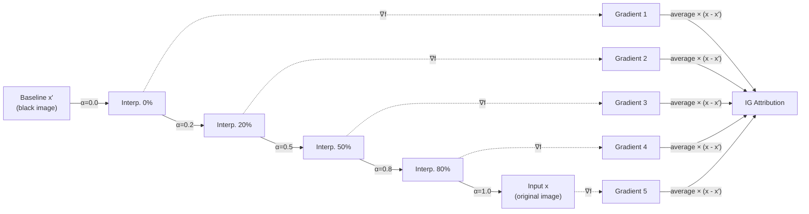

<!-- _class: lead -->

# Integrated Gradients

## Module 02 — Integrated Gradients & Path Methods
### Axiomatic Attribution for Deep Networks

<!-- Speaker notes: This deck covers the most theoretically important attribution method in the course. The key argument has a logical structure: (1) gradient methods fail the sensitivity axiom, (2) we can state exactly what an attribution method should do (axioms), (3) integrating gradients along a path is the unique solution to these requirements. The payoff is that IG is not just better empirically — it is provably correct by construction. -->

---

# The Problem We Are Solving

Module 01 showed:

- **Saliency fails sensitivity:** zero attribution for relevant features in saturation zones
- **Input×Gradient fails sensitivity:** same root cause, different formula
- **Guided Backprop fails impl. invariance:** reflects architecture, not weights

**Question:** Can we construct an attribution that satisfies BOTH axioms?

**Answer:** Yes. It is called Integrated Gradients.

<!-- Speaker notes: Set up the module as a resolution to Module 01's cliffhanger. Every limitation identified in Module 01 should be present in learners' minds. This deck resolves those limitations definitively. The two axioms are the constraints, IG is the solution. The proof of uniqueness (mentioned later) shows this is THE solution, not A solution. -->

---

# Key Insight: Integration vs Evaluation

<div class="columns">

**Saliency: evaluate at one point**
$$\phi_i^{\text{saliency}} = \left|\frac{\partial f(x)}{\partial x_i}\right|$$

Only sees: gradient here, now.

Misses: what happened between baseline and input?

**Integrated Gradients: integrate along path**
$$\phi_i^{\text{IG}} = (x_i - x'_i) \int_0^1 \frac{\partial f(x' + \alpha(x-x'))}{\partial x_i} d\alpha$$

Sees: gradient everywhere from $x'$ to $x$.

Captures: the full contribution along the path.

</div>

<!-- Speaker notes: This is the conceptual core. Saliency takes a snapshot at one location on the gradient landscape. IG films the entire journey from baseline to input. In regions where the network is saturated (gradient = 0 at the endpoint), saliency sees nothing. But IG integrates gradients at all intermediate points along the path — including the region where the neuron transitions from inactive to active. This is the intuitive resolution to the saturation failure. -->

---

# The Integration Path Visualized



<!-- Speaker notes: This flowchart makes the algorithm concrete. We generate m interpolation points between the baseline and the input. At each point, we compute the gradient via backpropagation. We average these gradients and multiply by (x - baseline). This is the Riemann sum approximation of the integral. The key insight: even if the gradient is zero at the final input x (saturation), some intermediate points along the path may have non-zero gradients — and those contribute to the attribution. -->

---

# Why FTC Makes This Exact

The Fundamental Theorem of Calculus states:

$$\int_0^1 g'(\alpha) d\alpha = g(1) - g(0)$$

Let $g(\alpha) = f\left(x' + \alpha(x - x')\right)$ (the model output along the path).

Then:
$$g(1) = f(x), \quad g(0) = f(x')$$

Chain rule gives:
$$g'(\alpha) = \sum_i \frac{\partial f}{\partial x_i}\bigg|_{x(\alpha)} \cdot (x_i - x'_i)$$

Therefore:
$$\sum_i \text{IG}_i(x) = f(x) - f(x') \quad \checkmark$$

<!-- Speaker notes: The FTC connection is the mathematical heart of IG. It guarantees that the sum of attributions equals the model output difference between input and baseline. This is not an approximation — it is an exact mathematical identity. The approximation only enters when we discretize the integral with m steps. The more steps we use, the smaller the approximation error. This is the completeness property and it provides a diagnostic: if sum(IG) is far from f(x) - f(x'), we need more steps. -->

---

# Formal Definition

$$\text{IG}_i(x) = (x_i - x'_i) \cdot \int_0^1 \frac{\partial f\!\left(x' + \alpha(x - x')\right)}{\partial x_i} d\alpha$$

**Components:**
- $x$: the input we are explaining
- $x'$: the baseline (reference "no information" point)
- $\alpha$: interpolation parameter $\in [0, 1]$
- $x' + \alpha(x - x')$: the interpolated point at step $\alpha$
- $(x_i - x'_i)$: scales attribution to input magnitude

<!-- Speaker notes: Walk through each component. The interpolation x' + alpha*(x - x') is a straight line in input space from the baseline (alpha=0) to the input (alpha=1). The gradient at each point tells us how sensitive the output is to feature i at that location. The integral accumulates all these sensitivities. The (x_i - x'_i) factor scales everything to be relative to the baseline: if feature i has the same value as the baseline, it gets zero attribution regardless of the gradient. -->

---

# The Two Axioms

**Axiom 1: Sensitivity**

$$\text{If } f(x) \neq f(x') \text{ and } x_i \neq x'_i \text{ while } x_j = x'_j \text{ for all } j \neq i,$$
$$\text{then } \text{IG}_i(x) \neq 0$$

If feature $i$ is the only one that changed AND the output changed, it must get non-zero attribution.

**Axiom 2: Implementation Invariance**

$$\text{If } f(x) = g(x) \text{ for all } x, \text{ then } \text{IG}_i^f = \text{IG}_i^g$$

Identical input-output behavior → identical attributions.

<!-- Speaker notes: The two axioms are minimal requirements for any attribution method that claims to explain model behavior. Sensitivity says: if a feature provably affects the output, don't give it zero credit. Implementation invariance says: the explanation should depend on what the model does, not on how it does it internally. These seem obvious but many practical methods fail one or both. IG is the uniquely correct method in the sense that it satisfies both. -->

---

# IG Satisfies Sensitivity: Why

Consider feature $i$ where $x_i \neq x'_i$ and changing $x_i$ changes $f$.

The path from $x'$ to $x$ passes through the region where changing $x_i$ affects $f$.

$$\int_0^1 \frac{\partial f}{\partial x_i}\bigg|_{x(\alpha)} d\alpha \neq 0$$

Because the gradient cannot be zero along the entire path if $f(x) \neq f(x')$ when only $x_i$ varies.

**Contrast with saliency:** saliency evaluates the gradient only at $\alpha = 1$. If the ReLU is saturated at that point, gradient = 0 even though the path integral is non-zero.

<!-- Speaker notes: The proof sketch is important to internalize. If changing feature i (and only feature i) from x'_i to x_i changes f, then by the intermediate value theorem applied to g(alpha) = f(x' + alpha*(x - x') with x_j = x'_j for j != i), there must be some alpha where the gradient is non-zero. Therefore the integral is non-zero. Saliency's failure is that it only evaluates at alpha=1 and might be unlucky to land at a zero-gradient point (saturation). IG avoids this by integrating over all alphas. -->

---

# IG Satisfies Implementation Invariance: Why

IG depends on the model only through:

$$\frac{\partial f\left(x(\alpha)\right)}{\partial x_i}, \quad \alpha \in [0, 1]$$

If $f(x) = g(x)$ for all $x$, then their partial derivatives are also equal everywhere.

Therefore $\text{IG}_i^f = \text{IG}_i^g$.

**Contrast with Guided Backprop:** GBP modifies gradient flow through ReLU layers based on implementation details (which activations are positive), not on the model's input-output mapping. Two models with identical I/O can have different GBP attributions.

<!-- Speaker notes: Implementation invariance is subtle but important. Two models with identical input-output behavior have identical partial derivatives (since partial derivatives are determined by the I/O function). Therefore their IG attributions are identical. GBP violates this because it uses the actual activation values (not just the gradient) to modify backpropagation — this makes it depend on internal implementation. A ReLU at position x=0.5 in model A vs a smoother activation function that approximates it in model B will produce different GBP attributions even if A and B have identical outputs. -->

---

# Completeness Property

$$\sum_{i=1}^d \text{IG}_i(x) = f(x) - f(x')$$

**Why this matters:**

1. **Validation:** Compute sum of IG attributions. If it doesn't equal $f(x) - f(x')$, your approximation has too much error → increase `n_steps`.

2. **Interpretability:** Attributions partition the output difference. Feature 1 explains 30% of the output change, feature 2 explains 25%, etc.

3. **Faithfulness check:** The completeness property is verifiable with one forward pass.

<!-- Speaker notes: Completeness is the practical consequence of the FTC identity. It provides a free validation check: compute the sum of all attributions and compare to f(input) - f(baseline). If they match (up to numerical tolerance), the approximation is good. If they disagree significantly, increase n_steps or switch to a more accurate integration scheme. This is the one sanity check that IG provides that no other gradient method offers. Use it every time you apply IG. -->

---

# Numerical Approximation

The integral is approximated with a Riemann sum:

$$\text{IG}_i \approx (x_i - x'_i) \cdot \frac{1}{m} \sum_{k=1}^{m} \frac{\partial f\!\left(x' + \frac{k}{m}(x - x')\right)}{\partial x_i}$$

| Steps ($m$) | Approx error | Use case |
|------------|-------------|---------|
| 20 | ~5% | Quick exploration |
| 50 | ~0.5% | Standard (Captum default) |
| 300 | ~0.01% | Validation, publication |

**Cost:** $m$ forward + backward passes. At $m=50$: 50× saliency.

<!-- Speaker notes: The approximation error decreases as O(1/m^2) for the trapezoidal rule version. At m=50, the error is typically well under 1% of the total attribution, which is sufficient for practical interpretation. For regulatory documentation or academic publication, use m=300. The cost scales linearly with m: at m=50, IG takes 50x as long as saliency. On a GPU, this is still fast (50ms for ResNet-50 on a single image). The convergence delta returned by Captum directly measures this error. -->

---

# Captum API

```python
from captum.attr import IntegratedGradients

ig = IntegratedGradients(model)

attributions, delta = ig.attribute(
    inputs=input_tensor,          # (1, C, H, W), requires_grad=True
    baselines=baseline,           # (1, C, H, W), does NOT need grad
    target=class_idx,             # Integer class index
    n_steps=50,                   # Steps in Riemann sum
    return_convergence_delta=True # Return delta for validation
)

# Validate completeness
with torch.no_grad():
    pred_in = model(input_tensor)[0, class_idx].item()
    pred_bl = model(baseline)[0, class_idx].item()

attr_sum = attributions.sum().item()
print(f"Attribution sum:   {attr_sum:.4f}")
print(f"f(in) - f(base):  {pred_in - pred_bl:.4f}")
print(f"Convergence delta: {delta.item():.5f}")
```

<!-- Speaker notes: Walk through the Captum API call. The key difference from saliency: IG requires a baseline parameter. The return_convergence_delta=True flag is important for validation — always use it during development to verify the approximation quality. The internal_batch_size parameter (not shown) controls memory usage for large n_steps values: internal_batch_size=50 processes 50 interpolation points at a time instead of all m at once. -->

---

# Internal Batch Size for Memory Control

For large images or many steps, control memory with `internal_batch_size`:

```python
attributions = ig.attribute(
    inputs=input_tensor,
    baselines=baseline,
    target=class_idx,
    n_steps=300,              # High quality
    internal_batch_size=50,   # Process 50 steps at a time
)
```

Without `internal_batch_size=50`:
- All 300 intermediate images loaded to GPU simultaneously
- May exceed GPU memory for high-resolution inputs

With `internal_batch_size=50`:
- Memory usage: 50 × (single image memory)
- Same result, lower peak memory

<!-- Speaker notes: The internal_batch_size parameter is critical for production deployment. Without it, IG with n_steps=300 attempts to hold 300 copies of the input in GPU memory simultaneously. For ResNet-50 with 224x224 inputs, this is manageable. For larger models or higher-resolution inputs (e.g., 512x512 medical images), this will exceed GPU memory. Setting internal_batch_size=50 computes the integral in chunks. The result is mathematically identical but memory usage is controlled. -->

---

# The Baseline: The Most Critical Choice

The baseline $x'$ defines the reference point. Different baselines answer different questions.

<div class="columns">

**Zero baseline (black image)**
- Asks: "compared to a completely dark image, what matters?"
- Fast and consistent
- May not represent meaningful "no information"

**Blurred image**
- Asks: "compared to blurred background, what local patterns matter?"
- More natural reference
- Keeps global structure, removes details

</div>

<div class="columns">

**Random noise (averaged)**
- Asks: "compared to random static, what matters?"
- Average over many random baselines
- Reduces baseline dependence

**Domain-specific**
- Text: `[MASK]` token embedding
- Tabular: mean of training distribution
- Best for domain-specific questions

</div>

<!-- Speaker notes: The baseline is the most underappreciated decision in IG attribution. It is as important as the architecture choice. The baseline defines the null hypothesis: "what would the model predict with no useful information?" For images, a black image is simple but may be unnatural (models rarely see black images). A blurred image is more natural. For text, the [MASK] token or a zero embedding vector are the standard choices. For tabular data, the mean of the training distribution represents a "typical" sample and is usually the right choice. Guide 02 covers this in depth with empirical comparisons. -->

---

# IG vs Related Methods

| Property | Saliency | Input×Grad | IG |
|----------|---------|------------|-----|
| Sensitivity | No | No | **Yes** |
| Impl. Invariance | Yes | Yes | **Yes** |
| Completeness | No | Approx | **Exact** |
| Baseline | None | Implicit (0) | Explicit |
| Speed | 1× | 1× | 50× |
| Noise | High | Medium | Low |

<!-- Speaker notes: The comparison table shows why IG is the gold standard among gradient methods. It costs 50x more computation but delivers: sensitivity (resolves saturation), exact completeness (checkable validation), and low noise (averaging over the path naturally smooths gradient noise). The explicit baseline requirement is a feature, not a bug — it forces you to think about what reference point you are using, which sharpens the interpretation of the attribution. -->

---

# Key Takeaways

1. **IG integrates** gradients along the path from baseline to input — not just at the endpoint
2. **FTC guarantees** that the sum of IG attributions = $f(x) - f(x')$ (completeness)
3. **Sensitivity satisfied:** even saturated features get non-zero attribution if they are relevant
4. **Implementation invariance satisfied:** depends only on I/O function, not internals
5. **Convergence delta** = sum of IG - ($f(x) - f(x')$) — use it to validate approximation quality

<!-- Speaker notes: These five points are the theoretical payload of this deck. After this, learners should understand: why IG is correct (satisfies both axioms), how to verify it is working (completeness check), and what the baseline means (the reference point for all attributions). The notebooks implement all of this and produce the visual evidence that IG is indeed more faithful than saliency for saturated networks. -->

---

<!-- _class: lead -->

# Next: Baselines & Convergence

### Guide 02: Choosing baselines, diagnosing convergence, NoiseTunnel on IG

<!-- Speaker notes: Guide 02 tackles the practical challenges of IG deployment: how to choose the baseline empirically, how to detect and fix poor convergence, and how to apply SmoothGrad (NoiseTunnel) on top of IG for the smoothest possible attributions. These are the decisions that determine whether IG works well in practice. -->
