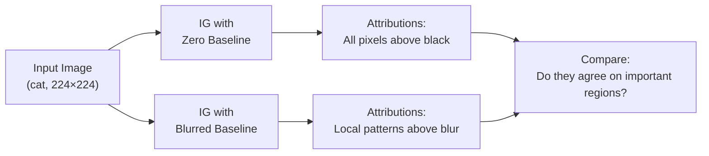
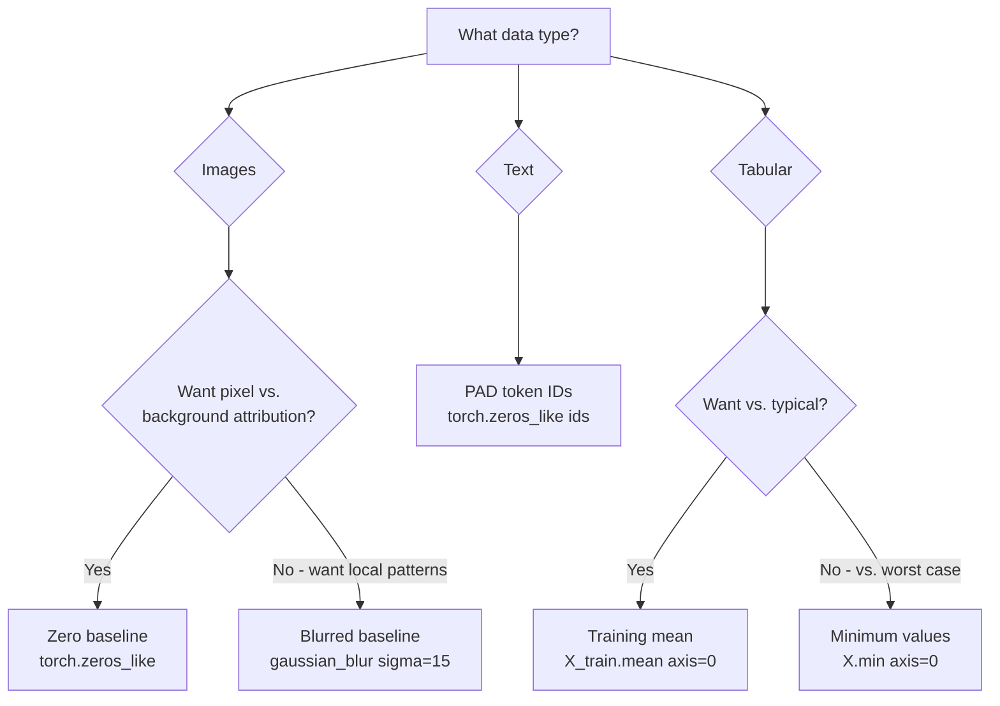

<!-- _class: lead -->

# Baselines, Convergence & NoiseTunnel

## Module 02 — Integrated Gradients
### Practical IG: Choosing Baselines and Validating Results

<!-- Speaker notes: This deck covers the practical decisions that determine whether IG works well or poorly in real applications. The theory deck established that IG is the correct method. This deck answers: how do you apply it correctly? The two critical decisions are (1) baseline choice and (2) convergence verification. Get these right and IG is reliable. Get them wrong and IG may be technically correct but practically misleading. -->

---

# The Baseline Defines the Question

$$\text{IG}_i(x) = (x_i - x'_i) \cdot \int_0^1 \frac{\partial f(x(\alpha))}{\partial x_i} d\alpha$$

$x'$ is the **baseline** — the reference "no information" point.

**Different baselines ask different questions:**

> "Compared to [black image], which pixels mattered?"

vs.

> "Compared to [blurred background], which local patterns mattered?"

Both are valid. Choose the one that matches your question.

<!-- Speaker notes: The baseline framing is the key conceptual shift. Practitioners often treat the baseline as a technical parameter to tune for best-looking results. This is wrong. The baseline defines the question. A black image baseline asks about pixel contribution above a dark background. A blurred image baseline asks about fine-grained detail contribution above the overall gist. These are legitimately different questions, and the right baseline depends on what you want to know. -->

---

# Four Standard Baselines

<div class="columns">

**Zero (black image)**
```python
baseline = torch.zeros_like(input_tensor)
```
Asks: "compared to complete darkness"
Simple, reproducible, out-of-distribution

**Blurred image**
```python
from torchvision.transforms.functional import gaussian_blur
baseline = gaussian_blur(input_tensor, [41,41], [15.0,15.0])
```
Asks: "compared to blurred background"
More natural, input-dependent

</div>

<div class="columns">

**Random noise (averaged)**
```python
baseline = torch.stack([
    torch.randn_like(x)*0.1 for _ in range(20)
]).mean(0)
```
Reduces baseline dependence

**Domain baseline**
```python
# Tabular: mean of training set
baseline = torch.tensor(X_train.mean(0, keepdims=True))
# Text: [MASK] token embedding
```
Domain-appropriate null hypothesis

</div>

<!-- Speaker notes: The four baselines cover the main use cases. Black is the default and works for most image classification tasks. Blurred is better when you want to understand which fine-grained details distinguish the prediction. Random is useful when you want baseline-independent attributions (at high computational cost). Domain-specific baselines are essential for non-image data: tabular data should use the training mean, text should use mask tokens. -->

---

# Zero vs Blurred Baseline: Visual Comparison



**Disagreement reveals:** the attribution is baseline-sensitive in those regions.

**Agreement builds confidence:** the important regions are robust to baseline choice.

<!-- Speaker notes: The comparison framework is practical: run both baselines, compare the top-20% most attributed regions. If they agree, you have a robust finding. If they disagree strongly, the attribution is baseline-sensitive, meaning the interpretation depends heavily on your choice of null hypothesis. This is not a failure — it may reflect genuinely different questions. But it should be disclosed and understood. -->

---

# The Convergence Delta: Your Validation Tool

$$\delta = \left|\sum_i \text{IG}_i^{\text{approx}} - (f(x) - f(x'))\right|$$

```python
attr, delta = ig.attribute(
    inputs, baselines=baseline, target=class_idx,
    n_steps=50,
    return_convergence_delta=True  # ALWAYS enable
)
print(f"Delta: {delta.item():.5f}")
```

| Delta | Quality | Action |
|-------|---------|--------|
| < 0.01 | Excellent | None needed |
| 0.01–0.05 | Good | Acceptable |
| > 0.05 | Marginal | Increase n_steps |
| > 0.10 | Poor | Use n_steps=300+ |

<!-- Speaker notes: The convergence delta is a free sanity check that every IG computation should include. It costs nothing extra (requires one additional forward pass to compute f(x) and f(x')). A delta above 0.05 means the numerical integration error is significant relative to the total attribution, and the attribution map may be unreliable. This is especially common when using very few steps (n_steps=5 or 10) for speed, when the model is highly non-linear, or when the baseline is very far from the input. -->

---

# Finding the Right n_steps

```python
# Sweep n_steps to find the convergence point
for n_steps in [20, 50, 100, 200, 300]:
    attr, delta = ig.attribute(
        inp, baselines=baseline, target=class_idx,
        n_steps=n_steps,
        return_convergence_delta=True
    )
    print(f"n_steps={n_steps:4d}: delta={delta.item():.5f}")
    if abs(delta.item()) < 0.02:
        print(f"  → Converged!")
        break
```

Expected output:
```
n_steps=  20: delta=0.08312  ← too few steps
n_steps=  50: delta=0.01241  ← good
n_steps= 100: delta=0.00312  ← excellent
```

<!-- Speaker notes: The convergence sweep is a one-time calibration step for a new model or domain. Run it once, find the n_steps where delta drops below your threshold, then use that value for all subsequent attributions. For most ImageNet models, n_steps=50 is sufficient. For transformer models on text, n_steps=100-200 may be needed because the embedding space is higher-dimensional and the integration path more complex. -->

---

# NoiseTunnel + IG: Smoothest Attributions

```python
from captum.attr import IntegratedGradients, NoiseTunnel

ig = IntegratedGradients(model)
nt = NoiseTunnel(ig)

# SmoothGrad-IG: expensive but cleanest
attr = nt.attribute(
    input_tensor,
    nt_type='smoothgrad',  # Average over noisy samples
    nt_samples=10,         # 10 × n_steps = 500 total passes
    stdevs=0.05,
    baselines=baseline,
    target=class_idx,
    n_steps=50
)
```

**Total cost:** `nt_samples × n_steps = 10 × 50 = 500` forward+backward passes.

<!-- Speaker notes: SmoothGrad-IG combines the best of both worlds: IG's axiomatic correctness with SmoothGrad's variance reduction. The cost is multiplicative: 10 samples × 50 steps = 500 passes, about 10× the cost of plain IG. For a ResNet-50 on GPU, this is ~500ms per image — acceptable for offline analysis, too slow for real-time. The result is typically the cleanest attribution map you can produce with gradient methods. -->

---

# LayerIntegratedGradients for Text

Text attribution requires `LayerIntegratedGradients`:

```python
from captum.attr import LayerIntegratedGradients

# Target the embedding layer
lig = LayerIntegratedGradients(
    model,                          # Forward function
    model.distilbert.embeddings     # Layer to attribute TO
)

attributions, delta = lig.attribute(
    inputs=input_ids,
    baselines=baseline_ids,         # [PAD] token IDs as baseline
    additional_forward_args=(attention_mask,),
    target=1,                       # Positive class
    n_steps=50,
    return_convergence_delta=True
)

# Sum across embedding dim → per-token score
token_scores = attributions.sum(dim=-1).squeeze()
```

<!-- Speaker notes: LayerIntegratedGradients is the standard method for transformer/NLP attribution. The key difference: it attributes to a specific layer's output (the embedding), not to the raw input IDs (which are integers and cannot have gradients). The baseline_ids use [PAD] token IDs because padding tokens represent "no information" in transformer models. The sum across the embedding dimension converts the per-embedding-dimension attribution into a single per-token importance score. -->

---

# Token Attribution Visualization

```python
def visualize_token_attribution(tokens, attributions, text, predicted_label):
    """Color each token by its attribution score."""
    attr_norm = attributions / (attributions.abs().max() + 1e-8)

    # Create colored HTML-style visualization
    fig, ax = plt.subplots(figsize=(12, 2))
    ax.set_xlim(0, 12); ax.set_ylim(0, 1); ax.axis('off')

    x, y = 0.2, 0.5
    for token, score in zip(tokens, attr_norm.numpy()):
        alpha = min(abs(score) * 1.5 + 0.1, 0.95)
        fc = (0.1, 0.7, 0.1, alpha) if score > 0 else (0.8, 0.1, 0.1, alpha)
        ax.text(x, y, token, fontsize=11,
                bbox=dict(boxstyle='round', facecolor=fc, edgecolor='none'))
        x += len(token) * 0.12 + 0.1
    ax.set_title(f"Token Attribution — Predicted: {predicted_label}")
    plt.tight_layout()
    plt.show()
```

**Green = supports positive class, Red = opposes it.**

<!-- Speaker notes: The token visualization converts per-token attribution scores into an intuitive color coding: green for positive attribution (supporting the positive class), red for negative attribution (opposing it), with intensity proportional to magnitude. This allows immediate identification of which words the model relies on for its prediction. Common findings: sentiment words (great, terrible) get high positive/negative attribution, while function words (the, a, in) get near-zero attribution. -->

---

# Baseline Selection Decision Tree



<!-- Speaker notes: The decision tree provides a quick reference for baseline selection. Images default to zero baseline. Text defaults to PAD tokens. Tabular data defaults to training mean. The blurred baseline is a deliberate choice when you want to understand which fine-grained details drive the prediction, over and above the overall scene gist. The adversarial/min baseline for tabular data is useful in fraud detection (baseline = minimum fraud indicators). -->

---

# Practical Checklist for IG Attribution

Before trusting any IG attribution:

1. `model.eval()` — ALWAYS
2. `input.requires_grad_(True)` — required
3. `baseline` chosen to match your question
4. `return_convergence_delta=True` — validate
5. `|delta| < 0.05` — if not, increase n_steps
6. Sum of attributions ≈ f(x) - f(baseline) — verify
7. High-attribution regions make semantic sense — inspect

<!-- Speaker notes: The seven-point checklist should become automatic. Most bugs in IG attribution come from violating items 1, 2, or 5. The semantic check (item 7) is the ultimate test: do the high-attribution regions correspond to the object being classified? For a correctly trained model predicting "dog," the dog should be warm and the background cool. If the background is warm, investigate the baseline choice or the model's training data. -->

---

# Key Takeaways

1. **Baseline = your null hypothesis** — choose it to match the question you want to answer
2. **Zero baseline** is the default for images; **training mean** for tabular; **PAD tokens** for text
3. **Convergence delta** is a free sanity check — always enable it, keep `|delta| < 0.05`
4. **NoiseTunnel wraps IG** for SmoothGrad-IG: clean but expensive (nt_samples × n_steps passes)
5. **LayerIntegratedGradients** for transformer models — attributes to embedding layer, not token IDs

<!-- Speaker notes: The five takeaways cover the practical decisions that determine IG attribution quality. The most commonly missed is the convergence delta check — practitioners often skip this and report attributions with large approximation errors. Make this check automatic. The baseline choice is the most impactful: a wrong baseline produces technically correct but meaningless attributions. The baseline defines what "no information" means in your domain. -->

---

<!-- _class: lead -->

# Next: Notebooks

### Notebook 01: IG on image classification — multiple baseline comparison
### Notebook 02: IG on text — token-level attribution with DistilBERT
### Notebook 03: SmoothGrad/NoiseTunnel — variance reduction demo

<!-- Speaker notes: The three notebooks build on each other. Notebook 01 is the core IG application on familiar image data. Notebook 02 extends to NLP with LayerIntegratedGradients — a qualitatively different domain. Notebook 03 focuses specifically on the NoiseTunnel-IG combination and includes a quantitative comparison of smoothness metrics. -->
