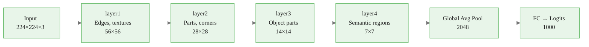
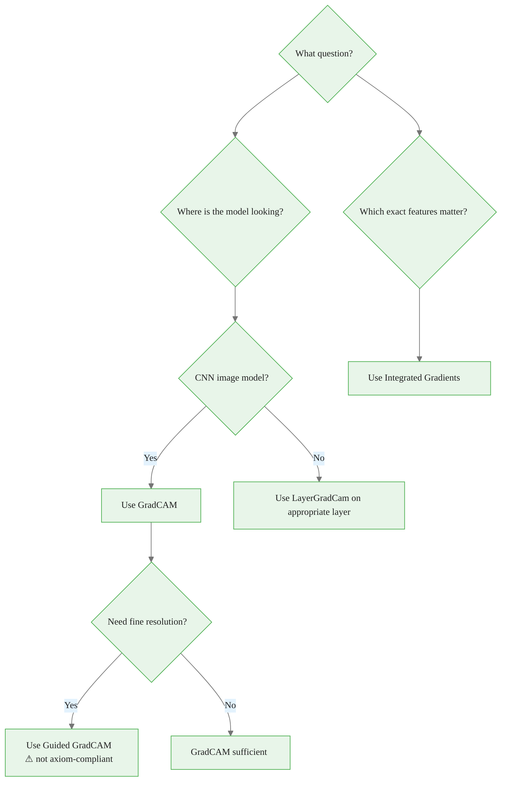

<!-- _class: lead -->

# GradCAM, Guided GradCAM & LayerGradCam

## Module 03 — Layer & Neuron Attribution
### Spatial Heatmaps from Convolutional Feature Maps

<!-- Speaker notes: GradCAM is the most widely used CNN attribution method in production. It answers a different question than IG: not "which pixels matter?" but "which regions does the model attend to?" The key insight is that convolutional feature maps retain spatial structure, and gradients flowing into those maps encode which regions were most influential for a given class. This deck covers the derivation, the Captum API, and when to use GradCAM versus IG. -->

---

# Why Not Just Use IG for CNNs?

IG gives per-pixel attribution. GradCAM gives per-region attribution.

```python
# IG: noisy, high-res, axiomatically sound
ig_attr.shape  # (1, 3, 224, 224) — every pixel, every channel

# GradCAM: clean, coarse, spatially coherent
gradcam_attr.shape  # (1, 2048, 7, 7) → upsampled to (1, 2048, 224, 224)
```

| | IG | GradCAM |
|--|--|--|
| Resolution | Full input | Feature map size |
| Speed | n_steps passes | 1 pass |
| Axioms | Sensitivity + Impl. Inv. | None formal |
| Best for | Per-pixel accuracy | Spatial localization |

<!-- Speaker notes: The two methods are complementary. IG is the right choice when you need provable correctness and exact per-pixel attribution. GradCAM is the right choice when you need fast spatial localization for a CNN. In practice, many teams use both: GradCAM for rapid exploration and communication, IG for rigorous analysis. -->

<div class="callout-info">
This is a foundational concept for the rest of the module.
</div>
---

# CNN Representation Hierarchy



**GradCAM targets `layer4`** — the last layer that retains spatial structure.

Before pooling collapses space, the 7×7 grid still encodes "where" in the image.

<!-- Speaker notes: The 7×7 feature map from ResNet-50's final conv layer is the key to GradCAM. Each cell of this 7×7 grid corresponds to a 32×32 patch of the original 224×224 image. The 2048 channels at each spatial location encode high-level semantic features. GradCAM weights these 2048 channels by their gradient importance and sums them to produce a single 7×7 heatmap indicating which spatial regions matter most. -->

<div class="callout-key">
This is the key takeaway from this section.
</div>
---

# GradCAM Derivation: Step 1 — Gradient Weights

For each feature map $k$ in the target layer, compute the **importance weight**:

$$\alpha_k^c = \frac{1}{Z} \sum_u \sum_v \frac{\partial y^c}{\partial A^k_{uv}}$$

- $y^c$ = class score for class $c$ (pre-softmax logit)
- $A^k_{uv}$ = activation at spatial location $(u,v)$ in feature map $k$
- $Z = u \times v$ = spatial size (7×7 = 49 for ResNet-50)

$\alpha_k^c$ = **"how much does feature map $k$ matter for class $c$?"**

Average gradient = global importance of the entire feature map.

<!-- Speaker notes: The global average pooling of gradients is the key insight. Rather than using the gradient at each spatial location independently, GradCAM pools them into a single weight per feature map. This has two effects: (1) it smooths out spatial noise in the gradients, and (2) it tells us the overall importance of each feature map (its 2048-dimensional "concept") for the target class. -->

<div class="callout-warning">
Common misconception — read carefully.
</div>
---

# GradCAM Derivation: Step 2 — Weighted Map

Form the class activation map:

$$L^c_{\text{GradCAM}} = \text{ReLU}\!\left(\sum_k \alpha_k^c \cdot A^k\right)$$

The **ReLU** retains only regions that **increase** class $c$ confidence.

```python
# Manual GradCAM (for understanding)
grads = compute_gradients_at_layer(model, input, layer, target)  # (C, H, W)
alphas = grads.mean(dim=(-2, -1))                                 # (C,)
cam = torch.relu((alphas[:, None, None] * activations).sum(0))   # (H, W)
```

Without ReLU: regions that suppress the class (negative gradients) contaminate the map.

<!-- Speaker notes: The ReLU is a design choice, not a theoretical requirement. It reflects the question GradCAM is answering: "which regions increase confidence in class c?" Removing the ReLU would answer "which regions have any gradient influence (positive or negative)?" For most visualization purposes, the positive-only map is cleaner and more interpretable. But for debugging — e.g., finding regions that suppress a class — the signed version is informative. -->

<div class="callout-insight">
This insight connects theory to practice.
</div>
---

# GradCAM in Captum: Full Code

```python
from captum.attr import LayerGradCam, LayerAttribution
import torch

model = resnet50(weights='IMAGENET1K_V1').eval()

# Target the final convolutional block
target_layer = model.layer4[-1]  # Last BasicBlock/Bottleneck

lg = LayerGradCam(model, target_layer)

# Compute GradCAM
attr = lg.attribute(
    input_tensor,       # (1, 3, 224, 224)
    target=class_idx    # Class to explain
)
# attr: (1, 2048, 7, 7)

# Upsample to input resolution
attr_up = LayerAttribution.interpolate(
    attr, interpolate_dims=(224, 224), interpolate_mode='bilinear'
)

# Single 2D heatmap
heatmap = torch.relu(attr_up.sum(dim=1)).squeeze(0).detach()
heatmap = (heatmap - heatmap.min()) / (heatmap.max() - heatmap.min() + 1e-8)
```

<!-- Speaker notes: The Captum implementation handles all the gradient bookkeeping. The critical step is the `target_layer = model.layer4[-1]` — this selects the last BasicBlock in ResNet-50's fourth residual stage. For VGG-16, the equivalent is `model.features[-3]` (last conv before max pool). For EfficientNet, it's `model.features[-1]`. Always verify the target layer outputs a spatial feature map (4D tensor), not a 1D vector. -->

---

# GradCAM Visualization

```python
import matplotlib.pyplot as plt
import numpy as np

fig, axes = plt.subplots(1, 3, figsize=(15, 5))

# Original image
axes[0].imshow(img_np)
axes[0].set_title('Original Image')

# GradCAM heatmap
axes[1].imshow(heatmap.numpy(), cmap='jet', vmin=0, vmax=1)
axes[1].set_title(f'GradCAM — {label}')

# Overlay on image
axes[2].imshow(img_np)
axes[2].imshow(heatmap.numpy(), alpha=0.5, cmap='jet', vmin=0, vmax=1)
axes[2].set_title('GradCAM Overlay')

for ax in axes:
    ax.axis('off')
plt.colorbar(axes[1].images[0], ax=axes[1], fraction=0.046)
plt.tight_layout()
plt.show()
```

The `jet` colormap is standard for GradCAM: blue=low attribution, red=high attribution.

<!-- Speaker notes: The three-panel layout is standard for GradCAM papers: original image, pure heatmap, and overlay. The overlay alpha of 0.5 allows the original image to show through the heatmap, helping viewers correlate attributed regions with visible image content. The jet colormap is conventional for GradCAM (despite being deprecated for scientific use) — its red=hot, blue=cold association is intuitive for attention visualization. -->

---

# Multi-Layer GradCAM: Hierarchical Representations

```python
layers = {
    'layer1 (edges)':    model.layer1[-1],
    'layer2 (parts)':    model.layer2[-1],
    'layer3 (objects)':  model.layer3[-1],
    'layer4 (semantic)': model.layer4[-1],
}

fig, axes = plt.subplots(1, len(layers) + 1, figsize=(20, 4))
axes[0].imshow(img_np); axes[0].set_title('Input')

for i, (name, layer) in enumerate(layers.items()):
    attr = LayerGradCam(model, layer).attribute(
        input_tensor, target=class_idx
    )
    h = torch.relu(attr.sum(1)).squeeze().detach()
    h = (h - h.min()) / (h.max() - h.min() + 1e-8)
    h_up = torch.nn.functional.interpolate(
        h.unsqueeze(0).unsqueeze(0), (224, 224), mode='bilinear'
    ).squeeze()
    axes[i+1].imshow(img_np)
    axes[i+1].imshow(h_up.numpy(), alpha=0.5, cmap='jet')
    axes[i+1].set_title(name)
```

<!-- Speaker notes: Multi-layer GradCAM is one of the most instructive exercises for CNN understanding. Showing all four layers side-by-side makes the hierarchical representation hierarchy viscerally clear: layer1 responds to edges and textures all over the image, layer2 to larger patterns, layer3 to part-level features near the object, and layer4 to the compact semantic region. This visualization alone is worth showing in a lecture — it directly demonstrates what we mean by "hierarchical feature extraction." -->

---

# Class-Discriminative Heatmaps

The same image, different target classes → different heatmaps.

```python
# Image contains: dog (class 208) and cat (class 281)
dog_cam = LayerGradCam(model, layer4).attribute(img, target=208)
cat_cam = LayerGradCam(model, layer4).attribute(img, target=281)
```

```
dog_cam: highlights dog region
cat_cam: highlights cat region
```

If `dog_cam ≈ cat_cam`: the model uses shared features (background, texture) rather than class-specific object features.

**This is a model debugging tool**, not just visualization.

<!-- Speaker notes: Class discriminativeness is GradCAM's biggest advantage over class-agnostic methods like saliency. Computing heatmaps for multiple classes on the same image reveals whether the model has learned to distinguish classes by their actual object features. A well-trained dog/cat classifier should produce different heatmaps for dog and cat classes. If they are similar, the model may have learned to use background or texture shortcuts — a sign of spurious correlations in training data. -->

---

# Guided GradCAM: High-Resolution Version

**Combine** Guided Backpropagation (fine-grained) with GradCAM (spatially coherent):

$$L^c_{\text{Guided GradCAM}} = L^c_{\text{GuidedBP}} \odot \text{upsample}(L^c_{\text{GradCAM}})$$

```python
from captum.attr import GuidedBackprop

gbp = GuidedBackprop(model)
gbp_attr = gbp.attribute(input_tensor, target=class_idx)
# gbp_attr: (1, 3, 224, 224) — full resolution

gradcam_up = upsample(gradcam_attr, (224, 224))

# Element-wise product
guided_gradcam = gbp_attr * gradcam_up
```

**Caveat:** Guided Backpropagation fails implementation invariance. Guided GradCAM inherits this limitation — it is visually clean, not axiomatically sound.

<!-- Speaker notes: Guided GradCAM appeared in the original Selvaraju et al. paper and is often presented as the best of both worlds. In practice, it does produce sharper, more interpretable heatmaps than either method alone. However, as Adebayo et al.'s sanity checks showed, Guided Backpropagation can pass randomization tests — meaning its attributions may look meaningful even for randomly initialized models. Guided GradCAM inherits this problem. Use it for communication, not for scientific attribution analysis. -->

---

# GradCAM++ and Improvements

**GradCAM++ (Chattopadhay et al., 2018):**

Uses second-order gradients to better handle multiple instances of the same class in one image:

$$\alpha_k^c = \sum_{u,v} \frac{(\partial y^c / \partial A^k_{uv})^2}{2(\partial y^c / \partial A^k_{uv})^2 + \sum_{a,b} A^k_{ab} \cdot (\partial^3 y^c / \partial (A^k_{uv})^3)}$$

Practically: GradCAM++ assigns higher weight to spatial locations with strong positive activation, handling multiple object instances better.

**When to use GradCAM++ vs GradCAM:**
- Single dominant object: GradCAM sufficient
- Multiple instances of the same class: GradCAM++ better

<!-- Speaker notes: GradCAM++ is a technical improvement but not always necessary. For most practical applications with single objects, GradCAM and GradCAM++ produce nearly identical results. GradCAM++ is worth using when explaining images with multiple instances of the target class — for example, a crowd of people when classifying "person," or multiple dogs when classifying "dog." The improvement comes from better weighting of spatial locations that have both high activation and high gradient. -->

---

# Insertion and Deletion: Quantitative Evaluation

Evaluate attribution quality numerically (Petsiuk et al., 2018):

**Deletion AUC** (lower = better attribution):
Mask pixels from most to least attributed → measure confidence drop rate

**Insertion AUC** (higher = better attribution):
Reveal pixels from most to least attributed → measure confidence rise rate

```python
# Good GradCAM attribution: confidence drops quickly when
# masking the highlighted region
# → Deletion AUC is low
# → Insertion AUC is high
```

Use this to compare: GradCAM vs. IG vs. Random attribution

<!-- Speaker notes: The insertion/deletion metrics are the standard quantitative evaluation for attribution methods on image classifiers. The intuition is simple: if an attribution method correctly identifies the important pixels, masking them should drop the model's confidence much faster than random masking, and revealing them should raise confidence much faster. These metrics are implemented in many attribution evaluation libraries. Run them when you need to justify which attribution method to use for a given model. -->

---

# Captum LayerGradCam: Advanced Options

```python
# Attribute with relu_attributions=False for signed heatmap
attr_signed = lg.attribute(
    input_tensor, target=class_idx,
    relu_attributions=False  # Default: True
)

# Batch processing: explain all top-5 classes
top5_classes = model(input_tensor).topk(5).indices.squeeze()
attrs = [
    lg.attribute(input_tensor, target=int(c))
    for c in top5_classes
]

# Average GradCAM across multiple inputs (dataset-level)
dataset_cam = torch.stack([
    lg.attribute(img.unsqueeze(0), target=class_idx)
    for img in dataset[:100]
]).mean(0)
```

`relu_attributions=False` removes the internal ReLU — use this to inspect negative contributions.

<!-- Speaker notes: The relu_attributions parameter is a useful option for debugging. With relu_attributions=True (default), you see only the regions that increase class confidence. With relu_attributions=False, you see the signed map — positive regions increase confidence, negative regions suppress it. For a model making a wrong prediction, the negative GradCAM (suppressed regions) may reveal which correct features the model is ignoring. Dataset-level GradCAM averaging is useful for understanding which spatial regions are systematically important across many examples. -->

---

# Practical Checklist for GradCAM

Before trusting any GradCAM heatmap:

1. `model.eval()` — always
2. Target layer must output a spatial feature map (4D tensor)
3. Verify `layer.output.shape` = `(batch, channels, H, W)` with H, W > 1
4. Normalize heatmap before visualization
5. Compare with alternate classes for the same image
6. Visual sanity: heatmap should highlight the classified object

**Red flags:**
- Heatmap is uniform (all one value) → wrong layer selected
- Heatmap highlights background consistently → spurious correlation
- Heatmap is identical for all classes → model not class-discriminative

<!-- Speaker notes: The red flags are particularly useful for model debugging. A uniform heatmap almost always means the target layer is wrong — either it has no spatial dimensions (like a fully connected layer) or the gradients are vanishing before reaching it. Background highlighting is a common issue with models trained on datasets where objects appear in stereotypical backgrounds (ImageNet dogs on grass). Class-identical heatmaps indicate the model is using class-agnostic features — often color histograms or texture patterns rather than object shape. -->

---

# GradCAM vs. IG: Decision Guide



<!-- Speaker notes: The decision guide captures the practical trade-off. GradCAM is fast, coarse, and spatially coherent — ideal for answering "where." IG is slow, fine-grained, and axiomatically sound — ideal for answering "which features." Use GradCAM for rapid exploration, model debugging, and visual communication. Use IG for rigorous attribution analysis, regulatory documentation, and cases where attribution accuracy matters over speed. -->

---

# Key Takeaways

1. **GradCAM** = weight convolutional feature maps by their global average gradient, sum with ReLU
2. **Resolution is coarse** (7×7 for ResNet-50) — use upsampling for overlay visualization
3. **Class-discriminative**: different target classes produce different heatmaps for the same image
4. **LayerGradCam** in Captum targets any convolutional layer — enables multi-layer hierarchy visualization
5. **Guided GradCAM** = GBP × GradCAM: high-res but not axiom-compliant
6. **Insertion/Deletion AUC** quantitatively evaluates attribution quality

<!-- Speaker notes: The key takeaways for this slide. GradCAM is the go-to tool for CNN image explanation. Its limitations are well-understood: coarse resolution and no formal axiom guarantees. Its strengths are speed and spatial coherence. LayerGradCam in Captum is particularly powerful because it enables multi-layer analysis in a few lines of code. The class-discriminativeness property is often underused — computing heatmaps for multiple classes is one of the most informative debugging techniques for CNN classifiers. -->

---

<!-- _class: lead -->

# Next: Notebooks

### Notebook 01: GradCAM on ResNet-50 — multi-class, multi-layer heatmaps
### Notebook 02: Layer Conductance — finding the "decision-making" layer
### Guide 02: Conductance and Internal Influence

<!-- Speaker notes: The GradCAM notebook will implement everything from this deck on a pretrained ResNet-50, producing heatmaps for multiple ImageNet classes and comparing layers. Guide 02 introduces a complementary approach: Layer Conductance, which attributes importance to entire layers rather than spatial regions. This is particularly useful for understanding which layer in a network is doing most of the "work" for a given prediction. -->
