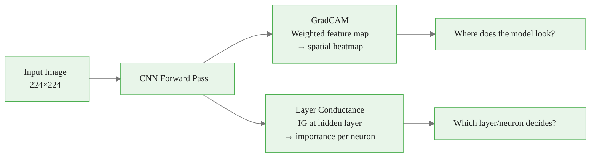
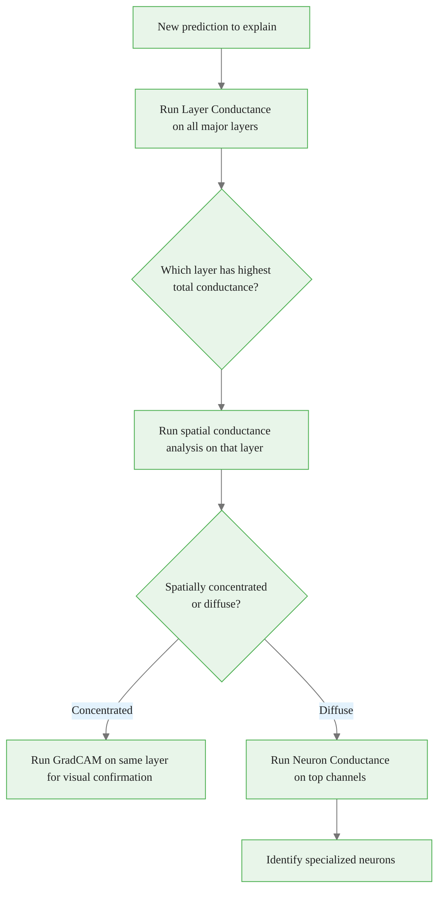

<!-- _class: lead -->

# Layer Conductance, Neuron Conductance & Internal Influence

## Module 03 — Layer & Neuron Attribution
### What Happens Inside the Network?

<!-- Speaker notes: This deck covers internal attribution — attributing predictions to intermediate layers and neurons rather than to input features. The key question is: in a 50-layer network, which layers do most of the "work" for a given prediction? Layer Conductance answers this with the same axiomatic guarantee as IG: completeness. The sum of conductance values across any single layer equals the total output difference. -->

---

# The Gap in Input Attribution

IG, GradCAM, Saliency all explain: **input → output**

But deep networks have 50+ layers of intermediate computation.

**Questions input attribution cannot answer:**
- Which layer makes the final decision?
- Are early layers or late layers most responsible?
- Which specific neurons drive the prediction?
- Does layer 3 matter at all for this input?

**Layer Conductance answers all of these.**

<!-- Speaker notes: The motivation for layer attribution is that deep networks are deep — there are many intermediate representations between input and output. Understanding which layers are critical is important for model debugging, compression (remove low-conductance layers), and mechanistic interpretability (understand what each layer computes). Layer Conductance provides this with the same completeness guarantee as IG. -->

<div class="callout-info">
This is a foundational concept for the rest of the module.
</div>
---

# Internal Influence: The Simple Baseline

For hidden unit $h_i$ in layer $l$, the output $y^c$:

$$\text{InternalInfluence}_i = \frac{\partial y^c}{\partial h_i^l}$$

Just the gradient of the output w.r.t. the hidden unit's activation.

```python
from captum.attr import InternalInfluence

ii = InternalInfluence(model, model.layer3[-1])
attr = ii.attribute(input_tensor, target=class_idx)
# attr: (1, 1024, 14, 14) — gradient at each neuron
```

**Problem:** same as saliency — ignores how much the neuron actually *changed*.

<!-- Speaker notes: Internal Influence is the simplest form of layer attribution. It's essentially saliency computed at an intermediate layer rather than the input. Just as saliency can saturate (zero gradient at a ReLU boundary even though the neuron was crucial), Internal Influence has the same saturation problem. A neuron with a very large activation change from baseline to input, but with zero gradient at the input point, would get zero internal influence even though it clearly contributed to the prediction. Layer Conductance solves this with integration. -->

<div class="callout-key">
This is the key takeaway from this section.
</div>
---

# Layer Conductance: IG at the Hidden Layer

For neuron $h_i$ in layer $l$:

$$\text{Cond}_i^l = \underbrace{(h_i(x) - h_i(x'))}_{\text{activation change}} \cdot \int_0^1 \frac{\partial y^c}{\partial h_i(x(\alpha))} \, d\alpha$$

Exactly the IG formula, applied at layer $l$ instead of the input.

**Completeness property** holds for *every layer*:

$$\sum_i \text{Cond}_i^l = f(x) - f(x')$$

This is remarkable: sum the conductance of any layer → get the same total.

<!-- Speaker notes: The completeness property across layers is the key insight. It means that no matter which layer you examine, summing the conductance values gives the same total prediction difference. This allows fair comparison across layers: you can directly compare "how much does layer3 contribute?" vs "how much does layer4 contribute?" without normalization. The mathematical foundation is the chain rule applied to the IG integral, which causes the integral to telescope through the network layers. -->

<div class="callout-warning">
Common misconception — read carefully.
</div>
---

# Conductance Across All Layers

```python
from captum.attr import LayerConductance

layers = {
    'layer1': model.layer1[-1],
    'layer2': model.layer2[-1],
    'layer3': model.layer3[-1],
    'layer4': model.layer4[-1],
}

layer_totals = {}
for name, layer in layers.items():
    lc = LayerConductance(model, layer)
    attr = lc.attribute(
        input_tensor, baselines=baseline,
        target=class_idx, n_steps=50
    )
    # Sum of all conductance values in this layer
    layer_totals[name] = attr.sum().item()

print(layer_totals)
# {'layer1': 0.03, 'layer2': 0.11, 'layer3': 0.24, 'layer4': 0.37}
```

Layer4 → highest conductance → primary decision layer for this image.

<!-- Speaker notes: The expected result for ResNet-50 on ImageNet is that layer4 has the highest conductance, confirming our understanding that the final residual block makes the semantic classification decision. However, this varies by task: for low-level visual tasks (detecting edges, colors), early layers may have comparable conductance. For fine-grained recognition tasks (distinguishing 120 dog breeds), layer3 often has substantial conductance because breed-distinguishing features (ear shape, coat color) are captured there. -->

<div class="callout-insight">
This insight connects theory to practice.
</div>
---

# Visualizing Layer Conductance

```python
# Bar chart: conductance by layer
names = list(layer_totals.keys())
values = list(layer_totals.values())

fig, axes = plt.subplots(1, 2, figsize=(14, 5))

# Layer totals
axes[0].bar(names, values, color=['#3498db', '#2ecc71', '#e67e22', '#e74c3c'])
axes[0].axhline(0, color='black', lw=0.8)
axes[0].set_ylabel('Total Signed Conductance')
axes[0].set_title('Layer Conductance — Which Layer Decides?')

# Spatial conductance heatmap for layer4
lc4 = LayerConductance(model, model.layer4[-1])
attr4 = lc4.attribute(input_tensor, baselines=baseline,
                       target=class_idx, n_steps=50)
spatial = attr4.abs().sum(1).squeeze().numpy()

axes[1].imshow(img_np)
axes[1].imshow(spatial / spatial.max(), alpha=0.6,
                cmap='hot', interpolation='bilinear')
axes[1].set_title('Layer4 Conductance — Spatial Map')
axes[1].axis('off')
```

<!-- Speaker notes: The two-panel visualization is standard for layer conductance analysis. The left panel shows the total conductance per layer as a bar chart, giving a quick summary of "which layer matters most." The right panel shows the spatial distribution of conductance within the most important layer, revealing which spatial regions within that layer are driving the decision. For ResNet-50 on a dog image, the spatial map should concentrate on the dog region. -->

---

# Neuron Conductance: Individual Neuron Importance

Layer Conductance → total importance of each layer.
Neuron Conductance → importance of a *single specific neuron*.

```python
from captum.attr import NeuronConductance

nc = NeuronConductance(model, model.layer4[-1])

# Conductance for neuron at channel=42, spatial=(3, 3)
neuron_attr = nc.attribute(
    input_tensor,
    neuron_selector=(42, 3, 3),  # (channel, h, w)
    target=class_idx,
    baselines=baseline,
    n_steps=50
)
# neuron_attr: (1, 3, 224, 224)
# What INPUT features caused THIS neuron to activate?
```

Neuron Conductance = "what did the input do to cause neuron 42 to fire?"

<!-- Speaker notes: Neuron Conductance is a two-level attribution: it answers the question "which input features caused this specific neuron to activate the way it did?" This is useful for mechanistic interpretability — understanding what individual neurons compute. A neuron with high conductance for "dog" that shows a Neuron Conductance map highlighting dog ears is a "dog ear detector." This kind of neuron dissection was popularized in the Network Dissection paper from MIT CSAIL. -->

---

# Finding the Most Important Neurons

```python
# Step 1: Get layer conductance to find high-conductance neurons
lc = LayerConductance(model, model.layer4[-1])
attr = lc.attribute(input_tensor, baselines=baseline,
                     target=class_idx, n_steps=50)

# Step 2: Find top neurons by absolute conductance
attr_flat = attr.abs().squeeze(0).view(-1)
top_idxs = attr_flat.topk(5).indices

C, H, W = attr.squeeze(0).shape
top_neurons = []
for flat_idx in top_idxs:
    c = (flat_idx // (H * W)).item()
    h = ((flat_idx % (H * W)) // W).item()
    w = ((flat_idx % (H * W)) % W).item()
    top_neurons.append((c, h, w, attr[0, c, h, w].item()))

print(f"Top neurons: {top_neurons}")
# Step 3: Use NeuronConductance to see what input features
# activate each top neuron
```

<!-- Speaker notes: The two-step process is the standard workflow for neuron analysis: first, use Layer Conductance to identify which neurons have the highest conductance for a given prediction; second, use Neuron Conductance on those top neurons to understand what input features they respond to. This workflow is efficient because you don't need to compute Neuron Conductance for all 2048×7×7 = 100,352 neurons — just the top few identified by Layer Conductance. -->

---

# Spatial Conductance Maps

For convolutional layers, conductance has spatial structure:

```python
# Layer3 spatial conductance (14×14 spatial grid)
lc3 = LayerConductance(model, model.layer3[-1])
attr3 = lc3.attribute(input_tensor, baselines=baseline,
                       target=class_idx, n_steps=50)

# Spatial importance: sum conductance across channels
spatial_3 = attr3.abs().sum(dim=1).squeeze()  # (14, 14)
channel_3 = attr3.abs().mean(dim=(-2,-1)).squeeze()  # (1024,)

# Upsample spatial map to image resolution
import torch.nn.functional as F
spatial_3_up = F.interpolate(
    spatial_3.unsqueeze(0).unsqueeze(0),
    (224, 224), mode='bilinear', align_corners=False
).squeeze()
```

The spatial map shows which image regions this layer cares about.
The channel map shows which learned features (channels) matter.

<!-- Speaker notes: The distinction between the spatial map and the channel map is important. The spatial map answers "where in the image is this layer computing important features?" The channel map answers "which of this layer's 1024 learned features are important?" These are complementary questions. A high spatial concentration with few important channels suggests the model has learned a localized but sparse representation at this layer. Diffuse spatial maps with many important channels suggest more distributed processing. -->

---

# Layer Conductance vs. GradCAM



| | GradCAM | Layer Conductance |
|--|--|--|
| Question | Where? | Which layer/neuron? |
| Completeness | No | Yes (every layer) |
| Spatial output | Yes | Yes (for conv layers) |
| Speed | Fast (1 pass) | n_steps passes |

<!-- Speaker notes: GradCAM and Layer Conductance are complementary. GradCAM is better for spatial localization and communication (it produces a clean overlay on the input image). Layer Conductance is better for quantitative analysis of which layer matters and which neurons are driving the prediction. In a complete interpretability analysis, you might use GradCAM first for rapid exploration, then Layer Conductance for rigorous attribution. -->

---

# Internal Representations: Completeness Check

Just as IG satisfies $\sum_i \text{IG}_i = f(x) - f(x')$,

Layer Conductance satisfies it for **every layer independently**:

```python
# Total prediction difference
with torch.no_grad():
    f_x = model(input_tensor)[0, class_idx].item()
    f_base = model(baseline)[0, class_idx].item()
total_diff = f_x - f_base
print(f"f(x) - f(x') = {total_diff:.4f}")

# Layer conductance sums
for name, total in layer_totals.items():
    print(f"Sum Cond({name}) = {total:.4f}")

# All should be approximately equal to total_diff
# (with small numerical error from n_steps approximation)
```

This cross-layer consistency is a built-in validation.

<!-- Speaker notes: The completeness check across layers is a powerful debugging tool. If the conductance sums disagree significantly across layers, it suggests a numerical issue (n_steps too low) or an architectural issue (skip connections may require special handling). In ResNet models with skip connections, the conductance should still sum correctly across the main pathway layers, but the skip connection paths also contribute and may need to be included for exact completeness. -->

---

# Residual Networks: Skip Connection Consideration

ResNet has skip connections: $y = \mathcal{F}(x) + x$

For Layer Conductance in ResNets, the target layer can be:
- The **residual block output** (includes skip connection)
- The **bottleneck conv** (only the main path)

```python
# Full residual block (includes skip connection identity path)
target = model.layer4[-1]           # Bottleneck output

# Only the last conv in the residual (main path only)
target = model.layer4[-1].conv3     # 1×1 projection conv

# The batch norm output (after conv, before ReLU)
target = model.layer4[-1].bn3
```

For ResNets, always target the full block output for completeness to hold properly.

<!-- Speaker notes: Skip connections in ResNets are an important edge case for layer attribution. The identity shortcut carries the input directly to the output, so layer attribution needs to account for both paths. When targeting a full BasicBlock or Bottleneck output, Captum includes both the residual path and the skip connection in the attribution, preserving completeness. If you target only an intermediate conv, you're only attributing the residual path, which breaks completeness. Always target the full block output for correct layer conductance in ResNets. -->

---

# Practical Workflow: Layer and Neuron Analysis



<!-- Speaker notes: The workflow diagram shows a systematic approach to layer analysis. Start with the broad question (which layer?), then drill down to spatial analysis, then to individual neurons if needed. This is a top-down investigation strategy: start coarse, then refine. The GradCAM confirmation step is valuable — if Layer Conductance says layer4 is most important and GradCAM on layer4 shows the correct object region, you have converging evidence from two independent methods. -->

---

# NeuronConductance: Visualizing What a Neuron Sees

```python
nc = NeuronConductance(model, model.layer4[-1])

# For top neuron identified by Layer Conductance
top_channel, top_h, top_w = 42, 3, 3

neuron_attr = nc.attribute(
    input_tensor,
    neuron_selector=(top_channel, top_h, top_w),
    target=class_idx, baselines=baseline, n_steps=50
)
# neuron_attr: (1, 3, 224, 224) — input attribution for this neuron

# Visualize: what input features caused this neuron to fire?
neuron_map = neuron_attr.abs().sum(1).squeeze().detach().numpy()
neuron_map = neuron_map / (neuron_map.max() + 1e-8)

plt.imshow(img_np)
plt.imshow(neuron_map, alpha=0.6, cmap='hot')
plt.title(f'What caused channel {top_channel} at ({top_h},{top_w}) to activate?')
plt.axis('off')
plt.show()
```

<!-- Speaker notes: The Neuron Conductance visualization is the most granular attribution you can get from Captum. It answers: "which pixels in the input caused this specific neuron to activate the way it did?" For a well-trained ImageNet model, neurons in layer4 often respond to class-specific features — the ear shape neuron highlights ear regions in its Neuron Conductance map, the texture neuron highlights texture regions, and so on. This is the foundation of mechanistic interpretability: understanding what each neuron "detects." -->

---

# Key Takeaways

1. **Internal Influence** = gradient of output w.r.t. hidden unit (fast, no integration, same issues as saliency)
2. **Layer Conductance** = IG applied at intermediate layers; completeness holds for every layer
3. **Neuron Conductance** = conductance for one neuron; shows which input features activate it
4. **Spatial conductance maps** reveal which spatial regions in a layer drive the prediction
5. **Completeness cross-check**: sum(Cond at any layer) ≈ f(x) - f(baseline)
6. **Workflow**: Layer Conductance first (which layer?) → Neuron Conductance (which neuron?) → GradCAM (where in image?)

<!-- Speaker notes: The key takeaways capture the hierarchy of layer attribution methods. Internal Influence is the fastest but least rigorous. Layer Conductance adds integration for correctness. Neuron Conductance drills down to individual units. The completeness cross-check is a built-in validation tool — using it routinely catches numerical issues early. The recommended workflow flows from coarse to fine: layer → neuron → spatial visualization. -->

---

<!-- _class: lead -->

# Next: Notebooks

### Notebook 01: GradCAM on ResNet-50 — visual class activation maps
### Notebook 02: Layer Conductance — finding the decision-making layer
### Notebook 03: Neuron Conductance — which neurons matter?

<!-- Speaker notes: The three notebooks implement the full layer attribution toolkit. Notebook 01 applies GradCAM visually across multiple layers and classes. Notebook 02 uses Layer Conductance to quantitatively compare which layers contribute most to various ImageNet predictions. Notebook 03 drills down to individual neurons, visualizing what each high-conductance neuron responds to using Neuron Conductance input attribution maps. -->
