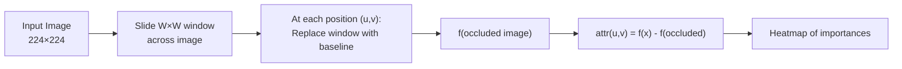
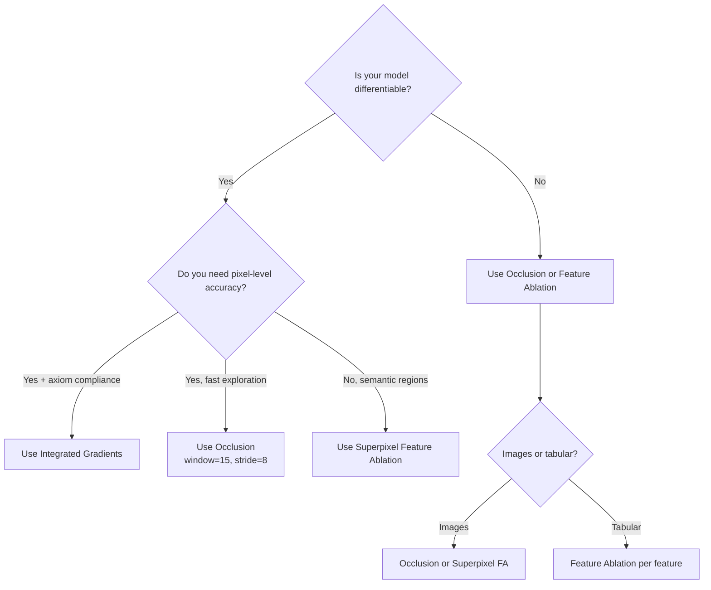

<!-- _class: lead -->

# Occlusion and Feature Ablation

## Module 04 — Perturbation Methods
### Model-Agnostic Attribution Without Gradients

<!-- Speaker notes: This module introduces the gradient-free side of interpretability. Perturbation methods are based on a simple counterfactual idea: if removing a feature changes the prediction, that feature matters. No gradients, no integration, no model-specific assumptions — just forward passes. The trade-off is computational cost. This deck covers Occlusion (sliding window) and Feature Ablation (arbitrary groups), with emphasis on when to prefer them over gradient methods. -->

---

# Why Perturbation Methods?

Gradient methods require a differentiable model. Perturbation methods don't.

```python
# Gradient methods: require backward()
attr = ig.attribute(input, ...)   # Needs autograd

# Perturbation methods: only need forward()
attr = occ.attribute(input, ...)  # Only model(x) calls
```

**Works on any model:**
- PyTorch, TensorFlow, scikit-learn
- XGBoost, LightGBM, CatBoost
- External APIs (no access to internals)
- Ensembles and stacked models

<!-- Speaker notes: The key differentiator is model-agnosticism. Perturbation methods are the only attribution approach that works on non-differentiable models. If you're explaining a random forest, a gradient boosted tree, or a model exposed via an API, perturbation methods are your only option. They're also useful for verifying gradient-based results: if IG says feature X is important and Occlusion agrees, you have strong convergent evidence. If they disagree, investigate why. -->

---

# The Perturbation Principle

For any feature $F_i$:

$$\text{Importance}(F_i) = f(x) - f(x \text{ with } F_i \text{ replaced by baseline})$$

**Interpretation:**
- Positive importance: removing $F_i$ *hurts* the prediction
- Zero: $F_i$ doesn't matter
- Negative: removing $F_i$ *helps* (the feature was causing confusion)

This is **causal**: directly measures the effect of feature presence/absence.

<!-- Speaker notes: The causal framing is important. Gradient methods measure local sensitivity — how the output changes with infinitesimal perturbations of a feature. Perturbation methods measure the full effect of removing a feature entirely, replaced by a baseline. These are different questions. Gradient sensitivity can be zero even for important features (saturation problem). Perturbation importance correctly captures large-scale feature contributions. -->

---

# Occlusion: Sliding Window Algorithm



**Cost:** $\lceil H/s \rceil \times \lceil W/s \rceil$ forward passes
- stride=8, window=15×15 → ~784 passes for 224×224

<!-- Speaker notes: The sliding window algorithm is conceptually simple but computationally expensive. For a 224×224 image with stride 8, you need about 784 forward passes, compared to just 50 for IG. However, Captum implements Occlusion with batching so all occluded versions are processed in a single batched inference call, which is much faster than sequential evaluation. On a GPU, 784 passes with a small batch size might take only 2-3 seconds for ResNet-50. -->

---

# Occlusion in Captum

```python
from captum.attr import Occlusion

occ = Occlusion(model)

attributions = occ.attribute(
    input_tensor,                    # (1, 3, 224, 224)
    strides=(3, 8, 8),               # (C, H, W) strides
    target=class_idx,
    sliding_window_shapes=(3, 15, 15),  # (C, H, W) window
    baselines=0                      # Black pixel baseline
)
# Output: (1, 3, 224, 224)
```

**Key parameters:**
- `strides=(3, s, s)` — 3 means "all channels at once" (full pixel occlusion)
- `sliding_window_shapes=(3, W, W)` — window covers all color channels
- `baselines=0` — replace with black pixels (or any scalar/tensor)

<!-- Speaker notes: The parameter naming in Captum's Occlusion can be confusing. The strides parameter uses (3, s, s) not (1, s, s) because we want to occlude all three color channels simultaneously at each spatial location. Using strides=(1, s, s) would occlude only one channel at a time, producing three heatmaps. The sliding_window_shapes=(3, W, W) means the window covers the full depth of the image. This is the standard configuration for image classification. -->

---

# Occlusion Resolution vs. Cost

| Window | Stride | Passes | Resolution |
|--------|--------|--------|------------|
| 7×7 | 3 | ~5,600 | High — precise pixel |
| 15×15 | 8 | ~784 | Medium — good object |
| 30×30 | 15 | ~225 | Low — approximate |

```python
# Quick exploration: coarse window
fast_attr = occ.attribute(
    input_tensor, strides=(3, 15, 15), target=class_idx,
    sliding_window_shapes=(3, 30, 30)  # ~225 passes
)

# Publication quality: fine window
precise_attr = occ.attribute(
    input_tensor, strides=(3, 3, 3), target=class_idx,
    sliding_window_shapes=(3, 7, 7)    # ~5,600 passes
)
```

<!-- Speaker notes: The resolution-cost trade-off is important to calibrate for your use case. For rapid exploration during model development, use a coarse window (30×30, stride 15) — this gives ~225 passes and takes under 1 second on GPU. For communication or documentation, use a fine window (7×7, stride 3) — this takes ~5,600 passes but produces crisp, pixel-accurate heatmaps. For most practical purposes, the medium setting (15×15, stride 8) is the best balance. -->

---

# Interpreting Occlusion Heatmaps

<div class="columns">

**High positive attribution:**
Occluding this region significantly drops confidence.
→ This region is crucial.

**Near-zero attribution:**
Occluding barely changes confidence.
→ This region doesn't matter for this prediction.

</div>

<div class="columns">

**Negative attribution:**
Occluding *increases* confidence.
→ This region is confusing the model!
→ May indicate spurious background correlation.

```python
# Show positive and negative separately
pos = torch.relu(attributions)    # Helpful regions
neg = torch.relu(-attributions)   # Confusing regions
```

</div>

<!-- Speaker notes: Negative attribution in Occlusion is particularly informative. It means the model's confidence for the target class actually increases when you remove that region. This is a signal that the model is being "confused" by that region — it may be a background region that looks similar to another class, or a spurious correlation from training data. Always visualize both positive and negative attribution regions when debugging models. -->

---

# Feature Ablation: Beyond Rectangular Windows

Occlusion = Feature Ablation with rectangular sliding-window groups.

`FeatureAblation` supports **any** feature grouping:

```python
from captum.attr import FeatureAblation

fa = FeatureAblation(model)

# With superpixel mask (more natural for images)
mask = get_slic_superpixels(img_np)  # (1, 1, 224, 224) int mask
attr = fa.attribute(
    input_tensor, target=class_idx,
    baselines=0, feature_mask=mask
)
# Each superpixel gets one importance value
```

Superpixels group semantically similar pixels together — result is a cleaner heatmap.

<!-- Speaker notes: Superpixel-based Feature Ablation is often preferable to rectangular Occlusion for images because the feature groups are semantically meaningful. A superpixel might correspond to a dog's ear, its body, the background grass, etc. When you ablate a superpixel, you're asking "does the ear region matter?" rather than "does this arbitrary 15×15 rectangle matter?" The number of superpixels (n_segments) controls the granularity: more superpixels = finer resolution but more forward passes. -->

---

# Superpixel Feature Ablation Code

```python
from skimage.segmentation import slic
import torch

def get_superpixel_mask(image_np, n_segments=50):
    """
    image_np: ndarray (H, W, 3) in [0, 1]
    Returns: Tensor (1, 1, H, W) of integer group IDs
    """
    segs = slic(image_np, n_segments=n_segments,
                compactness=10, start_label=0)
    return torch.tensor(segs, dtype=torch.long).unsqueeze(0).unsqueeze(0)

# Apply FeatureAblation with superpixels
mask = get_superpixel_mask(img_np, n_segments=50)
fa = FeatureAblation(model)
attr = fa.attribute(
    input_tensor, target=class_idx,
    baselines=0, feature_mask=mask
)
# n_segments forward passes (50 for 50 superpixels)
```

**Cost: n_segments forward passes** — much cheaper than pixel-level occlusion.

<!-- Speaker notes: The major efficiency advantage of superpixel Feature Ablation is that it requires only as many forward passes as there are superpixels. With 50 superpixels, you need exactly 50 forward passes, compared to 784 for medium-resolution Occlusion. The trade-off is that you lose sub-superpixel resolution — you can't distinguish the importance of individual pixels within a superpixel. For most image explanation tasks where the object is larger than a superpixel, this trade-off is acceptable. -->

---

# Feature Ablation for Tabular Data

For tabular models, each feature is a natural ablation unit:

```python
# Wine quality model: 11 features → quality score
fa = FeatureAblation(wine_model)
attr = fa.attribute(
    wine_sample,          # (1, 11)
    baselines=X_mean,     # "Typical wine" baseline
    target=None           # Regression: no target class
)
# attr: (1, 11) — one score per feature

# Visualize: most important features
names = ['alcohol', 'sulphates', 'pH', ...]
importance = attr.squeeze().detach().numpy()
sorted_idx = importance.argsort()

plt.barh([names[i] for i in sorted_idx],
          importance[sorted_idx],
          color=['#2ecc71' if v >= 0 else '#e74c3c'
                 for v in importance[sorted_idx]])
plt.title('Feature Ablation Importances')
```

<!-- Speaker notes: Feature Ablation for tabular data is conceptually identical to input-level IG on tabular data, but uses direct measurement instead of gradient integration. The result is often similar for well-behaved models, but can differ when features are highly non-linear or have interaction effects. Feature Ablation is more trustworthy for tabular data with strong feature interactions because it measures the actual effect of removing each feature rather than a linear approximation along a path. -->

---

# Occlusion vs. IG: Decision Guide



<!-- Speaker notes: The decision guide captures when to use each method. The primary split is differentiability: if the model is not differentiable, perturbation methods are the only option. For differentiable models, the choice depends on the use case. IG is faster and axiomatically sound for per-pixel attribution. Occlusion is slower but model-agnostic and captures non-linear feature interactions exactly. Superpixel FA is the best option when you want semantically meaningful feature groups without the cost of full pixel-level occlusion. -->

---

# Baseline Selection for Perturbation Methods

Same principles as IG:

```python
# Images
baselines_zero   = 0              # Black pixel — "no information"
baselines_mean   = 0.5            # Mean grey — "average pixel"
baselines_custom = img.mean()     # Image mean — "overall brightness"

# Tabular
baselines_train_mean = torch.tensor(X_train.mean(0))  # Typical sample
baselines_zero       = torch.zeros(1, n_features)      # Absence

# Text (token IDs)
baselines_pad  = torch.zeros_like(input_ids)           # [PAD] tokens
```

**Key difference from IG:** In Occlusion, `baselines` fills the *occluded window*, not the whole image. The rest of the image is unchanged.

<!-- Speaker notes: The baseline in Occlusion fills only the occluded window, not the whole image. This is different from IG where the baseline is the reference for the entire input. The choice of what to fill the window with is the baseline decision: 0 (black) means "no pixel here," image mean means "average pixel," and blurred region means "local average." Using 0 is standard for most applications. Using the local mean of the surrounding pixels is a more sophisticated choice that reduces the distribution shift caused by the occlusion. -->

---

# Postprocessing Occlusion Maps

```python
import numpy as np

# Step 1: Extract attributions
attr = occ.attribute(input_tensor, strides=(3, 8, 8),
                      target=cls, sliding_window_shapes=(3, 15, 15))

# Step 2: Aggregate color channels
# Use abs+mean for overall importance
heatmap = attr.abs().mean(dim=1).squeeze().detach().cpu().numpy()

# Step 3: Percentile normalization (robust to outliers)
p1, p99 = np.percentile(heatmap, 1), np.percentile(heatmap, 99)
heatmap = np.clip((heatmap - p1) / (p99 - p1 + 1e-8), 0, 1)

# Step 4: Visualize
plt.imshow(img_np)
plt.imshow(heatmap, alpha=0.6, cmap='hot', vmin=0, vmax=1)
plt.title(f'Occlusion — {label}')
plt.axis('off')
plt.colorbar()
```

<!-- Speaker notes: The postprocessing pipeline is important for getting clean visualizations. The abs+mean step collapses the (3, H, W) attribution to (H, W) by taking the magnitude. The percentile normalization clips outliers — individual pixels can have very high attribution scores due to local image patterns, and normalizing to [1st, 99th] percentile prevents a few outliers from washing out the rest of the heatmap. The colormap 'hot' (black → red → yellow → white) is good for attribution maps where 0 means "unimportant." -->

---

# Key Takeaways

1. **Perturbation methods** = model-agnostic attribution by measuring f(x) - f(x with feature removed)
2. **Occlusion** slides a rectangular window; cost = HW/stride² forward passes
3. **Feature Ablation** = generalization to any feature grouping (superpixels, tabular, etc.)
4. **Negative attribution** = the model was confused by this region (removing it helps!)
5. **Superpixel FA** = fewer passes, semantically coherent groups
6. **Use perturbation when:** model not differentiable, verifying gradient results, need causal attribution

<!-- Speaker notes: The six key takeaways. Perturbation methods are the foundation of model-agnostic interpretability. Their conceptual simplicity makes them easy to explain to non-technical stakeholders: "we hid different parts of the image and measured how much the prediction changed." Their computational cost is the main limitation, but GPU batching makes them practical for most use cases. The negative attribution insight is underused — it's one of the most informative diagnostic tools for identifying spurious correlations. -->

---

<!-- _class: lead -->

# Next: Guide 02 & Notebooks

### Guide 02: Shapley Values and Permutation Feature Importance
### Notebook 01: Occlusion on medical imaging
### Notebook 02: Feature Ablation for tabular data

<!-- Speaker notes: Guide 02 covers Shapley Value Sampling, which provides an axiomatic foundation for perturbation-based attribution through cooperative game theory. It's more expensive than Occlusion but more theoretically principled. The notebooks apply Occlusion and Feature Ablation to concrete use cases: medical imaging (where explainability is critical for clinical use) and tabular wine quality data (where feature importance is the primary deliverable). -->
