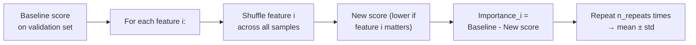

<!-- _class: lead -->

# Shapley Values and Permutation Feature Importance

## Module 04 — Perturbation Methods
### Game-Theoretic Fair Attribution

<!-- Speaker notes: Shapley values are the crown jewel of interpretability theory. They provide the unique mathematically fair attribution — the only method satisfying all four of the cooperative game theory axioms simultaneously. This makes them particularly compelling for regulatory and high-stakes applications where you need to justify why a feature was attributed a specific importance score. The practical challenge is computational cost, which is addressed by sampling approximations. -->

---

# Attribution as a Cooperative Game

**Players:** features $F_1, F_2, \ldots, F_n$

**Game:** the prediction $f(x) - f(x')$

**Question:** How much did each player (feature) contribute to the total payoff?

**Shapley's answer (1953):** The unique fair division is:

$$\phi_i = \sum_{S \subseteq N \setminus \{i\}} \frac{|S|!(n-|S|-1)!}{n!} \left[v(S \cup \{i\}) - v(S)\right]$$

$\phi_i$ = average marginal contribution of feature $i$ across all orderings.

<!-- Speaker notes: The cooperative game theory framing is the right way to think about Shapley values. The key intuition is: imagine randomly ordering all features and adding them one by one. Each time we add feature i, we measure how much the prediction changes. The Shapley value of feature i is the average of this marginal contribution across all possible orderings. This averaging is what makes Shapley values fair: it considers every possible context in which a feature might be evaluated. -->

---

# The Four Shapley Axioms

These are the ONLY attribution values satisfying all four:

| Axiom | Statement |
|-------|-----------|
| **Efficiency** | $\sum_i \phi_i = f(x) - f(x')$ — attributions sum to prediction difference |
| **Symmetry** | Equal contributors get equal attribution |
| **Dummy** | Irrelevant features get zero attribution |
| **Additivity** | Attribution is additive across independent submodels |

**No other attribution method satisfies all four simultaneously.**
(IG satisfies Efficiency and Sensitivity but not Symmetry.)

<!-- Speaker notes: The four axioms are worth understanding individually. Efficiency is the completeness property we saw in IG. Symmetry says that if two features have identical effects on every coalition, they should get the same attribution — this is a fairness condition that rules out many ad-hoc methods. Dummy ensures features that have zero effect get zero attribution — obvious, but important to state formally. Additivity allows Shapley values to decompose cleanly when models are sums of sub-models. The uniqueness result (that only Shapley values satisfy all four) is the key theoretical achievement. -->

---

# Why Not Exact Computation?

$$\phi_i = \frac{1}{n!} \sum_{\text{orderings}} \text{marginal}(i, \text{ordering})$$

For $n$ features: $n!$ orderings, but also $2^n$ unique coalitions.

| Features | Subsets | Time (1ms/eval) |
|----------|---------|-----------------|
| 10 | 1,024 | 1 second |
| 20 | 1,048,576 | 17 minutes |
| 50 | $1.1 \times 10^{15}$ | 35 million years |

**Solution: Monte Carlo Sampling**

Sample random orderings, estimate average marginal contribution.

<!-- Speaker notes: The exponential explosion of subsets is the fundamental challenge. For 11 tabular features (wine dataset), 2^11 = 2048 model calls is feasible. For a 100-feature model, 2^100 is completely infeasible. The Monte Carlo sampling approach solves this by averaging marginal contributions from randomly sampled orderings rather than all orderings. With n_samples random orderings, the standard error decreases as 1/sqrt(n_samples), so 100 samples gives a reasonable estimate and 500 samples gives a very accurate one. -->

---

# ShapleyValueSampling in Captum

```python
from captum.attr import ShapleyValueSampling

svs = ShapleyValueSampling(model)

attr = svs.attribute(
    input_tensor,       # (1, n_features)
    baselines=baseline, # Reference value
    target=class_idx,   # Target class
    n_samples=200       # Monte Carlo samples
)
# Cost: n_features × n_samples forward passes

# Variance decreases as 1 / sqrt(n_samples)
# n_samples=25:  fast, higher variance
# n_samples=200: slower, suitable for reporting
# n_samples=500: publication quality
```

<!-- Speaker notes: The n_samples parameter controls the bias-variance trade-off. With n_samples=25 (the default), you get a rough estimate suitable for rapid exploration. With n_samples=200, the estimate is good enough for model comparison and documentation. For paper-quality results or regulatory reporting, use n_samples=500 or more. The computational cost scales linearly with n_samples, so doubling the samples doubles the time but halves the standard error. -->

---

# Shapley Values vs. IG: Key Difference

**IG:** attributes along a straight line from baseline to input.

**Shapley:** considers ALL possible feature coalitions.

```python
# Example: Feature interaction
# A matters ONLY when B is present: f(A,B) = A*B
# IG at typical input (A=2, B=3), baseline (0, 0):
ig_A  = ?  # Depends on gradient at midpoint
ig_B  = ?

# Shapley (correct):
# Coalitions: {}, {A}, {B}, {A,B}
# phi_A = 0.5 * [f(A) - f()] + 0.5 * [f(A,B) - f(B)]
#        = 0.5 * [0 - 0] + 0.5 * [6 - 0] = 3.0
# phi_B = similarly = 3.0  (symmetric: B matters only when A present)
```

Shapley captures that **both A and B deserve equal credit** — IG may not.

<!-- Speaker notes: The feature interaction example is key to understanding when Shapley values are preferable to IG. For f(A,B) = A*B with inputs (2,3) and baseline (0,0): the gradient at any point on the straight-line path is (B_alpha, A_alpha) where alpha interpolates. IG would give attr_A = integral(B_alpha d_alpha) = integral(3*alpha d_alpha) = 3*0.5 = 1.5, not 3.0. Shapley correctly gives attr_A = 3.0 because it considers the coalition {A} where A has zero effect (since B=0 in that coalition) and the coalition {A,B} where adding A changes the output by 6. The averaging gives the "right" answer from a fairness perspective. -->

---

# Permutation Feature Importance: Global View

Local methods explain one prediction.
Permutation Feature Importance explains the model across a dataset.



No baseline value needed — permuting *breaks the relationship* without replacing the feature.

<!-- Speaker notes: Permutation Feature Importance is conceptually elegant because it doesn't require a baseline value. Instead of replacing the feature with a reference value, it randomizes the relationship between the feature and the prediction by shuffling the feature values across samples. A feature that matters will see performance drop significantly when its values are shuffled (because the correct value is no longer aligned with the other features). A feature that doesn't matter won't show any drop. The n_repeats parameter controls variance: run multiple permutations per feature to get error bars. -->

---

# Permutation Importance vs. Occlusion

<div class="columns">

**Permutation Importance (global)**
- Measures importance across all validation samples
- No baseline needed
- Captures real feature distribution
- Result: "feature X is important for this model"

```python
# For the whole dataset
perm_imp = permutation_importance(
    model, X_val, y_val,
    n_repeats=10
)
```

</div>

<div class="columns">

**Occlusion (local)**
- Measures importance for one specific input
- Requires baseline
- Captures local feature effect
- Result: "region X matters for *this* prediction"

```python
# For one specific image
occ_attr = occ.attribute(
    one_image, target=cls,
    sliding_window_shapes=(3,15,15)
)
```

</div>

<!-- Speaker notes: The local vs global distinction is crucial. Occlusion and Shapley values give you per-prediction attribution: this feature is important for explaining THIS prediction. Permutation Feature Importance gives you model-level attribution: this feature is important for the model's predictions across the entire validation set. Use local methods for debugging individual predictions and explaining decisions to end users. Use global methods for model evaluation, feature selection, and regulatory reporting about model behavior across the population. -->

---

# SHAP vs. Captum Shapley

<div class="columns">

**Captum ShapleyValueSampling**
- PyTorch-native, integrates with `nn.Module`
- Handles GPU tensors natively
- Works with any differentiable model
- Use in production PyTorch pipelines

```python
from captum.attr import ShapleyValueSampling
svs = ShapleyValueSampling(model)
```

</div>

<div class="columns">

**shap library (Lundberg et al.)**
- Works with XGBoost, sklearn, TF, PyTorch
- TreeSHAP: exact Shapley for trees
- More mature visualization tools
- Use for cross-framework comparisons

```python
import shap
explainer = shap.KernelExplainer(
    model_fn, background
)
```

</div>

Both converge to the same Shapley values with enough samples.

<!-- Speaker notes: In practice, if you're working purely in PyTorch, Captum is the better choice because it handles GPU tensors natively and integrates cleanly with nn.Module. If you need to compare across different model types (neural network vs. XGBoost for the same task), the shap library is more convenient because it has a unified API across frameworks. For tree models, TreeSHAP from the shap library computes exact Shapley values in polynomial time, which is much faster than sampling approximations. -->

---

# Convergence Check for Shapley Estimates

```python
import numpy as np

prev_attr = None
for n_samp in [25, 50, 100, 200]:
    attr = svs.attribute(x, baselines=bl,
                          target=cls, n_samples=n_samp)
    attr_np = attr.squeeze().detach().numpy()

    if prev_attr is not None:
        max_delta = np.abs(attr_np - prev_attr).max()
        print(f"n_samples={n_samp:4d}: max change = {max_delta:.5f}")
        if max_delta < 0.01:
            print(f"  Converged!")
            break

    prev_attr = attr_np
```

Stop when max change between successive runs < threshold (e.g., 0.01).

<!-- Speaker notes: The convergence check is analogous to the convergence delta check in IG, but for variance rather than numerical integration error. Run Shapley sampling with increasing n_samples until the maximum change in any feature's attribution drops below your tolerance threshold. This is a principled way to determine how many samples you need for your specific model and dataset, rather than using a fixed value. For simple models with few features, 25-50 samples may be sufficient. For complex models with many interacting features, 200-500 may be needed. -->

---

# Complete Attribution Comparison

| Method | Type | Axioms | Model-agnostic | Cost | Best for |
|--------|------|--------|----------------|------|---------|
| Saliency | Gradient | None | No | 1 pass | Quick exploration |
| IG | Gradient | Completeness, Sensitivity | No | n_steps | Per-pixel accuracy |
| GradCAM | Gradient | None | No | 1 pass | CNN spatial localization |
| Layer Cond. | Gradient | Completeness | No | n_steps | Which layer decides? |
| Occlusion | Perturbation | None | Yes | HW/s² | Non-differentiable models |
| Shapley | Perturbation | All 4 | Yes | n×n_samp | Fairest attribution |
| Perm. Imp. | Perturbation | None | Yes | n×n_rep | Global importance |

<!-- Speaker notes: This comparison table is the course's master reference. Each method has its niche. The key insight is that there's no single "best" method — the choice depends on the model type (differentiable vs not), the use case (local vs global), the required rigor (axioms vs speed), and the output format (heatmap vs feature bar chart). In production, use at minimum two methods for any important attribution — converging evidence from both gradient and perturbation methods is much stronger than a single method. -->

---

# Key Takeaways

1. **Shapley values** satisfy four cooperative game theory axioms — uniquely fair attribution
2. **Exact computation** requires $2^n$ model calls; **ShapleyValueSampling** approximates with $n \times n\_\text{samples}$ passes
3. **Shapley captures interactions** — IG does not (linear path approximation)
4. **Completeness** holds for Shapley values: $\sum \phi_i = f(x) - f(x')$
5. **Permutation Feature Importance** is the dataset-level counterpart — breaks feature-prediction relationship by shuffling
6. **Captum provides** `ShapleyValueSampling`, `KernelShap`, and `PermutationFeatureImportance`

<!-- Speaker notes: The six takeaways capture the core content. Shapley values are the most theoretically principled attribution method but the most computationally expensive. ShapleyValueSampling makes them practical with Monte Carlo approximation. The interaction-capturing property is what distinguishes Shapley from IG in practice — for tabular data with correlated or interacting features, Shapley will typically give more accurate attributions. Permutation Feature Importance is the go-to for global model understanding and feature selection decisions. -->

---

<!-- _class: lead -->

# Next: Notebooks

### Notebook 01: Occlusion on image classification
### Notebook 02: Feature Ablation on tabular data
### Notebook 03: Shapley Value Sampling comparison

<!-- Speaker notes: The three notebooks implement the full perturbation toolkit. Notebook 01 applies Occlusion to image classification, comparing it visually with IG. Notebook 02 uses Feature Ablation for tabular wine quality attribution, comparing per-sample and global importance. Notebook 03 runs Shapley Value Sampling and compares convergence as a function of n_samples, providing a complete comparison with IG for the same predictions. -->
