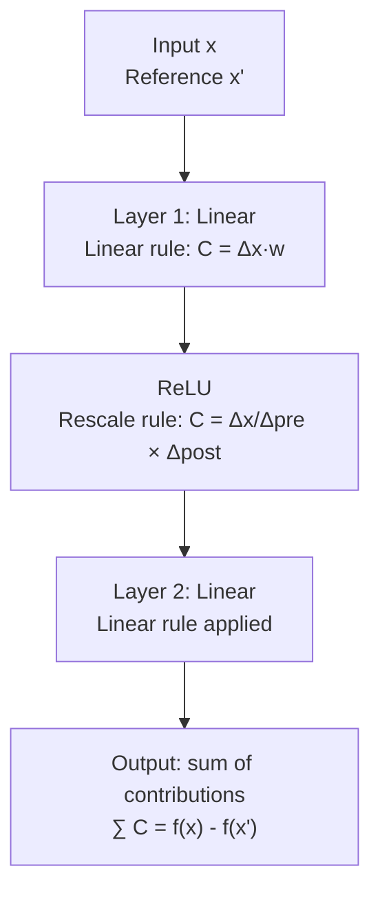

<!-- _class: lead -->

# GradientSHAP and DeepLIFT
## Fast Shapley Value Approximations for Neural Networks

Module 05 — SHAP and KernelSHAP in Captum

<!-- Speaker notes: This guide covers two neural-network-specific SHAP methods: GradientSHAP and DeepLIFT SHAP. Both leverage the differentiable structure of neural networks to compute approximate Shapley values much faster than KernelSHAP. We'll see when each is preferred and how to use them in Captum. -->

---

## The Speed Problem with KernelSHAP

KernelSHAP: $O(M \times n_{bg})$ model evaluations

| Model | Input size | KernelSHAP calls | Time |
|-------|-----------|-----------------|------|
| Tabular MLP | 20 features | 500 × 100 = 50,000 | ~2s |
| ResNet-50 | 224×224 image | 500 × 100 = 50,000 | ~5 min |
| BERT | 512 tokens | 500 × 100 = 50,000 | ~30 min |

**Neural networks demand faster alternatives** that exploit:
1. Differentiability (GradientSHAP uses gradients)
2. Layer structure (DeepLIFT propagates through layers)

<!-- Speaker notes: The speed problem is real. KernelSHAP requires hundreds of model evaluations to estimate Shapley values. For tabular models this is fine, but for image models requiring forward passes through ResNet, or BERT for text, this becomes prohibitively slow. GradientSHAP and DeepLIFT reduce this to tens of model evaluations by using the model's gradient information. -->

---

## GradientSHAP: IG Meets SHAP

**Integrated Gradients** (single baseline):
$$\text{IG}_i(x) = (x_i - x'_i) \int_0^1 \frac{\partial f(x' + \alpha(x-x'))}{\partial x_i} d\alpha$$

**GradientSHAP** (expectation over baselines):
$$\phi_i^{\text{GradSHAP}} = \mathbb{E}_{x' \sim \mathcal{D}_{bg},\, \alpha \sim U(0,1)} \left[\frac{\partial f(x' + \alpha(x-x'))}{\partial x_i} \cdot (x_i - x'_i)\right]$$

**Key difference:** SHAP takes the expectation over the baseline distribution — matching the Shapley value's expectation over coalitions.

<!-- Speaker notes: GradientSHAP is a natural extension of Integrated Gradients. IG uses a single baseline and integrates the gradient along the straight-line path. GradientSHAP takes this further by averaging over multiple baselines sampled from the background distribution. This expectation is what connects it to Shapley values — the background distribution substitutes for the coalition sampling in KernelSHAP. -->

---

## GradientSHAP Monte Carlo Estimation

**Algorithm:**
1. Sample $n$ baselines: $x'_1, \ldots, x'_n \sim \mathcal{D}_{bg}$
2. Sample interpolation points: $\alpha_k \sim U(0,1)$
3. Compute gradient at each interpolated input
4. Average the gradient × input-difference products

```python
# Conceptually (Captum handles this internally):
total_attribution = torch.zeros_like(x)
for k in range(n_samples):
    x_prime = background[np.random.randint(len(background))]
    alpha = np.random.uniform(0, 1)
    x_interp = x_prime + alpha * (x - x_prime)
    x_interp.requires_grad_(True)
    grad = torch.autograd.grad(model(x_interp)[target], x_interp)[0]
    total_attribution += grad * (x - x_prime)
attributions = total_attribution / n_samples
```

<!-- Speaker notes: The Monte Carlo estimation is straightforward. For each sample, we pick a random baseline and a random interpolation scalar alpha, compute the gradient at the interpolated point, multiply by the input difference, and accumulate. With enough samples, this converges to the expected value which approximates the Shapley value. In practice, 50-200 samples is usually sufficient for stable estimates. -->

---

## GradientSHAP in Captum

```python
import torch
from captum.attr import GradientShap

model.eval()
grad_shap = GradientShap(model)

# Multiple background samples
background = X_train[:100]  # (100, num_features)
x_test = X_test[[0]]        # (1, num_features)

# Compute attributions with convergence check
attributions, delta = grad_shap.attribute(
    inputs=x_test,
    baselines=background,
    target=class_idx,
    n_samples=50,
    return_convergence_delta=True,
)

print(f"Max |δ|: {delta.abs().max().item():.4f}")
# Good: < 0.01. If > 0.1, increase n_samples
```

<!-- Speaker notes: Captum's GradientShap API is simple. Pass your background as the baselines argument — Captum will sample from them during Monte Carlo estimation. The convergence delta checks how well the attributions satisfy the efficiency axiom. A small delta means the attributions sum closely to f(x) minus E[f(x')], which is what we want. If delta is large, increase n_samples. -->

---

## The Saturation Problem

Why gradients fail at saturation:

```
Input x = 5.0,  Reference x' = 0.0
Activation: sigmoid

σ(5.0) ≈ 0.993  (deeply saturated)
σ(0.0) = 0.500  (reference)

Gradient at x=5: σ'(5) = σ(5)(1-σ(5)) ≈ 0.007
Gradient attribution: 0.007 × (5-0) = 0.035 ← tiny!

Actual change in output: 0.993 - 0.500 = 0.493 ← large!
```

**Problem:** Gradient says "this feature barely matters" when it clearly matters a lot. Saturation kills the gradient signal.

<!-- Speaker notes: This is the fundamental motivation for DeepLIFT. When a neuron saturates — meaning its input is far into the flat region of sigmoid or ReLU — the gradient approaches zero. But the neuron's activation is very far from its reference value, meaning it IS important. Gradient methods systematically underattribute saturated neurons. DeepLIFT was designed specifically to fix this. -->

---

## DeepLIFT: Reference Activation Differences

**Core idea:** Use activation *differences* instead of gradients.

$$\Delta h_l = h_l(x) - h_l(x')$$

**DeepLIFT rule for saturated neuron:**

$$C_{\Delta x_i \Delta y} = \frac{\Delta x_i}{\Delta h_{\text{pre-act}}} \cdot \Delta h_{\text{post-act}}$$

For our sigmoid example:
$$C = \frac{(5.0 - 0.0)}{(5.0 - 0.0)} \times (0.993 - 0.500) = 1.0 \times 0.493 = 0.493$$

**Result:** Correct attribution even when gradient vanishes.

<!-- Speaker notes: DeepLIFT's rescale rule divides the activation difference by the input difference to get a "contribution per unit input change," then multiplies by the actual output change. For our saturated sigmoid, the input changed by 5 and the output changed by 0.493, giving an attribution of 0.493. Compare this to the gradient method's 0.035. DeepLIFT correctly identifies the saturated feature as highly important. -->

---

## DeepLIFT Propagation Rules



**Summation-to-delta:** Contributions always sum exactly to $f(x) - f(x')$.

This is DeepLIFT's version of the efficiency axiom — guaranteed by construction.

<!-- Speaker notes: DeepLIFT propagates through the network layer by layer using specific rules for each layer type. Linear layers use the standard linear rule. Nonlinear activations use the rescale rule. The propagation maintains the invariant that contributions sum to the total output difference. This is guaranteed by construction — unlike GradientSHAP where efficiency is only approximate. -->

---

## DeepLIFT in Captum

```python
from captum.attr import DeepLift

model.eval()
deep_lift = DeepLift(model)

# Single reference baseline
baseline = torch.zeros(1, num_features)       # zero baseline
# baseline = X_train.mean(dim=0, keepdim=True) # mean baseline

attributions, delta = deep_lift.attribute(
    inputs=x_test,
    baselines=baseline,
    target=class_idx,
    return_convergence_delta=True,
)

# delta should be extremely small (near machine precision)
assert delta.abs().max().item() < 1e-4, "DeepLIFT efficiency check failed"
```

**Note:** Unlike GradientSHAP, DeepLIFT's convergence delta should be near machine precision — not just small.

<!-- Speaker notes: DeepLIFT in Captum is clean. The key difference from GradientSHAP is that you provide a single baseline, not a distribution. And the convergence delta should be near machine precision, not just small — because efficiency is an exact property of DeepLIFT's propagation, not an approximation. If delta is large, something is wrong with the model architecture compatibility. -->

---

## DeepLIFT SHAP: Both Approaches Combined

**DeepLIFT SHAP** = DeepLIFT propagation + SHAP's expectation over baselines

$$\phi_i^{\text{DL-SHAP}} = \frac{1}{n_{bg}} \sum_{k=1}^{n_{bg}} C_{\Delta x_i \Delta y}(x, x'_k)$$

Run DeepLIFT once per background sample, then average.

```python
from captum.attr import DeepLiftShap

deep_lift_shap = DeepLiftShap(model)

# Multiple backgrounds → better Shapley approximation
background = X_train[:50]  # (50, num_features)

attributions, delta = deep_lift_shap.attribute(
    inputs=x_test,
    baselines=background,
    target=class_idx,
    return_convergence_delta=True,
)
```

<!-- Speaker notes: DeepLIFT SHAP is the combination — run DeepLIFT with each background sample as the reference, then average. This gives the efficiency of DeepLIFT's propagation with SHAP's principled baseline expectation. It's the recommended method when your model architecture is compatible with DeepLIFT — standard ReLU networks, CNNs, etc. For Transformer models, use GradientSHAP instead. -->

---

## Method Comparison: Same Input

```python
# All three methods on identical input/background
input_x = X_test[[0]]
backgrounds = X_train[:50]

methods = {
    "KernelSHAP":    KernelShap(model).attribute(input_x, backgrounds, n_samples=200),
    "GradientSHAP":  GradientShap(model).attribute(input_x, backgrounds, n_samples=50),
    "DeepLIFT SHAP": DeepLiftShap(model).attribute(input_x, backgrounds),
}

# Plot comparison
fig, axes = plt.subplots(3, 1, figsize=(10, 12))
for ax, (name, attrs) in zip(axes, methods.items()):
    ax.barh(feature_names, attrs.squeeze().numpy())
    ax.set_title(name)
plt.tight_layout()
```

Expected: all three should largely agree on top features, with minor differences.

<!-- Speaker notes: A good sanity check is to run all three methods on the same input and compare. For well-behaved models, they should agree on which features are most important, though the exact values will differ. Large disagreements indicate either model behavior that one method handles poorly (e.g., saturation confusing gradient methods) or that the background distribution is poorly chosen. -->

---

## When to Use Which Method

| Situation | Recommended Method | Why |
|-----------|-------------------|-----|
| Tabular model, any architecture | GradientSHAP or DeepLIFT SHAP | Both fast and accurate |
| Standard CNN (ReLU) | DeepLIFT SHAP | Exact efficiency, handles saturation |
| Transformer / BERT | GradientSHAP | DeepLIFT not compatible with attention |
| Custom activations (GELU, SiLU) | GradientSHAP | DeepLIFT rules undefined |
| Black-box / non-differentiable | KernelSHAP | Only option |
| Need exact Shapley values | KernelSHAP with large n_samples | Theoretical guarantee |

<!-- Speaker notes: The decision tree is straightforward. If your model uses standard layers and activations, DeepLIFT SHAP is often the best choice — it's fast, handles saturation, and has the efficiency guarantee. For Transformer models or custom architectures, use GradientSHAP. Only fall back to KernelSHAP when the model is non-differentiable or you need the theoretical Shapley guarantees. -->

---

## Visualization: Comparing Methods Side by Side

```python
import matplotlib.pyplot as plt
import matplotlib.gridspec as gridspec

fig = plt.figure(figsize=(15, 6))
gs = gridspec.GridSpec(1, 3)

method_names = ["GradientSHAP", "DeepLIFT", "DeepLIFT SHAP"]
all_attrs = [gs_attrs, dl_attrs, dl_shap_attrs]

for i, (name, attrs) in enumerate(zip(method_names, all_attrs)):
    ax = fig.add_subplot(gs[i])
    vals = attrs.squeeze().detach().numpy()
    colors = ["#d73027" if v > 0 else "#4575b4" for v in vals]
    ax.barh(feature_names, vals, color=colors)
    ax.axvline(0, color="k", lw=0.8)
    ax.set_title(name, fontweight="bold")
    ax.set_xlabel("Attribution (φᵢ)")

plt.suptitle("SHAP Methods Comparison", fontsize=14, fontweight="bold")
plt.tight_layout()
```

<!-- Speaker notes: This visualization pattern — side-by-side horizontal bar charts — is the standard way to compare attribution methods. Red bars are positive attributions (push toward the predicted class), blue bars are negative. The pattern of agreement and disagreement between methods is informative. Strong agreement across methods means high confidence in the attribution; disagreement flags areas to investigate further. -->

---

## Summary

<div class="columns">

**GradientSHAP**
$$\phi_i = \mathbb{E}_{x',\alpha}\left[\nabla_{x_i} f \cdot (x_i - x'_i)\right]$$
- Works with any differentiable model
- Monte Carlo sampling over baselines
- Approximate efficiency
- Best for Transformers, custom models

**DeepLIFT SHAP**
$$\phi_i = \mathbb{E}_{x'}\left[C_{\Delta x_i \Delta y}(x, x')\right]$$
- Handles activation saturation
- Exact efficiency guarantee
- Requires standard layer types
- Best for CNNs, tabular MLPs

</div>

**Both**: faster than KernelSHAP, need background distribution, approximate Shapley values

<!-- Speaker notes: To summarize: GradientSHAP and DeepLIFT SHAP are complementary methods. GradientSHAP is more general and works anywhere you can compute gradients. DeepLIFT SHAP is more theoretically sound for networks with saturation effects. Both require a background distribution and produce approximate Shapley values. Both are significantly faster than KernelSHAP for neural networks. Choose based on your model architecture. -->

---

<!-- _class: lead -->

## Next: Comparing All SHAP Methods

**Notebook 01:** `01_kernelshap_vs_gradientshap.ipynb`

Hands-on benchmarking of accuracy vs. speed trade-offs

<!-- Speaker notes: Now that you understand the theory, the first notebook benchmarks all three methods on the same model and data. You'll time each method, compare attributions quantitatively, and develop intuition for when each is appropriate. -->
