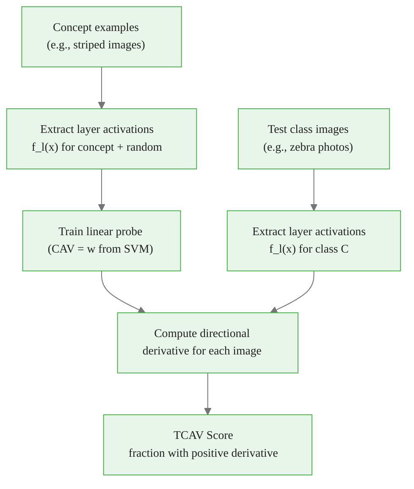

<!-- _class: lead -->

# TCAV
## Testing with Concept Activation Vectors

Module 06 — Concept-Based & Example-Based Explanations

<!-- Speaker notes: Welcome to Module 06. We're moving from feature-level attributions to concept-level explanations. TCAV asks not "which pixel drove this prediction?" but "does this model think like a domain expert?" Does a bird classifier use beak shape? Does a medical imaging model use the right clinical features? This is a fundamentally different and often more actionable kind of explanation. -->

---

## The Limitation of Pixel-Level Explanations

Attribution methods answer: *"Which pixels mattered for this prediction?"*

But practitioners ask:
- "Does this tumor detector use texture or shape?"
- "Is my model relying on racial features it shouldn't?"
- "Does the model use the same concepts as our domain experts?"

```
Radiologist: "This is malignant due to irregular borders and calcification."
Attribution: "These pixels in the upper-right quadrant were most important."
```

**Concept-based explanations bridge the vocabulary gap.**

<!-- Speaker notes: This is a key motivation slide. Pixel-level attributions are technically precise but semantically opaque. A doctor doesn't think in pixels — they think in clinical concepts: irregular borders, lobulated margins, spiculation. TCAV lets us test whether the model also thinks in those terms. This is directly relevant for regulatory compliance, clinical validation, and bias auditing. -->

<div class="callout-info">
This is a foundational concept for the rest of the module.
</div>
---

## TCAV's Central Question

```
Does model M use concept K when predicting class C?
```

**Example questions TCAV can answer:**

| Model | Class | Concept | TCAV Score |
|-------|-------|---------|-----------|
| ImageNet classifier | Zebra | Stripes | 0.84 |
| ImageNet classifier | Zebra | Dots | 0.51 |
| Medical imaging model | Melanoma | Blue-white veil | 0.79 |
| NLP sentiment model | Positive | "excellent" token | 0.88 |

Score close to 1.0 → model relies on concept for this class.
Score close to 0.5 → concept not systematically used.

<!-- Speaker notes: TCAV produces a single interpretable number for each (concept, class, layer) triple. A score of 0.84 for stripes in zebra classification means 84% of zebra images have internal activations that align with the "stripes" direction. A score of 0.51 for dots means the model isn't using dots — it's essentially random. These numbers are actionable in a way that heatmaps are not. -->

<div class="callout-key">
This is the key takeaway from this section.
</div>
---

## The TCAV Pipeline



Three ingredients: concept examples, model layer activations, class test images.

<!-- Speaker notes: The TCAV pipeline is a three-step process. First, you define your concept with positive examples and collect random negative examples. Second, you train a linear classifier (CAV) on the layer activations to separate concept from random. Third, you measure how often the test class images have activations that move in the concept direction. The key mathematical object is the Concept Activation Vector — the normal vector to the separating hyperplane. -->

<div class="callout-warning">
Common misconception — read carefully.
</div>
---

## What is a CAV?

A **Concept Activation Vector** is the normal to a linear separator in activation space.

```python
# Conceptually:
# Layer l activations for concept images
acts_concept = [model.layer_l(x) for x in concept_images]
acts_random  = [model.layer_l(x) for x in random_images]

# Train linear probe
from sklearn.linear_model import SGDClassifier
clf = SGDClassifier(loss='hinge')  # SVM
clf.fit(all_acts, labels)

# CAV = the learned weight vector (normal to separator)
CAV_vector = clf.coef_[0]
```

The CAV direction points **toward the concept** in activation space.

<!-- Speaker notes: A CAV is simply the weight vector of a linear SVM trained to separate concept activations from random activations in a specific layer's representation space. If the layer can cleanly separate "striped" from "not striped" examples, the SVM will have a clear decision boundary, and the CAV will point from the random cluster toward the concept cluster. A poorly-separable layer (low SVM accuracy) suggests the concept isn't represented at that layer. -->

<div class="callout-insight">
This insight connects theory to practice.
</div>
---

## The Directional Derivative

**How much does moving in the concept direction change the prediction?**

$$S_{K,C,l}(x) = \nabla_{f_l} F_C(x) \cdot v_{K,l}$$

<div class="columns">

**Components:**
- $F_C(x)$: model's probability for class $C$
- $\nabla_{f_l} F_C(x)$: how output changes with layer $l$ activations
- $v_{K,l}$: the CAV direction (concept vector)
- $\cdot$: dot product = projection

**Intuition:**
$$\text{If } S > 0: \text{ concept pushes prediction UP}$$
$$\text{If } S < 0: \text{ concept pushes prediction DOWN}$$

</div>

<!-- Speaker notes: The directional derivative measures the instantaneous rate of change of the model's prediction when we move the layer-l activations in the concept direction. A positive value means: "if these activations become more concept-like, the model becomes more confident in class C." A negative value means the concept suppresses this class. This is computed via the chain rule — backpropagate the gradient from output to layer l, then dot with the CAV. -->

---

## TCAV Score Formula

$$\text{TCAV}_{K,C,l} = \frac{|\{x \in C : S_{K,C,l}(x) > 0\}|}{|C|}$$

**In words:** What fraction of class $C$ images have a positive directional derivative in the concept direction?

```
Zebra class (100 images):
  85 images: S_stripes > 0  → moving toward "stripes" increases P(zebra)
  15 images: S_stripes < 0  → moving toward "stripes" decreases P(zebra)

TCAV_stripes = 85/100 = 0.85
```

If TCAV ≈ 0.5: concept is not systematically used (random-level).

<!-- Speaker notes: The TCAV score is just a count — what fraction of the test class images have positive directional derivatives? 0.5 is the null hypothesis (random concept). Values consistently above 0.5 across multiple random CAV runs indicate the model is genuinely using the concept. Values close to 1.0 indicate strong, consistent use of the concept. This is much more interpretable than a gradient heatmap. -->

---

## Statistical Significance Testing

**Problem:** Random concepts can produce TCAV > 0.5 by chance.

**Solution:** Train many CAVs with different random concept sets. Test:

$$H_0: \text{TCAV score} = 0.5 \text{ (random)}$$

```python
experimental_sets = [
    [concept_striped, random_set_1],  # random set 1
    [concept_striped, random_set_2],  # random set 2
    [concept_striped, random_set_3],  # random set 3
    # repeat 5-10 times for robust estimate
]
```

- If TCAV > 0.5 across **all** random sets → concept is significant
- If TCAV varies widely across random sets → unreliable result

Captum performs this automatically with multiple experimental sets.

<!-- Speaker notes: Statistical significance is critical for TCAV. If you run TCAV with a concept called "random dog photos" on a zebra classifier, you might get a high score just by chance. The significance test trains the CAV with different random negative sets and checks if the score is consistently high. Only if the score is above 0.5 for all random baseline comparisons do we conclude the concept is significant. Captum's TCAV implementation handles this automatically when you provide multiple experimental sets. -->

---

## Concept Dataset Design

**Good concept datasets:**

```
✓ Striped textures: 50+ diverse striped images
  - Different colors, scales, orientations
  - Not all from the same source
  - No confounding features (all striped + all low-res = bad)

✗ "Striped" = 10 images of zebras
  - Too few examples
  - Confounded with "zebra" (you're testing the concept you're explaining!)
```

**Sources:**
- ImageNet synsets (e.g., "tabby cat" for "striped")
- Texture datasets (Describable Textures Dataset)
- Manual curation from web search
- Synthetic generation with PIL/numpy

<!-- Speaker notes: The quality of your TCAV results is gated by concept dataset quality. Two cardinal sins: too few examples (under 20) and confounded concepts. If your "striped" images are all tigers, your CAV encodes "tiger" not "stripes." Good practice: use textures and patterns rather than objects, use diverse sources, and visually inspect that the images clearly exemplify the concept. The Describable Textures Dataset is excellent for texture concepts. -->

---

## Captum TCAV: Full Code

```python
from captum.concept import TCAV, Concept
from torch.utils.data import DataLoader, TensorDataset

# Wrap concept images in Concept objects
def make_concept(images: torch.Tensor, cid: int, name: str) -> Concept:
    loader = DataLoader(TensorDataset(images), batch_size=32)
    return Concept(id=cid, name=name, data_iter=loader)

striped_concept = make_concept(striped_images, cid=0, name="striped")
random_concept  = make_concept(random_images,  cid=99, name="random")

# Instantiate TCAV
tcav = TCAV(
    model=model,
    layers=["layer4"],
    model_id="resnet18",
    save_path="./tcav_cache/",  # caches CAVs for reuse
)

# Run on test images from the target class
scores = tcav.interpret(
    inputs=zebra_images,      # images from class "zebra"
    experimental_sets=[[striped_concept, random_concept]],
    target=torch.tensor([340]),  # ImageNet class 340 = zebra
)
```

<!-- Speaker notes: The Captum API wraps the concept images in DataLoader objects via the Concept class. The save_path parameter is useful — Captum caches the trained CAVs so you don't have to retrain them every time. The experimental_sets parameter takes a list of pairs: each pair is (concept, random). For statistical significance, provide 3-5 pairs with different random sets. The output is a nested dict: layer name → concept name → TCAV score. -->

---

## Multi-Layer Analysis

```python
tcav = TCAV(
    model=resnet,
    layers=["layer1", "layer2", "layer3", "layer4"],
    ...
)
```

**Typical layer-by-layer TCAV scores:**

```
layer1 (edges/colors):    striped=0.52  ← low-level, not concept-specific
layer2 (textures):        striped=0.64  ← beginning to encode stripes
layer3 (parts):           striped=0.78  ← strong stripe encoding
layer4 (objects/classes): striped=0.85  ← strongest: directly predicts zebra
```

Earlier layers encode low-level features; later layers encode semantic concepts.

<!-- Speaker notes: Running TCAV across multiple layers reveals where the concept emerges in the network's hierarchy. This is architecturally interesting — it tells you at what depth the model first represents the concept meaningfully. For ResNet-style architectures, semantic concepts like "stripes" tend to emerge in the later residual blocks. This analysis can guide decisions about where to insert concept-correcting interventions if a model is using a problematic concept. -->

---

## Real-World Application: Texture vs. Shape Bias

**Famous finding (Geirhos et al., 2019):** ImageNet-pretrained CNNs are biased toward texture over shape.

TCAV can test this directly:

```python
concepts = {
    "texture": make_concept(texture_images),
    "shape":   make_concept(shape_images),
}

# Test on multiple ImageNet classes
for class_name, class_idx in [("cat", 281), ("dog", 207), ("car", 817)]:
    tcav_scores = tcav.interpret(class_images[class_idx], ...)
    print(f"{class_name}: texture={scores['texture']:.2f}, shape={scores['shape']:.2f}")
```

**Finding:** texture TCAV scores are systematically higher → model is texture-biased.

<!-- Speaker notes: The texture vs. shape bias example is a famous result in deep learning. Geirhos et al. found that ImageNet CNNs classify images primarily by texture rather than shape — a cat-shaped silhouette with elephant texture gets classified as elephant. TCAV provides a quantitative test of this bias: compute TCAV for texture-type concepts and shape-type concepts across multiple classes. Consistently higher texture scores confirm the bias. This kind of TCAV analysis has real regulatory implications for medical imaging models. -->

---

## TCAV Limitations

<div class="columns">

**Requires concept curation**
- Must define concepts manually
- Quality depends on dataset quality
- No automatic concept discovery

**Linear assumption**
- CAV is a linear probe
- Non-linear concept representations may not be captured

**Concept ambiguity**
- "Texture" is multi-dimensional
- One CAV = one direction only
- May miss important aspects

**Compute cost**
- Need 50+ concept examples
- Run multiple random splits
- One forward+backward pass per image

</div>

<!-- Speaker notes: TCAV's limitations are worth understanding. First, it requires human curation of concept datasets — you can't discover concepts automatically. Second, the linear probe assumption means concepts encoded non-linearly might get low TCAV scores even if the model uses them. Third, concepts like "complex texture" are multi-dimensional, but the CAV is a single vector. Finally, computational cost scales with number of concepts times number of random repetitions. Despite these limitations, TCAV remains the most principled concept-testing approach available. -->

---

## TCAV vs. Attribution Methods

| | TCAV | Attribution (IG/SHAP) |
|---|------|---------------------|
| Question answered | "Does the model use concept K?" | "What drove this prediction?" |
| Unit of explanation | Human concept | Pixel/feature |
| Scope | Global (whole class) | Local (single input) |
| Human interpretability | High | Medium |
| Requires concept labels | Yes | No |
| Use for model auditing | Excellent | Limited |
| Use for debugging predictions | Limited | Excellent |

These methods are **complementary**. Use both.

<!-- Speaker notes: The comparison table shows that TCAV and attribution methods answer fundamentally different questions. TCAV is a global method — it characterizes the model's behavior across an entire class. Attribution methods are local — they explain individual predictions. For regulatory compliance and model auditing, TCAV is often more appropriate. For debugging a specific wrong prediction, attribution is better. A complete interpretability analysis uses both. -->

---

## Summary

<div class="columns">

**TCAV Pipeline**
1. Curate concept images
2. Extract layer activations
3. Train CAV (linear probe)
4. Compute directional derivatives
5. Compute fraction positive → TCAV score
6. Test statistical significance

**Key Formulas**

CAV: $v_{K,l} = \text{LinearProbe}(f_l)$

Directional derivative:
$$S_{K,C,l}(x) = \nabla_{f_l} F_C(x) \cdot v_{K,l}$$

TCAV score:
$$\text{TCAV} = \frac{|\{x: S > 0\}|}{|C|}$$

</div>

<!-- Speaker notes: To summarize: TCAV is a global, concept-based explanation method. You define human-interpretable concepts, extract layer activations, train a linear probe (CAV), then measure what fraction of class images have activations moving in the concept direction. Statistical significance requires multiple random baseline comparisons. The method is particularly valuable for model auditing, bias detection, and testing whether models use domain-appropriate concepts. Next, we look at influence functions — example-based explanations. -->

---

<!-- _class: lead -->

## Next: Influence Functions

**Guide 02:** `02_influence_functions_guide.md`

Which training examples most influence a prediction?

<!-- Speaker notes: The next guide covers influence functions — a complementary approach to TCAV. Instead of asking "does the model use concept X?", influence functions ask "which training examples most influenced this prediction?" This is example-based explanation, and it's particularly useful for understanding why a model made a specific decision. -->
