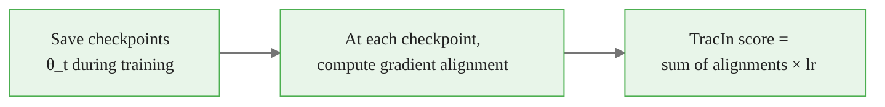

<!-- _class: lead -->

# Influence Functions, TracIn, and TracInCPFast
## Which Training Examples Drive a Prediction?

Module 06 — Concept-Based & Example-Based Explanations

<!-- Speaker notes: This guide covers example-based explanations — a fundamentally different lens on model behavior. Instead of asking what features matter, we ask: which training examples were most responsible for this prediction? This is powerful for data debugging, mislabeled example detection, and understanding model memorization. We'll cover classical influence functions and the more practical TracIn and TracInCPFast methods in Captum. -->

---

## The Example-Based Question

```
Model predicts "wolf" for a Siberian Husky photo.
Why? Let's look at the most influential training examples...

Top proponents (training examples that drove this prediction):
  1. Husky in snow     ← also labeled "wolf"? Or just similar background?
  2. Wolf in snow      ← snowy background correlation
  3. Husky in snow     ← pattern emerging...

Finding: The model may be classifying by background (snow), not animal shape.
```

This is **not visible in a gradient heatmap** unless you know to look.

<!-- Speaker notes: This example from the deep learning literature is illuminating. Ribeiro et al. found that a neural network was classifying wolves by whether the image contained snow, not by wolf features. Attribution heatmaps on individual predictions might show the wolf body region as important — but if you look at the training examples that drove the prediction, they all have snowy backgrounds. Example-based explanation revealed the spurious correlation that feature attribution missed. -->

<div class="callout-info">
This is a foundational concept for the rest of the module.
</div>
---

## Classical Influence Functions

Remove training example $z_i$ → how does the test loss change?

$$\mathcal{I}(z_i, z_{test}) = -\frac{1}{n}\nabla_\theta \ell(z_{test})^\top H_{\hat\theta}^{-1} \nabla_\theta \ell(z_i, y_i)$$

**Components:**
- $\nabla_\theta \ell(z_{test})$: how test gradient points
- $H_{\hat\theta}^{-1}$: curvature correction (second-order info)
- $\nabla_\theta \ell(z_i, y_i)$: how training example $i$ gradient points

If gradients align: removing $z_i$ would hurt test performance → it's a **proponent**.

<!-- Speaker notes: Classical influence functions from statistics were adapted for deep learning by Koh and Liang in 2017. The formula measures how removing a training example changes the test loss, via a first-order Taylor expansion in parameter space. The Hessian term corrects for the curvature of the loss landscape. This is theoretically exact for convex models. For neural networks, the approximation quality depends on how well the local Hessian captures the non-convex landscape. -->

<div class="callout-key">
This is the key takeaway from this section.
</div>
---

## The Hessian Problem

$$H_{\hat\theta} = \frac{1}{n}\sum_i \nabla^2_\theta \ell(x_i, y_i, \hat\theta)$$

For ResNet-50:
```
Parameters:    ~25 million
Hessian size:  25M × 25M = 625 trillion entries
Memory needed: ~5 petabytes  ← impossible
```

**Even approximating $H^{-1}$ is expensive and unstable** for non-convex neural networks.

→ We need a different approach for deep learning.

<!-- Speaker notes: The Hessian problem is fatal for classical influence functions at scale. A 25 million parameter network has a 25M × 25M Hessian — you can't even store it in memory, let alone invert it. Various approximations exist (LiSSA, Conjugate Gradient), but they can be numerically unstable and are still expensive. This is why Pruthi et al. developed TracIn — a completely different approach that avoids the Hessian entirely. -->

<div class="callout-warning">
Common misconception — read carefully.
</div>
---

## TracIn: A Completely Different Approach

**Key idea:** Instead of using the Hessian, trace the training trajectory.



$$\text{TracIn}(z, z_{test}) = \sum_{t \in \text{checkpoints}} \eta_t \cdot \nabla_\theta \ell(z_{test}, \theta_t) \cdot \nabla_\theta \ell(z, \theta_t)$$

**Intuition:** If training on $z$ consistently makes the model better at $z_{test}$ across checkpoints, then $z$ is a proponent of $z_{test}$.

<!-- Speaker notes: TracIn's insight is elegant. Rather than computing the Hessian at the final parameters, it asks: throughout training, whenever the model took a step on example z, did that step also help with z_test? The gradient dot product measures gradient alignment — if both gradients point in the same direction, training on z helped with z_test. Sum this across all training checkpoints and learning rates, and you have the TracIn score. No Hessian required. -->

<div class="callout-insight">
This insight connects theory to practice.
</div>
---

## TracIn Score Decomposition

$$\underbrace{\text{TracIn}(z, z_{test})}_{\text{total influence}} = \sum_{t=1}^{T} \underbrace{\eta_t}_{\text{lr}} \cdot \underbrace{\nabla_\theta \ell(z_{test}, \theta_t)}_{\text{test gradient}} \cdot \underbrace{\nabla_\theta \ell(z, \theta_t)}_{\text{training gradient}}$$

| Score | Interpretation |
|-------|---------------|
| **Positive (proponent)** | Training on $z$ helped model on $z_{test}$ |
| **Negative (opponent)** | Training on $z$ hurt model on $z_{test}$ |
| **Near zero** | Example $z$ had no consistent effect on $z_{test}$ |

<!-- Speaker notes: The decomposition helps understand TracIn's behavior. At each checkpoint, you're asking: do the gradients for z and z_test point in similar directions? If they do, training on z was moving parameters in a way that also helped with z_test. If they point in opposite directions, training on z was counterproductive for z_test. The learning rate weighting means steps taken with higher learning rates matter more in the final score. -->

---

## TracInCPFast: Practical Approximation

Full TracIn: $O(|\theta| \times |\mathcal{D}| \times T)$ ← expensive

**TracInCPFast:** Use only last-layer gradients

$$\text{TracInCPFast}(z, z_{test}) \approx \sum_t \eta_t \cdot \nabla_{\theta_{last}} \ell(z_{test}, \theta_t) \cdot \nabla_{\theta_{last}} \ell(z, \theta_t)$$

For a linear classification head: $O(d_{feat} \times |\mathcal{D}| \times T)$ where $d_{feat}$ is the feature dimension.

**Why it works:** The classification head captures what's needed to separate classes. Most of the discriminative information flows through the last layer.

<!-- Speaker notes: TracInCPFast is the practically usable version. For a ResNet-50 with a 2048-dimensional feature vector and 1000-class output, the last-layer gradient is 2048 × 1000 = ~2M dimensions — much more manageable than 25M full gradient. The approximation quality is good in practice: papers show high rank correlation between full TracIn and TracInCPFast scores. The key implementation requirement is saving model checkpoints during training. -->

---

## Captum TracIn Setup

```python
from captum.influence import TracInCPFast

# Checkpoints: list of (path, learning_rate) tuples
checkpoint_paths = [
    ("checkpoints/epoch_10.pt", 0.01),
    ("checkpoints/epoch_20.pt", 0.01),
    ("checkpoints/epoch_30.pt", 0.001),
    ("checkpoints/epoch_40.pt", 0.001),
]

tracin = TracInCPFast(
    model=model,
    train_dataset=train_dataset,
    checkpoints=checkpoint_paths,
    checkpoints_load_func=lambda m, p: m.load_state_dict(torch.load(p)),
    loss_fn=nn.CrossEntropyLoss(reduction='none'),
    batch_size=64,
)
```

**Critical:** Save checkpoints during training. No checkpoints → no TracIn.

<!-- Speaker notes: The implementation requirement to emphasize is checkpoint saving. This means you need to plan ahead during training. If you only have the final model, you cannot run TracIn. The checkpoint_paths list pairs each checkpoint file with the learning rate used at that point — this is important for the η_t weighting. The load function tells Captum how to load each checkpoint into the model. Captum then handles the rest of the TracIn computation automatically. -->

---

## Finding Proponents and Opponents

```python
test_input, test_target = test_dataset[42]
test_x = test_input.unsqueeze(0)
test_y = torch.tensor([test_target])

# Top-5 proponents (training examples that helped this prediction)
proponents_influences, proponents_indices = tracin.influence(
    inputs=(test_x, test_y),
    top_k=5,
    proponents=True,
)

# Top-5 opponents (training examples that hurt this prediction)
opponents_influences, opponents_indices = tracin.influence(
    inputs=(test_x, test_y),
    top_k=5,
    proponents=False,
)
```

Then visualize: show test image + proponents + opponents in a grid.

<!-- Speaker notes: The influence API is simple — just specify inputs, top_k, and whether you want proponents or opponents. The output is a tuple of (influence values, training indices). You can then look up those indices in the training dataset to visualize the actual training examples. The visualization step is crucial — often the most insightful moment is when you see that the top proponents for a wrong prediction are all from a specific spurious pattern. -->

---

## Visualizing Proponents and Opponents

```python
fig, axes = plt.subplots(3, 6, figsize=(18, 9))

# Test image (top-left)
axes[0, 0].imshow(test_image_np)
axes[0, 0].set_title(f"TEST IMAGE\nPredicted: {pred_class}", fontweight='bold',
                      color='green' if correct else 'red')

# Top proponents
for i, (idx, inf) in enumerate(zip(proponents_indices[0], proponents_influences[0])):
    img, lbl = train_dataset[idx.item()]
    axes[1, i+1].imshow(to_numpy(img))
    axes[1, i+1].set_title(f"Proponent {i+1}\n{labels[lbl]}\nInf={inf:.3f}")

# Top opponents
for i, (idx, inf) in enumerate(zip(opponents_indices[0], opponents_influences[0])):
    img, lbl = train_dataset[idx.item()]
    axes[2, i+1].imshow(to_numpy(img))
    axes[2, i+1].set_title(f"Opponent {i+1}\n{labels[lbl]}\nInf={inf:.3f}")
```

<!-- Speaker notes: The visualization layout puts the test image in the center-left, proponents in the middle row, and opponents in the bottom row. When you look at this for a correct prediction, you expect proponents to be similar images from the same class. For a wrong prediction, proponents might be from the wrong class or show a spurious feature. Opponents are training examples the model "worked against" to make this prediction — they often provide clues about what the model should have predicted instead. -->

---

## Self-Influence: Finding Mislabeled Data

**Self-influence:** How much did an example influence its own prediction during training?

$$\text{Self}(z) = \sum_t \eta_t \|\nabla_\theta \ell(z, \theta_t)\|^2$$

High self-influence → model had persistently high loss on this example.

**Why it detects mislabeled data:**
- Correct examples: model learns them, loss decreases, self-influence moderate
- Mislabeled examples: model struggles throughout, high persistent loss
- Result: high self-influence = candidate for mislabeled or atypical

```python
self_inf = tracin.self_influence(inputs=train_loader)
top_problematic = self_inf.argsort(descending=True)[:50]
# Visualize these 50 examples and check their labels
```

<!-- Speaker notes: Self-influence is one of the most practical applications of TracIn. The model tends to have persistently high loss on mislabeled examples throughout training, so their self-influence is high. By sorting training examples by self-influence and manually inspecting the top candidates, you can find and fix mislabeled data efficiently. This is much more efficient than random sampling or exhaustive manual review. Papers have shown that fixing high-self-influence mislabeled examples improves model accuracy significantly. -->

---

## SimilarityInfluence: No Checkpoints Needed

```python
from captum.influence import SimilarityInfluence

sim_influence = SimilarityInfluence(
    module=model,
    layers=["layer4"],
    influence_src_dataset=train_dataset,
    activation_dir="./activations/",
    model_id="resnet18",
    batch_size=64,
    load_from_disk=True,   # cache activations
)

# Find most similar training examples in representation space
top_similar = sim_influence.influence(
    inputs=test_input,
    top_k=5,
)
```

**When to use:** Only final model available. Finds training examples "near" the test point in feature space.

<!-- Speaker notes: SimilarityInfluence is the fallback when you don't have training checkpoints. It works by extracting layer activations for all training examples, building a nearest-neighbor index, and finding training examples whose activations are closest to the test example's activations. This is representationally similar — not exactly the same as TracIn's gradient-based influence — but often gives useful results and is computationally much cheaper. The load_from_disk parameter lets you cache activations so they don't need to be recomputed each time. -->

---

## Method Comparison

| | TracIn/TracInCPFast | SimilarityInfluence | Classical IF |
|---|---|---|---|
| Requires checkpoints | Yes | No | No |
| Theoretical basis | Gradient alignment | Representation similarity | Hessian approximation |
| Computation | $O(|\mathcal{D}| \times T)$ | $O(|\mathcal{D}|)$ | $O(|\mathcal{D}| \times P^2)$ |
| Handles non-convexity | Yes | Yes | No (unstable) |
| Finds proponents/opponents | Yes | No (only similar) | Yes |
| Data debugging | Excellent | Good | Moderate |

<!-- Speaker notes: This comparison table guides method selection. TracIn is the best-motivated method when you have checkpoints — it directly measures gradient alignment during training. SimilarityInfluence is simpler and faster but only finds similar examples, not gradient-aligned ones. Classical influence functions are theoretically motivated for convex models but often unstable for neural networks. In practice, TracInCPFast + SimilarityInfluence cover most use cases. -->

---

## Applications Summary

<div class="columns">

**Model Debugging**
- Find mislabeled training data (high self-influence)
- Identify spurious correlations (proponents cluster around spurious feature)
- Understand wrong predictions (what did the model "see"?)

**Model Auditing**
- Test for demographic bias: do proponents for a protected class show bias?
- Trace data poisoning: find training examples that affect target predictions
- Verify data quality before deployment

</div>

<!-- Speaker notes: TracIn and SimilarityInfluence have diverse applications. For model debugging, the most valuable use is finding mislabeled data via self-influence. For bias auditing, you can check whether proponents for predictions about a sensitive category disproportionately come from a biased subset of the training data. For security, influence methods can detect data poisoning — adversarially crafted training examples that cause specific test-time misbehavior. -->

---

## Summary

$$\text{TracIn}(z, z_{test}) = \sum_t \eta_t \cdot \underbrace{\nabla_\theta \ell(z_{test}, \theta_t) \cdot \nabla_\theta \ell(z, \theta_t)}_{\text{gradient alignment at step }t}$$

**Key takeaways:**
1. TracIn avoids the Hessian by tracing gradient alignment during training
2. TracInCPFast uses last-layer gradients only — practical at scale
3. Proponents help a prediction; opponents work against it
4. Self-influence detects mislabeled/atypical training examples
5. SimilarityInfluence works without checkpoints via representation similarity

**Requires:** Checkpoints saved during training (TracIn) or just the final model (SimilarityInfluence)

<!-- Speaker notes: To summarize the influence function module: TracIn measures gradient alignment across checkpoints, TracInCPFast approximates this with last-layer gradients, and both require checkpoints saved during training. Proponents and opponents give you a data-centric view of any prediction. Self-influence finds problematic training examples. SimilarityInfluence is a checkpoint-free alternative. All of these methods are in Captum's captum.influence module. The next notebook puts TCAV into practice on a real image classifier. -->

---

<!-- _class: lead -->

## Next: TCAV in Practice

**Notebook 01:** `01_tcav_texture_shape.ipynb`

Testing texture vs. shape bias in a pretrained classifier

<!-- Speaker notes: We'll now apply TCAV to test one of the most famous findings in deep learning: that ImageNet-pretrained CNNs are biased toward texture over shape. This notebook gives you hands-on experience designing concept datasets, running TCAV, and interpreting the results. -->
