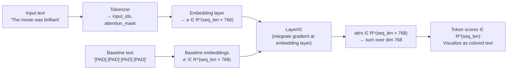

<!-- _class: lead -->

# Token-Level Attribution for NLP
## Explaining Transformer Predictions Word by Word

Module 07 — NLP & Transformer Interpretability

<!-- Speaker notes: Welcome to Module 07. We're moving from image to text models. The key challenge is that text is discrete — token IDs are integers with no natural gradient. We solve this by differentiating with respect to continuous token embeddings, then aggregating back to token-level scores. By the end, you'll produce colored text visualizations that show which words drove a BERT sentiment prediction. -->

---

## The Discrete Input Problem

**Images:** Continuous pixels — gradients are well-defined everywhere.

**Text:** Discrete token IDs — no meaningful gradient.

```
"The movie was brilliant"
→ tokenize → [101, 1996, 3185, 2001, 12278, 102]
→ gradient of loss w.r.t. [101, 1996, ...]? ← undefined
```

**Solution:** Differentiate w.r.t. **token embeddings** (continuous).

$$\text{TokenAttr}_i = \sum_j \left[ (e_i - e'_i)_j \cdot \int_0^1 \frac{\partial F}{\partial e_{i,j}} d\alpha \right]$$

Sum across embedding dimension $j$ gives one scalar per token.

<!-- Speaker notes: The fundamental challenge is that token IDs are integers. You can't take a gradient with respect to an integer. But every token ID maps to a continuous embedding vector, and we CAN take gradients with respect to those embeddings. Captum's LayerIntegratedGradients handles this automatically — you specify the embedding layer, and it applies IG at that layer. The output is an attribution tensor of shape (seq_len, embedding_dim), which we then aggregate to (seq_len,) by summing across the embedding dimension. -->

---

## The Attribution Pipeline for Text



<!-- Speaker notes: The pipeline has these stages: tokenize the input, pass through the embedding layer to get continuous vectors, apply LayerIG which integrates the gradient between the input embedding and the baseline embedding, sum across the embedding dimension to get one score per token, and visualize. The baseline is typically all-PAD tokens, giving a reference point of "no information." -->

---

## Choosing a Baseline for Text

| Baseline | How | When |
|---------|-----|------|
| `[PAD]` token | All tokens → `[PAD]` id | BERT-family (default) |
| `[MASK]` token | Content tokens → `[MASK]` | BERT bidirectional |
| Zero embedding | Set embedding to all zeros | Quick sanity check |
| Uniform embedding | Mean of all token embeddings | Model-agnostic |

**Rule:** Use `[PAD]` for BERT-family. Verify: model output on baseline ≈ 0 (uninformative).

```python
baseline_ids = torch.full_like(input_ids, tokenizer.pad_token_id)
```

<!-- Speaker notes: Baseline choice matters more for text than for images. For BERT, the PAD token is the most natural "absent" state — it's what the model sees for padding positions. Some researchers prefer MASK, arguing it better represents "we don't know this word." Zero embedding is numerically convenient but may be completely out of distribution. The key test: run the baseline through the model and check that the output probability is close to 0.5 or some neutral value. If the baseline already strongly predicts a class, your attributions will be skewed. -->

---

## Captum LayerIntegratedGradients

```python
from captum.attr import LayerIntegratedGradients
from transformers import AutoModelForSequenceClassification, AutoTokenizer

model_name = "textattack/bert-base-uncased-SST-2"
tokenizer = AutoTokenizer.from_pretrained(model_name)
model = AutoModelForSequenceClassification.from_pretrained(model_name)
model.eval()

# Forward function
def forward_func(input_ids, attention_mask=None, token_type_ids=None):
    return model(input_ids, attention_mask=attention_mask,
                 token_type_ids=token_type_ids).logits

# LayerIG on the embedding layer
lig = LayerIntegratedGradients(
    forward_func=forward_func,
    layer=model.bert.embeddings,   # ← embedding layer
)
```

<!-- Speaker notes: The Captum API for LayerIntegratedGradients takes a forward function and a layer. We target model.bert.embeddings — this is the module that converts token IDs to continuous vectors. Captum automatically hooks into this layer to apply IG. The forward function wraps the model and returns logits. We'll target a specific class (positive or negative sentiment) using the target argument in attribute(). -->

---

## Computing Token Attributions

```python
text = "The movie was surprisingly engaging with brilliant performances."
inputs = tokenizer(text, return_tensors="pt", max_length=128, truncation=True)
input_ids      = inputs["input_ids"]
attention_mask = inputs["attention_mask"]
token_type_ids = inputs.get("token_type_ids")

# Baseline: all PAD tokens
baseline_ids = torch.full_like(input_ids, tokenizer.pad_token_id)

# Predict class
with torch.no_grad():
    pred_class = model(input_ids, attention_mask=attention_mask).logits.argmax().item()

# Compute attributions
attributions, delta = lig.attribute(
    inputs=input_ids,
    baselines=baseline_ids,
    additional_forward_args=(attention_mask, token_type_ids),
    target=pred_class,
    n_steps=50,
    return_convergence_delta=True,
)
# attributions: (1, seq_len, 768)
token_scores = attributions.sum(dim=-1).squeeze(0)  # (seq_len,)
```

<!-- Speaker notes: The attribute call needs the input_ids, baselines_ids, and any additional arguments the forward function takes (attention_mask, token_type_ids). The target parameter specifies which output class to attribute to — we use the predicted class. n_steps=50 is usually sufficient for text (50 Riemann sum steps). The output attributions have shape (1, seq_len, 768) — we sum over the 768-dimensional embedding space to get one score per token. -->

---

## Token Attribution Visualization

```python
import matplotlib.pyplot as plt
import numpy as np

tokens = tokenizer.convert_ids_to_tokens(input_ids[0])
attrs  = token_scores.detach().numpy()
attrs_norm = attrs / np.abs(attrs).max()  # normalize to [-1, 1]

fig, ax = plt.subplots(figsize=(16, 2.5))
ax.axis('off')
n = len(tokens)

for i, (tok, a) in enumerate(zip(tokens, attrs_norm)):
    if a > 0:
        r, g, b = 1 - a*0.5, 1.0, 1 - a*0.5     # green
    else:
        r, g, b = 1.0, 1+a*0.5, 1+a*0.5           # red

    ax.add_patch(plt.Rectangle(
        ((i+0.05)/n, 0.2), 0.9/n, 0.6,
        facecolor=(r, g, b), edgecolor='white'
    ))
    ax.text((i+0.5)/n, 0.5, tok, ha='center', va='center', fontsize=9)
```

Output: each token colored by its attribution to the predicted class.

<!-- Speaker notes: The visualization converts normalized attributions to colors. Positive attributions (push toward predicted class) get green; negative attributions (push away from predicted class) get red; neutral tokens are white. The intensity of the color reflects the magnitude. This is the most intuitive visualization for stakeholders — they can immediately read which words drove the prediction. Token text is displayed inside the colored rectangle. -->

---

## Example: BERT Sentiment Attribution

```
Input:  "The movie was surprisingly engaging with brilliant performances"
Class:  POSITIVE (0.94 confidence)
```

```
[CLS]  The   movie   was  surprisingly  engaging  with  brilliant  performances  [SEP]
  ░     ░      ░      ░        ▓▓          ▓▓▓      ░        ▓▓▓▓       ▓▓           ░
 0.01  0.02   0.03  0.01      0.31        0.42    0.02      0.51       0.38       0.02
```

`▓` = green (positive contribution), `░` = white (neutral)

**Reading:** "brilliant" and "engaging" have the highest positive attributions → they drove the POSITIVE prediction.

<!-- Speaker notes: This example shows a realistic output. The word "brilliant" has the highest attribution (0.51), followed by "engaging" (0.42) and "surprisingly" (0.31). The function words "The", "was", "with" have near-zero attribution — they don't contribute to sentiment. Special tokens [CLS] and [SEP] have small attributions. This kind of output is immediately interpretable: the model predicts POSITIVE because of sentiment words "brilliant", "engaging", and "surprisingly" (which here modifies "engaging" positively). -->

---

## Subword Tokenization Challenge

BERT uses WordPiece: words split into pieces.

```
"disappointing" → ["disappoint", "##ing"]
                     attr=0.24    attr=0.31
                     ────────────────────
                     word attr = 0.55

"unbelievable"  → ["un", "##believ", "##able"]
                    attr=0.15  attr=0.28  attr=0.22
                    ──────────────────────────────
                    word attr = 0.65
```

**Merge subword attributions** for readable output:

```python
# Sum attributions for all subword pieces belonging to the same word
word_attrs = aggregate_subword_attributions(tokens, token_attrs, tokenizer)
```

<!-- Speaker notes: WordPiece tokenization breaks rare words into subpieces. "disappointing" might become ["disappoint", "##ing"] where ## indicates a continuation of the previous token. For visualization, it's cleaner to merge these back. The simplest approach is to sum the attributions of all subpieces. More sophisticated approaches might average or use the first subpiece. The aggregate_subword_attributions function I showed in the guide does this merging. -->

---

## Multi-Class Attribution: Both Classes

For sentiment, attribute to both positive AND negative class:

```python
attrs_positive = lig.attribute(..., target=1).sum(dim=-1).squeeze()
attrs_negative = lig.attribute(..., target=0).sum(dim=-1).squeeze()

# Net attribution = positive - negative
net_attrs = attrs_positive - attrs_negative
```

Positive net attribution → word pushes toward POSITIVE class
Negative net attribution → word pushes toward NEGATIVE class

This is more informative than single-class attribution.

<!-- Speaker notes: Single-class attribution tells you what drove the predicted class. But sometimes you want to understand why the model didn't predict the other class. Computing attribution for both classes and taking the difference gives a more complete picture. A word with high positive attribution but also high negative attribution is less diagnostic than a word with high positive and low negative attribution. The difference shows the word's discriminative power between classes. -->

---

## LayerConductance: Per-Layer Token Importance

```python
from captum.attr import LayerConductance

# Which transformer layer is most important for token attribution?
for layer_idx in range(12):  # BERT-base has 12 layers
    lc = LayerConductance(
        forward_func,
        model.bert.encoder.layer[layer_idx]
    )
    layer_attrs = lc.attribute(input_ids, baselines=baseline_ids,
                                target=pred_class, n_steps=20)
    # layer_attrs: (1, seq_len, 768)
    importance = layer_attrs.sum(dim=-1).squeeze().abs().sum()
    print(f"Layer {layer_idx}: total importance = {importance:.3f}")
```

**Typical finding:** Later layers (10-11 in BERT-base) carry more class-discriminative attribution.

<!-- Speaker notes: LayerConductance extends Layer Integrated Gradients to measure how much each layer contributes to the final prediction. For BERT, this tells you which transformer layers are most important for the classification. The typical pattern is that earlier layers capture basic syntax and morphology, while later layers capture semantics and task-relevant features. Layer 11 (the last encoder layer before the classification head) usually has the highest attribution for classification tasks. -->

---

## Baseline Sensitivity Check

Always verify your baseline doesn't already predict the class strongly:

```python
with torch.no_grad():
    baseline_logits = model(baseline_ids, attention_mask=attention_mask).logits
    baseline_probs = torch.softmax(baseline_logits, dim=1)
    print(f"Baseline prediction: {baseline_probs}")
    # Should be close to [0.5, 0.5] for a good baseline
    # If baseline_probs ≈ [0.9, 0.1], the PAD baseline is biased → bad
```

If baseline is biased, try `[MASK]` or uniform embedding baseline.

<!-- Speaker notes: This is an important sanity check. If you use [PAD] as the baseline and the model predicts "POSITIVE" with 90% confidence on an all-PAD sequence, then your attribution baseline is meaningless — the baseline already carries the prediction. Good baselines should produce near-uniform class probabilities. If [PAD] is biased, try [MASK] or a learned "neutral" baseline. Always print the baseline prediction before trusting your attributions. -->

---

## Summary

<div class="columns">

**Key Steps**
1. Tokenize input
2. Define baseline (→ `[PAD]`)
3. `LayerIntegratedGradients(model.bert.embeddings)`
4. Call `.attribute(input_ids, baseline_ids, ...)`
5. `.sum(dim=-1)` → token scores
6. Aggregate subwords → words
7. Visualize with colored text

**Key Formulas**

Token attribution:
$$\phi_i = \sum_j (e_i - e'_i)_j \cdot \text{IG}_j$$

Convergence:
$$\sum_i \phi_i \approx F(e) - F(e')$$

</div>

<!-- Speaker notes: The key pipeline is: tokenize, define baseline, LayerIG at embedding layer, attribute, sum over embedding dim, aggregate subwords, visualize. Always check convergence delta and baseline neutrality. The next guide covers the fundamental question of whether attention weights are equivalent to these token attributions — spoiler: they're not, and the difference matters a lot for model interpretation. -->

---

<!-- _class: lead -->

## Next: Attention vs. Attribution

**Guide 02:** `02_attention_vs_attribution_guide.md`

"Attention is not explanation" — why attention weights can mislead

<!-- Speaker notes: The next guide tackles a fundamental confusion in NLP interpretability: many practitioners use attention weights as explanations. But attention weights and attribution scores are very different things, and they often disagree in important ways. We'll demonstrate this empirically on BERT and show why IG-based attribution is generally more trustworthy. -->
