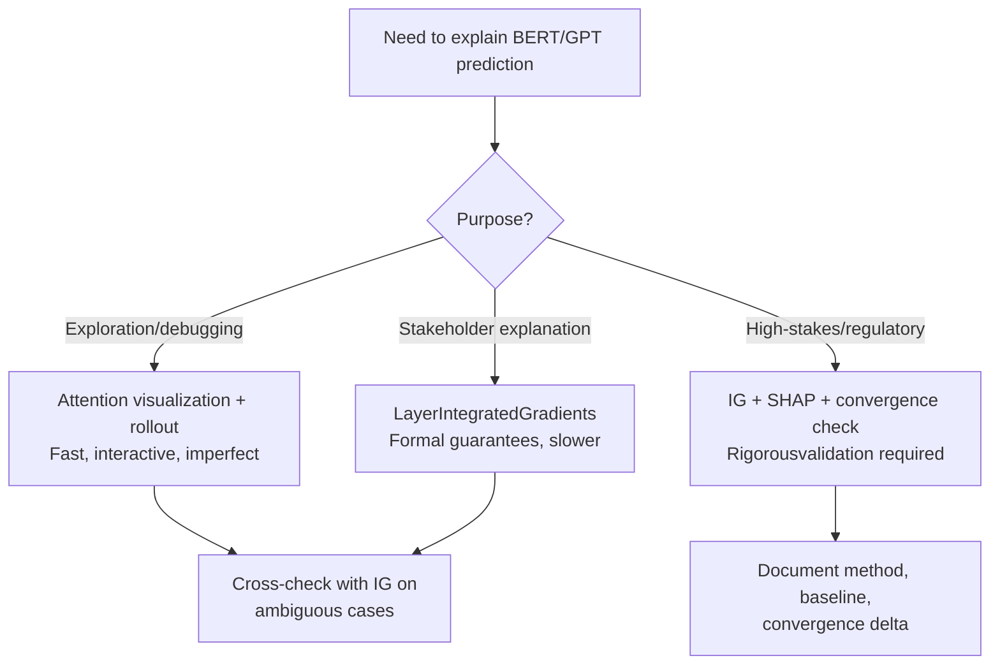

<!-- _class: lead -->

# Attention is Not Explanation
## Comparing Attention Weights vs. Integrated Gradients in BERT

Module 07 — NLP & Transformer Interpretability

<!-- Speaker notes: This guide tackles one of the most important and widely misunderstood topics in NLP interpretability. When Transformers became popular, researchers and practitioners started using attention weights as explanations — "the model attended to word X, so word X was important." This intuition is often wrong, and this guide explains why. We'll compare attention and IG empirically to show where they agree and disagree. -->

---

## The Intuition Everyone Uses (And Shouldn't)

```
Input: "The movie was absolutely brilliant"
BERT attention (layer 11, head 5):
  The:    0.02
  movie:  0.15
  was:    0.03
  absolutely: 0.31
  brilliant:  0.49   ← highest attention!
```

**Intuition:** "brilliant" was most important for POSITIVE prediction.

**Problem:** This ignores the 11 other heads, 11 other layers, and doesn't account for whether "brilliant" actually *caused* the prediction.

<!-- Speaker notes: The intuition is tempting: the model attended to "brilliant" the most, so "brilliant" drove the prediction. But this is just one head in one layer of a 12-layer, 12-head model. The other 143 attention matrices might show completely different patterns. And even if we aggregate across all heads and layers, attention weight is NOT the same as causal attribution — it measures information routing, not counterfactual impact. -->

---

## What Attention Weights Actually Measure

$$\alpha_{ij} = \text{softmax}\left(\frac{Q_i K_j^\top}{\sqrt{d_k}}\right)$$

$$\text{output}_i = \sum_j \alpha_{ij} V_j$$

$\alpha_{ij}$ = **fraction of value vector $V_j$ mixed into representation of token $i$**

**This is information routing, not attribution.**

High $\alpha_{ij}$ means: "token $i$'s representation will incorporate information from $V_j$"

It does NOT mean: "changing token $j$ would change the final prediction"

<!-- Speaker notes: The attention formula is a weighted average of value vectors. Alpha_ij controls how much of value_j goes into the representation of position i. This is a routing decision in the information flow. But the value vector V_j is itself a function of the input token — and if V_j doesn't change much between "brilliant" and a random word, high attention to "brilliant" might not matter for the prediction. Attribution measures counterfactual impact; attention measures information routing. These are different things. -->

---

## The Formal Problem: Missing Properties

Attribution methods satisfy axiomatic properties. Attention satisfies none:

| Property | Meaning | IG | Attention |
|----------|---------|-----|---------|
| **Efficiency** | $\sum_i \phi_i = f(x)-f(x')$ | ✓ | ✗ |
| **Sensitivity** | Changing important features changes score | ✓ | ✗ |
| **Dummy** | Irrelevant features get zero score | ✓ | ✗ |
| **Completeness** | Sum accounts for full output | ✓ | ✗ |

Attention weights are **softmax-normalized to sum to 1** — this normalization is an implementation detail, not a meaningful conservation law.

<!-- Speaker notes: The formal argument is crisp. Attribution methods must satisfy axioms derived from cooperative game theory. The efficiency axiom says attributions sum to the prediction minus the baseline — nothing is unaccounted for. Attention weights sum to 1 because of softmax normalization, but this 1 is arbitrary — it doesn't represent the total "prediction credit" that needs to be distributed. A dummy feature (irrelevant for the prediction) can receive high attention (the model might attend to it while doing something else), but a proper attribution method would give it zero. -->

---

## Empirical Evidence: Jain & Wallace (2019)

**Key experiment:** Permute attention weights randomly → does model performance change?

```
Original attention: [0.02, 0.15, 0.03, 0.31, 0.49]
Permuted attention: [0.31, 0.49, 0.02, 0.15, 0.03]
```

**Finding:** Many tasks showed **no significant accuracy drop** when attention was randomly permuted.

If attention explained the prediction, permuting it should destroy performance.
→ Attention is not the mechanism, but a byproduct of it.

<!-- Speaker notes: Jain and Wallace's 2019 NAACL paper ran this experiment across multiple tasks. If attention explains predictions, then scrambling the attention weights should break the model. But in many cases, models with permuted attention performed just as well. This is because the model's actual decision mechanism runs through the weights and activations, not directly through attention patterns. Attention is a useful description of information flow, but not an explanation of the prediction. -->

---

## Case Study: Negation

```
Text: "The movie was NOT boring at all."
True class: POSITIVE

IG attribution:
  The    was    NOT   boring   at   all
   0.02  0.01  [0.41]  -0.28   0.03  0.12
  ← "NOT" has HIGH positive attribution →

Attention (layer 11, averaged):
  The    was    NOT   boring   at   all
   0.05  0.04   0.08  [0.42]  0.06  0.09
  ← "boring" has HIGHEST attention →
```

**Interpretation:**
- IG correctly identifies "NOT" as the key modifier
- Attention incorrectly highlights the sentiment word, missing the negation

<!-- Speaker notes: This negation example is a classic failure case for attention. The sentiment word "boring" gets high attention because it's the most content-rich word. But the prediction is POSITIVE because "NOT boring" reverses the sentiment. IG correctly attributes high positive score to "NOT" — because removing "NOT" (replacing with baseline) would dramatically change the prediction from POSITIVE to NEGATIVE. Attention doesn't capture this counterfactual reasoning. This matters for applications like content moderation where negation handling is critical. -->

---

## Attention Rollout: An Improvement

**Problem:** Raw attention shows one layer's routing, not end-to-end information flow.

**Solution (Abnar & Zuidema 2020):** Propagate attention through all layers.

$$\tilde{A}^l = A^l \cdot \tilde{A}^{l-1}, \quad \tilde{A}^0 = I$$

where $A^l = \frac{1}{H}\sum_h \alpha^{l,h}$ + residual connections.

```python
def attention_rollout(attentions):
    result = torch.eye(attentions[0].shape[-1])
    for layer_attn in attentions:
        mean_attn = layer_attn.mean(dim=1).squeeze()  # avg over heads
        # Account for residual: each layer passes half via attention, half residual
        attn_residual = 0.5 * mean_attn + 0.5 * torch.eye(mean_attn.shape[0])
        attn_residual /= attn_residual.sum(dim=-1, keepdim=True)
        result = attn_residual @ result
    return result
```

<!-- Speaker notes: Attention rollout is a principled attempt to improve attention-based explanations. The key insight is that each transformer layer has residual connections — the output is a mix of the attention-weighted values and the direct input. Rollout propagates through all layers accounting for both paths. The result is more faithful to end-to-end information flow than any single layer's attention. But it still doesn't satisfy the attribution axioms. It's better than raw attention for exploration, but still not a replacement for IG. -->

---

## Gradient-Weighted Attention

Multiply attention by gradient to get importance-weighted attention:

$$\text{GradAttn}_{ij} = \alpha_{ij} \cdot \left|\frac{\partial F}{\partial \alpha_{ij}}\right|$$

```python
from captum.attr import LayerGradientXActivation

# Gradient × attention at each layer
for layer_idx, attn_layer in enumerate(model.bert.encoder.layer):
    lga = LayerGradientXActivation(
        forward_func,
        attn_layer.attention.self.value,  # value projection
    )
    grad_attn = lga.attribute(
        inputs=input_ids,
        additional_forward_args=(attention_mask, token_type_ids),
        target=pred_class,
    )
```

Better correlation with human rationale annotations than raw attention.

<!-- Speaker notes: Gradient-weighted attention multiplies each attention weight by the gradient of the output with respect to that attention weight. This filters out attention weights that the model doesn't actually use for the final prediction — if changing alpha_ij doesn't change the output, the gradient will be near zero, and the gradient-weighted score will be suppressed. This is analogous to Gradient×Input for regular attributions. It performs better than raw attention but still doesn't satisfy the attribution axioms. -->

---

## The Case FOR Attention

Despite formal limitations, attention has legitimate uses:

<div class="columns">

**Useful for:**
- Visualizing which tokens a specific head focuses on
- Identifying specialization: some heads attend to syntax, coreference, position
- Fast exploratory analysis
- Debugging unexpected model behavior

**Not suitable for:**
- Stakeholder explanations
- Regulatory compliance
- Claims about what "caused" a prediction
- Comparing importance across models/tasks

</div>

Use attention for exploration, IG for explanation.

<!-- Speaker notes: The bottom line is nuanced. Attention is NOT useless — it's a window into the model's information routing, and different heads genuinely specialize in different linguistic relationships. But it should only be used for exploration and debugging, not for explanations that need to satisfy formal properties or will be shown to stakeholders or regulators. When the stakes are low (exploring a model you're building), attention visualization is fast and informative. When stakes are high (explaining a medical AI decision), use IG. -->

---

## Comparison: When They Agree

For most "easy" cases with clear sentiment words, attention and IG broadly agree:

```
"The brilliant masterpiece deserves every award."
POSITIVE class.

Top tokens by attribution:
  IG:   [brilliant: 0.42, masterpiece: 0.38, deserves: 0.19]
  Attn: [masterpiece: 0.45, brilliant: 0.35, awards: 0.12]

Rank correlation: r = 0.87 (high agreement)
```

On easy cases with unambiguous content words, both methods agree on top tokens.

<!-- Speaker notes: It's important to be fair — attention and IG often agree, especially for simple cases. When a text contains clear sentiment words and no negation, modifiers, or complex structure, both methods will highlight similar tokens. The disagreements emerge in harder cases: negation, sarcasm, long-distance dependencies, adversarial inputs. So for quick exploration of simple cases, attention might give you 80% of the insight at 1% of the computation cost. -->

---

## Comparison: When They Disagree

Critical cases where attention misleads:

| Case | Attention says | IG says | Trust |
|------|---------------|---------|-------|
| Negation | Highlights negated word | Highlights negation | IG |
| Adversarial | Distributes broadly | Focuses on adversarial token | IG |
| Syntax | Content words | Function words can matter | IG |
| Redundant tokens | Attends to first occurrence | Ignores redundancy | IG |

**Risk:** Practitioners using attention for high-stakes decisions may be misled in exactly these hard cases.

<!-- Speaker notes: The disagreement cases are exactly the hard ones where you most need reliable explanations. Negation, adversarial inputs, complex syntax — these are cases where the model might fail, and where understanding the explanation is most critical. In precisely these cases, attention is least reliable. This asymmetry makes attention explanations particularly dangerous for high-stakes applications: they look fine for easy cases and break exactly when you need them most. -->

---

## Practical Decision Framework



<!-- Speaker notes: This decision flowchart gives practical guidance. For exploratory work, attention is fine — it's fast and gives useful signal. For stakeholder explanations, use LayerIntegratedGradients, which has formal guarantees. For regulatory contexts (medical AI, lending decisions), you need IG or SHAP plus convergence validation and documentation. Always cross-check attention with IG on ambiguous cases — if they disagree, IG is more trustworthy. -->

---

## Summary

**Attention measures:** Information routing (weighted average of values)
**Attribution measures:** Counterfactual impact (how much does this token change the prediction?)

These are fundamentally different, and they disagree when it matters most:
- Negation
- Long-range dependencies
- Adversarial inputs

**Use attention for:**  exploration, head specialization analysis, quick visualization

**Use IG/SHAP for:** explanations that matter, regulatory compliance, publication

<!-- Speaker notes: The key takeaway is that attention and attribution answer different questions. Attention asks "what information did token X contribute to the representation?" Attribution asks "how much did the presence of token X change the prediction?" For most applications where interpretation matters — medical, legal, financial AI — we need attribution, not attention. The next notebook demonstrates this empirically on a real BERT sentiment classifier, with side-by-side comparison of both methods. -->

---

<!-- _class: lead -->

## Next: Layer Attribution in Transformers

**Guide 03:** `03_transformer_layers_guide.md`

Which BERT layers are most important? LayerIntegratedGradients across all 12.

<!-- Speaker notes: The next guide extends token attribution to layer-level analysis. Instead of asking which tokens are important, we ask which BERT layers are most important for the prediction. This uses LayerIntegratedGradients applied at each encoder layer and is useful for understanding where task-relevant information is encoded in the network. -->
