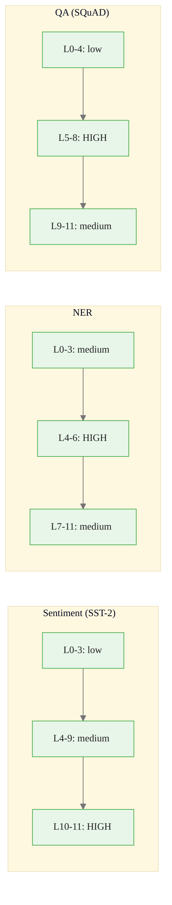

<!-- _class: lead -->

# Layer-Wise Attribution in Transformers
## Which BERT Layers Are Most Important?

Module 07 — NLP & Transformer Interpretability

<!-- Speaker notes: This guide extends token attribution to layer-level analysis. We've already seen which tokens drive a BERT prediction. Now we ask: at which layer does this information become relevant? This has practical implications for model compression (prune unimportant layers), transfer learning (know which layers to freeze), and understanding what BERT actually learns. -->

---

## Why Analyze Layers?

Token attribution: *Which words mattered?*
Layer attribution: *At which depth did they matter?*

```
BERT architecture:
  Input → Embeddings → [Layer 0] → [Layer 1] → ... → [Layer 11] → Classifier
                            ↓           ↓                 ↓
                        Syntax     Semantics        Task-specific
```

**Research findings (Tenney et al., 2019):**
- Layers 0-3: POS tags, surface features
- Layers 4-6: Syntactic parsing, dependencies
- Layers 7-9: Semantic roles, NER, coreference
- Layers 10-12: Task-specific, classification signal

<!-- Speaker notes: Different BERT layers encode different types of linguistic information. This is not a design choice — it emerges from pretraining on masked language modeling. The model develops a hierarchical representation where earlier layers handle simpler, more local patterns and later layers handle complex, task-specific semantics. By measuring which layers contribute most to a specific prediction, we can understand what kind of information the model is using. -->

<div class="callout-info">
This is a foundational concept for the rest of the module.
</div>
---

## LayerConductance: Formula

Conductance at layer $l$ measures how much of the final attribution passes through that layer:

$$C_l = \int_0^1 \frac{\partial F(x' + \alpha(x-x'))}{\partial h_l(\alpha)} \cdot \frac{d h_l(\alpha)}{d\alpha} d\alpha$$

**Chain rule interpretation:**
- $\frac{\partial F}{\partial h_l}$: how the output changes with layer $l$'s activation
- $\frac{dh_l}{d\alpha}$: how layer $l$'s activation changes as we interpolate from baseline to input
- Product: credit flowing through layer $l$

Sums to the total attribution (efficiency maintained across layers).

<!-- Speaker notes: LayerConductance is the natural layer-level analogue of Integrated Gradients. The first term measures how sensitive the output is to changes in layer l's activations. The second term measures how much layer l's activations actually change as we move from baseline to input. The product tells us how much attribution credit passes through this layer. Crucially, the sum of LayerConductance across all layers equals the total IG attribution — the efficiency property is maintained. -->

<div class="callout-key">
This is the key takeaway from this section.
</div>
---

## Captum LayerConductance

```python
from captum.attr import LayerConductance

model.eval()
layer_scores = []

for layer_idx, encoder_layer in enumerate(model.bert.encoder.layer):
    lc = LayerConductance(forward_func, encoder_layer)

    conductance = lc.attribute(
        inputs=input_ids,
        baselines=baseline_ids,
        additional_forward_args=(attention_mask, token_type_ids),
        target=pred_class,
        n_steps=20,    # fewer steps OK for layer analysis
    )

    # Total magnitude for this layer
    layer_score = conductance.abs().sum().item()
    layer_scores.append(layer_score)
    print(f"Layer {layer_idx:2d}: score = {layer_score:.4f}")
```

<!-- Speaker notes: The Captum API for LayerConductance is nearly identical to LayerIntegratedGradients. You pass the model layer as the second argument. We're computing one LayerConductance call per encoder layer — for BERT-base that's 12 calls plus the embedding layer. Each call does n_steps forward+backward passes. We use n_steps=20 instead of 50 for layer analysis since we're summarizing to a scalar per layer anyway, and the precision requirement is lower than for token-level attribution. -->

<div class="callout-warning">
Common misconception — read carefully.
</div>
---

## Layer Importance Visualization

```python
fig, ax = plt.subplots(figsize=(10, 4))
layers = [f"L{i}" for i in range(12)]
colors = ['#d73027' if s > np.percentile(layer_scores, 80) else '#4575b4'
          for s in layer_scores]

bars = ax.bar(layers, layer_scores, color=colors, edgecolor='white')
ax.set_xlabel("BERT Encoder Layer")
ax.set_ylabel("LayerConductance magnitude")
ax.set_title("Layer Importance for Sentiment Prediction\n(Red = top 20%)")
ax.grid(axis='y', alpha=0.3)
```

**Expected output for SST-2 (sentiment):**
- Layers 10-11 dominate (task-specific semantics)
- Early layers (0-3) contribute little to sentiment

<!-- Speaker notes: The visualization is a simple bar chart. For sentiment classification, you should see a clear pattern where the later layers (10, 11) have much higher importance than earlier layers. This is consistent with probing studies showing that semantic features relevant to sentiment are encoded in the upper layers of BERT. The contrast between tasks is informative — NER shows more uniform importance across layers because it requires both syntactic structure and semantic labeling. -->

<div class="callout-insight">
This insight connects theory to practice.
</div>
---

## Cross-Task Comparison



**Practical implication:** For sentiment classifiers, fine-tuning only the last 3 layers retains most performance.

<!-- Speaker notes: The cross-task comparison reveals task-specific layer preferences that reflect the linguistic demands of each task. Sentiment requires semantic understanding of emotional words — that's in the upper layers. NER requires recognizing named entities from surrounding syntactic context — that's in the middle layers. Question answering requires matching semantic content between question and passage — that's in layers 5-8 where cross-sentence semantic comparison happens. Knowing this guides smart fine-tuning strategies and model compression decisions. -->

---

## Token × Layer Heatmap

A complete picture: how each token's importance evolves across layers.

```
Token:     [CLS]   The   movie    was  brilliant  [SEP]
Layer 11:   0.02   0.01   0.04   0.01    0.51      0.02  ← semantics
Layer 10:   0.03   0.01   0.05   0.02    0.44      0.01
Layer 7:    0.04   0.03   0.08   0.03    0.38      0.02
Layer 4:    0.08   0.07   0.12   0.06    0.28      0.03  ← syntax
Layer 1:    0.05   0.06   0.09   0.05    0.19      0.04
Layer 0:    0.04   0.05   0.08   0.05    0.14      0.03  ← surface
```

**Reading:** "brilliant" attribution increases with depth → semantic meaning emerges in deeper layers.

<!-- Speaker notes: The heatmap shows the complete picture. Each cell is the attribution of a (token, layer) pair. Reading down a column shows how a token's importance evolves through processing. "Brilliant" starts with modest attribution at layer 0 (it's just a sequence of characters/subwords at that point) and grows substantially at layers 10-11 where the model has built up full semantic representations. Function words like "The" and "was" stay low across all layers — they contribute little to the sentiment decision. -->

---

## Application: Layer Pruning

Layer importance guides pruning decisions:

```python
# Compute layer scores for a validation set
all_layer_scores = []
for text, label in validation_set[:100]:
    scores = compute_layer_conductance(text, label)
    all_layer_scores.append(scores)

# Average across examples
mean_scores = np.mean(all_layer_scores, axis=0)

# Identify least important layers
threshold = mean_scores.max() * 0.05  # 5% of max
prunable = [i for i, s in enumerate(mean_scores) if s < threshold]
print(f"Potentially prunable layers: {prunable}")
print(f"Expected: early layers (0-3) for sentiment classification")
```

**Caution:** Always validate on held-out test set before pruning.

<!-- Speaker notes: Layer conductance can guide practical model compression decisions. If layers 0-3 contribute less than 5% of the total attribution for a sentiment task, they might be candidates for pruning. However, pruning removes the layer's contribution to ALL tokens, not just the unimportant ones, so this is approximate guidance. Always validate the pruned model's performance on a separate test set. In practice, the last-few-layers fine-tuning strategy (rather than full model pruning) is safer and more commonly used. -->

---

## GPT-2: Different Pattern

GPT-2 uses causal (left-to-right) attention — different from BERT's bidirectional.

```
GPT-2 layer attribution for next-token prediction:
Layer 0:  Local bigram patterns (high importance for syntax)
Layer 6:  Mid-range context (sentence structure)
Layer 11: Long-range semantic coherence
```

```python
# LayerIG for GPT-2
for block_idx, block in enumerate(gpt2_model.transformer.h):
    lig = LayerIntegratedGradients(forward_gpt2, block)
    attrs = lig.attribute(input_ids, baselines=baseline_ids,
                          target=next_token_id, n_steps=20)
```

**Key difference:** GPT-2 shows more uniform layer importance (all positions matter for generation) compared to BERT's last-layer dominance for classification.

<!-- Speaker notes: GPT-2 and BERT show different layer importance patterns because they have different architectures and objectives. BERT is bidirectional and trained for classification — it learns to compress all relevant information into the [CLS] token's final representation, which requires only the last layers. GPT-2 is unidirectional and trained for generation — it needs to maintain useful representations at every position and layer for predicting the next token. This more distributed representation leads to more even layer importance. -->

---

## Summary

<div class="columns">

**LayerConductance Formula**
$$C_l = \int_0^1 \frac{\partial F}{\partial h_l} \cdot \frac{dh_l}{d\alpha} d\alpha$$

**BERT Layer Patterns**
- Sentiment: layers 10-11 dominate
- NER: layers 4-6 dominate
- QA: layers 5-8 dominate
- Early layers (0-2): minimal contribution to classification

**Applications**
- Model compression: prune low-importance layers
- Fine-tuning: freeze early layers
- Architecture understanding

</div>

<!-- Speaker notes: To summarize layer attribution: LayerConductance measures how much attribution credit flows through each layer. For BERT classification tasks, later layers dominate. Different tasks show different patterns reflecting the linguistic demands. Practical applications include guided model pruning and fine-tuning strategies. The token × layer heatmap is the most comprehensive visualization, showing both which tokens and at which depth they contribute. The next notebook puts all three NLP guides into practice. -->

---

<!-- _class: lead -->

## Next: BERT Sentiment Attribution Notebook

**Notebook 01:** `01_bert_sentiment_ig.ipynb`

Token-level IG with colored text visualization on a real BERT sentiment classifier

<!-- Speaker notes: The next notebook is the most visual in the NLP module — you'll produce colored text outputs showing which words drove BERT's sentiment predictions, with green for positive contributions and red for negative. It uses a real pretrained BERT fine-tuned on SST-2 from HuggingFace. -->
