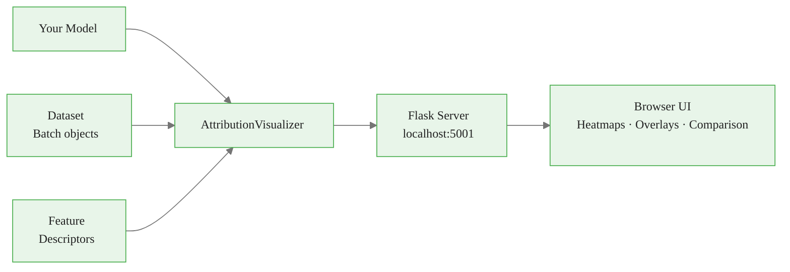

<!-- _class: lead -->

# Captum Insights
## Interactive Web-Based Attribution Visualization

Module 08 · Production Interpretability Pipelines

<!-- Speaker notes: Captum Insights is the "GUI layer" on top of Captum's attribution methods. It requires zero visualization code from the user — you configure your model, features, and dataset once, then explore interactively. This deck covers setup, architecture, and practical use cases for development-time exploration. -->

---

## What Problem Does Insights Solve?

**Writing visualization code is slow and repetitive**

Every project, practitioners write the same boilerplate:
- Run attribution
- Map back to input space
- Handle normalization and color mapping
- Repeat for 5+ methods × N examples

**Captum Insights eliminates this cycle**

<!-- Speaker notes: Before Insights, every interpretability workflow required custom matplotlib code. Insights provides a standardized interactive UI so you can focus on understanding the model rather than debugging visualization code. -->

<div class="callout-info">
This is a foundational concept for the rest of the module.
</div>
---

## Captum Insights Architecture



**Three inputs, one interface**

<!-- Speaker notes: The AttributionVisualizer is the central object. It wraps your model, feature descriptors, and dataset, then exposes a Flask endpoint. The browser UI handles all rendering including image overlays, text coloring, and method comparison. -->

<div class="callout-key">
This is the key takeaway from this section.
</div>
---

## Installation

```bash
# Full install with Insights dependencies
pip install captum[insights]

# Equivalent manual install
pip install captum flask flask-compress
```

**Verify:**

```python
from captum.insights import AttributionVisualizer, Batch
from captum.insights.attr_vis.features import ImageFeature, TextFeature
print("Captum Insights ready")
```

<!-- Speaker notes: The [insights] extra pulls in Flask and flask-compress. These are lightweight and do not affect your training environment. The standard captum install does NOT include them — always use pip install captum[insights] for this module. -->

<div class="callout-warning">
Common misconception — read carefully.
</div>
---

## Core Class: `AttributionVisualizer`

```python
from captum.insights import AttributionVisualizer, Batch

visualizer = AttributionVisualizer(
    models=[model],          # list — supports multi-model comparison
    score_func=score_func,   # converts raw output to probabilities
    classes=class_names,     # list of string class labels
    features=[image_feature],# list of Feature descriptors
    dataset=batches,         # iterable of Batch(inputs, labels)
    num_examples=4,          # examples shown per batch in the UI
)
```

All parameters are required. No optional shortcuts.

<!-- Speaker notes: The models list supports multiple models for side-by-side comparison. score_func is critical — it must return a probability vector (0 to 1 per class, summing to 1). For classification, torch.softmax(output, dim=1) is almost always correct. -->

<div class="callout-insight">
This insight connects theory to practice.
</div>
---

## Feature Descriptors

| Class | Input Type | Key Parameters |
|-------|------------|----------------|
| `ImageFeature` | Images | `baseline_transforms`, `input_transforms` |
| `TextFeature` | Token sequences | `visualization_transform` for id→token mapping |
| `GeneralFeature` | Tabular / any | `names` list for feature labels |

```python
from captum.insights.attr_vis.features import (
    ImageFeature, TextFeature, GeneralFeature
)
```

<!-- Speaker notes: Feature descriptors tell Insights two things: how to preprocess inputs before attribution, and how to render the attribution in the UI. ImageFeature renders heatmap overlays. TextFeature renders colored tokens. GeneralFeature renders a bar chart per feature. -->

---

## Image Classification Setup

```python
from torchvision.models import resnet18, ResNet18_Weights
import torchvision.transforms as T

weights = ResNet18_Weights.IMAGENET1K_V1
model = resnet18(weights=weights)
model.eval()

normalize = T.Normalize(mean=[0.485, 0.456, 0.406],
                        std=[0.229, 0.224, 0.225])
transform = T.Compose([T.Resize(256), T.CenterCrop(224),
                       T.ToTensor(), normalize])

def baseline_func(input_tensor):
    return torch.zeros_like(input_tensor)  # black image

image_feature = ImageFeature(
    name="Input Image",
    baseline_transforms=[baseline_func],
    input_transforms=[transform],
)
```

<!-- Speaker notes: The transform inside ImageFeature must match exactly what was used during model training. Using a different normalization will silently produce wrong attributions. The baseline is applied before attribution — black image (zeros) is standard for ImageNet models. -->

---

## The `Batch` Object

```python
from captum.insights import Batch

# Single example batch
batch = Batch(
    inputs=img_tensor,      # (1, C, H, W)
    labels=torch.tensor([3])  # ground-truth class index
)

# Dataset as a list of Batch objects
def build_dataset(images, labels):
    return [
        Batch(inputs=img.unsqueeze(0),
              labels=torch.tensor([lbl]))
        for img, lbl in zip(images, labels)
    ]
```

<!-- Speaker notes: Batch wraps a single example (batch size 1) with its ground-truth label. Insights uses the label to show whether the model is correct. The inputs tensor shape must match what your model expects — add the batch dimension with unsqueeze(0) if coming from a single image. -->

---

## Synthetic Dataset for Testing

```python
import numpy as np
from PIL import Image

def synthetic_image_dataset(n_batches=20, n_classes=10):
    """Generate test batches without real data."""
    normalize = T.Normalize([0.485, 0.456, 0.406],
                             [0.229, 0.224, 0.225])
    tfm = T.Compose([T.Resize(224), T.ToTensor(), normalize])

    for i in range(n_batches):
        label = i % n_classes
        arr = np.random.randint(50, 200, (224, 224, 3), dtype=np.uint8)
        arr[:, :, label % 3] = np.random.randint(150, 250)
        img = Image.fromarray(arr)
        img_t = tfm(img).unsqueeze(0)
        yield Batch(inputs=img_t, labels=torch.tensor([label]))
```

<!-- Speaker notes: This generator creates random images with a label-correlated color channel, giving Insights something non-trivial to attribute. Use this pattern to test your Insights configuration before wiring in real data. It avoids network downloads and works offline. -->

---

## Starting the Server

```python
visualizer = AttributionVisualizer(
    models=[model],
    score_func=lambda out: torch.softmax(out, dim=1),
    classes=class_names,
    features=[image_feature],
    dataset=list(synthetic_image_dataset(n_batches=20)),
    num_examples=4,
)

# Start Flask development server
visualizer.serve(debug=False, port=5001)
```

Navigate to `http://localhost:5001`

<!-- Speaker notes: The serve() call blocks the Python process. In notebooks, run it in a background thread or use the widget API instead. Port 5001 avoids conflict with common services on 5000. The debug=False setting is important — debug mode enables auto-reload which can cause double-initialization of the model. -->

---

## Jupyter Notebook Integration

```python
from captum.insights.widget import CaptumInsightsWidget

widget = CaptumInsightsWidget(visualizer)
widget.render()
```

Renders an interactive panel directly in the notebook output cell.

**Requirements:**
- JupyterLab 3.x or classic Notebook 6.x
- `jupyter nbextension enable` may be required for classic Notebook

<!-- Speaker notes: The widget is the recommended path for notebook-based development. It avoids the Flask server entirely and renders inline. If the widget does not appear, run: jupyter nbextension install --py captum --sys-prefix followed by jupyter nbextension enable captum --py --sys-prefix. -->

---

## Navigating the Insights UI

<div class="columns">

**Left panel — Controls**
- Model selector (multi-model)
- Attribution method dropdown
- Target class selector
- Example navigation arrows

**Right panel — Visualization**
- Input image + heatmap overlay
- Positive / negative attribution masks
- Magnitude threshold slider
- Download as PNG

</div>

<!-- Speaker notes: The method dropdown includes IG, GradientSHAP, Saliency, Gradient×Input, and DeepLIFT. Changing the method reruns attribution in real time. The threshold slider is useful for filtering noisy low-magnitude regions to focus on the model's most decisive features. -->

---

## Text Classification in Insights

```python
from captum.insights.attr_vis.features import TextFeature

text_feature = TextFeature(
    name="Input Text",
    baseline_transforms=[lambda e: torch.zeros_like(e)],
    input_transforms=[],
    visualization_transform=lambda ids:
        tokenizer.convert_ids_to_tokens(ids[0].tolist()),
)

text_visualizer = AttributionVisualizer(
    models=[bert_model],
    score_func=lambda out: torch.softmax(out, dim=1),
    classes=["NEGATIVE", "POSITIVE"],
    features=[text_feature],
    dataset=text_batches,
    num_examples=4,
)
```

<!-- Speaker notes: visualization_transform converts token IDs back to readable strings for the UI. Without it, the UI displays numeric IDs. The tokenizer.convert_ids_to_tokens method handles subword tokens including ## prefixes — Insights displays them as-is. -->

---

## Known Limitations

| Limitation | Workaround |
|------------|------------|
| Safari compatibility issues | Use Chrome or Firefox |
| Real-time IG is slow for large models | Use Saliency first; switch to IG for final analysis |
| Not for production deployment | Build a custom API (see Guide 02) |
| Custom layers may error | Test attribution standalone before wiring into Insights |
| High-res images are slow | Resize to 224×224 for interactive use |

<!-- Speaker notes: The most common error is a timeout when computing IG on large models in real time. The fix is almost always to switch to a gradient-only method (Saliency, Gradient×Input) for the interactive session, then run IG on selected examples programmatically. -->

---

## Summary

| Component | Role |
|-----------|------|
| `AttributionVisualizer` | Central wrapper: model + features + data |
| `ImageFeature` | Image preprocessing + heatmap rendering |
| `TextFeature` | Text preprocessing + token coloring |
| `GeneralFeature` | Tabular attribution bar chart |
| `Batch(inputs, labels)` | Single-example data container |
| `visualizer.serve(port=5001)` | Start Flask dev server |
| `CaptumInsightsWidget` | Inline Jupyter panel |

**Use Insights for:** development-time debugging, stakeholder demos, method comparison

**Do not use Insights for:** production APIs, batch processing, automated pipelines

<!-- Speaker notes: Insights is a development tool. The moment you need to serve attributions to end users, process large batches, or integrate with monitoring infrastructure, move to a custom API. Guide 02 covers building that API with FastAPI and Captum. -->
