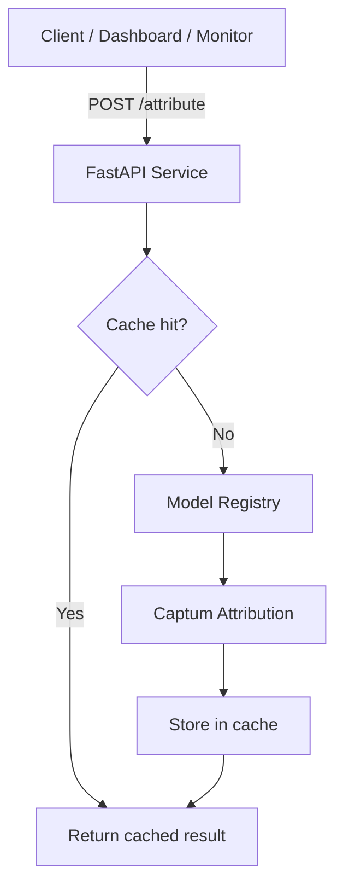

<!-- _class: lead -->

# Building an Interpretability API
## FastAPI + Captum in Production

Module 08 · Production Interpretability Pipelines

<!-- Speaker notes: This deck covers turning Captum attributions into a real API. The goal is a stateless, cacheable, horizontally scalable service that other systems can call programmatically. Captum Insights gave us a UI for exploration — this gives us a programmatic interface for production use. -->

---

## When Insights Is Not Enough

<div class="columns">

**Captum Insights**
- Browser UI
- Real-time interactive
- Development / demos
- Single machine
- No authentication
- No batch processing

**Attribution API**
- JSON endpoint
- Programmatic access
- Production pipelines
- Scales horizontally
- Authenticatable
- Batch support

</div>

<!-- Speaker notes: The decision is straightforward: if a human is looking at attributions, use Insights. If code is consuming attributions — dashboards, compliance tools, monitoring systems — build an API. The two tools are complementary, not competing. -->

---

## API Architecture



<!-- Speaker notes: The cache is the most important performance optimization. Many attribution requests are repeated — same image, same method, different dashboard user. A 16-byte hash key lets you return previously computed attributions in under 1ms instead of re-running IG for 300ms. -->

---

## Request / Response Shape

**Request:**
```json
{
  "model_id": "resnet18_imagenet",
  "method": "integrated_gradients",
  "inputs": [[...]],
  "input_shape": [3, 224, 224],
  "target": 281,
  "baseline": "zero",
  "n_steps": 50
}
```

**Response:**
```json
{
  "attributions": [[...]],
  "prediction": {"class_index": 281, "confidence": 0.94},
  "metadata": {"compute_time_ms": 312, "cache_hit": false}
}
```

<!-- Speaker notes: The input_shape field is essential because JSON arrays lose dimension information. The client serializes the tensor as a flat list and provides input_shape separately so the server can reconstruct the correct tensor shape. Attributions are returned in the same shape as inputs. -->

---

## Pydantic Validation

```python
from pydantic import BaseModel, validator
from typing import Literal

class AttributionRequest(BaseModel):
    model_id: str
    method: Literal["integrated_gradients", "gradient_shap",
                    "saliency", "gradcam", "layer_ig"]
    inputs: List[List[float]]
    input_shape: List[int]
    target: int
    baseline: Literal["zero", "mean", "noise"] = "zero"
    n_steps: int = 50

    @validator("n_steps")
    def validate_n_steps(cls, v):
        if not 10 <= v <= 500:
            raise ValueError("n_steps must be between 10 and 500")
        return v
```

**Pydantic rejects invalid requests before they reach Captum.**

<!-- Speaker notes: The Literal type for method is critical — it prevents arbitrary strings reaching the attribution dispatch logic. The n_steps validator catches both too-small values (inaccurate) and too-large values (timeout risk). FastAPI returns a 422 Unprocessable Entity automatically for validation failures. -->

---

## Model Registry

```python
from dataclasses import dataclass
import threading

@dataclass
class RegisteredModel:
    model: torch.nn.Module
    input_shape: tuple
    n_classes: int
    class_names: Optional[list] = None
    device: str = "cpu"
    attribution_layer: Optional[Any] = None

class ModelRegistry:
    def __init__(self):
        self._models: Dict[str, RegisteredModel] = {}
        self._lock = threading.Lock()

    def register(self, model_id: str, reg: RegisteredModel):
        with self._lock:
            self._models[model_id] = reg

    def get(self, model_id: str) -> RegisteredModel:
        with self._lock:
            if model_id not in self._models:
                raise KeyError(f"Model '{model_id}' not registered")
            return self._models[model_id]
```

<!-- Speaker notes: The threading.Lock is mandatory when running with multiple Uvicorn workers in the same process. Without it, concurrent requests can cause race conditions during model lookup or registration. Models are loaded once at startup in the lifespan context, then read-only during serving. -->

---

## Attribution Dispatch

```python
def compute_attribution(model, method, inputs, baseline,
                         target, n_steps, return_delta,
                         attribution_layer=None):
    def forward(x):
        return model(x)

    if method == "integrated_gradients":
        ig = IntegratedGradients(forward)
        return ig.attribute(inputs, baseline, target=target,
                            n_steps=n_steps,
                            return_convergence_delta=return_delta)

    elif method == "saliency":
        return Saliency(forward).attribute(inputs, target=target)

    elif method == "gradcam":
        return LayerGradCam(forward, attribution_layer).attribute(
            inputs, target=target)

    elif method == "gradient_shap":
        bg = baseline.expand(8, *baseline.shape[1:])
        return GradientShap(forward).attribute(
            inputs, bg, n_samples=50, target=target)
```

<!-- Speaker notes: The dispatch pattern is clean because each Captum method shares the same basic interface: attribute(inputs, baseline, target). GradientShap is the exception — it needs multiple baselines, so we expand the single baseline to a small background set. GradCAM needs a layer reference, which comes from the ModelRegistry. -->

---

## Attribution Caching

```python
import hashlib, json

class AttributionCache:
    def _cache_key(self, model_id, method, inputs_np,
                   target, baseline_type, n_steps):
        payload = {
            "model_id": model_id,
            "method": method,
            "inputs_hash": hashlib.md5(inputs_np.tobytes()).hexdigest(),
            "target": target,
            "baseline": baseline_type,
            "n_steps": n_steps,
        }
        return hashlib.sha256(
            json.dumps(payload, sort_keys=True).encode()
        ).hexdigest()[:16]
```

**Cache key uniquely identifies:** model + method + input + target + baseline + steps

**Eviction:** LRU with configurable max_size (default: 512 entries)

<!-- Speaker notes: The MD5 hash of the raw numpy bytes is the fastest way to fingerprint an input tensor. The outer SHA256 produces a stable 16-character hex key for the dict. Do not use Python hash() — it is not deterministic across processes or Python versions. -->

---

## The Attribution Endpoint

```python
@app.post("/attribute")
async def attribute(request: AttributionRequest):
    # 1. Resolve model → 404 if unknown
    registered = registry.get(request.model_id)

    # 2. Reconstruct tensor
    inputs_t = torch.tensor(request.inputs).reshape(
        request.input_shape).unsqueeze(0)

    # 3. Cache lookup → return immediately if hit
    cache_key = attribution_cache._cache_key(...)
    if cached := attribution_cache.get(cache_key):
        return {**cached, "metadata": {**cached["metadata"],
                                        "cache_hit": True}}

    # 4. Build baseline, run attribution
    baseline_t = build_baseline(inputs_t, request.baseline)
    attr_result = compute_attribution(...)

    # 5. Serialize → cache → return
    response = build_response(attr_result, ...)
    attribution_cache.set(cache_key, response)
    return response
```

<!-- Speaker notes: The five-step pattern — resolve, reconstruct, cache check, compute, serialize — is the complete attribution request lifecycle. Steps 1-3 are fast (sub-millisecond). Step 4 is where all the time goes. Step 5 ensures the next identical request returns in under 1ms. -->

---

## Startup Lifespan

```python
from contextlib import asynccontextmanager

@asynccontextmanager
async def lifespan(app: FastAPI):
    # ── STARTUP ──────────────────────────────────
    weights = ResNet18_Weights.IMAGENET1K_V1
    model = resnet18(weights=weights).eval()

    registry.register("resnet18_imagenet", RegisteredModel(
        model=model,
        input_shape=(3, 224, 224),
        n_classes=1000,
        attribution_layer=model.layer4[-1],
    ))
    logger.info("Models ready")
    yield
    # ── SHUTDOWN ─────────────────────────────────
    logger.info("Shutting down")

app = FastAPI(lifespan=lifespan)
```

<!-- Speaker notes: The lifespan context manager replaced the deprecated on_event("startup") pattern in FastAPI 0.95+. Models loaded here persist for the lifetime of the worker process. In a multi-worker deployment, each worker loads its own copy. For very large models, use shared memory or a model server like TorchServe instead. -->

---

## Batch Endpoint

```python
@app.post("/attribute/batch")
async def attribute_batch(batch_request: BatchAttributionRequest):
    semaphore = asyncio.Semaphore(batch_request.max_parallel)

    async def bounded(req):
        async with semaphore:
            return await attribute(req)

    results = await asyncio.gather(
        *[bounded(r) for r in batch_request.requests],
        return_exceptions=True
    )

    return {
        "results": [
            r if not isinstance(r, Exception) else {"error": str(r)}
            for r in results
        ],
        "total": len(results),
        "errors": sum(1 for r in results if isinstance(r, Exception)),
    }
```

<!-- Speaker notes: The semaphore limits concurrent attribution computations to prevent memory exhaustion. max_parallel defaults to 4, which works well on a 4-core CPU. On GPU, set max_parallel=1 since GPU attribution is already parallel internally. The return_exceptions=True ensures one failing request does not cancel the whole batch. -->

---

## Health and Observability

```python
@app.get("/health")
async def health():
    return {"status": "ok", "models": registry.list_models()}

@app.get("/cache/stats")
async def cache_stats():
    return attribution_cache.stats()
    # → {"size": 127, "max_size": 512}
```

**Deployment:**

```bash
# 4 workers, 120s timeout for slow IG requests
gunicorn interpretability_service:app \
    -w 4 -k uvicorn.workers.UvicornWorker \
    --bind 0.0.0.0:8080 --timeout 120
```

<!-- Speaker notes: The /health endpoint is the minimum for Kubernetes liveness probes. Add a /ready endpoint that checks if models are loaded for readiness probes. The 120-second timeout is generous but necessary — IG with n_steps=500 on a large model can take 30-90 seconds on CPU. In production, enforce n_steps caps via Pydantic validation. -->

---

## Performance Reference

| Method | 224×224 image | CPU time | GPU time |
|--------|--------------|----------|----------|
| Saliency | — | ~5 ms | ~2 ms |
| GradCAM | — | ~8 ms | ~3 ms |
| GradientSHAP (50 samples) | — | ~80 ms | ~15 ms |
| IG (n_steps=50) | — | ~300 ms | ~40 ms |
| IG (n_steps=200) | — | ~1200 ms | ~150 ms |

**Rule:** Serve Saliency / GradCAM for real-time dashboards. Reserve IG for audit reports.

<!-- Speaker notes: These numbers are approximate for ResNet-18 on a modern 8-core CPU / T4 GPU. Larger models (ResNet-50, ViT-L) multiply times by 3-5x. The practical production rule is: use the fastest method that meets the explanation quality bar. Saliency is sufficient for most real-time use cases; IG is for compliance-grade explanations. -->

---

## Summary

| Component | Role |
|-----------|------|
| `ModelRegistry` | Thread-safe model store |
| `AttributionRequest` | Pydantic-validated request schema |
| `build_baseline()` | Zero / mean / noise baseline factory |
| `compute_attribution()` | Captum method dispatch |
| `AttributionCache` | LRU cache, MD5-keyed |
| `POST /attribute` | Single attribution endpoint |
| `POST /attribute/batch` | Concurrent batch with semaphore |
| `GET /health` | Infrastructure liveness probe |

<!-- Speaker notes: The complete service is about 300 lines of Python. The template in the course templates directory provides the full implementation ready for deployment. Copy it, register your models in the lifespan function, and you have a production interpretability service. -->
