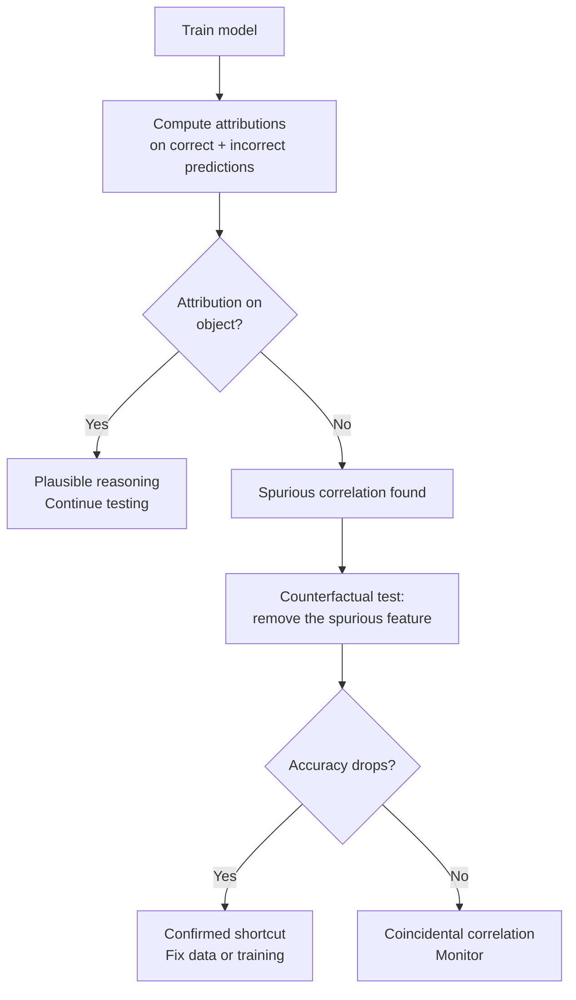

<!-- _class: lead -->

# Model Debugging with Attribution Methods
## Finding What Your Model Actually Learned

Module 08 · Production Interpretability Pipelines

<!-- Speaker notes: This deck is about using Captum as a debugging tool, not just an explanation tool. Attribution methods are most valuable when they reveal that a model is right for the wrong reasons — high accuracy hiding a dangerous shortcut. We cover the full debugging workflow from suspicious prediction to root cause to fix. -->

---

## The Shortcut Learning Problem

High accuracy does not guarantee correct reasoning.

**Real-world examples:**
- Pneumonia detector → learned scanner artifacts, not lung pathology
- Wolf/husky classifier → learned snow background
- Skin lesion classifier → learned surgical markers as "malignant"
- NLP sentiment model → learned annotation format, not sentiment

**Each was caught using attribution analysis after deployment.**

<!-- Speaker notes: Geirhos et al. (2020) coined "shortcut learning" for this pattern. Models that learn shortcuts generalize well in-distribution but fail catastrophically on distribution shifts. Attribution methods are the primary tool for detecting shortcuts before they cause harm in production. -->

---

## The Debugging Workflow



<!-- Speaker notes: The key test is counterfactual: if you remove the feature the model is attributing to, does accuracy drop? If yes, the model genuinely relies on that feature. The question then is whether that feature is a legitimate signal or a dataset artifact. -->

---

## Setting Up Attribution Debugging

```python
from captum.attr import IntegratedGradients, Saliency
import torch

model.eval()
ig = IntegratedGradients(lambda x: model(x))

def attribution_for_prediction(inputs, target_class, n_steps=50):
    baseline = torch.zeros_like(inputs)
    attrs, delta = ig.attribute(
        inputs, baseline,
        target=target_class,
        n_steps=n_steps,
        return_convergence_delta=True,
    )
    # Aggregate channels → (H, W)
    return (
        attrs.abs().sum(dim=1).squeeze(0).detach(),  # unsigned
        attrs.sum(dim=1).squeeze(0).detach(),          # signed
        delta.item()                                   # completeness
    )
```

<!-- Speaker notes: Start with Saliency for fast scanning across many examples, then switch to IG for examples that look suspicious. Saliency is ~50x faster and often sufficient to detect obvious shortcuts. Use IG for the final audit report where completeness guarantees matter. -->

---

## Debugging Visualization

```python
import matplotlib.pyplot as plt, matplotlib.cm as cm

def debug_plot(image_tensor, attr_map, title=""):
    mean = torch.tensor([0.485, 0.456, 0.406]).view(3,1,1)
    std  = torch.tensor([0.229, 0.224, 0.225]).view(3,1,1)
    img = (image_tensor.squeeze(0) * std + mean).clamp(0, 1)
    img_np = img.permute(1, 2, 0).numpy()

    attr_np = attr_map.numpy()
    attr_np = (attr_np - attr_np.min()) / (attr_np.max() - attr_np.min() + 1e-8)

    overlay = 0.6*img_np + 0.4*cm.hot(attr_np)[:,:,:3]

    fig, axes = plt.subplots(1, 3, figsize=(12, 4))
    axes[0].imshow(img_np);         axes[0].set_title("Input")
    axes[1].imshow(attr_np, cmap="hot"); axes[1].set_title("Attribution")
    axes[2].imshow(overlay.clip(0,1));   axes[2].set_title("Overlay")
    [ax.axis("off") for ax in axes]
    fig.suptitle(title, fontweight="bold")
```

<!-- Speaker notes: The three-panel layout is the standard debugging view. Input shows what the model saw, Attribution shows where it looked, Overlay combines both. When attribution concentrates on background (snow, sky, hospital text) rather than the object, you have found a shortcut. -->

---

## Pattern 1: Background Attribution

**Signal:** Attribution concentrates in background region, not on the object.

```python
def measure_background_attribution(attrs_map, object_mask):
    """
    object_mask: binary tensor, 1=object pixels.
    Returns fraction of attribution outside the object.
    """
    total = attrs_map.sum().item()
    object_attr = (attrs_map * object_mask).sum().item()
    background_fraction = 1 - object_attr / (total + 1e-8)
    return {
        "background_fraction": background_fraction,
        "diagnosis": "spurious" if background_fraction > 0.5 else "plausible"
    }
```

**Fix:** Background augmentation, foreground masking during training, or object-centric datasets.

<!-- Speaker notes: The threshold of 0.5 is a starting point. For fine-grained classifiers that genuinely use context (bird-species classifiers often use habitat), a high background fraction can be legitimate. Always combine quantitative thresholds with visual inspection. -->

---

## Pattern 2: Metadata / Artifact Attribution

**Signal:** High attribution on image borders, overlaid text, or systematic pixel patterns.

```python
def border_attribution_fraction(attrs_map, border_fraction=0.1):
    H, W = attrs_map.shape
    bh, bw = int(H * border_fraction), int(W * border_fraction)
    mask = torch.zeros_like(attrs_map)
    mask[:bh, :] = 1;  mask[-bh:, :] = 1
    mask[:, :bw] = 1;  mask[:, -bw:] = 1
    total = attrs_map.sum().item()
    return (attrs_map * mask).sum().item() / (total + 1e-8)

# Screen dataset: flag examples with >20% border attribution
flagged = [i for i, (img, lbl) in enumerate(dataloader)
           if border_attribution_fraction(
               compute_attr(img).abs().sum(dim=1).squeeze(0)
           ) > 0.20]
```

<!-- Speaker notes: Border artifacts are especially common in medical imaging where DICOM metadata is burned into image borders, and in scraped web images with watermarks. The 20% threshold catches most artifacts while avoiding false positives from legitimate edge features. -->

---

## Pattern 3: Misclassification Root Cause

**Dual attribution: what was missing vs. what fired wrongly**

```python
def debug_misclassification(model, image, true_label, pred_label, n_steps=50):
    ig = IntegratedGradients(lambda x: model(x))
    baseline = torch.zeros_like(image)

    # What supports the TRUE class (but was insufficient)?
    attrs_true = ig.attribute(image, baseline,
                               target=true_label, n_steps=n_steps)

    # What drove the WRONG prediction?
    attrs_pred = ig.attribute(image, baseline,
                               target=pred_label, n_steps=n_steps)

    return (
        attrs_true.abs().sum(dim=1).squeeze(0),   # missed signal
        attrs_pred.abs().sum(dim=1).squeeze(0),    # spurious signal
    )
```

<!-- Speaker notes: This is the most powerful debugging technique. Running IG toward both the true class and the predicted class on the same misclassified example tells you: (1) what evidence for the correct class was present but ignored, and (2) what drove the wrong answer. The spurious attribution map is your debugging target. -->

---

## Attribution-Based Regulatory Reporting

High-stakes deployments require per-decision explanations:

```python
@dataclass
class AttributionReport:
    report_id: str
    model_id: str
    model_version: str
    prediction_timestamp: str
    input_hash: str                  # SHA256 of raw input
    predicted_class: str
    predicted_confidence: float
    attribution_method: str
    top_features: List[dict]         # [{name, attribution, rank}, ...]
    convergence_delta: float         # completeness check
    baseline_description: str
```

**Completeness requirement:** $|\delta| < 0.05$ for compliance-grade reports.

<!-- Speaker notes: The convergence delta is the difference between the attribution sum and f(x) - f(baseline). Integrated Gradients guarantees this is zero in theory, but numerical integration introduces error. For compliance reporting, cap n_steps at 200+ to keep delta below 0.05. Include the delta in the report so auditors can verify the attribution method was run correctly. -->

---

## Monitoring Attribution Drift

```python
from scipy.stats import wasserstein_distance

class AttributionDriftMonitor:
    """Detect distribution shifts via attribution statistics."""

    def record_reference(self, dataloader, class_idx, n=200):
        """Compute reference attribution magnitude distribution."""
        # Record mean |attribution| per example for reference period
        ...

    def measure_drift(self, dataloader, class_idx, n=200):
        """Wasserstein distance between current and reference."""
        w_dist = wasserstein_distance(
            self.reference_distributions[class_idx],
            current_attributions
        )
        return {"drift_detected": w_dist > 0.1,
                "wasserstein_distance": w_dist}
```

**Attribution drift precedes accuracy drift** — catch distribution shift early.

<!-- Speaker notes: Wasserstein distance (Earth Mover's Distance) between attribution distributions is a distribution-shift signal that does not require labels. When the input distribution shifts, the model's attribution patterns change before accuracy degrades — because accuracy requires ground-truth labels that are often delayed in production monitoring. -->

---

## Debugging Summary Table

| Pattern | Signal | Measurement | Fix |
|---------|--------|-------------|-----|
| Background attribution | Attribution outside object | background_fraction > 0.5 | Background augmentation |
| Border artifacts | Attribution in image border | border_fraction > 0.2 | Crop borders, deduplicate |
| Texture bias | Disagrees with edge mask | Low shape attribution | Stylized training data |
| Wrong-class signal | High pred-class attribution | Dual attribution map | Dataset rebalancing |
| Distribution drift | Attribution magnitude shift | Wasserstein distance > 0.1 | Monitor + retrain trigger |

<!-- Speaker notes: Keep this table as a reference checklist for debugging sessions. Work through each pattern systematically on a new model before deployment. A 2-hour debugging session before deployment is far cheaper than a production incident caused by a shortcut. -->

---

## Debugging Session Checklist

Before deploying any classification model:

1. Visualize IG heatmaps for 10 examples per class
2. Compute border attribution fraction (flag if >20%)
3. Compare correct vs. incorrect predictions with dual attribution
4. Check attribution overlap with object segmentation mask
5. Run AttributionDriftMonitor reference period recording
6. Generate AttributionReport for 3 examples per class
7. Verify $|\delta| < 0.05$ for all reports
8. Document spurious signals found and mitigations applied

<!-- Speaker notes: This checklist ensures you have looked at the model through multiple lenses before deployment. Steps 1-4 are about finding shortcuts. Steps 5-7 are about setting up ongoing monitoring. Step 8 creates the audit trail that regulators and compliance teams expect. -->
