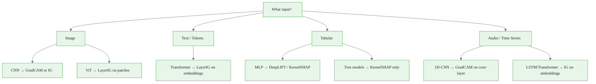
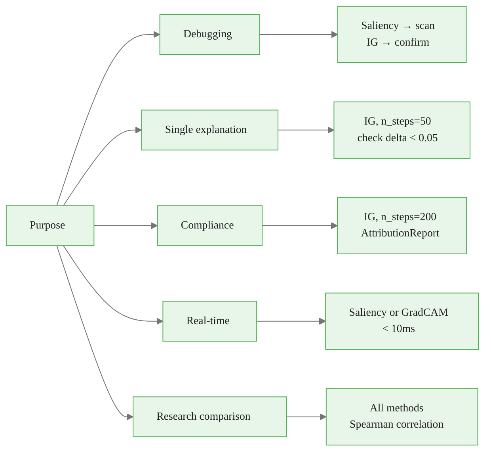

<!-- _class: lead -->

# Attribution Method Selection
## A Comprehensive Decision Framework

Module 08 · Production Interpretability Pipelines

<!-- Speaker notes: This is the capstone guide for the course. After 7 modules covering individual methods in depth, this deck synthesizes everything into a decision framework you can apply to any new project. The goal is to answer: given this model and this use case, which method do I reach for first? -->

---

## The Core Trade-Off Space

Every method trades across four dimensions:

| Dimension | Fastest | Slowest |
|-----------|---------|---------|
| Speed | Saliency (1 backward pass) | KernelSHAP (1000+ forward passes) |
| Faithfulness | Saliency (local only) | IG (completeness guaranteed) |
| Stability | IG (deterministic) | GradientSHAP (stochastic) |
| Scope | Pixel attribution | Concept attribution (TCAV) |

**No method wins on all dimensions.**

<!-- Speaker notes: The trade-off table is the first thing to internalize. Speed and faithfulness trade against each other — the most accurate methods (IG, KernelSHAP) are the slowest. The framework helps navigate these trade-offs based on what actually matters for your use case. -->

<div class="callout-info">
This is a foundational concept for the rest of the module.
</div>
---

## Primary Decision: Input Type



<!-- Speaker notes: Start with input type because it determines which methods are even applicable. GradCAM requires conv layers — inapplicable to ViTs or MLPs. Gradient methods require differentiability — inapplicable to tree models. Get the architecture constraint right first, then optimize within the feasible set. -->

<div class="callout-key">
This is the key takeaway from this section.
</div>
---

## CNN Models: Method Map

| Use Case | Method | Layer Target |
|----------|--------|-------------|
| Fast spatial heatmap | GradCAM | Last conv layer |
| Pixel-level + completeness | IG | Input image |
| Shapley guarantees + speed | GradientSHAP | Input image |
| Model-agnostic / black-box | KernelSHAP | — |
| Stakeholder demo | GradCAM overlay | Last conv layer |
| Compliance audit | IG (n\_steps=200) | Input image |

```python
# ResNet-18 GradCAM on last conv layer
from captum.attr import LayerGradCam
gc = LayerGradCam(lambda x: model(x), model.layer4[-1])
attrs = gc.attribute(inputs, target=pred_class)
```

<!-- Speaker notes: For CNNs, GradCAM is the default starting point — one backward pass, spatial visualization, no baseline needed. Switch to IG when you need pixel-level precision or the completeness guarantee for audit purposes. GradientSHAP sits in between: faster than IG but needs multiple baselines. -->

<div class="callout-warning">
Common misconception — read carefully.
</div>
---

## Text / Transformer Models: Method Map

| Task | Method | Target Layer |
|------|--------|-------------|
| Token attribution | LayerIntegratedGradients | Embedding layer |
| Layer importance | LayerConductance | Each encoder layer |
| Attention exploration | Mean attention | Last layer, mean head |
| Neuron analysis | NeuronIG | Specific attention heads |

```python
from captum.attr import LayerIntegratedGradients

lig = LayerIntegratedGradients(forward_func, model.bert.embeddings)
attrs, delta = lig.attribute(
    input_ids, baseline_ids,
    additional_forward_args=(attention_mask, token_type_ids),
    target=pred_class,
    n_steps=50,
    return_convergence_delta=True,
)
```

<!-- Speaker notes: For text models, the critical insight is that you cannot differentiate with respect to discrete token IDs — you differentiate with respect to continuous token embeddings. LayerIntegratedGradients handles this by targeting the embedding layer. The result is one attribution score per token (after summing over the embedding dimension). -->

<div class="callout-insight">
This insight connects theory to practice.
</div>
---

## The Attention Warning

<div class="columns">

**Attention weights**
- Information routing
- Softmax-normalized
- Architecture-specific
- No baseline concept
- Fast to extract

**Attribution scores (IG)**
- Counterfactual impact
- Unbounded, signed
- Architecture-agnostic (via LayerIG)
- Completeness guarantee
- Slower to compute

</div>

**Attention and attribution disagree on negation, adversarial inputs, and complex syntax. Use attention for exploration, IG for explanation.**

<!-- Speaker notes: Jain & Wallace (2019) showed empirically that attention and attribution disagree on which tokens are important. The intuition: a high-attention token does not necessarily change the prediction if you remove it. Attribution measures that counterfactual change; attention does not. This is the most important distinction in NLP interpretability. -->

---

## Tabular / MLP Models: Method Map

| Need | Method | Baseline |
|------|--------|----------|
| Speed + exact propagation | DeepLIFT | Training mean |
| Shapley guarantees | DeepLIFTSHAP | 50-100 training samples |
| Model-agnostic | KernelSHAP | Training mean |
| Tree-based (non-differentiable) | KernelSHAP | Training mean |

```python
from captum.attr import DeepLiftShap

background = train_data[torch.randperm(len(train_data))[:50]]
dl_shap = DeepLiftShap(model)
attrs, delta = dl_shap.attribute(
    inputs, background, target=1,
    return_convergence_delta=True,
)
```

<!-- Speaker notes: For tabular data with MLPs, DeepLIFTSHAP is often the best choice: it combines DeepLIFT's fast exact propagation with SHAP's theoretical guarantees by averaging over multiple baselines. The training-set mean baseline is the most interpretable — "what would the model predict for an average example?" -->

---

## Decision by Purpose



<!-- Speaker notes: The purpose dimension is as important as the architecture dimension. Two practitioners using the same CNN for different purposes should use different methods: the debugging practitioner wants speed and scan coverage; the compliance practitioner needs completeness guarantees and audit trails. -->

---

## Latency vs. Quality Guide

| Latency Budget | Method | Quality |
|----------------|--------|---------|
| < 10ms | Saliency or GradCAM | Local gradient only |
| < 50ms | GradientSHAP (n=10) | Shapley approx |
| < 200ms | IG (n_steps=20) | Good completeness |
| < 500ms | IG (n_steps=50) | Standard production |
| > 500ms | IG (n_steps=200) | Compliance-grade |

**Match your latency budget to your use case. Real-time dashboards need saliency; audit reports need IG with 200 steps.**

<!-- Speaker notes: These numbers are for ResNet-18 on CPU. GPU is approximately 10x faster, pushing most use cases toward IG. The key insight is that n_steps is not a fixed parameter — it is a dial that trades time for accuracy. Start at n_steps=50 and increase only when delta is above your tolerance. -->

---

## Baseline Selection Cheatsheet

| Domain | Standard Baseline | Notes |
|--------|------------------|-------|
| ImageNet CNN | Black image (zeros) | Models trained on mean-subtracted data |
| Medical images | Dataset mean | Black may produce artifacts |
| BERT text | PAD token ID (`[PAD]`) | Near-neutral prediction |
| GPT text | Zero embeddings | No PAD concept in GPT |
| Tabular | Training set mean | "Typical example" reference |
| Audio | Silence (zeros) | Natural absence of signal |

**Multiple baselines (GradientSHAP / DeepLIFTSHAP): 50-200 random training samples**

<!-- Speaker notes: The baseline choice changes attribution values dramatically. A black-image baseline for a model trained on dark-background images attributes everything to the background. A mean-image baseline is often more stable. When in doubt, try two baseline types and check if your conclusions change — if they do, report both. -->

---

## When Methods Disagree

| Pair | Reason for disagreement | Use |
|------|------------------------|-----|
| Saliency vs IG | IG integrates path, saliency is local | IG for saturated regions |
| IG vs GradCAM | Different granularity (pixel vs spatial) | Both, different questions |
| IG vs Attention | Different formalism entirely | IG for explanation |
| GradientSHAP vs IG | Stochastic vs deterministic | Average 5 GradShap runs |

**Strong agreement → robust importance signal**
**Strong disagreement → focus analysis here, report method sensitivity**

<!-- Speaker notes: Disagreement between methods is information, not a problem. When Saliency and IG strongly disagree, it usually means there is saturation in that region — the gradient at the input is near zero, but the integrated path shows the region is important. That's a meaningful finding about the model's behavior. -->

---

## Complete Method Reference

| Method | Architecture | Complete | Speed | SHAP Axioms |
|--------|-------------|----------|-------|-------------|
| Saliency | Any diff. | No | Fastest | No |
| GradCAM | CNN | No | Fastest | No |
| Gradient×Input | Any diff. | No | Fast | Partial |
| IG | Any diff. | Yes | Medium | Sensitivity + Linearity |
| DeepLIFT | MLP/CNN | Yes | Fast | Partial |
| DeepLIFTSHAP | MLP/CNN | Yes (E) | Fast | Full |
| GradientSHAP | Any diff. | Yes (E) | Medium | Full |
| KernelSHAP | Any | Yes (E) | Slow | Full |
| LayerIG | Any + layer | Yes | Medium | Sensitivity + Linearity |
| LayerConductance | Any + layer | Yes | Medium | Sensitivity + Linearity |
| TCAV | Any + concepts | No | Slow | N/A |

*E = in expectation over background distribution*

<!-- Speaker notes: This table is the final reference for method selection. The "Complete" column separates methods with the completeness axiom from those without it. The "SHAP Axioms" column shows which Shapley axioms each method satisfies. For compliance work, the combination of "Yes" completeness and at least Sensitivity + Linearity is the minimum bar. -->

---

## Course Synthesis

You now have the full Captum toolkit:

| Module | Methods Covered |
|--------|----------------|
| 01-02 | IG, Saliency, Gradient×Input |
| 03 | LayerIG, LayerConductance, NeuronIG |
| 04 | GradCAM, Occlusion, Perturbation |
| 05 | KernelSHAP, GradientSHAP, DeepLIFT |
| 06 | TCAV, TracIn, SimilarityInfluence |
| 07 | LayerIG for text, attention vs. attribution |
| 08 | Insights, API, debugging, this framework |

**Apply this decision framework to every new project.**

<!-- Speaker notes: This slide closes the course. Students have covered every major attribution family: gradient-based (Modules 1-4), SHAP-family (Module 5), concept and example-based (Module 6), NLP-specific (Module 7), and production deployment (Module 8). The decision framework in this guide is the synthesis that connects all of them. -->
