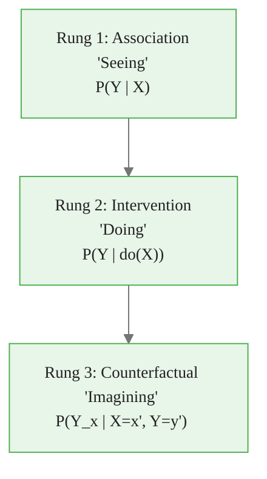
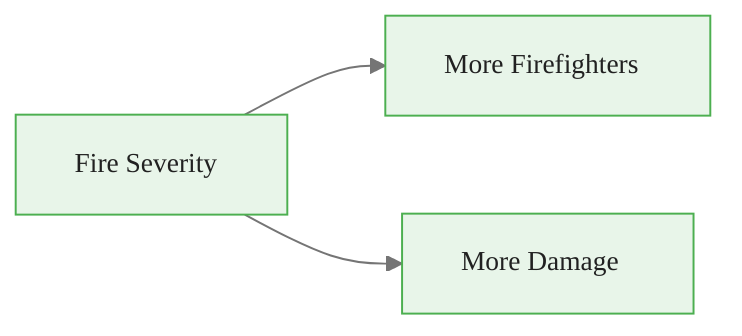
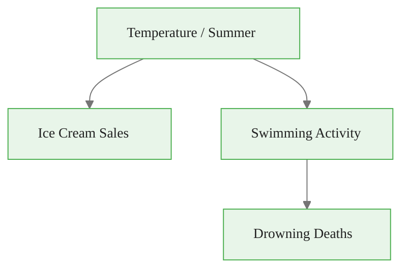
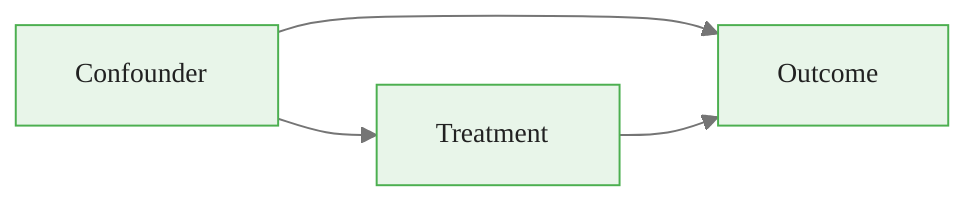
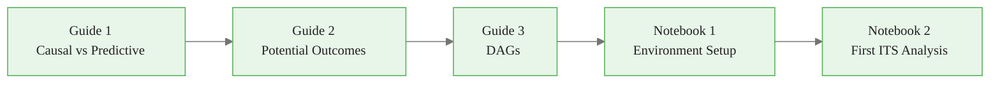

<!-- _class: lead -->

# Causal vs Predictive Thinking

## Why Correlation Is Not Enough for Decisions

### Causal Inference with CausalPy — Module 00

<!-- Speaker notes: This opening module sets the conceptual foundation for the entire course. Students may arrive thinking that causal inference is just "better statistics." The goal of this deck is to create genuine cognitive dissonance: they will see cases where a perfect predictive model gives completely wrong decision guidance. That dissonance motivates everything that follows. -->

---

# Two Kinds of Questions

**Prediction asks:**
> Given what I observe, what will happen?

**Causal inference asks:**
> If I intervene, what will happen?

Both use data. Both use math. But they answer **fundamentally different** questions.

<!-- Speaker notes: Emphasize that the distinction is not about technique or tooling — it is about the question being asked. Many practitioners have been trained exclusively in predictive modeling and need to explicitly recognize when they are in a causal setting. A good heuristic: if the word "if we do X" appears in the question, it is probably causal. -->

---

# The Ladder of Causation

All machine learning lives on **Rung 1**. Causal inference aims for **Rung 2 and 3**.

<!-- Speaker notes: Pearl's ladder is the clearest framing of why machine learning cannot, in principle, answer causal questions from observational data alone. A language model, a random forest, a neural network — all are pattern matchers on Rung 1. They cannot climb the ladder without causal assumptions. The good news: with the right design or the right assumptions, we can climb to Rung 2. -->

---

# Firefighters Cause Fire Damage?

Data shows: more firefighters at a fire → more property damage.

**Predictive model conclusion:** Reduce firefighter deployment to reduce damage.

**Causal reality:**

The association is real. The causal arrow is backwards.

<!-- Speaker notes: This is a classic confounding example. The fire severity causes both the number of firefighters dispatched and the amount of damage. There is no direct causal link from firefighters to damage (in fact, firefighters reduce damage for a given severity level). A predictive model correctly captures the correlation but gives catastrophically wrong policy advice. -->

Insight: Predictive model conclusion:

---

# Ice Cream and Drownings

Monthly correlation between ice cream sales and drowning deaths: **r = 0.87**

Ice cream sales perfectly predict drowning deaths.

Banning ice cream would not save a single life.

<!-- Speaker notes: The ice cream and drowning example is memorable precisely because it is absurd. But the statistical pattern is genuine. This is confounding by a third variable — temperature and the summer season drive both. Notice that the predictive model is correct: ice cream sales really do predict drownings. The model is just not causal. A policy based on it would be both ineffective and harmful. -->

---

# Simpson's Paradox

| Group | Treatment A | Treatment B |
|-------|-------------|-------------|
| Mild cases | 80% recovery | 70% recovery |
| Severe cases | 40% recovery | 30% recovery |
| **Overall** | **50% recovery** | **67% recovery** |

Treatment A is better for **every subgroup** but looks worse overall.

Why? Severe patients preferentially receive treatment B.

<!-- Speaker notes: Simpson's Paradox illustrates how aggregation hides causal structure. The key question is: which analysis is causally correct? The subgroup analysis, because disease severity is a confounder that affects both treatment assignment and outcome. A predictive model trained on the overall data would recommend treatment B — harming every patient. This motivates the need for explicit causal reasoning, not just good statistics. -->

Warning:  |

Treatment A is better for 

---

# When Prediction Suffices

Prediction is the right tool when:

- You are forecasting a **naturally unfolding** process
- You **cannot intervene** on the outcome
- The **environment is stable** — deployment won't change behavior
- You are **observing**, not deciding

**Examples:** Weather forecasting, population projections, anomaly detection

<!-- Speaker notes: It is important not to oversell causal inference. Predictive models are the correct tool for many important problems. The danger is applying predictive thinking to causal questions, not using predictive models per se. A weather forecast is genuinely predictive — meteorologists are not going to intervene in the atmosphere. But the moment you ask "should we close the airport?", you have moved to a decision problem that requires causal thinking. -->

---

# When You Need Causal Inference

Causal methods are required when:

- **Evaluating a policy** — did this regulation work?
- **Estimating treatment effects** — what is the drug's efficacy?
- **Making decisions** — which action maximizes benefit?
- **Distribution shift is expected** — your intervention changes the world

**Examples:** Policy evaluation, A/B testing with carryover, personalized medicine

<!-- Speaker notes: The key marker is the presence of an intervention or decision. Any time you are asking "what would happen if we did X differently," you need causal inference. This includes retrospective questions like "did our policy work?" — because you are implicitly comparing to a counterfactual world where the policy was not implemented. -->

---

# The Fundamental Problem of Causal Inference

For unit $i$, we observe **either** $Y_i(1)$ (treated) **or** $Y_i(0)$ (control).

**Never both simultaneously.**

$$\text{Treatment Effect}_i = Y_i(1) - Y_i(0) = \text{unidentifiable for any individual}$$

We can only estimate **averages** across groups.

<!-- Speaker notes: This is the deepest conceptual point in all of causal inference. The treatment effect for an individual is fundamentally unobservable — you cannot simultaneously give a patient a drug and withhold it. All of causal inference is the science of credibly estimating treatment effects despite this impossibility, by constructing plausible counterfactuals from groups of similar units. Every method we study in this course is a strategy for doing this. -->

---

# Constructing Counterfactuals

**Randomized Experiment**
Random assignment ensures treated and control groups are comparable on average.

$E[Y(0) | \text{treated}] = E[Y(0) | \text{control}]$

**Observational Methods**
Use design, timing, or geography to approximate random assignment.

ITS, DiD, SC, RD, IV — each exploits a different source of quasi-random variation.

<!-- Speaker notes: The randomized controlled trial (RCT) is the gold standard because randomization guarantees that the control group is a valid counterfactual for the treated group in expectation. In observational settings, we cannot randomize, so we need a credible argument that our comparison group would have behaved like the treated group absent treatment. Each method in this course provides a different structure for making that argument. -->

---

# Confounding: The Core Challenge

A **confounder** is a variable that affects both treatment assignment and the outcome.

Failing to account for confounders causes **omitted variable bias**.

Estimate $\hat{\beta}$ reflects both the true causal effect AND the confounder's influence.

<!-- Speaker notes: Confounding is why simply running a regression of outcome on treatment does not give you the causal effect. The estimated coefficient conflates the true causal effect with the spurious association induced by the confounder. In the exercise example, baseline health was a confounder. Methods like randomization, matching, and the designs in this course are all fundamentally about eliminating or modeling confounding. -->

---

# Regression Does Not Fix Confounding Automatically

Adding controls helps if:
- You observe the confounders
- The confounders are correctly specified
- You don't control for colliders or mediators

Controls hurt if:
- You control for a **collider** (a variable caused by both T and Y)
- You control for a **mediator** (the pathway through which T affects Y)

DAGs (Module 00 Guide 3) tell you which variables to control for.

<!-- Speaker notes: This slide introduces a crucial nuance. Students often believe that "controlling for more variables" is always better. It is not. Controlling for a collider (M-bias) can create a spurious association where none existed. Controlling for a mediator blocks the pathway you are trying to estimate. The only way to know which variables to include is to think explicitly about the causal structure — which is exactly what DAGs provide. -->

---

# Pearl's Do-Operator

**Prediction:** $P(Y | X = x)$ — conditioning on observing $X = x$

**Intervention:** $P(Y | do(X = x))$ — setting $X$ to $x$ by force

The difference matters when $X$ is not randomly assigned.

$$P(Y | X = x) \neq P(Y | do(X = x))$$

<!-- Speaker notes: The do-operator is Pearl's formal notation for distinguishing observation from intervention. When we write P(Y | X = x), we are conditioning on a subset of the world where X happened to equal x — but all the variables that cause X still operate. When we write P(Y | do(X=x)), we are surgically setting X to x and cutting all incoming arrows to X. This is what an intervention does. The do-calculus gives rules for when and how we can estimate do-expressions from observational data. -->

---

# The Methodological Toolkit

| Method | When to Use | Key Assumption |
|--------|-------------|----------------|
| **ITS** | Single treated unit, policy has a clear start date | Pre-trend would have continued |
| **Synthetic Control** | Single treated unit, pre-period data from donors | Donor units span the treated unit |
| **DiD** | Treated + control groups, panel data | Parallel trends |
| **RD** | Assignment based on a threshold | Continuity at threshold |
| **IV** | Endogenous treatment, valid instrument | Instrument affects Y only through T |

<!-- Speaker notes: This slide gives students a preview of the course arc. Each row is a different quasi-experimental design, and each makes a different structural assumption. The validity of the causal estimate depends entirely on the plausibility of the assumption — which in turn depends on domain knowledge. This is why "assumption transparency" is a core value of causal inference: you should always be explicit about what you are assuming and why. -->

---

# Predictive Model vs Causal Model: A Summary

**Predictive Model**
- Goal: minimize forecast error
- Assumptions: hidden in architecture
- Evaluation: held-out accuracy
- Environment: assumed stable
- Intervention: cannot reason about it

**Causal Model**
- Goal: identify effect of intervention
- Assumptions: explicit, testable
- Evaluation: plausibility of assumptions
- Environment: explicitly modeled
- Intervention: the whole point

<!-- Speaker notes: This comparison table crystallizes the core distinction. Note that "assumptions explicit and testable" is listed as a feature of causal models, not a limitation. In predictive modeling, assumptions are often implicit and invisible. In causal inference, you are forced to state your assumptions, which means others can challenge them, refine them, or find natural tests. This transparency is a strength, even when it feels uncomfortable. -->

---

# Key Pitfalls to Avoid

1. **Significant != Causal** — p-values measure precision, not causality
2. **Controlling for more != Better** — collider bias and mediator blocking are real
3. **Temporal order != Causation** — $X$ before $Y$ does not mean $X$ caused $Y$
4. **Both potential outcomes never observed** — individual effects are unidentifiable
5. **Stable world assumption** — your model may break as soon as you deploy it

<!-- Speaker notes: These five pitfalls come up repeatedly across all causal methods. Students should bookmark this slide — they will encounter each of these failure modes in real analysis. The stable world assumption (point 5) is particularly insidious in applied settings: the moment a policy is implemented, behavior changes, which can invalidate the pre-period data used to build the counterfactual. -->

---

# Module 00 Roadmap

**You are here:** Guide 1

<!-- Speaker notes: Orient students within the module. Guide 1 (this deck) establishes the motivation and conceptual vocabulary. Guide 2 formalizes the potential outcomes framework. Guide 3 introduces DAGs as a tool for reasoning about confounding structure. The two notebooks then give hands-on experience — first with setup, then with a complete ITS analysis to see the payoff of all this theory. -->

Key Point: Pearl's Ladder of Causation shows that no amount of observational data can answer causal questions without additional assumptions about the data-generating process.

---

<!-- _class: lead -->

# Core Takeaway

## Prediction learns $P(Y | X)$
## Causal inference targets $P(Y | do(X))$

**These are different questions.**
**They require different methods.**
**Confusing them leads to wrong decisions.**

<!-- Speaker notes: End with the simplest possible statement of the course's foundation. Students should be able to recite this distinction by the end of the course and, more importantly, recognize it in real problems. The three-line takeaway is the key message: different question, different method, conflating them is costly. -->

---

# What's Next

**Guide 2:** Potential Outcomes Framework (Rubin Causal Model)
- Formal notation for counterfactuals
- Average Treatment Effect (ATE) and variants
- Why we need assumptions, not just data

**Notebook 1:** Environment Setup
- Install CausalPy, PyMC, ArviZ
- Verify your installation is working

<!-- Speaker notes: The potential outcomes framework (Guide 2) provides the formal machinery for everything that follows. Students who are familiar with RCT design will recognize the notation; students coming from ML backgrounds may find it unfamiliar. The key new concept is the indexing of outcomes by treatment status — Y(1) and Y(0) — which makes the counterfactual problem explicit. -->

Danger: Using a predictive model to select interventions is the single most common source of failed A/B tests and wasted marketing budgets.

