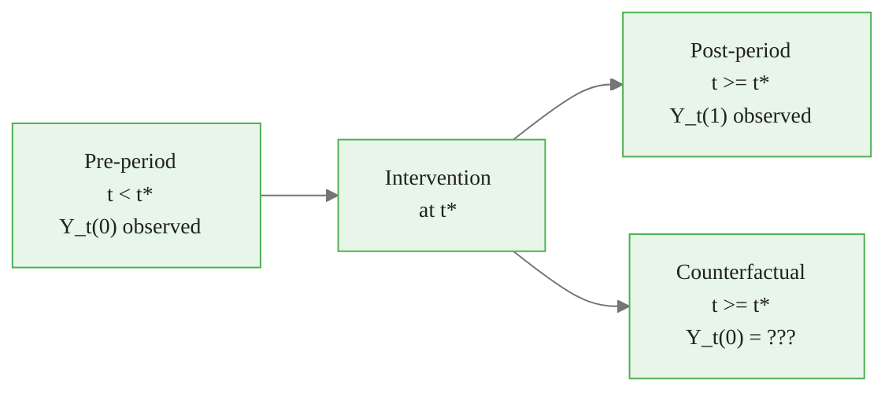

<!-- _class: lead -->

# Potential Outcomes Framework

## Formalizing Counterfactuals

### Causal Inference with CausalPy — Module 00, Guide 2

<!-- Speaker notes: The potential outcomes framework (Rubin Causal Model) is the dominant formal language for causal inference in statistics, epidemiology, and economics. Students who have worked with RCTs will recognize some of this. The key new idea for most learners is the explicit notation for unobserved counterfactuals — writing Y(0) and Y(1) as a pair that exists for every unit even though only one is ever seen. -->

---

# The Core Setup

For each unit $i$, define **two potential outcomes**:

$$Y_i(0) = \text{outcome if unit } i \text{ is NOT treated}$$
$$Y_i(1) = \text{outcome if unit } i \text{ IS treated}$$

We observe only **one** of these:

$$Y_i^{obs} = W_i \cdot Y_i(1) + (1 - W_i) \cdot Y_i(0)$$

where $W_i \in \{0, 1\}$ is the treatment indicator.

<!-- Speaker notes: The notation is deceptively simple but conceptually powerful. Both Y(0) and Y(1) are defined for every unit before treatment is assigned. Treatment assignment W reveals one of these. The other remains forever hidden — the "missing data" problem at the heart of causal inference. Rubin famously said that causal inference is a missing data problem, and this framing is exactly right. -->

---

# The Fundamental Problem

| Unit | $Y_i(0)$ | $Y_i(1)$ | $W_i$ | $Y_i^{obs}$ | $\tau_i = Y_i(1) - Y_i(0)$ |
|------|-----------|-----------|--------|-------------|---------------------------|
| 1 | **?** | 80 | 1 | 80 | **?** |
| 2 | 55 | **?** | 0 | 55 | **?** |
| 3 | **?** | 90 | 1 | 90 | **?** |
| 4 | 65 | **?** | 0 | 65 | **?** |

**We never observe both $Y_i(0)$ and $Y_i(1)$ for the same unit.**

Individual treatment effects $\tau_i$ are unidentifiable.

<!-- Speaker notes: The "?" in the table is the fundamental problem made visible. No statistical technique, regardless of how sophisticated, can recover the missing entries for individual units without making strong assumptions. The best we can do is estimate averages — and even that requires assumptions. Emphasize that this is not a data collection problem: you could gather unlimited data and still never observe both potential outcomes for the same unit at the same time. -->

<div class="callout-key">
Key Point: We never observe both $Y_i(0)$ and $Y_i(1)$ for the same unit.
</div>

---

# Treatment Effect Estimands

**Individual Treatment Effect (ITE):** $\tau_i = Y_i(1) - Y_i(0)$
→ Never observed

**Average Treatment Effect (ATE):**
$$\text{ATE} = E[\tau_i] = E[Y_i(1)] - E[Y_i(0)]$$

**Average Treatment Effect on Treated (ATT):**
$$\text{ATT} = E[\tau_i \mid W_i = 1] = E[Y_i(1) - Y_i(0) \mid W_i = 1]$$

**ITS estimates the ATT** — the effect on units that were actually treated.

<!-- Speaker notes: Walk through each estimand carefully. The ITE is fundamentally unidentifiable. The ATE asks about the average effect for a randomly selected unit from the population. The ATT asks about the average effect for units that were actually treated — a different question! For policy evaluation, ATT is almost always more relevant because we want to know: "Did this policy help the people it was applied to?" ITS answers this question. -->

<div class="callout-insight">
Insight: Individual Treatment Effect (ITE):
</div>

---

# Why Naive Comparisons Are Biased

Naive estimator: $\hat{\tau}^{naive} = E[Y^{obs} | W=1] - E[Y^{obs} | W=0]$

Decompose it:

$$\hat{\tau}^{naive} = \underbrace{E[Y_i(1) | W_i=1] - E[Y_i(0) | W_i=1]}_{\text{True ATT}} + \underbrace{E[Y_i(0) | W_i=1] - E[Y_i(0) | W_i=0]}_{\text{Selection Bias}}$$

If treated units have higher baseline outcomes, selection bias > 0, and we overestimate the effect.

<!-- Speaker notes: This decomposition is the key algebraic result of the potential outcomes framework. The naive comparison of means mixes the true causal effect with selection bias. Selection bias is the difference in what the treated group's outcome would have been if untreated versus what the control group's outcome actually is. If healthier people (higher Y(0)) seek treatment, selection bias is positive and we overestimate the effect. The goal of every design in this course is to make the selection bias term go to zero or become estimable. -->

---

# Randomization Eliminates Selection Bias

With random assignment: $W_i \perp\!\!\!\perp (Y_i(0), Y_i(1))$

Therefore:
$$E[Y_i(0) \mid W_i = 1] = E[Y_i(0) \mid W_i = 0] = E[Y_i(0)]$$

Selection bias term = 0. Naive comparison recovers the ATE:

$$E[Y^{obs} \mid W=1] - E[Y^{obs} \mid W=0] = E[Y(1)] - E[Y(0)] = \text{ATE}$$

<!-- Speaker notes: This is why the RCT is the gold standard. Randomization makes treatment assignment independent of potential outcomes, so the control group's observed outcome is a valid estimate of the treated group's counterfactual. No selection bias is possible in expectation. The key word is "in expectation" — any single randomized trial can have imbalance by chance, which is why we randomize large samples and why we check for balance on key covariates. -->

---

# Key Identification Assumptions

**SUTVA** (Stable Unit Treatment Value Assumption):
- No interference between units
- No hidden versions of treatment

**Unconfoundedness** (Ignorability):
$$Y_i(0), Y_i(1) \perp\!\!\!\perp W_i \mid X_i$$
No unmeasured confounders given $X_i$. **Untestable from data.**

**Overlap** (Positivity):
$$0 < P(W_i = 1 \mid X_i) < 1$$
Every covariate profile has a chance of receiving each treatment.

<!-- Speaker notes: SUTVA is often violated in practice — vaccines create herd immunity (interference), different doctors deliver "the same treatment" differently (hidden versions). Unconfoundedness is the big one: it says we have measured all relevant confounders. This cannot be tested; it requires domain expertise to argue. Overlap ensures we have counterfactual comparisons for every type of unit — without overlap, we are extrapolating beyond the data, which is risky. -->

---

# Potential Outcomes in ITS

In Interrupted Time Series, time periods are the "units":

$$Y_t(0) = \text{outcome at time } t \text{ absent intervention}$$
$$Y_t(1) = \text{outcome at time } t \text{ given intervention}$$

We observe:
- $Y_t(0)$ for $t < t^*$ (pre-intervention)
- $Y_t(1)$ for $t \geq t^*$ (post-intervention)

The counterfactual $Y_t(0)$ for $t \geq t^*$ is **never observed** — it must be estimated from the pre-period trend.

<!-- Speaker notes: The potential outcomes framework applies directly to the ITS setting with time periods as units. The fundamental problem is: after the intervention, we only observe Y(1) — the world where the intervention happened. We never observe Y(0) in the post-period — the world where it didn't happen. The ITS design addresses this by assuming the pre-period trend provides a valid forecast of what Y(0) would have been. -->

---

# The ITS Counterfactual



**Core ITS assumption:** The pre-intervention trend $Y_t(0)$ would have continued at the same rate absent the intervention.

We estimate $\hat{Y}_t(0)$ by extrapolating the pre-trend.

The estimated causal effect: $\hat{\tau}_t = Y_t(1) - \hat{Y}_t(0)$

<!-- Speaker notes: The diagram makes the missing data problem visual. After t*, we only see Y(1) — the green path. The orange box represents what we must estimate: Y(0) for the post period. The ITS assumption is that the orange box can be filled in by extending the trend from the pre-period. This is a strong assumption — it says the world would have continued on its prior trajectory without the intervention. Domain knowledge is needed to argue this is plausible. -->

---

# Bayesian Uncertainty Over Counterfactuals

Rather than a point estimate of $Y_t(0)$, the Bayesian approach gives a full **posterior distribution**:

$$P(Y_t(0) \mid \text{pre-period data})$$

This lets us answer:

$$P(\tau_t > 0 \mid \text{data}) = P(Y_t(1) > Y_t(0) \mid \text{data})$$

"What is the probability the intervention had a positive effect?"

This is a natural causal statement with a direct probability interpretation.

<!-- Speaker notes: The Bayesian approach is particularly elegant for the potential outcomes problem because uncertainty about the counterfactual is naturally represented as a posterior distribution. We are not just estimating a point and attaching a standard error — we are describing our full belief about what would have happened. The probability that the treatment was beneficial is a direct output of the Bayesian analysis, not a derived p-value with an awkward interpretation. -->

---

# ATT vs ATE: Which Does ITS Estimate?

**ITS estimates the ATT** (Average Treatment Effect on the Treated)

Because:
- We only have data from the single treated unit (or a few units)
- We estimate what happened to *those specific units* under treatment vs counterfactual

**ATT is often what we care about for policy:**

> "Did this pollution regulation reduce hospitalizations in the cities where it was applied?"

Not: "What would happen if we applied the regulation everywhere?" (ATE)

<!-- Speaker notes: This distinction matters for how we interpret and generalize ITS results. ITS tells us about the effect of the policy on the units that actually received it. Whether this effect generalizes to other units (the ATE-type question) depends on additional assumptions about treatment effect heterogeneity. Often the ATT is exactly the right question for policy evaluation: the policymaker wants to know if their intervention worked for the population it targeted, not for some hypothetical broader population. -->

---

# SUTVA in ITS: When It Can Fail

**No interference assumption in ITS:**

The treated region's potential outcomes should not be affected by control regions' treatment status.

**Violations:**
- Geographic spillovers (pollution regulation in one city affects neighboring cities)
- Market competition effects (price controls in one market shift demand elsewhere)
- Information diffusion (treated population shares behavior with untreated)

If SUTVA fails, the control group is "contaminated" and causal estimates are biased.

<!-- Speaker notes: SUTVA violations are common in real-world policy settings. If you regulate pollution in one industrial region, industries might relocate to nearby unregulated regions (spillover). If you run a job training program in one city, some participants might move for jobs (geographic mobility). If you change a price, producers in other markets might shift supply (market equilibrium effects). These spillovers mean the "control" outcome is no longer a pure counterfactual. This is one reason why large-scale natural experiments with well-separated treated and control regions are preferred when possible. -->

---

# Effect Heterogeneity in ITS

The treatment effect may vary over time:

$$\tau_t = Y_t(1) - Y_t(0) \quad \text{may change as } t \text{ increases}$$

This is a Conditional Average Treatment Effect (CATE) over time.

**Common patterns:**
- Immediate level change + no slope change
- No immediate change + slope change (gradual adoption)
- Both level and slope change
- Fading effect (initial jump, then decay)

CausalPy models all of these through formula specification.

<!-- Speaker notes: One advantage of ITS over single-number treatment effects is that we can see HOW the effect evolves. A drug might show immediate effects or gradual onset. A policy might have an impact on impact then fade as people adapt. A technology adoption might show accelerating effects as network effects kick in. The segmented regression structure in ITS explicitly models both level changes (immediate effects) and slope changes (trend effects), and the Bayesian posterior gives us the full time-path of uncertainty. -->

---

# Connecting Notation to CausalPy

In CausalPy, the potential outcomes are implemented as:

```python
import causalpy as cp

result = cp.InterruptedTimeSeries(
    data=df,
    treatment_time=intervention_date,  # This is t*
    formula="y ~ 1 + t + treated + t:treated"
)

# result.causal_impact is the posterior of tau_t = Y(1) - Y(0)
# result.plot() shows the counterfactual Y(0) and observed Y(1)
```

The counterfactual trajectory is the model's prediction under the `treated=0` condition extrapolated post-intervention.

<!-- Speaker notes: Making the connection to CausalPy code early helps students see how the abstract notation maps to concrete API calls. The counterfactual in CausalPy is the model prediction with all post-intervention indicator variables set to zero — exactly Y(0) in the potential outcomes notation. The causal impact is the difference between observed and counterfactual at each post-intervention time point. -->

---

# Summary: Potential Outcomes Framework

| Concept | Symbol | Key Point |
|---------|--------|-----------|
| Potential outcomes | $Y_i(0), Y_i(1)$ | Both exist; only one observed |
| Individual effect | $\tau_i = Y_i(1) - Y_i(0)$ | Never identifiable |
| ATE | $E[\tau_i]$ | Target under RCT |
| ATT | $E[\tau_i \mid W_i=1]$ | Target for ITS |
| Selection bias | $E[Y(0)\mid W=1] - E[Y(0)\mid W=0]$ | Eliminated by design |
| SUTVA | — | Units don't interfere |
| Unconfoundedness | $Y(0), Y(1) \perp W \mid X$ | Core untestable assumption |

<!-- Speaker notes: Use this table as a reference. The key message is that every method in this course is a strategy for making the unconfoundedness assumption (or something equivalent) plausible through design rather than just claiming it holds. ITS uses pre-period timing; synthetic control uses donor unit matching; DiD uses parallel trends; RD uses continuity at a threshold. The assumption is always there — the design determines how credible it is. -->

<div class="callout-key">
Key Point: SUTVA (Stable Unit Treatment Value Assumption) requires that one unit's treatment does not affect another's outcome -- violated when there are network effects or spillovers.
</div>

---

<!-- _class: lead -->

# Core Takeaway

## $Y_i(1) - Y_i(0)$ is what we want.
## Only one of these is ever observed.
## Every causal method is a strategy for estimating the missing one.

<!-- Speaker notes: The three-line summary. Every lecture, every method, every assumption check in this course comes back to this: we are trying to fill in the missing potential outcome. The method tells us how; the assumptions tell us when we can trust it. Keep this framing in mind throughout the course. -->

---

# What's Next

**Guide 3:** Directed Acyclic Graphs (DAGs)
- Visual language for causal structure
- Confounders, colliders, mediators
- Which variables to control for (and which NOT to)

**Notebook 1:** Environment Setup
- `pip install causalpy pymc arviz`
- Verify the full stack works end-to-end

<!-- Speaker notes: DAGs (Guide 3) provide the visual language for reasoning about which variables to include in an analysis. They make the unconfoundedness assumption concrete: you can draw the assumed causal structure and read off which variables are confounders, colliders, and mediators. This is essential for correct model specification in CausalPy and for communicating your causal assumptions to others. -->

<div class="callout-insight">
Insight: The fundamental problem of causal inference is that we can never observe both potential outcomes for the same unit -- every causal method is a strategy for working around this limitation.
</div>
