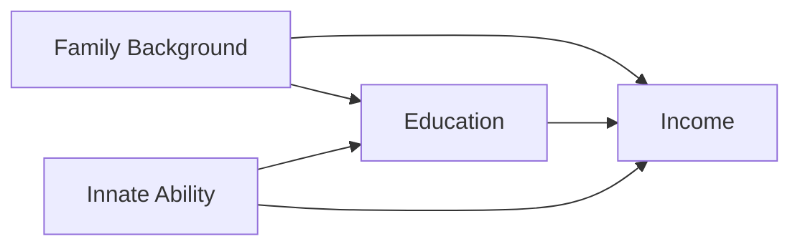
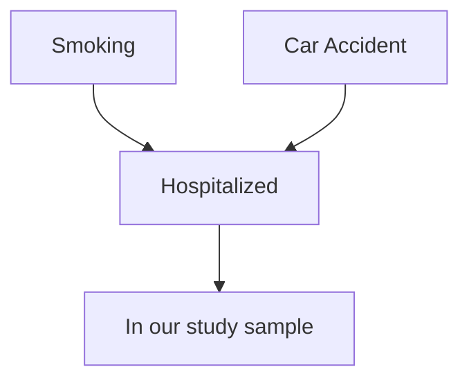
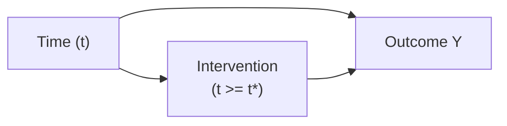
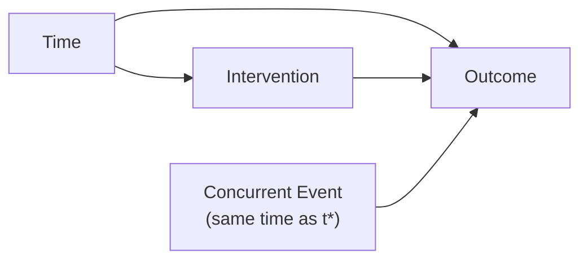
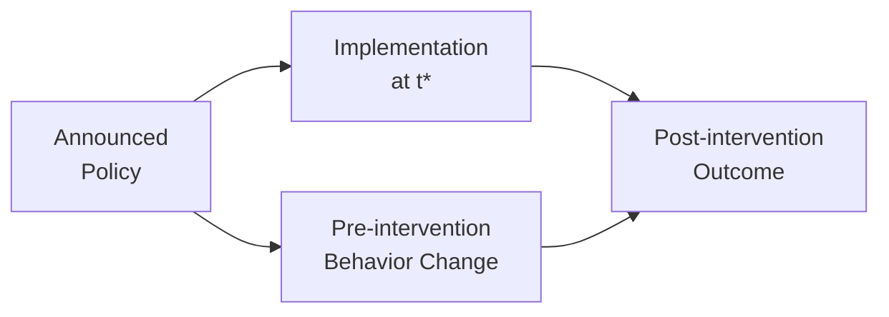

# Directed Acyclic Graphs (DAGs) for Causal Inference

> **Reading time:** ~9 min | **Module:** 0 — Foundations | **Prerequisites:** Basic statistics, regression, probability

## In Brief

Directed Acyclic Graphs (DAGs) are visual representations of causal assumptions. Each node is a variable; each directed edge (arrow) represents a direct causal effect. DAGs make your causal assumptions explicit, allow identification of confounders, colliders, and mediators, and determine which variables must (and must not) be conditioned upon.

<div class="callout-key">

<strong>Key Concept:</strong> Directed Acyclic Graphs (DAGs) are visual representations of causal assumptions. Each node is a variable; each directed edge (arrow) represents a direct causal effect.

</div>

## Key Insight

A DAG is not a statistical model — it is a declaration of causal assumptions. The same data can be consistent with many different DAGs. Choosing the right DAG requires domain knowledge, not statistical testing. Once you commit to a DAG, it tells you the correct analysis strategy.

---

## What Is a DAG?

A **Directed Acyclic Graph** consists of:
- **Nodes:** variables (treatment, outcome, covariates)
- **Directed edges (arrows):** $A \to B$ means "$A$ is a direct cause of $B$"
- **Acyclic:** no variable can cause itself through a chain of arrows

"Direct cause" means "cause not mediated by other variables in the graph." Every arrow represents a substantive claim about the world.

### Reading a DAG

```

X → Y
```

$X$ directly causes $Y$.

```

X → Z → Y
```

$X$ causes $Y$ through mediator $Z$.

```

C → X
C → Y
```

$C$ is a common cause (confounder) of $X$ and $Y$.

---

## Three Fundamental Structures

### 1. Chains (Mediation)

```

X → M → Y
```

$X$ causes $Y$ through mediator $M$.

**Example:** Job training program ($X$) → skill acquisition ($M$) → employment ($Y$)

**Key rule:** Conditioning on $M$ blocks the path from $X$ to $Y$. If we control for $M$, we lose the indirect effect. To estimate the total effect of $X$ on $Y$, do NOT control for $M$.

### 2. Forks (Confounding)

```

C → X
C → Y
```

Common cause $C$ creates a spurious correlation between $X$ and $Y$.

**Example:** Neighborhood income ($C$) → both home computers ($X$) and school quality ($Y$).

**Key rule:** Conditioning on $C$ blocks the backdoor path. To estimate the causal effect of $X$ on $Y$, you MUST control for $C$ (or use a design that blocks this path).

### 3. Colliders

```

X → M ← Y
```

$M$ is a **collider** — both $X$ and $Y$ point into $M$.

**Example:** Artistic talent ($X$) and athletic talent ($Y$) both influence admission to a highly selective arts-and-sports school ($M$).

**Key rule:** $X$ and $Y$ are independent (no confounding). But conditioning on $M$ OPENS a path between $X$ and $Y$, creating spurious correlation. In the school example: among students admitted to this school, artistic talent and athletic talent are negatively correlated (selection artifact).

---

## The Backdoor Criterion

A **backdoor path** from treatment $T$ to outcome $Y$ is any path that starts with an arrow pointing INTO $T$ (not out of $T$).

Backdoor paths represent spurious correlations induced by common causes.

**Backdoor criterion:** A set of variables $Z$ satisfies the backdoor criterion for estimating the effect of $T$ on $Y$ if:
1. $Z$ blocks all backdoor paths from $T$ to $Y$
2. $Z$ contains no descendants of $T$ (no mediators or post-treatment variables)

If $Z$ satisfies the backdoor criterion, then:
$$P(Y | do(T = t)) = \sum_z P(Y | T = t, Z = z) \cdot P(Z = z)$$

This is the **adjustment formula** — conditioning on $Z$ removes confounding.

### Example: Education and Income



Backdoor paths from Education to Income:
1. Education ← Family Background → Income
2. Education ← Innate Ability → Income

Adjusting for both Family Background and Innate Ability blocks both backdoor paths. If we can measure both, we identify the causal effect of Education on Income.

---

## Collider Bias: The Most Common Mistake

Collider bias (also called M-bias or Berkson's bias) occurs when you condition on a collider or a descendant of a collider.

### Classic Example: Hospitals

Among the general population: being a smoker is independent of being in a car accident.

But in a hospital sample (conditioning on hospitalization = collider):



Within the hospitalized sample, smoking and car accidents become negatively correlated — if you didn't have a car accident, you must have done something else to be hospitalized (like smoke). This is selection bias, not a real relationship.

### Implications for ITS

In ITS, be careful about including post-intervention variables as controls. Any variable that is influenced by the intervention is a mediator or descendant of treatment. Controlling for it would block part of the causal effect you are trying to estimate.

**Rule of thumb:** Only adjust for pre-intervention (pre-treatment) variables in ITS models.

---

## Causal Paths vs Statistical Associations

A key insight of DAGs is the distinction between:

**d-separation:** A set of variables $Z$ d-separates $X$ from $Y$ if all paths between $X$ and $Y$ are blocked by $Z$. d-separated variables are conditionally independent given $Z$.

**Rules for blocking:**
- A chain $X \to M \to Y$: blocked by conditioning on $M$
- A fork $X \leftarrow C \rightarrow Y$: blocked by conditioning on $C$
- A collider $X \to M \leftarrow Y$: **opened** by conditioning on $M$ or its descendants

This gives us a mechanical procedure: draw the DAG, enumerate all paths between treatment and outcome, identify which are blocked and which are open, then select the adjustment set to block all backdoor paths while not conditioning on any mediators or colliders.

---

## DAGs for Common ITS Scenarios

### Scenario 1: Clean ITS (No Confounders)



The causal effect runs directly from the intervention to the outcome. Time affects both the trend and the intervention timing. No confounders — a clean design where the pre-trend identifies the counterfactual.

### Scenario 2: ITS with Concurrent Events (Threat to Validity)



A concurrent event occurs at the same time as the intervention. This is a confounding threat: we cannot distinguish the intervention effect from the concurrent event effect. The DAG makes this visible; the analyst must argue that no significant concurrent events coincided with the intervention.

### Scenario 3: Anticipation Effects



If the policy was announced before implementation, units may change behavior in anticipation. This violates the assumption that the pre-period reflects the counterfactual — behavior has already started changing before $t^*$. The DAG suggests examining whether there are pre-intervention trend changes coinciding with the announcement date.

---

## The Minimal Adjustment Set

For a given DAG, there may be multiple valid adjustment sets. The **minimal adjustment set** is the smallest set of variables that satisfies the backdoor criterion.

**Strategy:**
1. Draw the DAG based on domain knowledge
2. List all backdoor paths (paths entering treatment node)
3. Find the minimal set that blocks all backdoor paths without blocking any front-door paths
4. Verify no colliders are included

**Software tools:** The `dagitty` Python package (or the web tool at dagitty.net) can compute minimal adjustment sets, test conditional independencies, and suggest testable implications of your DAG.

<div class="code-window">
<div class="code-header">
<div class="dots"><span class="dot-red"></span><span class="dot-yellow"></span><span class="dot-green"></span></div>
<span class="filename">example.py</span>

</div>

```python
# Using dagitty to check adjustment sets
# Install: pip install dagitty-python
from dagitty import get_adjustment_sets

dag = """
dag {
  Confounder -> Treatment
  Confounder -> Outcome
  Treatment -> Outcome
}
"""

# dagitty computes what to adjust for
# adjustment_sets = get_adjustment_sets(dag, "Treatment", "Outcome")
```

</div>

---

## Testing DAG Implications

DAGs generate testable predictions about conditional independencies. These predictions can be checked in data — if they fail, the DAG is wrong.

**Example:** If your DAG says $A \perp\!\!\!\perp B \mid C$, you can test whether $A$ and $B$ are independent given $C$ in your data. A violation suggests either the DAG is misspecified or data quality issues.

However, **passing a conditional independence test does not prove the DAG is correct** — many DAGs can generate the same set of conditional independencies (this is called Markov equivalence). DAGs are validated by domain knowledge first, statistical tests second.

---

## Building a DAG for Your ITS Analysis

A step-by-step process:

1. **List all variables:** outcome, treatment, time, potential confounders, mediators
2. **For each pair, ask:** "Does variable A directly cause variable B?" (not "are they correlated?")
3. **Draw arrows** only where you assert direct causal relationships
4. **Identify the treatment → outcome paths:** these are front-door paths you want to estimate
5. **Identify backdoor paths:** these need to be blocked
6. **Determine adjustment set:** minimal set that blocks backdoor without conditioning on mediators/colliders
7. **Check for concurrent threats:** draw any external events that might confound the intervention timing

### ITS-Specific DAG Considerations

| Variable Type | In DAG | Adjust? |
|--------------|--------|---------|
| Time trend (pre-intervention) | Yes, as covariate | Yes |
| Seasonal patterns | Yes, if they affect outcome | Yes |
| Pre-intervention outcome levels | Yes, as control | Only if not mediating the intervention |
| Post-intervention behavior | Yes, as mediator/descendant | No — would block causal effect |
| Concurrent policy changes | Yes, as confounders | Yes (or argue they don't exist) |
| Anticipation effects | Yes, as pre-treatment change | Model explicitly |

---

## Code Example: Drawing DAGs

<div class="code-window">
<div class="code-header">
<div class="dots"><span class="dot-red"></span><span class="dot-yellow"></span><span class="dot-green"></span></div>
<span class="filename">example.py</span>

</div>

```python
import networkx as nx
import matplotlib.pyplot as plt
import matplotlib.patches as mpatches

def draw_dag(edges, title="DAG", highlight_nodes=None):
    """
    Draw a directed acyclic graph.

    Parameters
    ----------
    edges : list of tuples
        Each tuple (A, B) represents a directed edge A -> B
    title : str
        Plot title
    highlight_nodes : dict, optional
        Dict mapping node names to colors for highlighting
    """
    G = nx.DiGraph()
    G.add_edges_from(edges)

    # Use shell layout for small graphs
    pos = nx.shell_layout(G)

    node_colors = []
    default_colors = {
        "Treatment": "#3498db",
        "Outcome": "#e74c3c",
    }
    if highlight_nodes:
        default_colors.update(highlight_nodes)

    for node in G.nodes():
        node_colors.append(default_colors.get(node, "#95a5a6"))

    fig, ax = plt.subplots(figsize=(8, 5))
    nx.draw_networkx(
        G,
        pos=pos,
        ax=ax,
        node_color=node_colors,
        node_size=2000,
        font_size=9,
        font_color="white",
        font_weight="bold",
        arrows=True,
        arrowsize=20,
        edge_color="#2c3e50",
        width=2,
    )
    ax.set_title(title, fontsize=14, fontweight="bold")
    ax.axis("off")
    plt.tight_layout()
    plt.show()

# ITS DAG: policy intervention on smoking rates
its_edges = [
    ("Time", "Smoking Rate"),
    ("Time", "Intervention"),
    ("Intervention", "Smoking Rate"),
    ("Age Structure", "Smoking Rate"),
    ("Economic Conditions", "Smoking Rate"),
]

draw_dag(
    its_edges,
    title="ITS DAG: Smoking Ban → Smoking Rate",
    highlight_nodes={"Intervention": "#27ae60", "Smoking Rate": "#e74c3c"},
)

# Collider example
collider_edges = [
    ("Smoking", "Hospitalized"),
    ("Car Accident", "Hospitalized"),
]
draw_dag(
    collider_edges,
    title="Collider Example: Both Variables Cause Hospitalization",
    highlight_nodes={"Hospitalized": "#f39c12"},
)
```

</div>

---

## Connections

<div class="callout-info">

<strong>How this connects to the rest of the course:</strong>

</div>

- **Builds on:** Causal vs predictive thinking (Guide 1), Potential outcomes (Guide 2)
- **Leads to:** ITS model specification (Module 01), Bayesian model building (Module 02)
- **Related to:** Structural equation models, graphical models, do-calculus


## Practice Questions

### Question 1: Conceptual Check
**Question:** In your own words, explain the core concept of Directed Acyclic Graphs (DAGs) for Causal Inference and why it matters for practical applications. What problem does it solve that simpler approaches cannot?

### Question 2: Application
**Question:** Describe a real-world scenario where you would apply the techniques from this guide. What assumptions would you need to verify before proceeding?

## Further Reading

- Pearl, J., Glymour, M., & Jewell, N.P. (2016). *Causal Inference in Statistics: A Primer* — the most accessible DAG introduction
- Hernan, M.A. & Robins, J.M. (2020). *Causal Inference: What If* — Chapter 6-9 on DAGs
- Cinelli, C., Forney, A., & Pearl, J. (2022). "A Crash Course in Good and Bad Controls." — essential paper on collider bias
- dagitty.net — browser-based DAG tool with automatic adjustment set computation


## Resources

<a class="link-card" href="../notebooks/01_environment_setup.ipynb">
  <div class="link-card-title">Hands-on Notebook</div>
  <div class="link-card-description">15-minute micro-notebook with guided exercises for this topic.</div>
</a>
