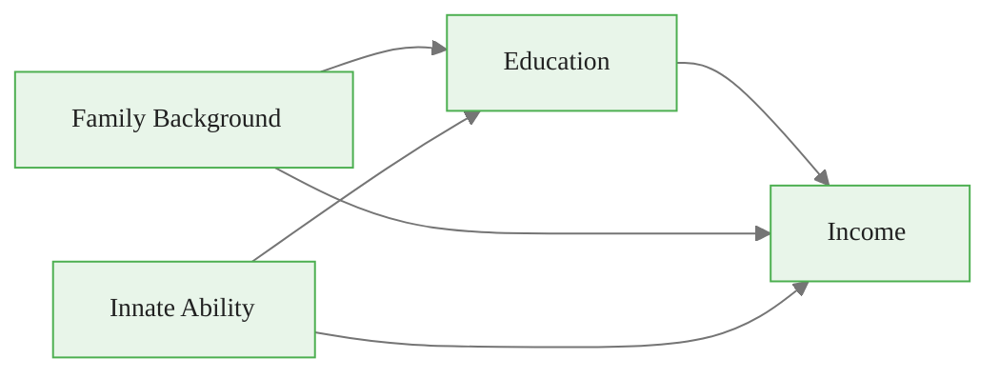
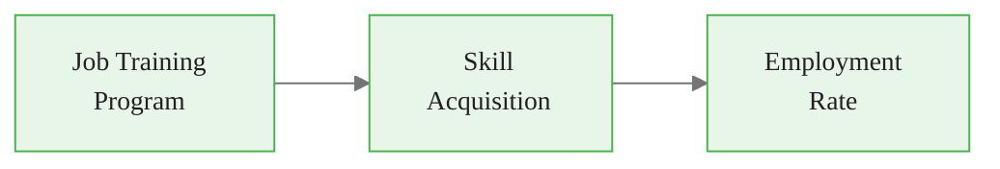
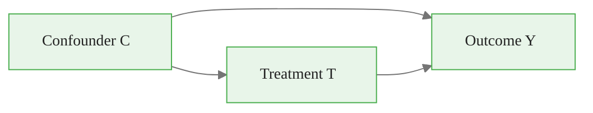
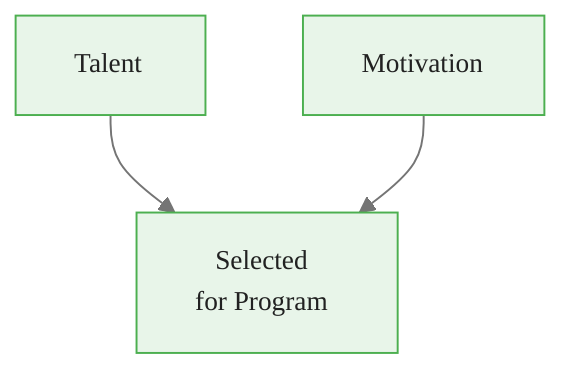
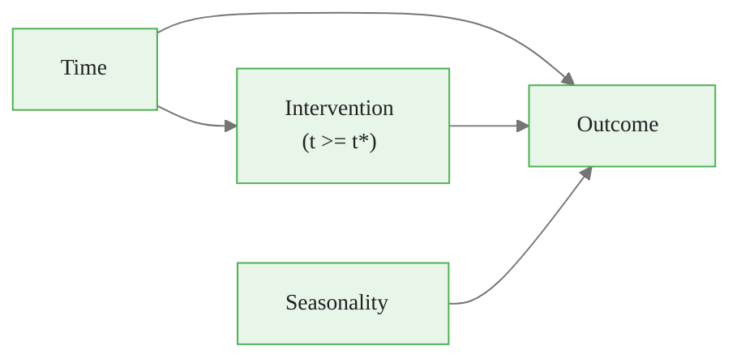
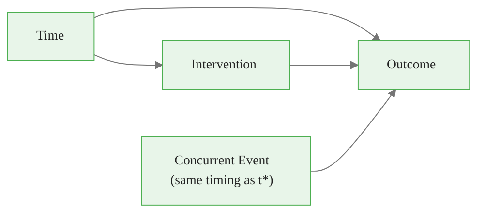
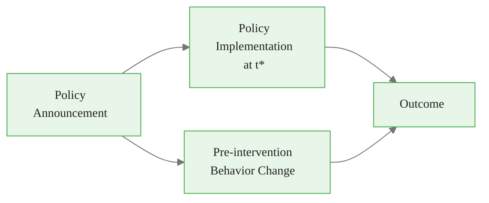

<!-- _class: lead -->

# Directed Acyclic Graphs

## The Language of Causal Assumptions

### Causal Inference with CausalPy — Module 00, Guide 3

<!-- Speaker notes: DAGs are the single most powerful conceptual tool in applied causal inference. They make causal assumptions explicit, visual, and checkable. Many practitioners who have done regression analysis for years have never explicitly reasoned about collider bias — this guide will fix that. The key shift in mindset: a DAG is not derived from data, it is stated as a prior belief about causal structure, then tested against data through its conditional independence implications. -->

---

# What Is a DAG?

- **Nodes:** Variables (treatment, outcome, covariates)
- **Directed edges:** $A \to B$ means "$A$ directly causes $B$"
- **Acyclic:** No cycles — a variable cannot cause itself



This DAG asserts: family background and innate ability both cause education AND income directly.

<!-- Speaker notes: Every arrow in a DAG is a substantive causal claim that must be justified on domain grounds. The absence of an arrow is equally a claim: you are saying there is no direct causal effect. The "acyclic" requirement rules out feedback loops — income cannot cause education in this DAG (but it could in a more complex dynamic DAG with time indices). For ITS analysis, the acyclic assumption is satisfied because time flows forward and we do not model feedback explicitly. -->

<div class="callout-info">
Info:  Variables (treatment, outcome, covariates)
- 
</div>

---

# Three Fundamental Structures

<div class="columns">

**Chain (Mediation)**
```
X → M → Y
```
$M$ mediates $X$'s effect on $Y$

**Fork (Confounding)**
```
X ← C → Y
```
$C$ confounds the $X$–$Y$ relationship

**Collider**
```
X → M ← Y
```
$M$ is caused by both $X$ and $Y$

</div>

<!-- Speaker notes: These three patterns are the building blocks of all DAGs. Every DAG is a combination of chains, forks, and colliders. Understanding the rules for each — what gets blocked, what gets opened — is the entire operational knowledge needed to use DAGs for analysis. The most counterintuitive is the collider: conditioning on a collider OPENS a path rather than closing it, creating spurious correlation where none existed. -->

<div class="callout-key">
Key Point: 
```
X → M → Y
```
$M$ mediates $X$'s effect on $Y$

</div>

---

# Chains: Don't Block the Mediator



**Total effect of program on employment:** $P \to S \to E$

If you control for skill acquisition ($S$):
- You block the pathway through which the program works
- Your estimate of the program effect goes to zero... artificially!

**Rule:** To estimate the total effect, do NOT control for mediators.

<!-- Speaker notes: This is one of the most common mistakes in applied regression analysis. Researchers add controls to "adjust for confounding" but inadvertently include mediators — variables that are part of the causal mechanism. If you want the total effect of a job training program on employment, you should not control for skill acquisition, because skills are HOW the program works. Controlling for it gives you the "direct effect" of the program not operating through skills, which may be zero even if the total effect is large. -->

<div class="callout-insight">
Insight: Total effect of program on employment:
</div>

---

# Forks: Confounding



Confounders create a **backdoor path** from $T$ to $Y$:

$$T \leftarrow C \rightarrow Y$$

This path creates a spurious correlation between $T$ and $Y$ even without any causal effect of $T$.

**Fix:** Condition on $C$ to block the backdoor path.

<!-- Speaker notes: The fork structure is confounding in its pure form. The confounder C is a common cause that induces a correlation between T and Y through the backdoor path T ← C → Y. If we condition on C — hold it constant — the backdoor path is blocked and the only remaining association between T and Y is the direct causal effect. This is why randomization works: it severs the arrows from confounders to T, making the only path from T to Y the direct causal one. -->

---

# Colliders: The Hidden Trap



Talent and Motivation are **independent** in the general population.

But **among program participants** (conditioning on A):

> High talent → less motivation needed → talent and motivation are negatively correlated!

This is **collider bias** — conditioning creates a spurious association.

<!-- Speaker notes: Collider bias is the most counter-intuitive causal concept for newcomers. The classic demonstration: in a selective school, high-aptitude students are admitted even with low effort, and high-effort students are admitted even with moderate aptitude. So within the school (conditioned on admission), aptitude and effort are negatively correlated — even though in the general population they are independent or positively correlated. This shows up in data as "controlling for more variables makes my estimate worse." -->

<div class="callout-warning">
Warning:  in the general population.

But 
</div>

---

# The Backdoor Criterion

A set $Z$ satisfies the **backdoor criterion** for $T \to Y$ if:

1. $Z$ **blocks** all backdoor paths from $T$ to $Y$
2. $Z$ contains **no descendants** of $T$ (no mediators, no post-treatment variables)

Then:
$$P(Y | do(T)) = \sum_z P(Y | T, Z=z) P(Z=z)$$

Conditioning on a valid adjustment set $Z$ identifies the causal effect.

<!-- Speaker notes: The backdoor criterion gives us a rigorous procedure: enumerate all paths from T to Y (both direct and indirect), identify which are backdoor paths (entering T), determine what set of variables blocks all backdoor paths without blocking any frontdoor paths, and check that set contains no descendants of T. If such a set exists, we can identify the causal effect from observational data. The do-calculus can handle cases where the backdoor criterion doesn't apply. -->

---

# Which Variables Should You Control For?

<div class="columns">

**Control for:**
- Pre-treatment confounders
- Variables that block backdoor paths
- Pre-treatment covariates that reduce variance

**Do NOT control for:**
- Mediators (front-door paths)
- Colliders
- Descendants of treatment
- Post-treatment variables (in ITS, post-t* variables)

</div>

When in doubt: draw the DAG first, then decide.

<!-- Speaker notes: The practical upshot for ITS analysis: be very careful about what you include as controls. Pre-intervention covariates (seasonal patterns, demographic trends) are generally safe and can improve precision. Post-intervention variables are dangerous — they are often mediators or descendants of the intervention. The formula in CausalPy specifies which covariates enter the model, so you need to think carefully about each one using DAG reasoning. -->

---

# DAG for a Clean ITS Design



This DAG says:
- Time drives a secular trend in the outcome
- The intervention starts at $t^*$ (caused by time crossing a threshold)
- Seasonality affects the outcome but NOT the intervention timing

**Adjustment set:** Time trend + seasonality. Blocks all backdoor paths.

<!-- Speaker notes: For a clean ITS, the causal structure is relatively simple because the intervention is determined by calendar time, not by the outcome or potential confounders. The pre-trend represents the counterfactual. The main threats are concurrent events (things that happen at the same time as t*) and seasonality (which if unmodeled can look like a level change at the intervention point). The DAG helps us think clearly about both. -->

---

# Threat to ITS Validity: Concurrent Events



A concurrent event $E$ that happens at exactly $t^*$ is **indistinguishable** from the intervention effect.

The DAG makes this threat explicit. Your validity argument must address why $E$ either:
- Did not occur, or
- Had negligible impact on $Y$

<!-- Speaker notes: This is the primary threat to ITS validity. If a second policy was implemented at exactly the same time as your policy of interest, you cannot separate their effects. The DAG forces you to be explicit about this threat. In practice, analysts conduct "multiple comparisons" across outcomes that should and should not be affected by the intervention to build a circumstantial case. If the intervention affects exactly the outcomes theory predicts and none of the "placebo" outcomes, the concurrent event explanation becomes implausible. -->

---

# Threat: Anticipation Effects



If behavior changes **before** $t^*$ due to the announcement, the pre-period is no longer a clean counterfactual.

**Test:** Look for a pre-trend break at the announcement date, not just $t^*$.

<!-- Speaker notes: Anticipation effects contaminate the pre-period. If a new minimum wage law is announced 6 months before it takes effect, businesses may start adjusting pay or hiring in anticipation. The "pre-period" up to t* would then show a trend break at the announcement date, not at the implementation date. The ITS design assumes the pre-period trend is unaffected by the treatment — anticipation effects directly violate this. The fix is to either use data from before the announcement date or to explicitly model the anticipation effect. -->

---

# DAG Checklist for ITS Analysis

Before running your ITS, answer:

1. Is the intervention timing determined by calendar time (exogenous)?
2. Did any concurrent events occur at approximately $t^*$?
3. Was the intervention announced before $t^*$? (Anticipation risk)
4. Are there seasonal patterns that could mimic a level change?
5. Did units anticipate and select into treatment? (self-selection)
6. Are there spillover effects to the "control" period?
7. What pre-treatment covariates reduce variance?

<!-- Speaker notes: This checklist translates DAG reasoning into concrete analysis decisions. Each item corresponds to a potential threat to the ITS validity argument. Go through the list for every ITS analysis you conduct. Document your answers — this becomes the "Assumption Justification" section of your analysis report. The goal is not to claim all assumptions hold, but to make the strongest possible argument that they are sufficiently plausible. -->

---

# Testing DAG Implications

DAGs imply **conditional independence** relationships you can test:

If the DAG says $A \perp\!\!\!\perp B \mid C$, test this:

```python
from scipy import stats
import pandas as pd

def test_conditional_independence(df, var_a, var_b, conditioning_vars):
    """
    Partial correlation test for conditional independence.
    If p-value > 0.05, cannot reject independence.
    """
    # Residualize both variables on conditioning set
    from sklearn.linear_model import LinearRegression

    lr = LinearRegression()
    lr.fit(df[conditioning_vars], df[var_a])
    resid_a = df[var_a] - lr.predict(df[conditioning_vars])

    lr.fit(df[conditioning_vars], df[var_b])
    resid_b = df[var_b] - lr.predict(df[conditioning_vars])

    # Test correlation of residuals
    corr, pval = stats.pearsonr(resid_a, resid_b)
    return corr, pval
```

**Failing a test disproves the DAG. Passing does not prove it.**

<!-- Speaker notes: DAGs generate falsifiable predictions, which makes them scientifically useful. The conditional independence implications of a DAG can be tested — and if they fail, the DAG must be revised. However, passing all testable implications does not uniquely confirm the DAG, because multiple DAGs (Markov equivalent DAGs) can generate the same set of conditional independencies. The data can constrain but not uniquely determine the causal structure. This is why domain knowledge is essential and cannot be replaced by data alone. -->

---

# DAGs in Python: networkx

```python
import networkx as nx
import matplotlib.pyplot as plt

# Draw the ITS causal structure
dag = nx.DiGraph([
    ("Time", "Outcome"),
    ("Time", "Intervention"),
    ("Intervention", "Outcome"),
    ("Seasonality", "Outcome"),
    ("Confounder", "Intervention"),  # Threat: endogenous timing
    ("Confounder", "Outcome"),
])

pos = nx.planar_layout(dag)
colors = {
    "Intervention": "#27ae60",
    "Outcome": "#e74c3c",
    "Confounder": "#e67e22",
}
node_colors = [colors.get(n, "#3498db") for n in dag.nodes()]

nx.draw_networkx(dag, pos=pos, node_color=node_colors,
                 node_size=2000, font_color="white")
plt.title("ITS DAG with Endogenous Timing Threat")
plt.axis("off")
plt.show()
```

<!-- Speaker notes: Showing the code for drawing DAGs serves two purposes: it gives students a practical skill and it reinforces that DAGs are concrete objects that can be analyzed computationally. The dagitty library (not shown here for brevity) goes further and can compute adjustment sets, list testable implications, and identify which effects are identifiable from observational data. Encourage students to draw DAGs before any analysis, even informally on paper. -->

---

# Summary: DAG Rules

| Structure | Blocked by? | Opened by? |
|-----------|-------------|------------|
| Chain $X \to M \to Y$ | Conditioning on $M$ | (naturally open) |
| Fork $X \leftarrow C \rightarrow Y$ | Conditioning on $C$ | (naturally open) |
| Collider $X \to M \leftarrow Y$ | (naturally closed) | Conditioning on $M$ |

**The goal:** Block all backdoor paths, leave all front-door paths open, never condition on colliders.

<!-- Speaker notes: This three-row table is the complete operational knowledge for using DAGs. Memorize it. Chains are blocked by controlling for mediators (usually a mistake). Forks (confounders) must be controlled to remove bias. Colliders are naturally closed but conditioning on them creates bias. The design goal is an adjustment set that blocks exactly the backdoor paths without touching frontdoor paths or colliders. The minimal adjustment set from dagitty does this automatically given your assumed DAG. -->

---

<!-- _class: lead -->

# Core Takeaway

## Draw the DAG before choosing controls.

## Controlling for more variables is NOT always better.

## Collider bias can make your estimate worse than no adjustment.

<!-- Speaker notes: The three-line takeaway challenges the intuition that "more controls = better." Controlling for the wrong variables (mediators, colliders) actively harms causal inference. The solution is to draw the DAG, identify the correct adjustment set, and include only those variables. This is harder than adding all available controls, but it gives correct answers rather than precisely estimated wrong ones. -->

---

# Module 00 Complete

You now have the conceptual foundations:

1. **Guide 1:** Causal vs predictive thinking — different questions require different methods
2. **Guide 2:** Potential outcomes — $Y(1) - Y(0)$ is what we want but only one is observed
3. **Guide 3:** DAGs — draw causal assumptions, identify valid adjustment sets

**Next:** Notebooks put these ideas into practice.
- Notebook 1: Set up your environment
- Notebook 2: Your first ITS analysis with CausalPy

<!-- Speaker notes: Module 00 has given students the three conceptual pillars of causal inference: the philosophical distinction between prediction and causation, the formal language of potential outcomes, and the graphical tool of DAGs for reasoning about confounding. These three tools will be used throughout the course. Every time we specify an ITS model in CausalPy, we are implicitly making claims about potential outcomes and assuming a particular DAG structure. Making those assumptions explicit is what distinguishes rigorous causal analysis from sophisticated curve fitting. -->
