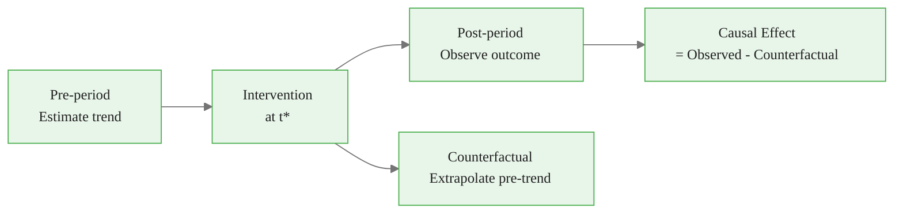
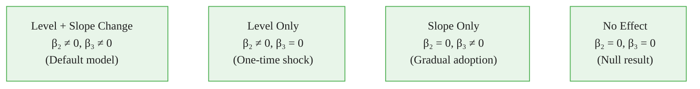
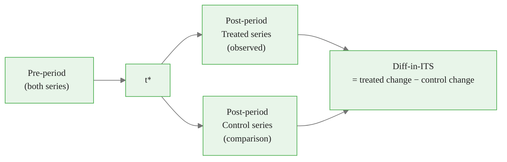
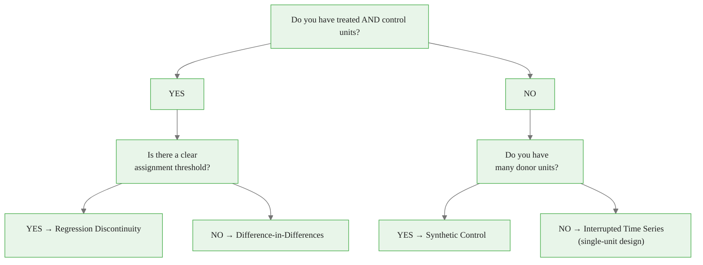
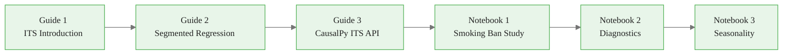

<!-- _class: lead -->

# Interrupted Time Series

## The Core Design for Policy Evaluation

### Causal Inference with CausalPy — Module 01

<!-- Speaker notes: Module 01 moves from foundations to the main workhorse method of this course. ITS is one of the most widely used quasi-experimental designs in public health, economics, and policy evaluation. The key selling point: it requires only one unit (or a few), a clear intervention date, and sufficient pre-period data. No control group required, though one dramatically strengthens the design. Many high-impact policy evaluations rely on ITS — from smoking ban evaluations to speed camera effectiveness studies. -->

---

# What Is ITS?

**Interrupted Time Series** uses the pre-intervention trend as the counterfactual.



**Key assumption:** The pre-trend would have continued unchanged absent the intervention.

<!-- Speaker notes: ITS works by exploiting the temporal structure of the data. The same unit is observed before and after the intervention. The pre-intervention data estimates the trend; the post-intervention data shows what actually happened. The difference between what happened and what the trend predicted is the causal effect. This difference-from-trend estimator is intuitive and visual, making it easy to communicate to non-technical stakeholders. -->

---

# Why ITS Works: The Intuition

Imagine tracking a city's air pollution monthly.

- Pre-period: pollution trending slightly upward at 2 ppm/month
- Month 36: emissions regulation takes effect
- Post-period: pollution drops immediately and the trend reverses

The counterfactual says: "Without the regulation, pollution would have continued rising at 2 ppm/month."

The treatment effect is: observed pollution − projected pollution.

<!-- Speaker notes: The intuition is powerful and accessible. Present the ITS idea as: "What would have happened if the intervention hadn't occurred?" The answer is: the trend would have continued. For a clear level change — pollution drops by 20 ppm immediately — even laypeople can see the treatment effect in a simple time series plot. This is part of what makes ITS results so communicable to policymakers and the public. The Bayesian posterior adds rigorous uncertainty quantification to this intuitive visual. -->

---

# The Segmented Regression Model

$$Y_t = \alpha + \beta_1 t + \beta_2 D_t + \beta_3 (t - t^*) D_t + \varepsilon_t$$

<div class="columns">

**Parameters:**
- $\alpha$: baseline level
- $\beta_1$: pre-intervention slope
- $\beta_2$: **level change** at $t^*$
- $\beta_3$: **slope change** after $t^*$
- $D_t = 1$ if $t \geq t^*$, else 0

**Counterfactual:**
$$\hat{Y}_t(0) = \hat{\alpha} + \hat{\beta}_1 t$$

**Causal effect:**
$$\hat{\tau}_t = Y_t^{obs} - \hat{Y}_t(0)$$

</div>

<!-- Speaker notes: Walk through each parameter carefully. Alpha and beta_1 describe the pre-intervention trajectory. Beta_2 is the "jump" at the intervention point — the immediate level change. Beta_3 is the change in the growth rate — positive means the series started rising faster after the intervention, negative means it slowed. The counterfactual is just the regression line if you set beta_2 and beta_3 to zero. The causal effect at any post-intervention time t is beta_2 plus beta_3 times the time since intervention. -->

<div class="callout-key">
Key Point: 
- $\alpha$: baseline level
- $\beta_1$: pre-intervention slope
- $\beta_2$: 
</div>

---

# Four Model Shapes



**Start with the full model.** The posterior will tell you which components are active.

<!-- Speaker notes: These four patterns correspond to different causal mechanisms. A one-time subsidy payment might produce a pure level change (B): money paid out immediately, no lasting trajectory change. A public awareness campaign might produce a pure slope change (C): behavior changes gradually as information diffuses. A major policy reform often produces both (A): immediate adjustment plus changed trajectory. The Bayesian posterior naturally expresses uncertainty about which model is appropriate — if beta_3's credible interval includes zero, the slope change is not well-supported. -->

<div class="callout-insight">
Insight: Start with the full model.
</div>

---

# When to Use ITS

**Good fit:**
- Clear intervention with a known date
- 12+ pre-intervention observations (30+ preferred)
- Intervention timing is exogenous (not triggered by the outcome)
- No major concurrent events at $t^*$
- Regular, equally-spaced outcome measurements

**Examples:** Smoking bans, speed cameras, minimum wage changes, drug approvals, financial regulations

<!-- Speaker notes: The requirement for 12+ pre-observations is a rough minimum. With 12 observations, you can estimate a linear trend but will have wide confidence intervals and limited ability to detect non-linear pre-trends. With 30+, you can check for seasonality and non-linearity, and the estimates will be much more precise. The "exogenous timing" requirement is the most important — if the intervention was triggered by the outcome level, the design is invalid and estimates are biased. -->

---

# When NOT to Use ITS

**Design failures:**
- Very short pre-period (< 12 observations)
- Intervention triggered by the outcome level (endogenous timing → regression to the mean)
- Multiple major events at $t^*$
- No plausible causal mechanism
- Outcome measured inconsistently before/after $t^*$

**Alternatives to consider:**
- Difference-in-Differences (if you have a control group)
- Synthetic Control (if you have many donor units)
- Regression Discontinuity (if assignment is threshold-based)

<!-- Speaker notes: Endogenous timing is the most dangerous failure mode. If a factory installed a pollution scrubber because regulators were responding to a spike in pollution readings, then the ITS comparison is invalid — the pre-period trend was already on an upward spike that would have reversed. This is regression to the mean masquerading as a treatment effect. Always ask: "Why was the intervention implemented at this specific time? Was the outcome level a factor in the timing decision?" -->

<div class="callout-warning">
Warning: Alternatives to consider:
</div>

---

# Key Assumption: Pre-Trend Validity

**The pre-trend would have continued absent the intervention.**

This requires:
1. No secular trend change occurring naturally at $t^*$
2. No concurrent events at $t^*$
3. No anticipation effects before $t^*$
4. The pre-period trend is correctly specified (linear? seasonal?)

**How to check:**
- Visual inspection of the pre-period
- Pre-trend statistical test
- Placebo test (move $t^*$ to different dates in the pre-period — should find no effects)

<!-- Speaker notes: The pre-trend validity assumption is the core identification assumption of ITS. It is never fully testable — by definition, we cannot observe the counterfactual post-intervention trajectory. But we can conduct falsification tests: if you fake the intervention date (placebo test) and run ITS, you should find no effect. If you do find an effect, either there is a real concurrent change at the placebo date, or the pre-trend is not stable (bad news for the real ITS). The Bayesian approach handles this naturally through posterior predictive checks. -->

---

# Pre-Trend Test

Before trusting your ITS results, test for pre-existing trends.

**Approach:** Fit the ITS model to only the pre-intervention data, but pretend the intervention occurs at $t^* - k$ for a few periods before the real intervention.

If you find a spurious "effect" at this fake intervention date within the pre-period, either:
- The pre-period trend is non-linear, OR
- Something else was changing at that time

**In Bayesian terms:** The prior predictive check should show the pre-period is well-fit by the model.

<!-- Speaker notes: The pre-trend test is a critical validation step that many applied researchers skip. In frequentist ITS, this involves testing for structural breaks in the pre-period. In Bayesian ITS, the prior predictive check and posterior predictive check against pre-period data serve this role. If the model fits the pre-period well but has high posterior uncertainty, that is fine — it means honest uncertainty. If the model systematically misfits the pre-period, the counterfactual extrapolation is unreliable. -->

---

# Concurrent Event Threat

The biggest threat to ITS validity: something else changed at $t^*$.

**Example:** A city implements a speed camera program in March. In the same month, the speed limit is also reduced.

Both changes occur at $t^*$. Which one reduced accidents?

**You cannot tell from ITS alone.**

**Mitigation strategies:**
- Literature review and policy calendar check
- Placebo outcomes (outcomes the speed cameras should NOT affect)
- Comparison to cities without the speed limit change

<!-- Speaker notes: This is why qualitative knowledge is essential for causal inference. No statistical method can tell you whether a concurrent event occurred — that requires institutional knowledge. A thorough ITS analysis always includes a discussion of potential concurrent events and a justification for why they are unlikely to explain the results. The placebo outcome test is powerful: if you find the same "effect" on outcomes that the intervention cannot plausibly affect (e.g., car accident rates in cities that did not install cameras), something else is driving the results. -->

---

# Autocorrelation in Time Series Data

Standard regression assumes errors are uncorrelated. Time series data almost never satisfies this.

**Positive autocorrelation** (very common): A high residual today predicts a high residual tomorrow.

**Consequences of ignoring autocorrelation:**
- Standard errors are too small
- Confidence intervals are too narrow
- False positive rate is inflated

**Durbin-Watson test:** Values near 2 = no autocorrelation; < 1.5 = positive autocorrelation

**CausalPy's Bayesian approach** handles autocorrelation through explicit error modeling.

<!-- Speaker notes: Autocorrelation is the most common statistical problem in ITS analysis. Monthly or weekly time series data nearly always shows positive autocorrelation — consecutive observations in a time series tend to be similar. This inflates t-statistics in standard regression, leading to overconfident inference. The Bayesian approach with an AR(1) error term is the cleanest solution: it models the autocorrelation explicitly and propagates the uncertainty correctly into the posterior. Newey-West standard errors are a simpler alternative for point estimates but do not change the posterior interpretation. -->

---

# Strengthening ITS: Adding a Control Series

**Controlled ITS** adds a comparison series that did NOT receive the intervention.



If both series show a change at $t^*$, it is a concurrent event. If only the treated series shows a change, the evidence for a causal effect is much stronger.

<!-- Speaker notes: The controlled ITS is essentially a combination of ITS and Difference-in-Differences. Adding a control series dramatically strengthens the design because it provides a falsification check: if the control series also shows a break at t*, something else changed at t* (concurrent event threat confirmed). The ideal control series is one that is exposed to the same general environment (same economy, same population) but not to the specific intervention. A neighboring city, a different disease not targeted by the public health intervention, or a different demographic group that is not affected by the policy are all good candidates. -->

---

# ITS in the Quasi-Experimental Landscape



<!-- Speaker notes: This decision tree helps students choose the right design for their data. ITS is the right choice when you have a single treated unit and a clear intervention date, but no natural control group. If you do have control units, DiD is generally preferred because it controls for time-varying confounders common to both treated and control groups. Synthetic control is appropriate when you have many potential control units and want a data-driven method for constructing a weighted comparison. RD is appropriate when assignment is based on a measurable threshold. -->

---

# What CausalPy Gives You

```python
import causalpy as cp

result = cp.InterruptedTimeSeries(
    data=df,
    treatment_time=t_star,
    formula="y ~ 1 + t + treated + t_post",
    model=cp.pymc_models.LinearRegression(...)
)

result.plot()         # Observed + counterfactual + impact
result.summary()      # Posterior means and credible intervals
result.idata          # Full InferenceData for ArviZ diagnostics
```

**Output:** Full posterior distribution over the causal effect at every post-intervention time point.

<!-- Speaker notes: Preview of the CausalPy API to motivate the notebooks. The key output is not a single p-value but a full posterior distribution over the counterfactual and the causal effect at each post-intervention time point. This is more informative: you can see how certain the effect is, whether it is constant or growing, and compute any derived quantity (cumulative impact, probability of positive effect, etc.) directly from the posterior samples. -->

---

# Module 01 Roadmap



**You are here:** Guide 1

<!-- Speaker notes: Orient students in the module. Guide 1 (this deck) introduces ITS conceptually — what it is, when to use it, what assumptions it makes. Guide 2 goes deeper into the segmented regression mechanics: autocorrelation, model variants, diagnostics. Guide 3 is a detailed API walkthrough of CausalPy's InterruptedTimeSeries class. The notebooks then apply these concepts to real data: a smoking ban dataset, diagnostics, and handling seasonality. -->

---

<!-- _class: lead -->

# Core Takeaway

## ITS uses the pre-trend as the counterfactual.

## It assumes: the trend would have continued absent the intervention.

## Validity depends on exogenous timing and no concurrent events.

<!-- Speaker notes: Three-line takeaway. The beauty of ITS is that the assumption is transparent and falsifiable. You state explicitly: "I believe the trend would have continued." You can check this by looking for pre-trend instability, concurrent events, and anticipation effects. Compare this to a simple before-after comparison (which assumes no time trend at all) or a cross-sectional comparison (which assumes all differences are due to the treatment). ITS makes a more defensible and checkable assumption than either alternative. -->

---

# What's Next

**Guide 2:** Segmented Regression Mechanics
- Level vs slope changes
- Autocorrelation detection and correction
- Seasonal adjustment in ITS models
- Model selection via posterior predictive checks

**Notebook 1:** ITS on a Real Policy Dataset
- Smoking ban and acute myocardial infarction rates
- Full CausalPy workflow end-to-end

<!-- Speaker notes: Guide 2 goes into the technical mechanics of segmented regression, which Guide 1 only introduced at a high level. The main additions are: formal autocorrelation diagnosis and correction, seasonal adjustment, and model selection between level-only, slope-only, and combined models. The first notebook applies everything to a real dataset — the smoking ban example is a classic ITS application with a clear causal mechanism and sufficient data to demonstrate the full diagnostic workflow. -->

<div class="callout-danger">
Danger: If the intervention was triggered BY the outcome level (e.g., a policy enacted because crime was rising), the pre-trend is not a valid counterfactual.
</div>
