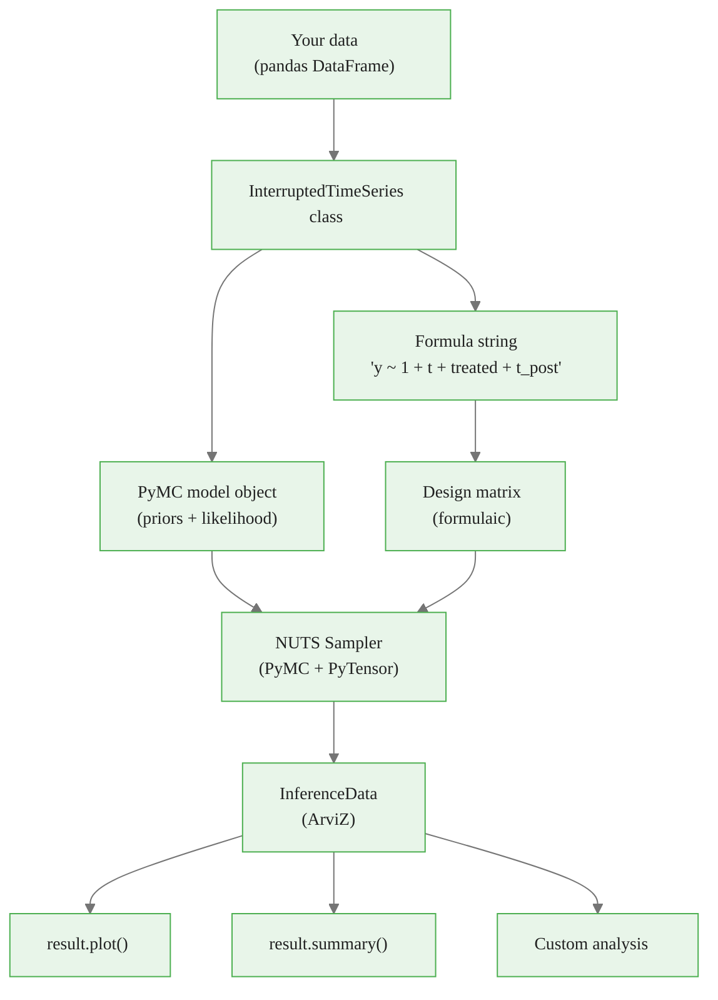

<!-- _class: lead -->

# CausalPy ITS API

## From Formula to Posterior in Minutes

### Causal Inference with CausalPy — Module 01, Guide 3

<!-- Speaker notes: This guide is practical and code-focused. Students should have their laptops open and follow along. The goal is to make them fluent with the CausalPy API so they can move quickly in the notebooks. Cover: data preparation conventions, the formula specification language, model objects, output structure, visualization methods, and convergence diagnostics. By the end, students should be able to set up and interpret a CausalPy ITS analysis from scratch. -->

---

# CausalPy Architecture



<!-- Speaker notes: The architecture diagram shows that CausalPy is a thin, well-designed wrapper. Your data goes in, a formula specifies the model structure, a PyMC model object specifies the priors and likelihood, and CausalPy orchestrates the full pipeline. The output is an ArviZ InferenceData object — the standard container for Bayesian inference results in the Python ecosystem. Knowing this architecture helps you understand how to debug and customize. -->

---

# Data Requirements

CausalPy needs a pandas DataFrame with:

1. **Outcome column** — what you are measuring
2. **Numeric time index** — integer from 0 to N-1
3. **`treated` column** — 1 after intervention, 0 before
4. **`t_post` column** — time since intervention (0 in pre-period)

```python
df.head(3)
#    t  outcome  treated  t_post
# 0  0    102.3      0.0     0.0
# 1  1    104.1      0.0     0.0
# 2  2    106.7      0.0     0.0

df.iloc[24:27]
#     t  outcome  treated  t_post
# 24 24    118.5      1.0     0.0  ← intervention point
# 25 25    121.8      1.0     1.0
# 26 26    123.4      1.0     2.0
```

<!-- Speaker notes: Point out the key detail: at the intervention point (row 24 here), treated=1 but t_post=0. The level change (beta_2) applies immediately at t*, but the slope change (beta_3) needs time to accumulate. Students sometimes expect t_post=1 at the intervention point, which would be wrong. The formula y ~ 1 + t + treated + t_post with this data structure correctly estimates the segmented regression model. -->

<div class="callout-info">
Info:  — what you are measuring
2. 
</div>

---

# Fitting the Model

```python
import causalpy as cp

result = cp.InterruptedTimeSeries(
    data=df,
    treatment_time=24,         # Integer index of first treated row
    formula="y ~ 1 + t + treated + t_post",
    model=cp.pymc_models.LinearRegression(
        sample_kwargs={
            "draws": 1000,
            "tune": 1000,
            "chains": 4,
            "target_accept": 0.9,
            "progressbar": True,
            "random_seed": 42,
        }
    ),
)
```

CausalPy prints sampling progress and then stores all results in `result`.

<!-- Speaker notes: The `treatment_time` parameter must be an integer index, not a date or string. This is the row number in the DataFrame at which treatment begins. If students are using date-indexed DataFrames, they need to convert: `treatment_time = df.index.get_loc(intervention_date)`. The default priors in LinearRegression are weakly informative — they impose minimal regularization and let the data speak. For most ITS analyses, the defaults are appropriate. -->

---

# Formula Specification

<div class="columns">

**Formula → Model parameters**

`y ~ 1 + t + treated + t_post`

- `1`: Intercept ($\alpha$)
- `t`: Pre-intervention slope ($\beta_1$)
- `treated`: Level change ($\beta_2$)
- `t_post`: Slope change ($\beta_3$)

**With seasonal controls:**

`y ~ 1 + t + treated + t_post + C(month)`

`y ~ 1 + t + treated + t_post + sin_1 + cos_1`

</div>

Every variable in the formula must be a column in `data`.

<!-- Speaker notes: The formula syntax follows the standard Wilkinson formula notation used by R's lm() and Python's statsmodels/formulaic. C(month) creates dummy variables for each unique value of month. You can also use interactions (t:treated), polynomial terms (I(t**2)), and transformations (np.log(t)). The formula is the key interface between causal theory and statistical implementation — every term should correspond to something in your DAG. -->

<div class="callout-key">
Key Point: Formula → Model parameters
</div>

---

# Reading the Output

```python
# Quick summary table
print(result.summary())

# Full ArviZ summary
import arviz as az
az.summary(result.idata, hdi_prob=0.94)
```

Output columns:
- `mean`: Posterior mean
- `sd`: Posterior standard deviation
- `hdi_3%`, `hdi_97%`: 94% Highest Density Interval
- `r_hat`: Convergence diagnostic (< 1.01 = good)
- `ess_bulk`: Effective sample size (> 400 = good)

<!-- Speaker notes: Walk through each output column. The HDI is more informative than a frequentist confidence interval: the 94% HDI contains 94% of the posterior probability mass. It is a direct statement about where the parameter values are, given the data. The r_hat and ess_bulk diagnostics are the convergence checks — they should be verified before trusting any estimates. A high r_hat means the chains did not mix (the sampler got stuck), and the posterior estimates are unreliable. -->

---

# Accessing Posterior Samples

```python
# All samples in an xarray Dataset
posterior = result.idata.posterior
# Shape: (chains, draws, ...) for each variable

# Extract and flatten a specific parameter
beta_level = posterior["treated"].values.flatten()
# Now it's a 1D numpy array with chains*draws values

# Compute any quantity
print(f"Mean: {beta_level.mean():.3f}")
print(f"Std: {beta_level.std():.3f}")
print(f"94% HDI: {az.hdi(beta_level, hdi_prob=0.94)}")
print(f"P(> 0): {(beta_level > 0).mean():.2%}")
```

<!-- Speaker notes: Having access to raw posterior samples is the key advantage of the Bayesian approach. You can compute any quantity of interest: the probability that the effect exceeds a threshold, the median rather than the mean, the effect in a specific subperiod, or any derived statistic. This flexibility is impossible with frequentist methods that only report point estimates and standard errors. Encourage students to explore the posterior samples directly rather than just reading the summary table. -->

---

# Visualization: result.plot()

```python
fig, axes = result.plot()

# axes[0]: observed + fitted + counterfactual
# axes[1]: causal impact at each time point

axes[0].set_title("ITS Analysis")
axes[0].set_ylabel("Outcome")
axes[1].set_ylabel("Causal Impact")
plt.tight_layout()
plt.show()
```

The shaded bands show the posterior uncertainty.

The counterfactual is shown as a dashed line in the post-period.

<!-- Speaker notes: The built-in plot is designed for quick communication. The top panel shows everything on the same axis: observed data points, the fitted model (with uncertainty bands), and the dashed counterfactual trajectory in the post-period. The bottom panel shows the estimated causal impact at each time point — if it is above zero everywhere, there is consistent evidence of a positive effect. The width of the bands shows uncertainty: wider bands mean less confident estimates. -->

---

# ArviZ Diagnostic Plots

```python
import arviz as az

# Posterior distributions
az.plot_posterior(
    result.idata,
    var_names=["treated", "t_post"],
    ref_val=0,
)

# Trace plots (check chain mixing)
az.plot_trace(
    result.idata,
    var_names=["treated", "t_post"],
)

# Posterior predictive check
az.plot_ppc(result.idata, num_pp_samples=50)
```

<!-- Speaker notes: Each ArviZ plot serves a specific diagnostic purpose. plot_posterior shows where the parameter values are and whether the reference value (zero = no effect) is in the tail of the distribution. plot_trace shows whether the chains explored the parameter space independently and consistently (good mixing = hairy caterpillar pattern). plot_ppc compares simulated data from the posterior to the observed data — systematic misfits indicate model misspecification. Run all three before reporting results. -->

---

# Convergence Checklist

```python
# 1. Check R-hat (< 1.01)
rhat = az.rhat(result.idata)

# 2. Check ESS (> 400)
ess = az.ess(result.idata)

# 3. Check divergences (should be 0 or very few)
n_div = result.idata.sample_stats["diverging"].sum().item()

# 4. Visual trace plots
az.plot_trace(result.idata, var_names=["treated", "t_post"])
```

**If convergence fails:**
- Increase `tune` (more warmup iterations)
- Increase `target_accept` (0.9 → 0.95)
- Check for model misspecification
- Simplify the formula

<!-- Speaker notes: Convergence checking is not optional — it is a prerequisite for interpretation. A model that has not converged gives unreliable posterior estimates that may be arbitrarily far from the true posterior. The checklist here is the minimum: check all four items for every analysis. If R-hat > 1.01, do not report the results — re-run with more tuning iterations or a reparameterized model. Divergences in NUTS indicate the sampler encountered regions of the parameter space where the log-density had problematic geometry, often suggesting model misspecification. -->

---

# Computing Derived Quantities

```python
posterior = result.idata.posterior
beta_level = posterior["treated"].values.flatten()
beta_slope = posterior["t_post"].values.flatten()

# Causal effect at each post-intervention month
n_post = 24
k = np.arange(n_post)
# impact[i, k] = sample i, month k post-intervention
impact_matrix = beta_level[:, None] + beta_slope[:, None] * k[None, :]

# Cumulative impact
cumulative = impact_matrix.sum(axis=1)
print(f"Cumulative impact: {cumulative.mean():.1f}")
print(f"94% HDI: {az.hdi(cumulative, hdi_prob=0.94)}")
print(f"P(positive): {(cumulative > 0).mean():.1%}")
```

The posterior samples support any derived quantity.

<!-- Speaker notes: This slide is the key practical payoff of the Bayesian approach. In a frequentist framework, computing the cumulative impact and its uncertainty requires delta method approximations or bootstrap. In the Bayesian framework, it is three lines of code: compute the quantity from posterior samples, then summarize the distribution. The same approach works for any derived quantity: maximum monthly impact, time to peak effect, probability that the effect exceeded a threshold, etc. -->

---

# Common API Mistakes

| Mistake | Symptom | Fix |
|---------|---------|-----|
| `treatment_time` is a date, not integer | `TypeError` | Use the row index integer |
| Variable not in DataFrame | `KeyError` | Add the column before fitting |
| `t_post = 1` at intervention point | Wrong `β₃` estimate | Use `max(t - t_star, 0)` |
| `treated = t > t_star` (strict) | Skips one observation | Use `treated = t >= t_star` |
| `draws=100` | Wide HDIs, poor mixing | Use `draws >= 1000` |
| No `random_seed` | Non-reproducible results | Always set `random_seed` |

<!-- Speaker notes: Go through each mistake. The t_post convention (0 at the intervention point, not 1) is the one that most commonly trips up students. The treatment indicator using >= vs > shifts which observation is labeled as the first treated observation. The random_seed is essential for reproducibility — without it, two identical runs give different posterior samples due to randomness in the NUTS sampler. With 100 draws, results are noisy and credible intervals are unreliable; 1000 is the minimum for reporting. -->

---

# Quick Reference: Formula Building

| Goal | Formula Term |
|------|-------------|
| Intercept (always include) | `1` |
| Secular time trend | `t` |
| Immediate level change | `treated` |
| Slope change after intervention | `t_post` |
| Monthly seasonal fixed effects | `C(calendar_month)` |
| Smooth annual seasonality (1 harmonic) | `sin_1 + cos_1` |
| Additional covariate | `covariate_name` |
| Quadratic pre-trend | `I(t**2)` |
| Log outcome | Use `np.log(y)` as the outcome variable |

<!-- Speaker notes: This table is the practical reference for formula building. Students can bookmark this slide. The key decisions are: (1) should I include t_post (slope change) or just treated (level only)? — start with both, let the posterior tell you. (2) Do I need seasonal controls? — check residual ACF for seasonal patterns. (3) Are there important pre-intervention covariates? — add them if they confound the time trend. The formula directly encodes your causal assumptions about what drives the outcome. -->

<div class="callout-key">
Key Point: The `treatment_time` parameter in CausalPy must exactly match your intervention date. Off-by-one errors silently bias the treatment effect estimate.
</div>

---

<!-- _class: lead -->

# Core Takeaway

## formula = causal assumptions in code
## result.idata = full posterior distribution
## Always check R-hat < 1.01 before reporting

<!-- Speaker notes: Three things to remember. The formula string is not just a statistical convenience — it encodes your causal model. Each term represents a claim about what drives the outcome. The InferenceData object is the full result: posterior samples, prior samples, observed data, log-likelihood, and sample statistics. And convergence checking is non-negotiable: R-hat >= 1.01 means the posterior is unreliable. -->

---

# What's Next

**Notebook 1:** ITS on a Smoking Ban Dataset
- Load monthly hospital admissions data
- Prepare the ITS design matrix
- Fit the full CausalPy ITS model
- Run all convergence checks
- Interpret level change, slope change, and cumulative impact

**Notebook 2:** ITS Diagnostics
- Residual analysis and autocorrelation detection
- Posterior predictive checks
- Placebo tests

<!-- Speaker notes: The notebooks immediately apply the API knowledge from this guide. Notebook 1 is the core ITS workflow on a realistic dataset — students should be able to complete it independently using what they learned in Guides 1-3. Notebook 2 goes deeper into diagnostics, which is where many applied analyses fall short. A model that passes all diagnostic checks is much more defensible than one that ignores them. -->

<div class="callout-info">
Info: CausalPy's ITS API fits both frequentist and Bayesian models with the same data preparation -- switching is one parameter change.
</div>
