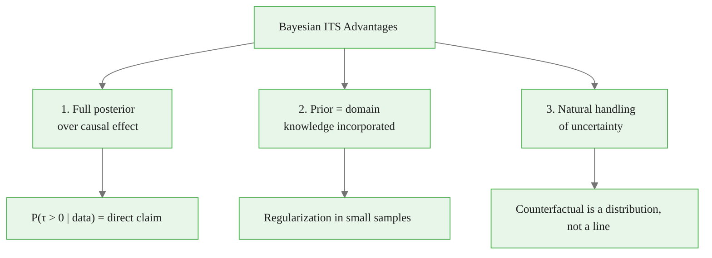
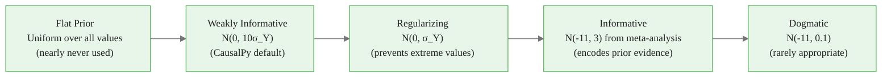

<!-- _class: lead -->

# Bayesian ITS

## Uncertainty Quantification for Causal Inference

### Causal Inference with CausalPy — Module 02

<!-- Speaker notes: This module shifts from the "what" and "how" of ITS to the "why Bayesian." Students who have used frequentist methods will need to recalibrate their intuitions. The key shift: from "reject the null" to "quantify the evidence." Bayesian ITS gives you a full probability distribution over the causal effect, not just a point estimate and p-value. This module explains why that matters and how to use it. -->

---

# Frequentist vs Bayesian ITS

<div class="columns">

**Frequentist ITS**
- Point estimate: $\hat{\beta}_2 = -4.2$
- Standard error: $SE = 1.3$
- p-value: $p = 0.002$
- Inference: "Reject null at 5%"

**Bayesian ITS**
- Posterior mean: $E[\beta_2 | data] = -4.1$
- 94% HDI: $[-6.9, -1.5]$
- $P(\beta_2 < 0 | data) = 99.2\%$
- Inference: "99.2% credible that effect is negative"

</div>

Both use the same data. Bayesian gives a **direct probability statement**.

<!-- Speaker notes: The comparison highlights the practical advantage. The frequentist p-value is a statement about the sampling procedure ("if this study were repeated infinitely under the null, 0.2% of results would be this extreme"). Most practitioners misinterpret this as "0.2% probability that the null is true." The Bayesian 99.2% credibility is exactly the statement practitioners want and actually understand correctly. The two approaches give numerically similar answers for well-behaved problems, but the Bayesian interpretation is cleaner and more useful for decision-making. -->

<div class="callout-info">
Info: direct probability statement
</div>

---

# Three Advantages of Bayesian ITS



<!-- Speaker notes: These three advantages are cumulative. First, the full posterior gives you every probability statement you need. Second, priors let you incorporate what you knew before seeing the data — useful for small samples and for communicating with domain experts. Third, the counterfactual is properly treated as uncertain, growing more uncertain the further you extrapolate. Together, these advantages make Bayesian ITS more informative and more honest about uncertainty than frequentist ITS. -->

---

# The Bayesian Model

**Likelihood:**
$$Y_t \sim \mathcal{N}(\mu_t, \sigma^2)$$
$$\mu_t = \alpha + \beta_1 t + \beta_2 D_t + \beta_3 (t - t^*) D_t$$

**Priors (weakly informative):**
$$\alpha \sim \mathcal{N}(\bar{Y}, 2\sigma_Y) \quad \beta_1 \sim \mathcal{N}(0, 1)$$
$$\beta_2 \sim \mathcal{N}(0, \sigma_Y) \quad \beta_3 \sim \mathcal{N}(0, 0.1\sigma_Y)$$
$$\sigma \sim \text{HalfNormal}(\sigma_Y)$$

**Posterior:** Proportional to likelihood × prior (computed via NUTS MCMC)

<!-- Speaker notes: Walk through the model structure. The likelihood is a standard Gaussian regression. The priors encode: we expect the outcome to be near its mean (intercept prior), we expect small trends and slope changes relative to the outcome scale, and we expect positive noise. These are "weakly informative" because they center on plausible values but are broad enough to be overridden by data. The magic of MCMC is that we do not need to compute the posterior analytically — NUTS generates samples from it. -->

<div class="callout-key">
Key Point: Priors (weakly informative):
</div>

---

# P(τ > 0): The Bayesian Causal Statement

```python
# Extract posterior samples
beta_level = model.idata.posterior["treated"].values.flatten()

# Direct probability statement
print(f"P(effect < 0) = {(beta_level < 0).mean():.1%}")

# No need for p-values or test statistics
```

**Compare to frequentist:**
- Frequentist p-value: P(data | null) — statement about data
- Bayesian P(τ < 0 | data): statement about the parameter

**Bayesian says what you want to know.**

<!-- Speaker notes: This slide makes the most important practical point. P(τ < 0 | data) is the probability that the treatment had a negative effect, given the data we observed. This is directly useful for decision-making: "Should we implement this policy? The data says there is a 97% chance it reduces hospitalizations." The frequentist p-value does not directly support this statement, and practitioners who interpret it this way are making a logical error (though a forgivable one). -->

---

# The Counterfactual as a Distribution

In frequentist ITS: the counterfactual is a **single line**.

In Bayesian ITS: the counterfactual is a **distribution** that grows wider over time.

```python
# Posterior samples of counterfactual at each time
alpha_samples = model.idata.posterior["Intercept"].values.flatten()
beta1_samples = model.idata.posterior["month"].values.flatten()

# Counterfactual distribution at time t (post-intervention)
t = 40  # Example post-intervention time
cf_samples = alpha_samples + beta1_samples * t
print(f"Counterfactual at t={t}: {cf_samples.mean():.1f} ± {cf_samples.std():.1f}")
```

The further from $t^*$, the wider the posterior predictive interval.

<!-- Speaker notes: This is the honest representation of counterfactual uncertainty. In a frequentist model, the standard error of the counterfactual prediction is typically similar at all post-intervention time points (or even constant in simple models). But intuitively, our uncertainty about what would have happened without the intervention should grow as we extrapolate further forward. The Bayesian posterior correctly captures this because the uncertainty in the slope coefficient (beta_1) compounds over time — a small uncertainty in the slope translates to larger uncertainty in the counterfactual value at t=50 than at t=25. -->

---

# Prior Knowledge as Domain Information

**Scenario:** You are evaluating a workplace smoking ban in a European city.

Previous studies from other European cities found:
- Effect size: −8 to −15 AMI admissions / 100k (immediate effect)
- Posterior from meta-analysis: $\mathcal{N}(-11, 3)$

**Informative prior:**
```python
beta_level = pm.Normal(
    "beta_level",
    mu=-11,   # Prior mean from meta-analysis
    sigma=3,  # Prior uncertainty
)
```

**Why this helps:** Even with 12 months of post-intervention data, the informative prior from 20 previous studies substantially reduces uncertainty.

<!-- Speaker notes: This example shows how Bayesian ITS formally incorporates prior evidence. The meta-analysis result becomes a prior. The new city's data updates the prior to produce a posterior that combines both sources of evidence. This is Bayesian updating at its most transparent. Note: if the new data strongly contradicts the prior (e.g., the effect appears to be near zero despite the prior expecting −11), the posterior will be somewhere between the two — and if the data is strong enough, it will pull the posterior away from the prior. -->

---

# Prior Types: A Spectrum



**Rule:** Use weakly informative by default. Use informative when you have genuine prior evidence. Never use flat or dogmatic.

<!-- Speaker notes: Walk through each type. Flat priors (uniform over all values) are mathematically problematic (improper) and give nonsensical results in many regression settings. Weakly informative priors are the CausalPy default — they center on zero or plausible values but are broad. Regularizing priors are slightly tighter and reduce the risk of overfitting. Informative priors encode genuine prior knowledge and are scientifically honest. Dogmatic priors essentially fix the parameter and prevent data from updating the belief — almost never appropriate except in very specific constrained optimization contexts. -->

---

# NUTS: The Sampling Engine

**No-U-Turn Sampler (NUTS)** uses gradient information for efficient sampling.

<div class="columns">

**Why NUTS over Random Walk?**
- Takes large steps guided by gradient
- Dramatically lower autocorrelation between samples
- Scales to 100s of parameters
- Auto-tunes step size

**Key parameters:**
- `draws`: samples after warmup
- `tune`: warmup iterations
- `chains`: parallel chains (≥4)
- `target_accept`: 0.8–0.95

</div>

<!-- Speaker notes: NUTS is a sophisticated variant of Hamiltonian Monte Carlo. The key insight is that it uses the gradient of the log-posterior to make informed proposals, like a ball rolling on a landscape guided by the terrain. This dramatically reduces the correlation between consecutive samples compared to random-walk Metropolis, meaning you need far fewer samples to get reliable estimates. The "No-U-Turn" part refers to the adaptive termination criterion that prevents the sampler from doubling back on itself, automatically choosing the right trajectory length. -->

---

# Convergence: R-hat and ESS

**R-hat (Gelman-Rubin diagnostic):**
$$\hat{R} = \sqrt{\frac{\hat{V}}{W}}$$

where $\hat{V}$ is the variance across chains and $W$ is within-chain variance.

- $\hat{R} \approx 1$: all chains exploring the same distribution (good)
- $\hat{R} > 1.01$: chains disagree — do not trust the estimates

**ESS (Effective Sample Size):**

Corrects sample count for autocorrelation within chains.

- ESS > 400: sufficient for reliable estimates
- ESS < 100: estimates may be unreliable

<!-- Speaker notes: R-hat and ESS are the two most important convergence diagnostics. R-hat compares the variance within chains to the variance between chains — if the chains are all exploring the same region, these should be similar and R-hat ≈ 1. ESS accounts for the fact that consecutive MCMC samples are correlated — 4000 samples with high within-chain autocorrelation may give only 200 effective independent samples. Both diagnostics should be checked for every parameter you plan to report. ArviZ computes both automatically. -->

---

# What Divergences Mean

**Divergences** are NUTS failures where the sampler encounters problematic geometry.

**Common causes:**
- Near-degenerate posterior geometry (funnel-shaped)
- Highly correlated parameters
- Model misspecification creating multimodality

**What to do:**
- Increase `target_accept` (0.9 → 0.95)
- Reparameterize (non-centered parameterization)
- Check model specification for logical errors
- Use stronger priors to regularize the geometry

**Zero divergences = the sampler trusted the gradient throughout**

<!-- Speaker notes: Divergences are a unique feature of HMC/NUTS that makes it more informative than other MCMC samplers. When a divergence occurs, it means the sampler detected that it was in a region where the gradient could not be trusted — usually because the posterior has extreme curvature. Unlike random-walk MCMC where you would never know this is happening, NUTS explicitly flags these events. More than 10-20 divergences (out of 4000 samples) is a warning sign that the model has structural problems. Zero divergences is a positive signal. -->

---

# Module 02 Road Map

```mermaid
%%{init: {"theme": "base", "themeVariables": {"primaryColor": "#e8f5e9", "primaryBorderColor": "#4caf50", "primaryTextColor": "#212121", "secondaryColor": "#e3f2fd", "tertiaryColor": "#fff8e1", "lineColor": "#757575", "fontFamily": "Inter, sans-serif", "fontSize": "14px"}}}%%
flowchart LR
    G1["Guide 1\nBayesian ITS: Why Bayes"] --> G2["Guide 2\nCausalPy-PyMC Internals"]
    G2 --> G3["Guide 3\nPrior Specification"]
    G3 --> N1["Notebook 1\nITS from Scratch in PyMC"]
    N1 --> N2["Notebook 2\nPrior Sensitivity"]
    N2 --> N3["Notebook 3\nPosterior Predictive Checks"]
```



**You are here:** Guide 1

<!-- Speaker notes: Guide 1 (this deck) explains the philosophical and statistical advantages of the Bayesian approach. Guide 2 goes inside CausalPy to show how it constructs the PyMC model. Guide 3 is practical guidance on choosing priors. The notebooks move from building a model from scratch (Notebook 1) to sensitivity analysis (Notebook 2) to posterior predictive checks (Notebook 3). After this module, students understand not just how to run CausalPy but what it is doing under the hood. -->

<div class="callout-warning">
Warning: Bayesian results are sensitive to prior specification. Always run prior predictive checks before examining posterior results.
</div>

---

<!-- _class: lead -->

# Core Takeaway

## Bayesian ITS gives P(τ > 0 | data) — a direct probability statement about the causal effect.

## Priors encode domain knowledge and regularize small samples.

## NUTS + ArviZ provides diagnostics that frequentist methods cannot.

<!-- Speaker notes: Three-line takeaway. The most important is the first: P(τ > 0 | data) is the quantity decision-makers actually want and that is awkward to obtain from frequentist methods. The second underscores that priors are not a liability — they are a feature that allows formal incorporation of prior evidence. The third reminds students that the Bayesian toolkit (divergences, R-hat, ESS, trace plots, PPC) is richer than the frequentist equivalent and catches problems that frequentist diagnostics miss. -->

---

# What's Next

**Guide 2:** CausalPy-PyMC Internals
- How CausalPy builds the PyMC model
- The model graph and computational structure
- Accessing and modifying the underlying PyMC model

**Notebook 1:** ITS from Scratch in PyMC
- Build the exact model that CausalPy builds
- Then replicate with CausalPy and verify they match

<!-- Speaker notes: Guide 2 opens the hood of CausalPy. Understanding how CausalPy constructs the PyMC model is important for two reasons: it helps you debug when things go wrong, and it shows you how to extend the model for cases not handled by the default API (e.g., Poisson likelihood for count outcomes, AR(1) errors, hierarchical models across multiple treated units). Notebook 1 builds the ITS model from scratch — this is the most educational exercise in the module. -->

<div class="callout-insight">
Insight: Bayesian ITS provides full posterior distributions over treatment effects, naturally quantifying uncertainty without relying on asymptotic approximations.
</div>
