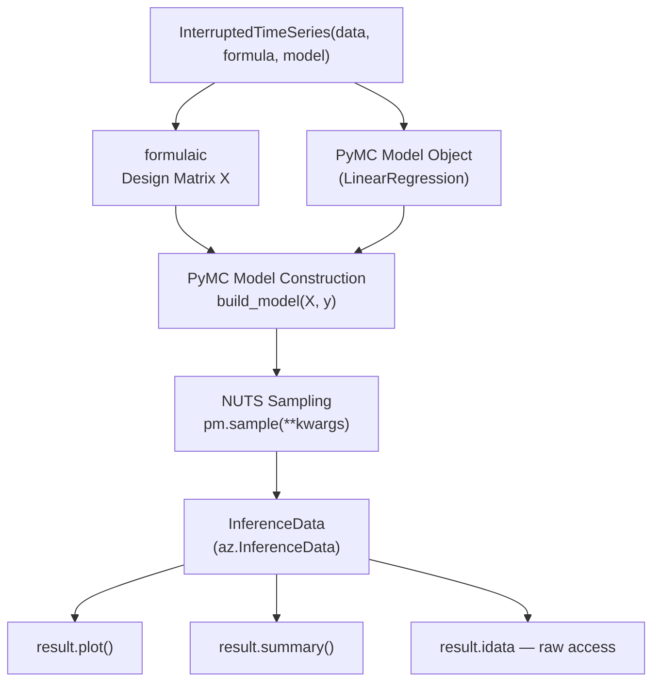

<!-- _class: lead -->

# CausalPy-PyMC Internals

## Opening the Hood

### Causal Inference with CausalPy — Module 02, Guide 2

<!-- Speaker notes: This guide is for practitioners who want to understand what CausalPy is doing under the hood, debug problems, and extend the library for custom use cases. The most important lesson: CausalPy is a thin wrapper. Everything it does is accessible and modifiable. Understanding this empowers students to go beyond the default API when their research questions require it. -->

---

# CausalPy Architecture



<!-- Speaker notes: This architecture diagram shows the complete flow. The formula string goes to formulaic which builds the design matrix X. X and the observed outcome y go into the PyMC model builder. The NUTS sampler produces the posterior samples. Everything is stored in an ArviZ InferenceData object. The plot() and summary() methods are just convenience wrappers around the InferenceData. Students who understand this flow can debug any step and customize any component. -->

---

# Step 1: Design Matrix via formulaic

```python
import formulaic

# CausalPy uses this internally
y, X = formulaic.model_matrix(
    "ami_rate ~ 1 + month + treated + t_post",
    df,
)

print(X.columns.tolist())
# ['Intercept', 'month', 'treated', 't_post']

print(X.head())
#    Intercept  month  treated  t_post
# 0        1.0    0.0      0.0     0.0
# 1        1.0    1.0      0.0     0.0
# ...
# 24       1.0   24.0      1.0     0.0  ← intervention point
# 25       1.0   25.0      1.0     1.0
```

Column names become coefficient names in the posterior.

<!-- Speaker notes: The formulaic library is the R-style formula interface. The column names it produces become the variable names you will see in result.idata.posterior — if you have 'treated' in your formula, you access it as idata.posterior['treated']. This is why it is important to name your columns clearly: 'treated' is more interpretable than 'D_t'. C(calendar_month) produces columns named 'calendar_month[T.1]', 'calendar_month[T.2]', etc. Understanding the design matrix structure helps you know exactly what CausalPy is estimating. -->

---

# Step 2: PyMC Model Construction

```python
import pymc as pm
import numpy as np

# This is essentially what LinearRegression.build_model() does:

with pm.Model() as its_model:
    # Data as PyMC Data (allows later prediction)
    X_data = pm.Data("X", X.values)
    y_data = pm.Data("y_obs", y.values)

    # Weakly informative priors
    beta = pm.Normal("beta", mu=0, sigma=20, shape=X.shape[1])
    sigma = pm.HalfNormal("sigma", sigma=1)

    # Linear predictor
    mu = pm.Deterministic("mu", pm.math.dot(X_data, beta))

    # Likelihood
    y_hat = pm.Normal("y_hat", mu=mu, sigma=sigma, observed=y_data)
```

<!-- Speaker notes: Show students the actual PyMC code structure. The coefficients are a single vector 'beta' — CausalPy renames them to match the design matrix column names after sampling. The pm.Data objects are important: they allow you to update the data after model construction, which is how CausalPy computes counterfactual predictions (by setting treatment variables to zero in the data and re-predicting). The HalfNormal prior on sigma ensures the noise standard deviation stays positive. -->

---

# Step 3: Sampling

```python
# CausalPy calls this internally:
with its_model:
    idata = pm.sample(
        draws=1000,       # From sample_kwargs
        tune=1000,        # From sample_kwargs
        chains=4,         # From sample_kwargs
        target_accept=0.9,
        progressbar=True,
        random_seed=42,
    )
```

After sampling, `idata.posterior["beta"]` has shape `(chains, draws, n_features)`.

<!-- Speaker notes: The sampling step is where the NUTS algorithm runs. NUTS uses automatic differentiation (via PyTensor) to compute gradients of the log-posterior, then uses those gradients to make informed proposals. The 'tune' iterations adapt the step size and mass matrix. After tuning, the 'draws' iterations generate the actual posterior samples. The random_seed ensures reproducibility. CausalPy forwards all sample_kwargs directly to pm.sample, so anything PyMC's pm.sample accepts can be passed here. -->

---

# Step 4: Counterfactual via pm.set_data

```python
# CausalPy computes counterfactuals by:
# 1. Building a new design matrix with treatment variables zeroed
# 2. Updating the model data
# 3. Sampling posterior predictive under counterfactual

# Modified design matrix: treatment variables set to 0
X_counterfactual = X.copy()
X_counterfactual["treated"] = 0
X_counterfactual["t_post"] = 0

# Update the model data
with its_model:
    pm.set_data({"X": X_counterfactual.values})

    # Posterior predictive under counterfactual
    cf_ppc = pm.sample_posterior_predictive(idata, random_seed=42)

# Causal effect = observed - counterfactual
tau = y.values - cf_ppc.posterior_predictive["y_hat"].mean(("chain", "draw"))
```

<!-- Speaker notes: The counterfactual computation is elegant: just set the treatment variables to zero in the design matrix and re-predict. This gives you the outcome under the assumption that the intervention never happened — the counterfactual. The difference between the observed outcome and the counterfactual prediction is the causal effect. Because we are using posterior predictive sampling, we get a distribution over the counterfactual, not just a point estimate. -->

---

# The InferenceData Structure

```python
idata = result.idata

# Groups in the InferenceData
print(idata)

# Key groups:
# posterior         — posterior samples of all parameters
# observed_data     — the y values used to fit the model
# posterior_predictive — model predictions (at observed X)
# sample_stats      — NUTS diagnostics

# Access posterior for the level change
beta_level = idata.posterior["treated"]  # xarray DataArray
# Shape: (chain: 4, draw: 1000)

# Flatten to 1D numpy array
beta_level_flat = beta_level.values.flatten()  # (4000,)
```

<!-- Speaker notes: The InferenceData is an xarray-based container. Xarray gives labeled dimensions (chain, draw) which makes it easy to work with multi-chain posteriors. The .values attribute converts to numpy. The main groups students need are: posterior (the samples you want), sample_stats (for convergence diagnostics), and posterior_predictive (for PPCs). observed_data stores the original y values — useful for comparing to posterior predictive samples. -->

---

# Inspecting Variable Names

```python
# See all parameter names in the posterior
print(list(result.idata.posterior.data_vars))
# ['Intercept', 'month', 'treated', 't_post', 'sigma']

# For seasonal models with C(calendar_month):
# ['Intercept', 'month', 'treated', 't_post', 'sigma',
#  'calendar_month[T.1]', 'calendar_month[T.2]', ...]

# Access specific parameter
alpha_posterior = result.idata.posterior["Intercept"]
beta_month = result.idata.posterior["month"]
beta_level = result.idata.posterior["treated"]
beta_slope = result.idata.posterior["t_post"]
sigma = result.idata.posterior["sigma"]
```

The variable names come from the design matrix column names.

<!-- Speaker notes: The variable naming convention is important to know upfront. The intercept is always named 'Intercept'. Other variables are named exactly as they appear in the formula. Interaction terms (e.g., treated:t_post) appear as 'treated:t_post'. Polynomial terms (I(t**2)) appear as 'I(t ** 2)'. For categorical variables created with C(), each level appears separately. Knowing the names saves debugging time when accessing the posterior. -->

---

# Extending: Custom PyMC Models

```python
class PoissonITS(cp.pymc_models.LinearRegression):
    """Override build_model for Poisson count outcomes."""

    def build_model(self, X, y, coords):
        with pm.Model(coords=coords) as self.model:
            X_ = pm.Data("X", X, dims=["obs", "coeffs"])
            y_ = pm.Data("y_obs", y, dims=["obs"])

            # Log-scale coefficients for Poisson GLM
            beta = pm.Normal("beta", mu=0, sigma=1, dims=["coeffs"])
            log_mu = pm.Deterministic("log_mu", pm.math.dot(X_, beta))
            mu = pm.Deterministic("mu", pm.math.exp(log_mu))

            # Poisson likelihood
            y_hat = pm.Poisson("y_hat", mu=mu, observed=y_, dims=["obs"])
        return self.model

# Use like any other model
result = cp.InterruptedTimeSeries(
    data=df, treatment_time=t_star,
    formula="count ~ 1 + t + treated + t_post",
    model=PoissonITS(sample_kwargs={...}),
)
```

<!-- Speaker notes: The customization pattern is clean: subclass LinearRegression and override build_model. The build_model method receives X (the design matrix), y (the outcome), and coords (a dict of coordinate labels for xarray). By following the same structural pattern (pm.Data objects, dims for array dimensions, a "y_hat" observed variable), the resulting model works seamlessly with all of CausalPy's plot and summary methods. This extensibility is a key advantage of CausalPy's architecture. -->

---

# Model Diagnostics: Sample Stats

```python
# Access NUTS diagnostics
sample_stats = result.idata.sample_stats

# Divergences (should be 0 or near 0)
divergences = sample_stats["diverging"]
print(f"Total divergences: {int(divergences.sum())}")

# Tree depth (deeper = sampler is taking longer steps)
tree_depth = sample_stats["tree_depth"]
print(f"Mean tree depth: {float(tree_depth.mean()):.1f}")
print(f"Max tree depth: {int(tree_depth.max())}")

# If max tree depth is 10 (the default maximum), the sampler hit the limit
# This means the trajectory was truncated and results may be unreliable
if int(tree_depth.max()) >= 10:
    print("WARNING: Max tree depth hit. Consider increasing max_treedepth.")
```

<!-- Speaker notes: The sample_stats group contains rich NUTS diagnostic information. In addition to divergences (the most important), tree depth tells you how efficiently the sampler is exploring. A consistently low tree depth (1-3) means the sampler is taking many small steps — possibly because the mass matrix is poorly adapted (run more tuning iterations). A tree depth consistently hitting the maximum (10 by default) means the sampler needs longer trajectories — increase max_treedepth in sample_kwargs. -->

---

<!-- _class: lead -->

# Core Takeaway

## CausalPy is formulaic → PyMC → ArviZ.

## Every step is inspectable: `result.model`, `result.idata`.

## Extend by subclassing `cp.pymc_models.LinearRegression`.

<!-- Speaker notes: Three-line takeaway. The architecture is transparent: formula → design matrix, design matrix → PyMC model, PyMC model → MCMC samples, samples → InferenceData. Every intermediate product is accessible. Customization is via subclassing — not hacking the source. The extensibility pattern (override build_model) enables Poisson regression for counts, Student-t for robustness, AR(1) for autocorrelation, hierarchical models for multiple treated units, and any other PyMC model you can imagine. -->

---

# What's Next

**Guide 3:** Prior Specification
- Choosing informative vs weakly informative priors
- Prior predictive checks
- Visualizing prior impact

**Notebook 1:** ITS from Scratch in PyMC
- Build the exact model CausalPy builds
- Verify outputs match
- Add AR(1) error structure

<!-- Speaker notes: Guide 3 makes the prior specification practical — how do you choose priors for the intercept, trend slope, level change, and noise? The prior predictive check is the key tool: sample from the prior before seeing the data and check that the implied outcomes span a plausible range. Notebook 1 is the capstone of this module: students write the ITS model in raw PyMC, verify it matches CausalPy, then extend it with AR(1) errors that CausalPy does not support by default. -->
