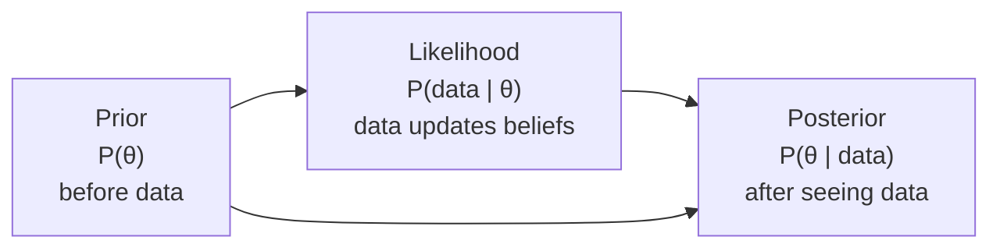
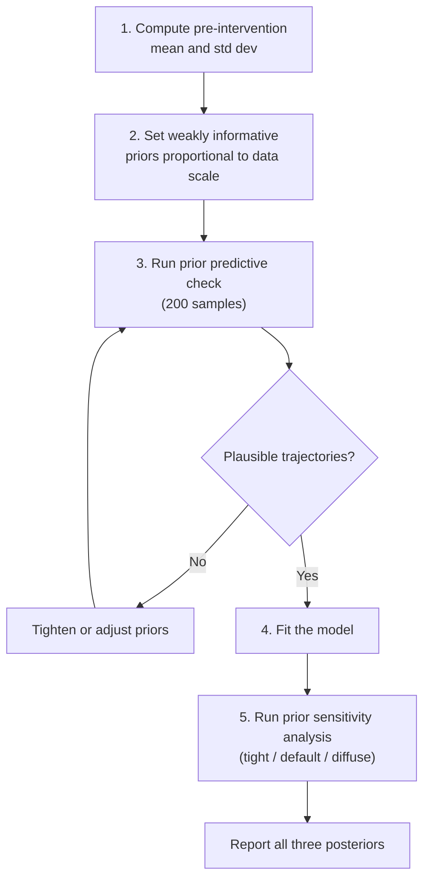

<!-- _class: lead -->

# Prior Specification

## Encoding Domain Knowledge in Bayesian ITS

### Causal Inference with CausalPy — Module 02, Guide 3

<!-- Speaker notes: Prior specification is often seen as the most controversial aspect of Bayesian analysis. Critics argue it is subjective; Bayesians argue that ignoring prior knowledge is also a choice (just an implicit one). The goal of this guide is to make prior choice principled, transparent, and checkable. The key tool is the prior predictive check — before seeing the data, verify that the prior implies plausible outcomes. -->

---

# What Is a Prior?

A **prior** $P(\theta)$ represents your beliefs about parameter values **before** seeing the data.



In large samples, the likelihood dominates and the prior has minimal influence.

In small samples, the prior is crucial — it regularizes the estimates.

<!-- Speaker notes: Bayes' theorem is simple: posterior ∝ prior × likelihood. When the data are abundant, the likelihood is very peaked and the posterior closely tracks it regardless of the prior. When data are scarce, the prior pulls the posterior toward the prior mean. This is regularization from a Bayesian perspective. The key question for applied Bayesian ITS is: do you have enough post-intervention data that the prior doesn't matter much? With 6 post-intervention observations, the answer is almost certainly no. With 30+, the answer is probably yes for the level change (but maybe not for the slope change, which accumulates slowly). -->

---

# Three Prior Types

<div class="columns">

**Weakly Informative**
$$\beta_2 \sim \mathcal{N}(0, \sigma_Y)$$
Centered at zero, scale proportional to data variation. **Use this as default.**

**Informative**
$$\beta_2 \sim \mathcal{N}(-11, 3)$$
Based on meta-analysis or previous studies. **Use when prior evidence exists.**

**Too Diffuse**
$$\beta_2 \sim \mathcal{N}(0, 1000)$$
Allows absurd effects. Causes sampling problems. **Avoid.**

</div>

<!-- Speaker notes: The weakly informative prior is the Goldilocks prior: not too tight, not too diffuse. Centered at zero means no prior assumption about direction. Scale proportional to sigma_Y means the prior says "the effect is probably within one standard deviation of the outcome." This is almost always correct — effects rarely exceed the full variation of the outcome. The informative prior formally incorporates external evidence. The too-diffuse prior is effectively flat and causes problems: the posterior can be pulled to extreme values by numerical noise in the likelihood. -->

---

# Prior Predictive Check

**Before fitting the model, sample from the prior and look at the implied outcomes.**

```python
import pymc as pm

with pm.Model() as prior_model:
    alpha = pm.Normal("alpha", mu=85, sigma=20)   # AMI baseline
    beta1 = pm.Normal("beta1", mu=0, sigma=0.5)  # Pre-trend
    beta2 = pm.Normal("beta2", mu=0, sigma=10)   # Level change
    beta3 = pm.Normal("beta3", mu=0, sigma=0.5)  # Slope change
    sigma = pm.HalfNormal("sigma", sigma=5)

    mu = alpha + beta1*t + beta2*treated + beta3*t_post
    y_prior = pm.Normal("y_prior", mu=mu, sigma=sigma)

    prior_pred = pm.sample_prior_predictive(samples=200)
```

**Ask: Do these trajectories look like plausible AMI data?**

<!-- Speaker notes: The prior predictive check is the Bayesian equivalent of sanity-checking your model before fitting. You sample from the prior, compute the implied outcomes at every time point, and plot them. If the trajectories include negative AMI rates, your intercept prior is too diffuse. If the trajectories all cluster within ±2 units of 85 regardless of the intervention, your beta_2 prior is too tight. The prior predictive check is cheap (no actual sampling needed) and catches prior misspecification before you invest computation in sampling the posterior. Encourage students to always run this check. -->

---

# Choosing Prior Scales

**Step 1:** Compute pre-intervention statistics

```python
y_pre = df.loc[df["treated"] == 0, "outcome"]
y_mean = y_pre.mean()   # Center for intercept prior
y_std = y_pre.std()     # Scale for effect size priors
n_pre = len(y_pre)      # Number of pre-intervention obs
```

**Step 2:** Set priors proportional to data scale

| Parameter | Prior | Rationale |
|-----------|-------|-----------|
| $\alpha$ | $\mathcal{N}(\bar{Y}, 2\sigma_Y)$ | Outcome near its pre-period range |
| $\beta_1$ | $\mathcal{N}(0, \sigma_Y/\sqrt{n_{pre}})$ | Monthly change is small relative to overall variation |
| $\beta_2$ | $\mathcal{N}(0, \sigma_Y)$ | Effect within ±2 standard deviations |
| $\beta_3$ | $\mathcal{N}(0, 0.1\sigma_Y)$ | Slope changes are smaller than level changes |
| $\sigma$ | $\text{HalfNormal}(\sigma_Y)$ | Noise similar to pre-period variation |

<!-- Speaker notes: This table provides a principled default prior for ITS analyses. The key insight is scaling all priors by the pre-intervention standard deviation (sigma_Y). This means the same prior code works for any outcome scale: whether you're modeling AMI rates per 100k (sigma ~10) or stock returns (sigma ~0.02), the priors are automatically appropriate. The intercept prior centers at the pre-period mean, which is typically a very good starting point. The beta_3 prior is tighter because slope changes are typically much smaller than level changes. -->

---

# Prior Sensitivity Analysis

Test three prior widths for the causal effect parameter:

```python
results = {}
for sigma_scale, label in [(0.5, "tight"), (1.0, "default"), (3.0, "diffuse")]:
    results[label] = fit_model_with_prior(
        beta2_sigma=y_std * sigma_scale
    )

# Compare posteriors
import arviz as az
az.plot_forest(
    [r.idata for r in results.values()],
    model_names=list(results.keys()),
    var_names=["treated"],
    figsize=(8, 3),
)
```

**Robust result:** All three priors give similar posteriors.

**Fragile result:** Posteriors change substantially — data are not informative enough.

<!-- Speaker notes: Prior sensitivity analysis is a standard requirement in rigorous Bayesian reporting. If the conclusion changes depending on whether you used a tight or diffuse prior, the data alone cannot support a strong causal claim. This does not necessarily mean the analysis is wrong — it might mean you need more data. But it is important to report this sensitivity rather than hiding it. A forest plot showing all three posteriors overlaid is the most efficient visualization of prior sensitivity. -->

---

# Informative Priors from Previous Studies

**Scenario:** Meta-analysis of 8 smoking ban studies finds:
- Mean level change: −10.5 AMI / 100k
- Standard deviation across studies: 3.2

**Informative prior:**

```python
# Prior encodes meta-analysis results
beta_level = pm.Normal(
    "beta_treated",
    mu=-10.5,   # Meta-analysis mean effect
    sigma=3.2,  # Heterogeneity across studies
)
```

**This is scientifically honest:** You are using all available evidence, not pretending the new study is the first.

<!-- Speaker notes: Using informative priors from meta-analyses is one of the strongest arguments for Bayesian ITS. In frequentist analysis, prior studies are acknowledged in the introduction but formally ignored in the statistical model. In Bayesian analysis, they become part of the inference. The key is transparency: report that you used an informative prior, report its source, and include the prior sensitivity analysis showing what happens with weaker priors. A result that holds up under both informative and weakly informative priors is stronger than one that holds only under informative priors. -->

---

# The Prior for Sigma

**The noise prior matters more than people think.**

```python
# Option 1: HalfNormal — recommended
sigma = pm.HalfNormal("sigma", sigma=y_pre_std)

# Option 2: HalfCauchy — heavier tails, allows occasional larger noise
sigma = pm.HalfCauchy("sigma", beta=y_pre_std)

# Option 3: Inverse Gamma — traditional but can be sensitive
sigma = pm.InverseGamma("sigma", alpha=2, beta=y_pre_std**2)
```

**Recommendation:** Use HalfNormal with sigma = pre-intervention standard deviation.

This gives 95% of the prior mass below $2 \times \sigma_Y$ — the noise cannot be unreasonably large.

<!-- Speaker notes: The sigma prior is often overlooked but matters especially for small samples. A very diffuse sigma prior allows the model to fit noise as signal, inflating the causal effect estimate. A very tight sigma prior may underestimate the residual variance, giving artificially precise causal estimates. The HalfNormal with scale equal to the pre-intervention standard deviation is a robust choice: it says "the noise is probably similar to the typical pre-intervention variation." This can be updated if the post-intervention data has different variance (e.g., if the intervention reduces not just the level but also the volatility). -->

---

# Prior Predictive Check: What to Look For

<div class="columns">

**Good prior predictive:**
- Trajectories span plausible outcome range
- Trajectories look like realistic data (not extreme outliers)
- Effects at intervention are within domain-plausible bounds

**Bad prior predictive:**
- Negative outcomes (outcome must be positive)
- Effects larger than the full range of the outcome
- Trajectories immediately diverge to extreme values

</div>

**Action:** Tighten any prior that produces implausible trajectories.

<!-- Speaker notes: The prior predictive check requires human judgment — there is no automatic pass/fail criterion. The analyst must look at the trajectories and ask "Could this plausibly be real data from my system?" Some things are clearly wrong: negative AMI rates, pollution values in the thousands, crime rates exceeding 100%. Others require domain knowledge: is a 50% reduction in AMI rates within the first month after a smoking ban plausible? (No — the published literature shows 10-25% reductions.) The prior predictive gives you a visual way to catch these violations before fitting the model. -->

---

# Summary: Prior Specification Protocol



<!-- Speaker notes: This protocol formalizes the prior specification process as a repeatable workflow. Steps 1-3 (data-based prior setting + prior predictive check) happen before fitting. Step 5 (sensitivity analysis) happens after fitting. Reporting all three posteriors (tight, default, diffuse) is the gold standard for robustness. If a reviewer or stakeholder asks "but what if your prior is wrong?", you can show the sensitivity analysis and demonstrate that the conclusion holds across a range of priors. -->

---

<!-- _class: lead -->

# Core Takeaway

## Weakly informative priors, scaled to the data, are the safe default.

## Always run a prior predictive check before sampling.

## Always run a sensitivity analysis after sampling.

<!-- Speaker notes: Three imperatives for prior specification. The weakly informative default (scaled to sigma_Y) works for the vast majority of ITS analyses. The prior predictive check catches errors before they waste computation. The sensitivity analysis documents robustness. Together, these three steps make the prior specification transparent, checkable, and defensible — transforming what critics see as a subjective weakness of Bayesian analysis into a strength. -->

---

# What's Next

**Notebook 1:** ITS from Scratch in PyMC
- Manually build the exact ITS model that CausalPy constructs
- Compare outputs — they should match
- Add AR(1) error structure as an extension

**Notebook 2:** Prior Sensitivity Analysis
- Systematic comparison of tight/default/diffuse priors
- Visualizing prior impact on the posterior causal effect

<!-- Speaker notes: The notebooks make everything concrete. Notebook 1 is a building exercise that deepens understanding of both PyMC and CausalPy. When students successfully replicate the CausalPy output with their own PyMC code, they truly understand the model. Notebook 2 turns the sensitivity analysis protocol into working code, producing publication-quality prior sensitivity tables and forest plots. After these notebooks, students have the skills to handle any prior specification question in their applied work. -->
