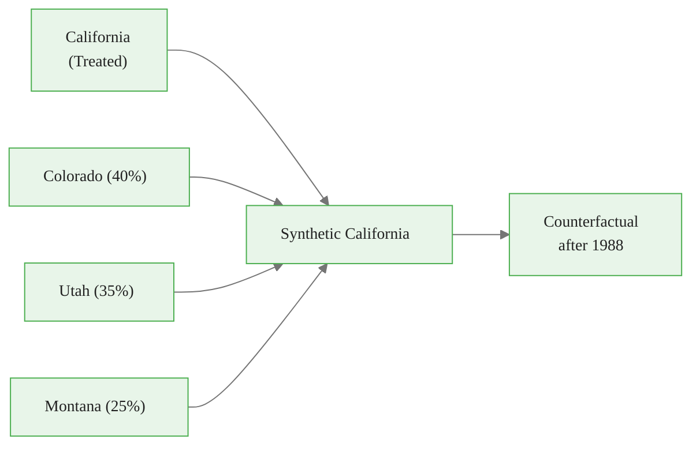
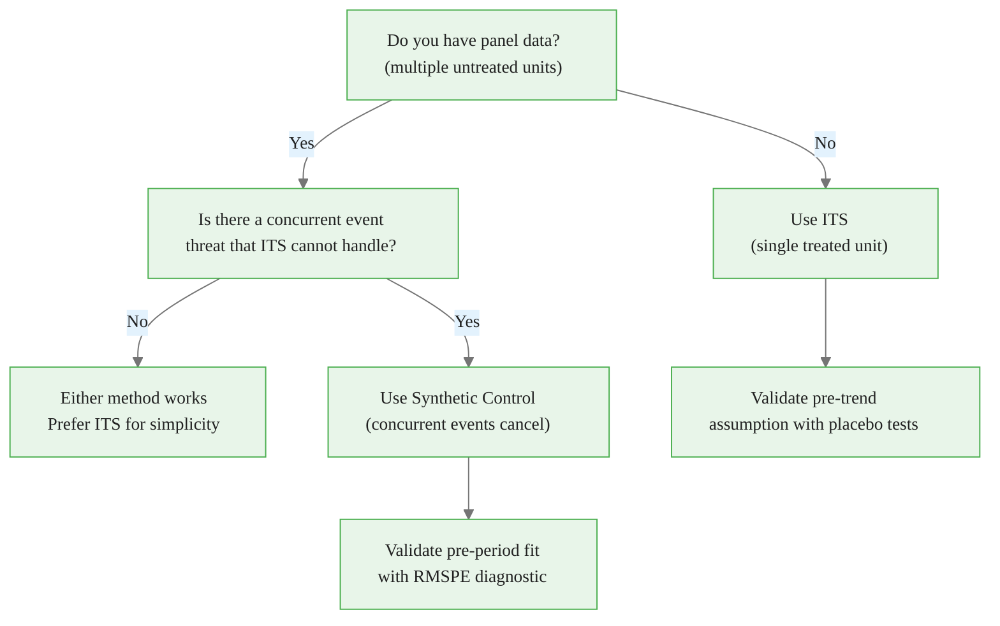

<!-- _class: lead -->

# Synthetic Control Methods

## Building a Counterfactual from Donor Units

### Causal Inference with CausalPy — Module 03, Guide 1

<!-- Speaker notes: Synthetic control is arguably the most important methodological contribution to program evaluation in the last 20 years. Abadie, Diamond, and Hainmueller's 2010 JASA paper has been cited over 7,000 times and was awarded the Econometric Society's Frisch Medal. The key insight is simple: if no single comparison unit is good enough, combine many comparison units into a weighted average that matches the treated unit's pre-intervention trajectory. The weights tell a transparent story about which donors are most comparable. -->

---

# When ITS Fails: Concurrent Events

```mermaid
%%{init: {"theme": "base", "themeVariables": {"primaryColor": "#e8f5e9", "primaryBorderColor": "#4caf50", "primaryTextColor": "#212121", "secondaryColor": "#e3f2fd", "tertiaryColor": "#fff8e1", "lineColor": "#757575", "fontFamily": "Inter, sans-serif", "fontSize": "14px"}}}%%
timeline
    title ITS: Smoking Ban & Recession (Same Month)
    2007 : Pre-intervention trend
    2008-01 : Smoking ban implemented
    2008-01 : Global financial crisis begins
    2009 : AMI rates fall
    2010 : Post-intervention
```



**Problem:** Did the smoking ban reduce AMI, or did the recession reduce elective procedures?

ITS cannot distinguish these. Synthetic control uses **untreated comparison regions** that also experienced the recession — so the recession is "differenced out."

<!-- Speaker notes: The concurrent event threat is the most common reason ITS fails in practice. A policy change that happens during a major recession, epidemic, or other macroeconomic event cannot be cleanly identified using only the treated unit's own pre-trend as a counterfactual. The synthetic control solves this by requiring the donors to experience the same macro events, so the macro effects cancel in the gap between treated and synthetic. The key identifying assumption shifts from "parallel trends" (same trend, no concurrent events) to "all concurrent events affect treated and donors similarly." -->

<div class="callout-info">
Info: untreated comparison regions
</div>

---

# The Core Idea

**Instead of:** Extrapolating the treated unit's pre-trend as a counterfactual

**Synthetic control:** Build a weighted average of untreated units that *tracks* the treated unit in the pre-period



**After the intervention:** The gap between California and Synthetic California = causal effect

<!-- Speaker notes: The synthetic California is literally a portfolio of real states. You can fly to Colorado and observe it. This transparency is a major advantage over statistical extrapolation. The weights tell a concrete story: "California's cigarette consumption before 1988 was most similar to a combination of Colorado (40%), Utah (35%), and Montana (25%)." This is verifiable and interpretable. The causal estimate is the gap that opens up after 1988 — the actual California diverges from this weighted combination of real states that did not implement the tax. -->

<div class="callout-key">
Key Point:  Extrapolating the treated unit's pre-trend as a counterfactual

</div>

---

# Formal Setup

**Treated unit:** $j = 1$ (California)
**Donor units:** $j = 2, \ldots, J+1$ (38 other states)
**Outcome:** $Y_{jt}$ (cigarette packs per capita per year)
**Treatment time:** $T_0 = 1988$

**Choose weights** $\mathbf{w} = (w_2, \ldots, w_{J+1})$ with $w_j \geq 0$, $\sum_j w_j = 1$:

$$\mathbf{w}^* = \arg\min_{\mathbf{w}} \left\| \mathbf{X}_1 - \mathbf{X}_0 \mathbf{w} \right\|_V$$

**Counterfactual:** $\;\widehat{Y}_{1t}(0) = \sum_j w_j^* Y_{jt}$ for $t > T_0$

**Causal effect:** $\;\hat{\alpha}_t = Y_{1t} - \widehat{Y}_{1t}(0)$

<!-- Speaker notes: The optimization problem is a constrained least squares problem. X_1 is the vector of pre-intervention predictors for California: the pre-period outcome levels, plus economic and demographic covariates like per-capita income, beer consumption, and age structure. X_0 is the corresponding matrix for all donors. The matrix V weights the importance of different predictors — more weight on recent outcomes, for example. The non-negativity constraint and sum-to-one constraint together require the synthetic California to be a convex combination of real states, which prevents extrapolation to regions of the feature space that no real unit occupies. -->

---

# Why Weights, Not Regression?

<div class="columns">

**Regression approach:**
$$\hat{Y}_1 = \hat{\beta}_2 Y_2 + \hat{\beta}_3 Y_3 + \ldots$$
- Coefficients can be negative
- Coefficients need not sum to 1
- Can extrapolate outside the donor range
- Overfits with many donors

**Synthetic control:**
$$\hat{Y}_1 = w_2 Y_2 + w_3 Y_3 + \ldots, \quad w_j \geq 0, \sum w_j = 1$$
- All weights non-negative (no extrapolation)
- Convex combination of real units
- Interpretable: portfolio weights
- Good pre-fit is a diagnostically testable criterion

</div>

<!-- Speaker notes: The key mathematical difference is the non-negativity and simplex constraints. These constraints have a profound interpretation: the synthetic control is a convex combination of real, observable units. You can point to each donor and say "this is 40% of the synthetic California." This is impossible with unconstrained regression, where negative coefficients mean "subtract this state's behavior from the counterfactual," which has no intuitive causal interpretation. The constraints also prevent the optimization from exploiting chance correlations in the pre-period — a state cannot get a large weight just because it happened to correlate with California through noise. -->

---

# Pre-Intervention Fit: The Validity Check

The synthetic control is credible only if **pre-intervention fit is good**.

```python
import numpy as np

def rmspe(y_treated, y_synthetic):
    """Root mean squared prediction error — lower is better."""
    return np.sqrt(np.mean((y_treated - y_synthetic) ** 2))

# Rule of thumb: RMSPE < 20% of treated unit's pre-period std
rmspe_value = rmspe(y_california_pre, y_synthetic_pre)
threshold = 0.20 * y_california_pre.std()

print(f"Pre-period RMSPE: {rmspe_value:.2f}")
print(f"20% threshold:    {threshold:.2f}")
print("Pre-fit OK" if rmspe_value < threshold else "Poor pre-fit — reconsider donor pool")
```

**If pre-fit is poor:** The counterfactual extrapolation after the intervention is unreliable.

<!-- Speaker notes: The pre-intervention fit check is to synthetic control what the pre-trend test is to difference-in-differences. If the synthetic California cannot track the real California in the pre-period when we know there was no treatment effect, there is no reason to trust it in the post-period. The RMSPE is the standard diagnostic. Abadie et al. use a slightly different measure (the ratio of post-period to pre-period RMSPE), but the intuition is the same: a good fit before the intervention validates the counterfactual after the intervention. Encourage students to always plot the full pre-period trajectory — a good RMSPE can hide systematic patterns like early-period divergence. -->

---

# Assumptions

| Assumption | What It Means | When It Fails |
|-----------|---------------|---------------|
| No interference | Donors unaffected by treated unit's policy | California's ban influences neighboring states' smoking |
| No anticipation | Donors don't change before intervention | Policy debated publicly, donors adjust early |
| Good pre-fit | Treated unit in convex hull of donors | Treated unit is extreme outlier |
| Stable donors | Donor units have no own structural breaks | A donor implements its own policy mid-study |

**ITS assumptions vs SC assumptions:**
- ITS requires: pre-trend extrapolates, no concurrent events
- SC requires: good donor pool, no spillovers, stable donors

<!-- Speaker notes: The assumptions of synthetic control are different from ITS, not necessarily weaker. The no-interference assumption (a form of SUTVA) can fail when the treated unit's policy affects donors — for example, a smoking ban in California might reduce tobacco industry spending in nearby states, or might cause smokers to cross state lines. The no-anticipation assumption is especially tricky for policies that are debated publicly for years before implementation — California's Prop 99 was debated throughout the late 1980s, and tobacco companies may have increased advertising in California's donor states in anticipation. Good pre-fit is testable; the other assumptions require domain knowledge and judgment. -->

---

# The California Tobacco Example

```python
import causalpy as cp

sc_model = cp.pymc_experiments.SyntheticControl(
    data=panel_df,
    treatment_time=1989,
    formula="cigsale ~ 1",
    group_variable_name="state",
    treated_group="California",
    model=cp.pymc_models.WeightedSumFitter(
        sample_kwargs={"draws": 1000, "tune": 1000,
                       "chains": 4, "random_seed": 42}
    ),
)

sc_model.plot()          # Treated vs synthetic trajectory
sc_model.plot_weights()  # Donor weight distribution
```

<!-- Speaker notes: CausalPy's SyntheticControl class handles the weight optimization, the counterfactual generation, and the uncertainty quantification. The Bayesian approach places a Dirichlet prior on the weights (enforcing non-negativity and sum-to-one automatically) and estimates the full posterior distribution over both weights and counterfactual trajectories. This gives principled credible intervals for the causal effect at each post-intervention period — something classical synthetic control cannot easily provide. -->

---

# Donor Weights: What They Tell You

```python
# Extract weight posterior means
weights = sc_model.idata.posterior["weights"].mean(dim=["chain", "draw"])
weight_df = pd.DataFrame({
    "state": donor_states,
    "weight": weights.values,
}).sort_values("weight", ascending=False)

print("Synthetic California composition:")
print(weight_df[weight_df["weight"] > 0.01].to_string(index=False))
```

```
state       weight
Colorado     0.404
Utah         0.348
Montana      0.152
Nevada       0.096
```

**Interpretation:** States with high weights are most similar to California's pre-1988 trajectory. States with zero weights are dissimilar and should not have been included (or can be excluded for a cleaner donor pool).

<!-- Speaker notes: The sparse weights are a feature, not a bug. Most donors get near-zero weight because their pre-period trajectories are not helpful for matching California. The few donors with substantial weights are the genuine comparison units. This sparsity can be used as a diagnostic: if 20 or 30 donors all get small positive weights, it often indicates that the match is driven by in-sample overfitting rather than genuine comparability. In that case, restricting to the top-weighted donors and re-running the analysis is a robustness check. -->

---

# Counterfactual Gap: Post-Intervention Effect

```python
import arviz as az
import numpy as np

# Gap = treated - synthetic, with uncertainty from weight posterior
gap_samples = sc_model.idata.posterior_predictive["gap"].values.reshape(-1, n_post)
gap_mean = gap_samples.mean(axis=0)
gap_hdi = az.hdi(gap_samples, hdi_prob=0.94)

# Cumulative effect (total packs saved per capita)
cumulative_effect = gap_mean.sum()
print(f"Cumulative effect 1989–2000: {cumulative_effect:.1f} packs per capita")
```

**Key results (Abadie et al.):**
- By 1999: California cigarette consumption was ~26 packs/year lower than synthetic California
- Translates to ~5,000 fewer deaths attributable to Prop 99

<!-- Speaker notes: The cumulative effect is the most policy-relevant summary. A −26 pack/year effect on per-capita consumption, sustained over 12 years and multiplied by California's population, implies a substantial reduction in smoking-related mortality. The Bayesian approach lets us compute uncertainty intervals not just at each time point but for the cumulative effect — integrating over the full posterior distribution of the counterfactual trajectory. This is harder to do with the original Abadie et al. approach, which relies on permutation tests for statistical inference. -->

---

# ITS vs Synthetic Control: Decision Guide



<!-- Speaker notes: The decision is primarily driven by data availability and the severity of concurrent event threats. If you have a long, clean time series for a single unit with no concurrent events, ITS is simpler, easier to explain, and easier to implement. If you have panel data and a credible concern about concurrent events or regression to the mean, synthetic control is more credible. In practice, both methods are often run and results compared — if they agree, the conclusion is more robust. If they disagree, understand why before drawing causal conclusions. -->

---

# CausalPy SyntheticControl: Data Format

```python
import pandas as pd
import numpy as np

# Long format: one row per (unit, time) combination
panel_df = pd.DataFrame({
    "state": ["California"] * n_years + ["Colorado"] * n_years + ...,
    "year": list(range(1970, 2001)) * n_states,
    "cigsale": [...],       # outcome
    "income": [...],        # optional predictor
    "beer": [...],          # optional predictor
})

# The treated unit row for each post-intervention year has
# the OBSERVED outcome (not the counterfactual)
print(panel_df.head())
#       state  year  cigsale  income   beer
# California  1970    127.1   ...     ...
# California  1971    131.4   ...     ...
# ...
```

<!-- Speaker notes: The data format requirement is straightforward: one row per unit per time period. The formula argument specifies which variables are used for matching — at minimum, the outcome itself (using its lagged pre-period values). Additional predictors like income, beer consumption, or age structure can improve the pre-period fit when the outcome alone does not fully characterize the treated unit. CausalPy handles the long-to-wide transformation internally. -->

---

# Limitations and Honest Reporting

**What to report:**
1. Pre-intervention RMSPE and plot of pre-period fit
2. Donor weight distribution (which states contribute?)
3. Placebo test results (Module 03, Notebook 02)
4. Posterior predictive gap with 94% HDI

**Known limitations:**
- Sensitive to donor pool composition
- Perfect pre-fit is impossible with few donors
- Post-period extrapolation accuracy degrades over time
- Standard errors are not classical — inference is via permutation tests

<!-- Speaker notes: Honest reporting of synthetic control requires showing the pre-period fit, not just the post-period effect. A paper that only shows the post-period gap without the pre-period validation cannot be evaluated. The donor weight table is essential for transparency — readers should be able to see which comparison states drive the result and assess whether they are plausible comparisons. The placebo tests (Module 03, Notebook 02) are the main inferential tool and should always be included. -->

---

# Summary

**Synthetic control:**
- Constructs a counterfactual by weighting untreated donor units
- Weights are chosen to minimize pre-intervention discrepancy
- Weights are non-negative and sum to 1 (no extrapolation)
- Counterfactual gap = estimated causal effect
- Pre-period fit quality validates the approach

**When to use it:**
- Panel data available (multiple untreated units)
- Concurrent event threats undermine ITS
- Interested in transparent, interpretable donor weights

**Assumption shift from ITS:**
- ITS: pre-trend extrapolates
- SC: good pre-period fit and no spillovers to donors

<!-- Speaker notes: Summarize the core message: synthetic control shifts the counterfactual problem from "extrapolating the trend" to "matching the pre-period trajectory using real comparison units." Both approaches require untestable assumptions, but the assumptions are different. Synthetic control's assumptions are in some ways easier to defend because the pre-period fit is directly observable — you can see how well the synthetic counterpart tracks the treated unit before the intervention. ITS's pre-trend assumption is also testable (placebo tests at earlier dates), but less visually transparent. -->

---

# What's Next

**Notebook 01:** Synthetic Control Basics
- Build a synthetic control from a panel dataset from scratch
- Optimize donor weights using scipy.optimize
- Visualize pre-period fit and post-period gap

**Notebook 02:** Placebo Tests and Permutation Inference
- Permutation-based p-values for SC estimates
- In-time and in-space placebo tests
- Interpreting p-values when donor pool is small

**Guide 02:** Inference and Placebo Tests
- Complete theory of permutation inference for SC

<!-- Speaker notes: The notebooks make the abstract concrete. Notebook 01 builds a synthetic control from scratch using scipy.optimize to solve the constrained quadratic program — this gives students a deep understanding of what the weights actually optimize. Notebook 02 covers placebo tests, which are the main inferential tool for synthetic control. Unlike parametric tests, placebo tests make no distributional assumptions and are valid even when the number of post-intervention periods is small. -->

<div class="callout-warning">
Warning: If no convex combination of donors can reproduce the pre-treatment trajectory, synthetic control is not appropriate for your setting.
</div>

---

<!-- _class: lead -->

# Core Takeaway

## Synthetic control builds a counterfactual from real comparison units.

## The pre-intervention fit is the validity check — not the statistical test.

## Concurrent events that affect all units cancel in the gap.

<!-- Speaker notes: Three key messages. First, the counterfactual is built from real units — this is both the strength (interpretable, no extrapolation) and the limitation (needs panel data, good donor pool). Second, the pre-period fit is the core validity check — a bad pre-period fit means the post-period estimate is not trustworthy, regardless of how compelling the post-period divergence looks. Third, the concurrent event cancellation is the main advantage over ITS — if California and Colorado both experienced the same recession, the recession's effect cancels in the gap. -->

---

# Supplementary: Math Behind the Optimization

The SC weights solve a constrained quadratic program:

$$\min_{w} \quad (X_1 - X_0 w)^\top V (X_1 - X_0 w)$$
$$\text{s.t.} \quad w_j \geq 0 \quad \forall j, \quad \sum_j w_j = 1$$

The matrix $V$ assigns importance to each predictor. The outer optimization chooses $V$ to minimize cross-validated post-period prediction error — nested optimization.

**CausalPy's Bayesian approach:**
- Places Dirichlet$(\mathbf{1}/J)$ prior on weights (uniform on simplex)
- Estimates posterior over weights via NUTS
- Posterior predictive gives uncertainty on the counterfactual

<!-- Speaker notes: The original Abadie et al. nested optimization is computationally expensive and can converge to local minima. CausalPy's Bayesian approach replaces the outer optimization (for V) with MCMC sampling from the posterior over weights, given the pre-period data. The Dirichlet prior enforces the simplex constraints automatically — any draw from a Dirichlet distribution is non-negative and sums to 1. This gives full uncertainty quantification for the causal effect without the computationally intensive nested optimization. -->

<div class="callout-insight">
Insight: Synthetic control constructs a data-driven counterfactual by weighting untreated units to match the treated unit's pre-treatment trajectory.
</div>
