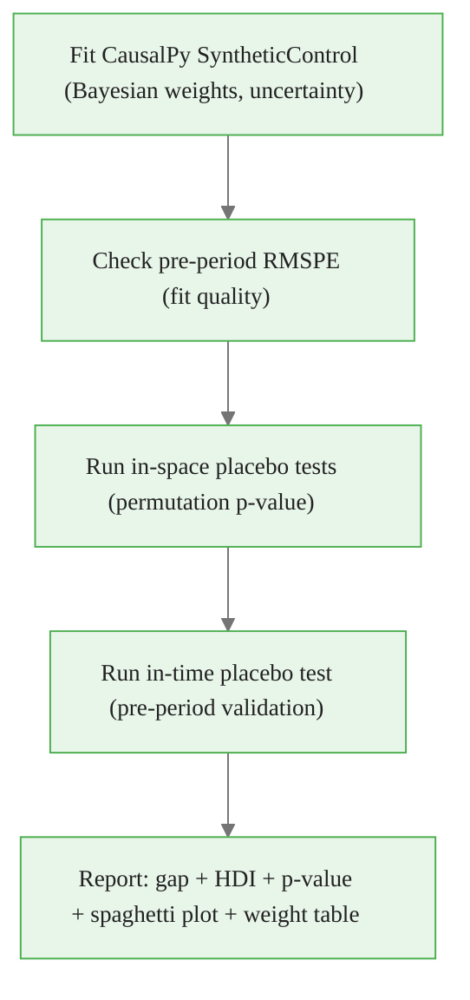

<!-- _class: lead -->

# Inference for Synthetic Control

## Placebo Tests and Permutation Methods

### Causal Inference with CausalPy — Module 03, Guide 2

<!-- Speaker notes: Classical statistical inference requires a sampling distribution — the distribution of the estimator across hypothetical repeated experiments. With one treated unit and a fixed post-intervention period, there is no classical sampling distribution. Placebo tests solve this by treating each donor unit as a pseudo-treated unit and building an empirical null distribution. The treated unit's effect is significant if it is unusually large compared to all the placebo effects. This is Fisher's randomization inference adapted to the synthetic control setting. -->

---

# The Fundamental Inference Problem

**With one treated unit:**
- No classical sampling distribution
- Can't compute standard errors the usual way
- Asymptotic theory doesn't apply

**The question:** Is the observed gap unusual, or could it arise from chance?

**Answer via permutation inference:**

$$p\text{-value} = \frac{\text{number of units with gap} \geq \text{treated unit's gap}}{\text{total number of units}}$$

<!-- Speaker notes: The one-treated-unit problem is fundamental to synthetic control. In difference-in-differences, you have many treated units and can estimate standard errors. In synthetic control, you have one treated unit and must ask: "Is the treated unit's post-period gap unusually large relative to how donors diverge from their own synthetic counterparts?" The permutation p-value answers this question without any distributional assumption. -->

---

# In-Space Placebo Tests

**Procedure:**


If the treated unit's gap is in the extreme tail of the placebo distribution:

$$p = P(\text{placebo gap} \geq \text{treated gap})$$

<!-- Speaker notes: The in-space placebo test applies the exact same synthetic control procedure to each donor unit in turn, as if that donor were the treated unit. This gives J placebo estimates under the null hypothesis that the treatment has no effect on any unit. The treated unit's gap is then compared to this null distribution. If the treated unit's gap is larger than 95% of placebo gaps, the permutation p-value is 0.05 or smaller. -->

---

# Why Normalize by Pre-Period Fit?

**Problem:** Donors with poor pre-period fit naturally have larger post-period gaps (from fit error, not treatment)

**Solution:** Compute RMSPE ratio

$$\text{Ratio}_j = \frac{\text{RMSPE}_{\text{post}}(j)}{\text{RMSPE}_{\text{pre}}(j)}$$

```python
rmspe_post = np.sqrt(np.mean(gaps_post ** 2, axis=0))
rmspe_pre  = np.sqrt(np.mean(residuals_pre ** 2, axis=0))
ratio = rmspe_post / rmspe_pre

# p-value: fraction of units with ratio >= treated unit
treated_ratio = ratio[treated_idx]
p_value = (ratio >= treated_ratio).mean()
```

<!-- Speaker notes: The RMSPE ratio is the key innovation of the Abadie et al. inference approach. If you compare raw post-period gaps, units with poor pre-period fit (high pre-period RMSPE) will tend to have large post-period gaps just from noise — not from any treatment effect. The ratio normalizes: a high ratio means the post-period gap is large relative to what you'd expect from the pre-period fit quality. A treated unit with a high ratio is genuinely unusual, not just a poorly-matched unit. This normalization is essential for valid inference when donors vary in pre-period fit quality. -->

<div class="callout-key">
Key Point:  2, axis=0))
rmspe_pre  = np.sqrt(np.mean(residuals_pre 
</div>

---

# The Spaghetti Plot

The standard visualization shows all placebo gaps alongside the treated unit:

```python
fig, ax = plt.subplots(figsize=(12, 6))

# Gray lines: donor placebos
for j in range(n_units):
    if j == treated_idx:
        continue
    ax.plot(years_post, gaps[:, j], color="#aaaaaa", alpha=0.4, linewidth=1)

# Blue line: treated unit
ax.plot(years_post, gaps[:, treated_idx],
        color="#2980b9", linewidth=2.5, label="California")

ax.axhline(0, color="black", linestyle="--")
ax.set_ylabel("Gap (Packs per Capita)")
ax.set_title("Synthetic Control: California vs Placebo States")
ax.legend()
```

**The treated unit should stand out clearly** — if it blends in with donors, the effect is not identifiable.

<!-- Speaker notes: The spaghetti plot is the most important visualization in synthetic control analysis. The gray lines represent the null distribution — how much donor units diverge from their own synthetic counterparts due to random noise and imperfect pre-period fit. The blue line (treated unit) should stand out from the gray bundle in the post-intervention period. If the blue line is buried in the gray lines, there is no identifiable treatment effect. If it stands clearly above or below all gray lines, the effect is statistically significant and visually compelling. -->

<div class="callout-insight">
Insight: The treated unit should stand out clearly
</div>

---

# Reading the Spaghetti Plot

```
Gap (packs/year)
 10 ─┤                            ╭─ (noisy donor)
  5 ─┤ ────────────────────────── ─
  0 ─╫─────────┬──────────────────────── (zero = no gap)
 -5 ─┤         │   ─ ─ ─ ─ (other donors)
-10 ─┤         │
-15 ─┤         │    ══════════════════ ← California (treated)
-20 ─┤         │
     └─────────┴──────────────────────
      1970     1988      1995     2000
              Prop 99
```

**What makes a convincing result:**
- Pre-1988: California line near zero (good pre-period fit)
- Post-1988: California clearly below all donor lines

<!-- Speaker notes: Walk students through reading this stylized plot. In the pre-period (1970-1988), all lines should cluster near zero — if California were a placebo donor, the synthetic counterpart would track it closely. The zero gap confirms this. After Prop 99 in 1988, California diverges downward (lower cigarette consumption than synthetic) while donors remain near zero. The fact that California is below ALL donors gives a permutation p-value of 1/39 = 0.026 — statistically significant at the 5% level. -->

<div class="callout-warning">
Warning: What makes a convincing result:
</div>

---

# Excluding Poor-Fit Donors

Units with poor pre-period fit are unreliable placebos:

```python
# Exclude donors with pre-period RMSPE more than 2x California's RMSPE
california_rmspe_pre = rmspe_pre[treated_idx]
good_fit_mask = rmspe_pre <= 2.0 * california_rmspe_pre

print(f"Total donors:      {n_donors}")
print(f"Good-fit donors:   {good_fit_mask.sum()}")
print(f"Excluded (poor fit): {(~good_fit_mask).sum()}")

# Recompute p-value on filtered set
p_value_filtered, _ = filtered_p_value(gaps, rmspe_pre, treated_idx)
print(f"Filtered p-value: {p_value_filtered:.3f}")
```

Poor-fit donors should be shown in light gray (or excluded) in the spaghetti plot.

<!-- Speaker notes: Some donor states simply cannot be matched well to California — their trajectories are too different. Including them in the inference set weakens the test: a unit that was poorly matched in the pre-period will show large post-period gaps from noise, inflating the null distribution and making it harder to reject the null for California. The standard practice is to exclude units with pre-period RMSPE more than 2-3 times the treated unit's RMSPE. Report both the full p-value and the filtered p-value. If they differ substantially, investigate why. -->

---

# In-Time Placebo Tests

**Also test with a placebo treatment date in the pre-period:**

```python
# Pretend Prop 99 happened in 1982 (6 years early)
gap_placebo, rmspe_pre_placebo = in_time_placebo(
    Y_all=Y_matrix,
    true_t0=1988,
    placebo_t0=1982,
    treated_idx=treated_idx,
)

print(f"Placebo gap (1982–1988): {gap_placebo.mean():.2f}")
print(f"True gap (1988–2000):   {true_gap.mean():.2f}")
print()
if abs(gap_placebo.mean()) < 0.1 * abs(true_gap.mean()):
    print("In-time placebo is small relative to true gap — supports validity.")
else:
    print("Large in-time placebo — investigate pre-period fit quality.")
```

<!-- Speaker notes: The in-time placebo test provides a complementary validity check. If the synthetic control algorithm creates a spurious large gap even when we use a date within the pre-period (when there was definitely no treatment), the pre-period fit is poor and the post-period estimate is unreliable. A small in-time placebo gap validates the approach from the temporal direction, complementing the in-space placebo test. -->

---

# Minimum Achievable P-Value

**With $J$ donors, the minimum p-value is $\frac{1}{J+1}$**

| Donors ($J$) | Min p-value | "Significant at 5%?" |
|------------|-------------|----------------------|
| 4 | 0.200 | Never possible |
| 9 | 0.100 | Never possible |
| 19 | 0.050 | Exactly if top-ranked |
| 38 | 0.026 | Yes (California: 1/39) |
| 99 | 0.010 | Yes |

**With few donors:** Report the rank and the minimum achievable p-value explicitly.

<!-- Speaker notes: This table illustrates why synthetic control inference is limited by the size of the donor pool, not by the amount of data. With 4 donors, even a result where the treated unit has the largest gap gives a p-value of 0.20 — not significant at the 5% level. This is not a failing of the method — it is an honest reflection of the evidence available. Encourage students to expand the donor pool when possible, or to use Bayesian uncertainty quantification (CausalPy) to supplement permutation tests when the donor pool is small. -->

---

# Bayesian Synthetic Control Inference

CausalPy's Bayesian approach gives a complementary perspective:

```python
import arviz as az

# Posterior predictive samples of the counterfactual
cf_samples = sc_model.idata.posterior_predictive["y_hat"].values.reshape(-1, n_periods)

# Gap samples for post-intervention period
gap_samples = y_treated_post[np.newaxis, :] - cf_samples[:, n_pre:]

# Pointwise effects with uncertainty
gap_mean = gap_samples.mean(axis=0)
gap_hdi = az.hdi(gap_samples, hdi_prob=0.94)

# Cumulative effect
cum_effect_samples = gap_samples.sum(axis=1)
cum_hdi = az.hdi(cum_effect_samples, hdi_prob=0.94)
print(f"Cumulative effect: {cum_effect_samples.mean():.1f} "
      f"[{cum_hdi[0]:.1f}, {cum_hdi[1]:.1f}]")
```

**Advantage:** Full posterior uncertainty without needing a large donor pool.

<!-- Speaker notes: The Bayesian approach complements placebo tests rather than replacing them. Placebo tests give a non-parametric p-value that makes no distributional assumptions. The Bayesian approach gives a full posterior distribution over the causal effect at each time point, which is more informative than a single p-value. Together, they provide both a hypothesis test (is the effect different from zero?) and an effect size estimate (how large is the effect, with uncertainty?). When the donor pool is small, the Bayesian uncertainty quantification is especially valuable because permutation p-values cannot be very small regardless of the true effect. -->

---

# Confidence Sets by Test Inversion

```python
# Construct 90% confidence set by inverting placebo tests
from scipy.optimize import brentq

alpha0_grid = np.linspace(-40, 5, 90)
in_set = []

for alpha_0 in alpha0_grid:
    Y_shifted = Y_all.copy()
    Y_shifted[n_pre:, treated_idx] -= alpha_0  # subtract hypothesis

    gaps_h, rmspe_h = run_placebo_tests(Y_shifted, n_pre, treated_idx)
    p_h, _ = placebo_p_value(gaps_h, rmspe_h, n_pre, treated_idx)

    if p_h > 0.10:  # Include in 90% confidence set
        in_set.append(alpha_0)

print(f"90% Confidence set: [{min(in_set):.1f}, {max(in_set):.1f}]")
```

<!-- Speaker notes: The confidence set construction is computationally expensive — it requires running the full placebo test for each value on the grid. A coarse grid (30-50 points) is usually sufficient for an approximate confidence set. The confidence set interpretation is the same as for frequentist confidence sets: if we were to test every hypothetical effect size, the values we fail to reject form the confidence set. Unlike Bayesian credible intervals, this set does not have a direct probability interpretation — it is a set of values consistent with the data at the 90% level. -->

---

# Combining Bayesian + Permutation Inference

**Recommended workflow:**



- **Bayesian:** Effect size + HDI per time period
- **Permutation:** Non-parametric significance test
- **Combined:** Comprehensive, defensible causal claim

<!-- Speaker notes: The recommended workflow combines both approaches. The Bayesian CausalPy model gives the weight posterior and counterfactual HDI. The permutation test gives the non-parametric p-value. These are complementary, not redundant. A result that is significant on both the permutation test and has an HDI excluding zero is much more compelling than a result where only one test passes. If they disagree (e.g., large Bayesian gap but non-significant permutation test), investigate why — often the donor pool is too small for permutation inference but the Bayesian estimate is still informative. -->

---

# Summary Table: SC Inference Methods

| Method | Assumption | Output | Use When |
|--------|-----------|--------|----------|
| In-space placebo | IID donors | p-value | $J \geq 19$ donors |
| In-time placebo | Stable pre-period | Validation check | Always |
| Bayesian HDI | Gaussian likelihood | Credible interval | Any donor pool size |
| Confidence set | Non-parametric | Confidence set | Large donor pool |

**Default recommendation:** Bayesian HDI + in-space permutation p-value + spaghetti plot

<!-- Speaker notes: This table summarizes the four inference tools. In practice, most SC analyses report the in-space permutation p-value and the spaghetti plot as the primary inference, with the Bayesian HDI as supporting evidence. The in-time placebo is a pre-analysis validation step, not a primary result. The confidence set is reported in methodologically focused papers but is often omitted in applied work because the computational cost is high and the additional information is limited when the Bayesian HDI is already reported. -->

---

<!-- _class: lead -->

# Core Takeaway

## Placebo tests compare the treated unit to donors under the null of no effect.

## The minimum achievable p-value is $1/(J+1)$ — expand the donor pool when possible.

## Bayesian uncertainty and permutation tests are complementary, not competing.

<!-- Speaker notes: Three final messages. First, placebo tests are the right tool for SC inference because they make no distributional assumptions — they just ask "is the treated unit unusual relative to donors?" Second, with few donors, statistical significance at 5% may be impossible — this is an honest limitation that should be stated explicitly. Third, the Bayesian and permutation approaches answer different questions: "how large is the effect?" vs "is the effect distinguishable from zero?" Both questions matter for policy. -->

---

# What's Next

**Notebook 02:** Placebo Tests in Code
- Implement in-space placebo tests from scratch using scipy
- Build the spaghetti plot
- Compute and interpret the permutation p-value

**Notebook 03:** CausalPy Synthetic Control API
- Full analysis using cp.pymc_experiments.SyntheticControl
- Bayesian weight estimation and counterfactual HDI
- Combining CausalPy output with placebo inference

<!-- Speaker notes: The next two notebooks translate everything from these two guides into working code. Notebook 02 implements placebo tests from scratch — this is important because students should understand the algorithm before using the CausalPy wrapper. Notebook 03 then uses CausalPy's SyntheticControl for the full Bayesian analysis, which adds weight uncertainty and counterfactual HDI on top of the classical SC estimate. -->

<div class="callout-key">
Key Point: Placebo tests are the primary tool for assessing synthetic control validity -- if placebo effects are as large as the real effect, the result is not credible.
</div>
