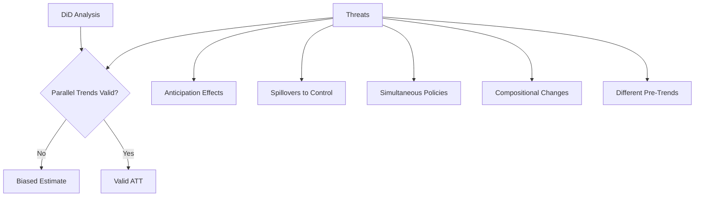

<!-- _class: lead -->

# Difference-in-Differences: Fundamentals

## Identifying Causal Effects with Comparison Groups

Module 04 | Causal Inference with CausalPy

<!-- Speaker notes: Welcome to Module 04. DiD is the workhorse of applied causal inference — it powers hundreds of published policy studies each year. Today we build the intuition from scratch, then formalise it. By the end you'll be able to run and interpret a DiD analysis and, critically, know when NOT to trust one. -->

---

## The Counterfactual Problem

Every causal question needs a counterfactual

> *What would have happened to the treated units **had they not been treated?***

<div class="columns">

**Approaches we've seen:**
- ITS: pre-treatment trend of same unit
- Synthetic control: weighted donor units

**DiD approach:**
- Use a **comparison group** of untreated units
- Their change over time = the counterfactual change

</div>

<!-- Speaker notes: We keep returning to the same fundamental problem. What makes DiD different is that it explicitly uses other units — not just other time periods — to construct the counterfactual. This is powerful when you have a natural comparison group that wasn't treated. -->

---

## The Two-Period Setup

<div class="columns">

**Two groups:**
- Treated: $D_i = 1$
- Control: $D_i = 0$

**Two periods:**
- Pre: $t = 0$
- Post: $t = 1$

</div>

| Group | Pre | Post | Difference |
|-------|-----|------|-----------|
| Treated | $\bar{Y}_{1,0}$ | $\bar{Y}_{1,1}$ | $\Delta_1$ |
| Control | $\bar{Y}_{0,0}$ | $\bar{Y}_{0,1}$ | $\Delta_0$ |

$$\hat{\tau}_{DiD} = \Delta_1 - \Delta_0$$

<!-- Speaker notes: This is the simplest possible setup. Two groups, two periods. The DiD estimator is just the difference in the before-after changes. Why does this work? Because the control group's change over time tells us what would have happened to the treated group absent treatment — IF the parallel trends assumption holds. That's the big IF we'll explore throughout this module. -->

---

## Visualising DiD

```
Outcome
  |                             ● Treated (observed)
  |              /             /
  |             ●  ─ ─ ─ ─ ─ ✕  Treated (counterfactual)
  |            /             /        ↑
  |           /             /     DiD estimate
  |          /             /          ↓
  |         ●─────────────●  Control
  |
  |_________Pre___________Post_________→ Time
                    ↑
               Treatment
```

**DiD** = (Treated post − Treated pre) − (Control post − Control pre)

<!-- Speaker notes: Look at this diagram carefully. The solid lines are what we observe. The dashed line is the counterfactual: what would have happened to the treated group without the intervention? DiD assumes that counterfactual is parallel to the control group's trajectory. The treatment effect is the vertical gap between the observed treated post outcome and that counterfactual. -->

---

## The Regression Formulation

$$Y_{it} = \alpha + \beta \cdot \text{Post}_t + \gamma \cdot \text{Treated}_i + \tau \cdot (\text{Post}_t \times \text{Treated}_i) + \epsilon_{it}$$

| Parameter | Meaning |
|-----------|---------|
| $\alpha$ | Control group, pre-period baseline |
| $\beta$ | Time trend (common to both groups) |
| $\gamma$ | Pre-period level difference between groups |
| $\tau$ | **The DiD treatment effect** |

The interaction $\text{Post} \times \text{Treated}$ is the key coefficient.

<!-- Speaker notes: The regression formulation makes the mechanics explicit. Alpha captures the baseline level. Beta captures the time trend that both groups share. Gamma captures the fact that treated and control groups might start at different levels. And tau — the coefficient on the interaction — is the DiD estimate. This formulation generalises naturally to more periods and groups. -->

---

## The Parallel Trends Assumption

**The central identifying assumption:**

> In the absence of treatment, the average outcome for the treated group would have followed the **same trend** as the control group.

$$E[Y_{it}(0) - Y_{it-1}(0) \mid D_i = 1] = E[Y_{it}(0) - Y_{it-1}(0) \mid D_i = 0]$$

This is about **counterfactual trends** — not observed levels.

<!-- Speaker notes: Parallel trends is the assumption that makes or breaks a DiD analysis. Note what it does NOT say: it doesn't say the two groups had the same outcome levels. It says that, absent treatment, they would have moved together. This is fundamentally untestable because we never observe the counterfactual trajectory for the treated group. We can only assess its plausibility. -->

---

## What Parallel Trends Requires

<div class="columns">

**Does NOT require:**
- Equal outcome levels
- Groups to be identical
- Literally parallel pre-trends

**DOES require:**
- Same counterfactual trajectory
- No time-varying confounders affecting groups differently
- No anticipation of treatment

</div>

<!-- Speaker notes: This distinction matters for communication. Reviewers often confuse "parallel trends" with "equal outcomes." The levels can be very different — a DiD comparing New Jersey and Pennsylvania on wages doesn't require them to have the same wage levels. It requires that the gap between them would have remained stable absent the policy change. -->

---

## Threats to Identification



<!-- Speaker notes: Walk through each threat. Anticipation: if firms know a regulation is coming, they start adjusting before it hits — contaminating the pre-period. Spillovers: if your control group is affected by the treatment too, their change is not a clean counterfactual. Simultaneous policies: if another policy hits treated but not control at the same time, you can't separate effects. -->

---

## Two-Way Fixed Effects (TWFE)

Extending DiD to many units and periods:

$$Y_{it} = \alpha_i + \lambda_t + \tau \cdot D_{it} + \epsilon_{it}$$

| Term | Role |
|------|------|
| $\alpha_i$ | Unit fixed effects — absorb time-invariant differences |
| $\lambda_t$ | Time fixed effects — absorb common shocks |
| $D_{it}$ | Treatment indicator |
| $\tau$ | DiD treatment effect |

This is the standard panel DiD estimator.

<!-- Speaker notes: TWFE is what most researchers mean when they say "DiD with panel data." By including unit fixed effects, we control for everything that's constant within a unit. By including time fixed effects, we control for common shocks that hit all units equally. What remains is identified from treatment variation within units over time, after removing the common time trend. -->

---

## Pre-Trend Testing

Cannot test parallel trends directly — but can examine **pre-treatment trends**

```python
# Group means by period
pre_data = df[df["period"] < 0].groupby(
    ["period", "treated"]
)["outcome"].mean().reset_index()

# Plot: do treated and control move together?
for group in [0, 1]:
    subset = pre_data[pre_data["treated"] == group]
    plt.plot(subset["period"], subset["outcome"],
             label=["Control", "Treated"][group])
plt.axvline(x=0, color="red", ls="--", label="Treatment")
```

Pre-trends parallel → supports (but does not prove) parallel trends

<!-- Speaker notes: Pre-trend testing is your first diagnostic. If treated and control units moved together in the pre-period, this is consistent with — though not proof of — the parallel trends assumption holding into the post-period. If pre-trends diverge, your DiD estimate is suspect. Stata and R both have standard tools for this; CausalPy's event study plots make it visual. -->

---

## The Event Study Regression

$$Y_{it} = \alpha_i + \lambda_t + \sum_{k \neq -1} \beta_k \cdot \mathbf{1}[t - T_i^* = k] \cdot D_i + \epsilon_{it}$$

- $k < 0$: pre-treatment periods — should have $\beta_k \approx 0$
- $k = 0$: treatment onset
- $k > 0$: post-treatment periods — show treatment effect dynamics
- $k = -1$: **normalised to zero** (baseline)

<!-- Speaker notes: The event study regression is the most transparent way to display DiD evidence. Instead of a single coefficient, you get a coefficient for each period relative to treatment. If the pre-period coefficients cluster around zero, parallel trends looks plausible. If there's a clear pre-trend, your DiD estimate is confounded. Post-period coefficients show you whether the effect is immediate, builds over time, or fades. -->

---

## Event Study Plot

```
β_k
  |
  |        ●   ●           ● ● ●   ← post-treatment effect
0 |● ─────────────────────────────── baseline
  |  ● ●                            ← pre-trend coefficients
  |                                  should be ≈ 0
  |___-3__-2__-1___0___1___2___3___→ k (periods relative to treatment)
                ↑
           Treatment
           (β_{-1} = 0 by normalisation)
```

<!-- Speaker notes: This is the gold standard plot in applied DiD. Reviewers and editors look for this immediately. If your pre-period dots are tight around zero with overlapping confidence intervals, your design is credible. If there's a sloping pre-trend, you have a problem. The post-period dots show the treatment effect trajectory — you can see if effects build up, peak, or decay over time. -->

---

## What DiD Estimates: The ATT

DiD identifies the **Average Treatment Effect on the Treated (ATT)**:

$$\tau_{ATT} = E[Y_{it}(1) - Y_{it}(0) \mid D_i = 1, t = \text{Post}]$$

> "What was the average effect of treatment for **units that were actually treated**?"

**Not** the ATE — does not generalise to untreated units without additional assumptions.

<!-- Speaker notes: This is a crucial point that gets muddled in practice. DiD gives you the ATT — the effect for the treated units. This is often exactly what policymakers want: how effective was our program for participants? But if you want to know the effect for everyone, or the effect of expanding the program, you need additional assumptions. The ATT and ATE only coincide under homogeneous treatment effects. -->

---

## Interpreting a DiD Estimate

**Example:** DiD estimate $\hat{\tau} = 0.12$ on log employment

<div class="columns">

**Correct interpretation:**
"The policy increased employment by approximately 12% for treated firms, on average, in the post-period."

**Common mistakes:**
- "Employment increased 12%" (for whom?)
- "The policy works" (only for treated units in this context)
- Extrapolating to other populations

</div>

<!-- Speaker notes: Precision in interpretation matters, especially when communicating to non-technical audiences. Always specify: what outcome, for whom, over what period. The ATT qualifier is important — your result doesn't automatically generalise to other firms, regions, or time periods. External validity requires separate argumentation. -->

---

## CausalPy DiD: Quick Start

```python
import causalpy as cp
import pandas as pd

result = cp.DifferenceInDifferences(
    data=df,
    formula="outcome ~ 1 + period + treated + period:treated",
    time_variable_name="period",
    group_variable_name="treated",
)

# Plot counterfactual
result.plot()

# Get treatment effect summary
print(result.summary())
```

Key output: coefficient on `period:treated` interaction

<!-- Speaker notes: CausalPy's interface is clean. You specify the data, the formula — which must include the Post:Treated interaction — and the names of your time and group variables. The plot method gives you the DiD visualisation with the counterfactual. The summary prints the treatment effect estimate with credible intervals if you're using a Bayesian backend, or confidence intervals with a frequentist one. -->

---

## Assumptions Checklist

Before running DiD, verify:

- [ ] Treatment timing is known and sharp
- [ ] Treatment is binary and absorbing (no treatment reversal)
- [ ] No spillovers to control units
- [ ] No anticipation effects
- [ ] Parallel trends is plausible (check pre-trends)
- [ ] Stable composition (balanced panel or account for entry/exit)
- [ ] No simultaneous policies affecting only treated units

<!-- Speaker notes: Use this as a literal checklist before submitting or presenting DiD results. Each item corresponds to a potential threat. If you can't check off all of them, document why and assess the likely direction of bias. Transparency about limitations strengthens rather than weakens your analysis — reviewers respect honesty about assumptions. -->

---

## Summary

| Concept | Key Point |
|---------|-----------|
| DiD estimator | Difference in before-after changes, treated vs control |
| Parallel trends | Counterfactual trends equal — the key assumption |
| ATT | DiD estimates treatment effect for treated units |
| TWFE | Generalises to panel data with fixed effects |
| Pre-trend test | Assess parallel trends using pre-treatment data |
| Event study | Shows effect dynamics and tests pre-trends visually |

<!-- Speaker notes: These six concepts are the foundation for everything in this module. The DiD estimator is simple arithmetic. Parallel trends is the assumption that justifies it causally. The ATT is what you're actually estimating. TWFE is the practical estimator. And pre-trend tests and event studies are your key diagnostics. -->

---

<!-- _class: lead -->

## Next: Staggered DiD

When units adopt treatment at **different times**, standard DiD breaks down.

We need modern estimators that handle heterogeneous timing and effects.

→ [02 — Staggered DiD and Event Studies](02_staggered_did_guide.md)

<!-- Speaker notes: The classic two-period DiD is elegant but rarely matches reality. In most policy settings, different units adopt the treatment at different times — some states pass a law in 2010, others in 2014, others never. This staggered adoption structure creates serious problems for the TWFE estimator. That's what we tackle next. -->
