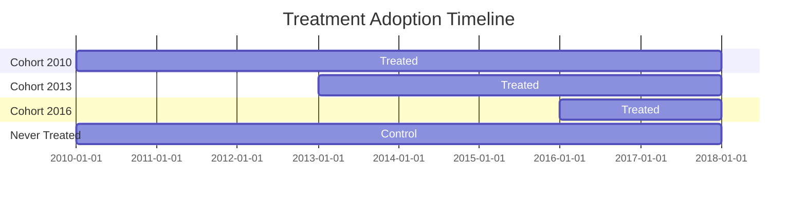
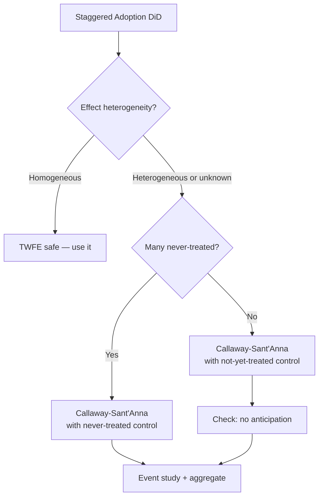

<!-- _class: lead -->

# Staggered DiD and Event Studies

## When Units Adopt Treatment at Different Times

Module 04.2 | Causal Inference with CausalPy

<!-- Speaker notes: In Module 04.1 we covered the canonical two-period DiD. Real policy settings rarely look like that. States pass laws in different years. Firms adopt technologies at different times. Schools get programs in staggered waves. This "staggered adoption" breaks the standard TWFE estimator in ways that were only fully understood around 2018-2021. This module covers the modern solutions. -->

---

## Staggered Adoption: The Real World

Most policies don't hit everyone at once



Units adopt at different times → **cohort structure**

<!-- Speaker notes: This Gantt chart shows a typical staggered adoption pattern. Some units are treated starting in 2010, others in 2013, others in 2016, and some never at all. Each group that shares a first-treatment date is called a "cohort." The challenge: when you run standard TWFE, it uses the 2010 cohort as a control for the 2013 cohort in 2013, even though the 2010 cohort has already been treated for 3 years. That's a contaminated control group. -->

---

## Why TWFE Breaks Down

Standard TWFE uses **already-treated units as controls**

$$Y_{it} = \alpha_i + \lambda_t + \tau \cdot D_{it} + \epsilon_{it}$$

Problems:
1. Early-treated units are **not clean controls** for late-treated
2. With dynamic (growing) effects, TWFE can produce **negative weights**
3. The TWFE estimate can have the **wrong sign**

> Even if every unit has a positive treatment effect, TWFE can return a negative estimate

<!-- Speaker notes: This seems counterintuitive but it's mathematically provable. Goodman-Bacon (2021) decomposed the TWFE estimator and showed it's a weighted average of all possible 2x2 DiD comparisons — including ones where early-treated units serve as controls for late-treated. If treatment effects grow over time (which is common — programs take time to work), those comparisons get negative weights. The TWFE estimate can be negative even when the true effect is always positive. -->

---

## The Goodman-Bacon Decomposition

$$\hat{\tau}_{TWFE} = \sum_{k,\ell} \hat{w}_{k\ell} \hat{\tau}_{k\ell}^{2\times2}$$

<div class="columns">

**Three types of 2×2 comparisons:**
1. Early cohort vs. never-treated
2. Late cohort vs. never-treated
3. Early cohort as control for late cohort ← **problematic**

**Weights can be negative!**
When effects are heterogeneous across time

</div>

<!-- Speaker notes: The Goodman-Bacon paper is required reading for anyone doing staggered DiD. The decomposition is illuminating: TWFE is a weighted average of all possible two-cohort, two-period DiD comparisons. The first two types are fine. The third type — using early-treated units as controls — is the problem. If early-treated units have already responded to treatment, their "change" includes a treatment effect, not just a time trend. -->

---

## Cohort-Based Solution: Callaway & Sant'Anna

**Key insight:** Compare each cohort only to **clean controls**

Define the **group-time ATT**:
$$ATT(g, t) = E[Y_t(g) - Y_t(0) \mid G = g]$$

where $G = g$ means "first treated in period $g$"

**Algorithm:**
1. For each cohort $g$, estimate $ATT(g, t)$ using never/not-yet-treated controls
2. Aggregate across cohorts for overall ATT, event study, or calendar-time effects

<!-- Speaker notes: Callaway and Sant'Anna's contribution is conceptually clean. Instead of one regression, compute a separate 2x2 DiD for each cohort at each time period, always using clean controls. Then aggregate. This avoids the contaminated control group problem entirely. The result is a set of group-time ATTs that you can aggregate however you want. -->

---

## Clean Control Groups

<div class="columns">

**Never-treated controls:**
- Only units that never receive treatment
- Cleanest comparison
- May be small or unrepresentative

**Not-yet-treated controls:**
- Units that haven't been treated *yet*
- Larger sample
- Requires no anticipation assumption

</div>

**Tradeoff:** Power vs. purity

Choose based on context: is the never-treated group representative of where treated units would go?

<!-- Speaker notes: The choice of control group matters. Never-treated is cleanest in principle — these units have no treatment contamination ever. But in many policy settings, the never-treated group might be systematically different. For example, states that never adopted a minimum wage increase might be fundamentally different from adopting states. Not-yet-treated units are more comparable but require the no-anticipation assumption: units don't start changing before they're actually treated. -->

---

## Sun & Abraham (2021) Approach

**Saturate the regression with cohort × time interactions:**

$$Y_{it} = \alpha_i + \lambda_t + \sum_{g} \sum_{k \neq -1} \delta_{g,k} \cdot \mathbf{1}[G_i = g] \cdot \mathbf{1}[t - g = k] + \epsilon_{it}$$

Then aggregate $\delta_{g,k}$ with appropriate weights.

**Advantage:** Works within standard OLS framework
**Implementation:** `eventstudyinteract` in Stata; `sunab()` in R's `fixest`; manual in Python

<!-- Speaker notes: Sun and Abraham came at the same problem from a regression perspective. Their key contribution is to fully saturate the event study regression with cohort-by-relative-time interactions. This avoids the negative weights problem because each cohort's effect is estimated separately. You then combine these estimates using a weighted average that respects the cohort composition of your sample. It's more natural for researchers comfortable with regression. -->

---

## Aggregating Group-Time ATTs

Once you have $ATT(g,t)$, you can aggregate multiple ways:

| Aggregation | Formula | Answers |
|------------|---------|---------|
| Overall ATT | $\sum_{g,t} w_{gt} \cdot ATT(g,t)$ | Single summary effect |
| Event study | $\theta^{ES}(k) = \sum_g w_g \cdot ATT(g, g+k)$ | Effect trajectory |
| By cohort | $\theta^{group}(g) = \bar{ATT}(g, t \geq g)$ | Which cohort benefits? |
| Calendar time | $\theta^{cal}(t) = \sum_{g \leq t} w_g \cdot ATT(g,t)$ | When did effects emerge? |

<!-- Speaker notes: The beauty of the cohort-based approach is flexibility. You compute the fundamental ATT(g,t) objects once, then aggregate them in whatever way best answers your research question. If you want a single number for your abstract, use the overall ATT. If you want to show that the effect builds over time, use the event study. If you think early adopters are different from late adopters, break it down by cohort. -->

---

## Event Study Plot: The Gold Standard

```
β_k (ATT by event time)
  |
2 |                ●—●—●—●  ← growing post-treatment effect
1 |            ●
0 |●—●—●—●—●—●              ← pre-trends: flat → supports PT
-1|
  |_-5_-4_-3_-2_-1__0__1__2__3_→ k
                ↑
           Treatment onset
           (k = -1 normalised to 0)
```

**What to look for:**
- Pre-period: coefficients near zero (supports parallel trends)
- Post-period: shows treatment effect trajectory

<!-- Speaker notes: The event study plot has become the standard figure in DiD papers. Every journal that publishes DiD results now expects to see this. The pre-period flat coefficients are "evidence" — not proof — of parallel trends. The post-period coefficients show you the dynamics: does the effect kick in immediately? Does it take a few periods to build? Does it fade out? This is far more informative than a single treatment effect estimate. -->

---

## Pre-Trend Test: Formal Approach

Test $H_0: \beta_{-5} = \beta_{-4} = \ldots = \beta_{-2} = 0$

```python
from scipy.stats import chi2

pre_coefs = event_coefs[event_coefs.index < -1]
pre_cov = cov_matrix.loc[pre_coefs.index, pre_coefs.index]

# Wald test
W = pre_coefs.values @ np.linalg.inv(pre_cov.values) @ pre_coefs.values
p_value = 1 - chi2.cdf(W, df=len(pre_coefs))
print(f"Pre-trend Wald test: χ²={W:.2f}, p={p_value:.3f}")
```

**Interpretation:**
- p > 0.05: fail to reject flat pre-trends (supportive)
- p < 0.05: evidence of pre-existing trends (problematic)

<!-- Speaker notes: The joint F-test or Wald test on pre-period coefficients is the standard way to formally test pre-trends. You're testing whether all the pre-period event study coefficients are jointly equal to zero. Failing to reject is supportive but NOT proof — remember, low statistical power can also cause you to fail to reject a true pre-trend. Roth (2022) formalises this concern and provides power-adjusted sensitivity analyses. -->

---

## Power and Sensitivity: Roth (2022)

**Problem:** Failing to reject pre-trends ≠ parallel trends holds

A pre-trend test has **low power** if:
- Few pre-treatment periods
- Small sample
- High variance

**Solution:** Sensitivity analysis bounding how much pre-trends violation would change your estimate

```python
# Conceptual: bound treatment effect under
# linear pre-trend violation of size delta
# See HonestDiD package (R) or honest_did (Python)
```

<!-- Speaker notes: Roth's point is subtle but important. A failed pre-trend test might just mean you didn't have enough data to detect a real pre-trend. His paper derives the minimum detectable pre-trend given your data, and shows how to report treatment effect bounds that are honest about this uncertainty. The HonestDiD software implements this. It's becoming increasingly expected in top journals. -->

---

## Choosing an Estimator



<!-- Speaker notes: This flowchart summarises the decision process. If you're willing to assume homogeneous treatment effects — same effect regardless of cohort and event time — TWFE is fine. In practice, most researchers now default to the robust estimators because the homogeneity assumption is often implausible. Callaway-Sant'Anna is the most widely adopted. Choose your control group based on whether you have a large, representative never-treated group. -->

---

## Python Implementation

```python
# Using csdid (Python) for Callaway-Sant'Anna
from csdid import ATTgt

# g = 0 for never treated, else first treatment period
att = ATTgt(
    data=df,
    yname="outcome",
    gname="first_treat",   # 0 = never treated
    idname="unit_id",
    tname="period",
    control_group="nevertreated"
)

att.fit()

# Event study aggregation
es = att.aggregate("dynamic")
es.plot()

# Overall ATT
overall = att.aggregate("simple")
print(overall)
```

<!-- Speaker notes: The csdid package is a Python port of Callaway and Sant'Anna's R package did. The interface is clean: specify your data, outcome name, cohort indicator, unit ID, and time variable. The control_group argument lets you choose never-treated or not-yet-treated. After fitting, you aggregate however you want. The event study plot is the most informative output for communication purposes. -->

---

## Synthetic DiD: An Alternative

Arkhangelsky et al. (2021) combine DiD with synthetic control:

- **Reweight control units** to better match treated units' pre-trends
- **Reweight time periods** to emphasise pre-treatment periods
- More robust to parallel trends violations

```python
# Conceptual — synthdid package (R) or sdid (Python)
from sdid import SynthDiD

model = SynthDiD(df, outcome="y", unit="id", time="t", treated="D")
result = model.fit()
result.plot()
```

Best when pre-treatment fit matters and you have a large donor pool.

<!-- Speaker notes: Synthetic DiD is a relatively new approach that bridges two methods we've covered: DiD and synthetic control. It reweights control units so their pre-treatment average better matches the treated units — like synthetic control — but then does the DiD comparison. This makes it more robust to violations of parallel trends in levels. It's computationally heavier but increasingly practical with modern packages. -->

---

## Summary

| Method | Handles Heterogeneity | Implementation |
|--------|----------------------|---------------|
| Standard TWFE | No — can be biased | Simple regression |
| Callaway-Sant'Anna | Yes | `csdid` package |
| Sun-Abraham | Yes | Saturated regression |
| Synthetic DiD | Partially | `sdid` package |

**For new analyses:** default to Callaway-Sant'Anna or Sun-Abraham

<!-- Speaker notes: To summarise the landscape: standard TWFE is still widely used but you now need to justify its use by arguing homogeneous effects, or just run the robust estimators as a robustness check. For any new analysis, I'd recommend starting with Callaway-Sant'Anna — it's the most flexible, has good software, and is the most cited. Run TWFE as a comparison. If they agree, great. If they diverge, investigate why. -->

---

<!-- _class: lead -->

## Next: CausalPy DiD API

Implementation details for CausalPy's `DifferenceInDifferences` class

→ [03 — CausalPy DiD API](03_causalpy_did_api_guide.md)

<!-- Speaker notes: Now that we understand the theory and the modern estimators, let's look at CausalPy's native DiD implementation. CausalPy uses a Bayesian approach which gives us full posterior distributions over treatment effects — more informative than point estimates and p-values. -->
