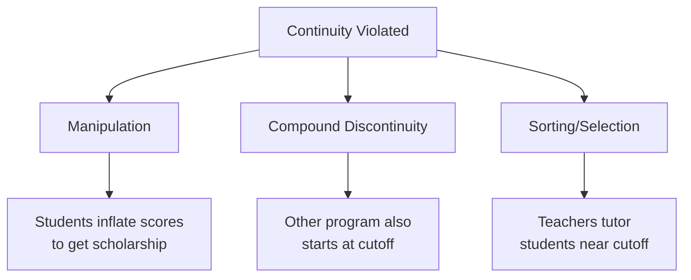

<!-- _class: lead -->

# Regression Discontinuity Designs

## Identifying Effects at a Threshold

Module 05 | Causal Inference with CausalPy

<!-- Speaker notes: Regression discontinuity is elegant because the identification strategy is so transparent. A rule says: above this score, you get the scholarship. Below, you don't. Two students with nearly identical scores end up in very different situations. That discontinuity is your experiment. This module builds up from the basic idea to the formal assumptions and estimation strategies. -->

---

## The Core Idea

Many policies assign treatment based on a **threshold rule**:

| Running Variable | Cutoff | Treatment |
|-----------------|--------|-----------|
| Test score | 50 pts | Scholarship |
| Household income | $30,000 | Housing subsidy |
| Company size | 50 employees | Regulatory compliance |
| Election margin | 50% | Win/lose |

**Key insight:** Units just above and just below the cutoff are nearly identical — except one group is treated and the other is not.

<!-- Speaker notes: These examples span economics, education, political science, and public health. The scholarship example is intuitive: a student scoring 50.1 gets it, a student scoring 49.9 doesn't. In large samples, the average characteristics of students in a narrow band around the cutoff should be similar — they just ended up on different sides by the slimmest of margins. That's our source of as-good-as-random variation. -->

---

## Sharp vs Fuzzy RDD

<div class="columns">

**Sharp RDD:**
$$D_i = \mathbf{1}[X_i \geq c]$$

- Treatment exactly determined by cutoff
- All above: treated
- All below: untreated

**Fuzzy RDD:**
$$P(D_i=1)$$ jumps at $c$, but not 0→1

- Compliance is partial
- Some above cutoff refuse treatment
- Some below cutoff self-enroll
- Identified as IV at cutoff

</div>

<!-- Speaker notes: The distinction matters for interpretation. Sharp RDD is simpler: crossing the threshold guarantees treatment. An election winner gets to govern — that's sharp. A scholarship cutoff is often sharp if the institution follows the rule strictly. Fuzzy RDD applies when the threshold creates a jump in treatment probability but not a perfect one. For example, a grade cutoff for a remediation program where some students opt out and some tutors work with students below the cutoff anyway. -->

---

## Visual Intuition: Sharp RDD

```
Outcome Y
  |                              ●●●
  |                          ●●●●
  |                      ●●●●
  |   ●●●●                    ↑
  |●●●●   ●●●              Jump = τ (treatment effect)
  |          ●●●               ↑
  |             ●●●         ----  (counterfactual)
  |                ●●●      /
  |                   ●●●●●
  |__________________________↑______→ X (running variable)
                          Cutoff c
```

- Left of cutoff: untreated outcome function
- Right of cutoff: treated outcome function
- **Jump at cutoff** = causal treatment effect

<!-- Speaker notes: This diagram captures the entire RDD logic. If the outcome function is smooth everywhere except at the cutoff, and if the cutoff is where treatment changes, then the jump must be caused by the treatment. The smooth curve on the left is our counterfactual — it tells us where the treated units (right side) would have been without treatment. The vertical gap between the two curves at the cutoff is our estimate. -->

---

## The Continuity Assumption

**Formal statement:**

$$E[Y_i(0) \mid X_i = x] \text{ and } E[Y_i(1) \mid X_i = x] \text{ are continuous at } x = c$$

**In plain language:**

> Absent treatment, there would be no jump in the outcome at the cutoff.

Any observed jump is attributed entirely to the treatment.

<!-- Speaker notes: Continuity is the only identifying assumption in a sharp RDD — it's doing a lot of work. It says that the relationship between the running variable and the potential outcomes is smooth at the cutoff. There's no other factor that jumps at exactly the same point. If you think about the scholarship example: student motivation, family income, test preparation — all of these might correlate with test scores, but they should change smoothly around score = 50, not jump discontinuously at that exact threshold. -->

---

## What Can Violate Continuity?



<!-- Speaker notes: Three main threats. Manipulation: if students know the cutoff and can game the system, those just above aren't random — they're the strategic ones who pushed hard. Compound discontinuity: if another policy threshold coincides with yours, you can't separate effects. Sorting: more subtle — if teachers systematically give extra help to students just below the cutoff, those students are different from those above in unobservable ways. -->

---

## Detecting Manipulation: McCrary Test

If units manipulate the running variable, you see **bunching just above the cutoff**:

```
Density
  |
  |          ●
  |        ● ● ●●       ← spike here = manipulation
  |    ● ●       ● ● ●
  | ●               ● ●
  |_____________↑_________→ X
              Cutoff
```

**Test:** Is the density of the running variable continuous at the cutoff?

```python
from rdrobust import rddensity
test = rddensity(df['score'], c=50)
print(test.summary())  # p > 0.05 = no manipulation
```

<!-- Speaker notes: The McCrary density test is the first thing reviewers look for in an RDD paper. Plot a histogram of the running variable with fine bins. If you see a spike just above the cutoff and a dip just below, that's manipulation. Formally, the test checks whether the density function has a discontinuity at the cutoff — if it does, units are sorting to either side strategically, violating the continuity assumption. -->

---

## Covariate Balance Check

**Covariates should NOT jump at the cutoff**

```python
covariates = ['age', 'gender', 'prior_income', 'family_size']

for cov in covariates:
    result = rdrobust(y=df[cov], x=df['running_var'], c=cutoff)
    jump = result.coef[0]
    p_val = result.pv[0]
    status = "OK" if p_val > 0.05 else "PROBLEM"
    print(f"{cov:<15} jump={jump:+.3f}  p={p_val:.3f}  [{status}]")
```

Pre-determined covariates should be balanced — they can't be affected by a future treatment assignment.

<!-- Speaker notes: This is analogous to a balance table in a randomised experiment. If the treatment is as-good-as-random near the cutoff, then variables determined before the treatment assignment should be balanced — they shouldn't jump at the cutoff. If you see a covariate jumping, something is wrong: either there's manipulation, or there's a compound discontinuity with another variable that affects the covariate. -->

---

## Estimation: Local Linear Regression

The **preferred estimator** for RDD:

$$Y_i = \alpha + \tau D_i + \beta (X_i - c) + \gamma D_i (X_i - c) + \epsilon_i$$

for $|X_i - c| \leq h$ (within bandwidth $h$)

<div class="columns">

**Benefits:**
- Uses only nearby observations
- Allows different slopes on each side
- Reduces boundary bias vs. polynomials

**Key choice:**
- Bandwidth $h$ — use data-driven IK/MSE-optimal selection

</div>

<!-- Speaker notes: The local linear regression fits a line on each side of the cutoff, using only observations within the bandwidth. The jump at the cutoff — the difference between the two lines at x=c — is the treatment effect estimate. The slope can differ on each side, which is important: the relationship between the running variable and outcome might be steeper on one side than the other. The bandwidth controls the tradeoff between bias (wider = more bias from non-linearity) and variance (narrower = fewer obs, higher variance). -->

---

## Bandwidth Selection

The single most important tuning choice in RDD

```
Bias-Variance Tradeoff:

MSE
  |    \\
  |     \\       ← Optimal bandwidth minimises MSE
  |      \\____/
  |           \\
  |             \\
  |               \\___
  |___________________h→
      Narrow        Wide
      (high var)    (high bias)
```

**IK/MSE-optimal bandwidth:**
```python
from rdrobust import rdbwselect
bw = rdbwselect(y=df['y'], x=df['x'], c=0, bwselect='mserd')
h_opt = bw.bws['h']
```

<!-- Speaker notes: Bandwidth selection is where most practitioners agonize. Too narrow: you have almost no data to fit the line, and your standard errors are huge. Too wide: you're extrapolating the linear fit far from the cutoff, and the true regression function is probably nonlinear at that scale. The Imbens-Kalyanaraman optimal bandwidth minimises the asymptotic mean squared error — it balances these two concerns automatically using properties of the data. Always report results for multiple bandwidths as a robustness check. -->

---

## What RDD Identifies: The LATE

RDD estimates the effect **at the cutoff only**:

$$\tau_{RDD} = E[Y_i(1) - Y_i(0) \mid X_i = c]$$

This is a **Local Average Treatment Effect (LATE)** — local to the cutoff $c$.

**It does NOT tell you:**
- The effect for units far from the cutoff
- The average effect in the population
- What would happen if you changed the cutoff

<!-- Speaker notes: External validity is the main limitation of RDD. The estimate is hyper-local — it tells you the effect of the scholarship for students who scored right around 50. If you care about the effect for high-achieving students who scored 90, RDD doesn't tell you that. This is actually a feature of sorts: the local estimate is often exactly what a policymaker needs — if we're debating whether to keep this scholarship cutoff, the relevant effect IS the effect for those near the threshold. But don't overclaim generalisability. -->

---

## CausalPy RDD in Practice

```python
import causalpy as cp

# Prepare data: centre running variable around cutoff
df['x_centered'] = df['score'] - cutoff

result = cp.RegressionDiscontinuity(
    data=df,
    formula='outcome ~ 1 + x_centered',
    running_variable_name='x_centered',
    model=cp.pymc_models.LinearRegression(),
    bandwidth=0.5,   # units of centred running variable
    epsilon=0.01
)

result.plot()
print(result.summary())  # treatment effect is the jump at x=0
```

<!-- Speaker notes: CausalPy's RDD interface centres around the running variable. You subtract the cutoff from your running variable so the cutoff is at zero. The bandwidth parameter controls which observations are used. The epsilon parameter defines a small window right at the cutoff for evaluating the treatment effect. The plot shows the fitted lines on each side and the estimated jump with credible intervals. -->

---

## Placebo Test: False Cutoffs

Run the RDD at cutoffs where treatment does NOT change — should give null estimates:

```python
placebo_cutoffs = [30, 40, 60, 70]

for c_placebo in placebo_cutoffs:
    df['x_placebo'] = df['score'] - c_placebo
    # Run RDD only on untreated side
    subset = df[df['score'] < true_cutoff]  # below the real cutoff
    result = rdrobust(y=subset['outcome'], x=subset['score'], c=c_placebo)
    print(f"Cutoff={c_placebo}: τ={result.coef[0]:.3f}, p={result.pv[0]:.3f}")
```

If placebo estimates are near zero, the real effect at the true cutoff is credible.

<!-- Speaker notes: Placebo cutoffs are a powerful robustness check. The idea: if your continuity assumption holds, then running the RDD at an arbitrary cutoff away from the true one should give a null result — there's no reason for the outcome to jump there. If you find significant effects at many placebo cutoffs, it suggests the outcome function is lumpy in general, and your "true" discontinuity might just be noise. Typically you run placebos only on the untreated side to avoid contaminating with the actual treatment effect. -->

---

## RDD Assumptions Checklist

Before reporting RDD results, verify:

- [ ] Treatment is clearly determined by the running variable and cutoff
- [ ] No manipulation of the running variable (McCrary test passes)
- [ ] Covariates are balanced at the cutoff
- [ ] No compound discontinuities (other policies at same threshold)
- [ ] Results are robust to bandwidth choice
- [ ] Placebo cutoffs give null estimates
- [ ] Sample size is adequate for the chosen bandwidth

<!-- Speaker notes: This is your pre-flight checklist. Every item has a test or diagnostic associated with it. The McCrary test handles manipulation. Covariate regressions handle balance. Bandwidth sensitivity plots handle robustness. Placebo cutoffs handle the possibility that you're just picking up general lumpiness in the outcome. Work through all of these before submitting or presenting. An RDD paper that checks all these boxes is compelling; one that ignores them invites skepticism. -->

---

## Summary

| Concept | Key Point |
|---------|-----------|
| Running variable | Score that determines treatment via threshold |
| Sharp RDD | Exact treatment assignment at cutoff |
| Fuzzy RDD | Jump in treatment probability — use IV |
| Continuity | Potential outcomes smooth at cutoff — key assumption |
| LATE at cutoff | Effect is local to the cutoff, not population-wide |
| Local linear | Preferred estimator — fit separate lines near cutoff |
| Bandwidth | Bias-variance tradeoff — use MSE-optimal selection |
| Diagnostics | Density test, covariate balance, bandwidth sensitivity |

<!-- Speaker notes: To summarise: RDD is powerful because the identification strategy is so transparent — everyone can see the cutoff, everyone can see the rule. But its power is also its limitation: the estimate is inherently local. The checklist ensures that your inference is valid. Get comfortable with running all these diagnostics — reviewers will expect them. -->

---

<!-- _class: lead -->

## Next: Bandwidth Selection and Sensitivity

Choosing the optimal bandwidth and testing robustness

→ [02 — Bandwidth Selection](02_bandwidth_selection_guide.md)

<!-- Speaker notes: The most consequential practical choice in an RDD analysis is the bandwidth. In the next guide, we go deep on bandwidth selection theory, the MSE-optimal IK estimator, and how to present sensitivity analysis results that convince skeptical reviewers that your findings are robust. -->
